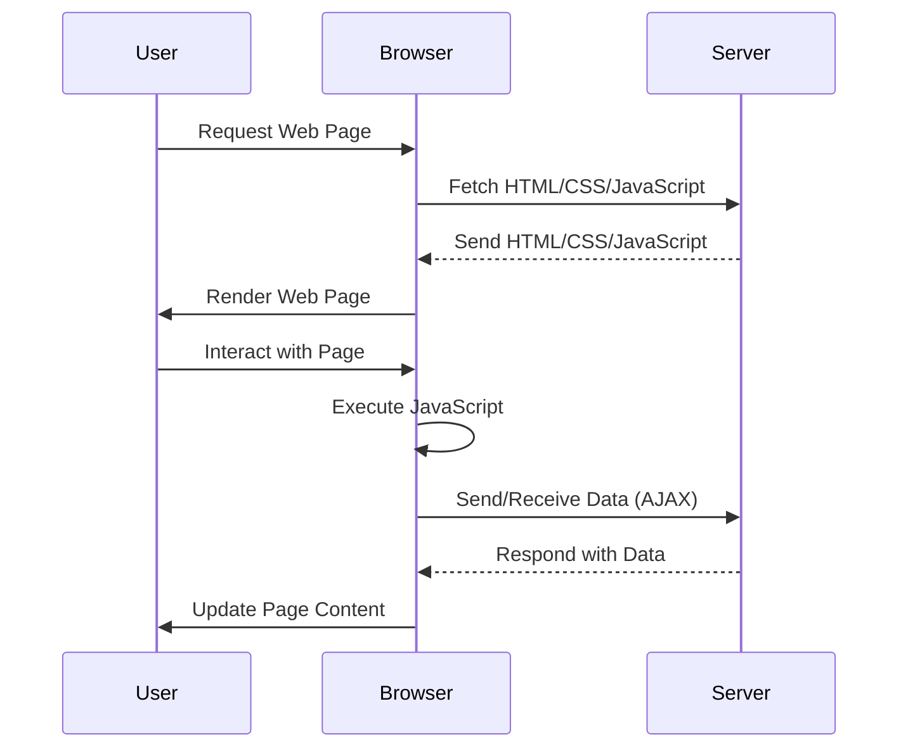

## 1.1 Welcome to JavaScript

Welcome to the world of JavaScript, a versatile and powerful programming language that has become a cornerstone of modern web development. Whether you're browsing a website, using a web application, or interacting with a mobile app, chances are JavaScript is working behind the scenes to make your experience interactive and dynamic. In this section, we'll explore what makes JavaScript so essential in today's digital landscape, its widespread use across various platforms, and how it extends beyond the confines of web browsers.

### The Ubiquity of JavaScript in Websites and Applications

JavaScript is everywhere. It's the language that powers the interactive elements on websites, from simple animations to complex web applications. Let's delve into why JavaScript is so prevalent and how it has become an integral part of the web development ecosystem.

#### A Brief History of JavaScript

JavaScript was created in 1995 by Brendan Eich while working at Netscape Communications. Initially designed to add interactivity to static web pages, JavaScript quickly evolved into a full-fledged programming language. Its ability to run directly in the browser, without the need for additional plugins, made it an instant success. Over the years, JavaScript has undergone significant transformations, with the introduction of new features and standards, making it more robust and versatile.

#### JavaScript in the Browser

JavaScript is the only programming language that can run natively in web browsers, making it indispensable for web development. It allows developers to create dynamic content that responds to user interactions, such as clicking buttons, filling out forms, or navigating through a website. Here's a simple example of JavaScript in action:

```javascript
// This JavaScript code changes the text of a paragraph when a button is clicked

// Select the button and paragraph elements
const button = document.querySelector('button');
const paragraph = document.querySelector('p');

// Add an event listener to the button
button.addEventListener('click', () => {
  // Change the text content of the paragraph
  paragraph.textContent = 'You clicked the button!';
});
```

In this example, JavaScript is used to listen for a click event on a button and change the text of a paragraph. This kind of interactivity is what makes web pages engaging and user-friendly.

#### JavaScript Frameworks and Libraries

To streamline the development process, a plethora of JavaScript frameworks and libraries have been created. These tools provide pre-written code and components that developers can use to build applications more efficiently. Some popular JavaScript frameworks and libraries include:

- **React**: Developed by Facebook, React is a library for building user interfaces. It allows developers to create reusable UI components, making it easier to manage complex applications.

- **Angular**: Maintained by Google, Angular is a comprehensive framework for building dynamic web applications. It provides a robust set of tools for managing data, routing, and state management.

- **Vue.js**: Known for its simplicity and flexibility, Vue.js is a progressive framework for building user interfaces. It's easy to integrate with other projects and libraries, making it a popular choice for both small and large applications.

These frameworks and libraries have revolutionized web development, enabling developers to create sophisticated applications with less effort and time.

### JavaScript Beyond the Browser

While JavaScript is most commonly associated with web browsers, its capabilities extend far beyond. Thanks to platforms like Node.js, JavaScript can now be used for server-side development, mobile app development, and even desktop applications.

#### Node.js: JavaScript on the Server

Node.js is a runtime environment that allows developers to run JavaScript on the server. This opens up a whole new world of possibilities, enabling developers to use JavaScript for both front-end and back-end development. With Node.js, you can build scalable network applications, APIs, and real-time services like chat applications. Here's a simple example of a Node.js server:

```javascript
// Import the http module
const http = require('http');

// Create a server that responds with "Hello, World!"
const server = http.createServer((req, res) => {
  res.statusCode = 200;
  res.setHeader('Content-Type', 'text/plain');
  res.end('Hello, World!\n');
});

// Listen on port 3000
server.listen(3000, () => {
  console.log('Server running at http://localhost:3000/');
});
```

This code creates a basic HTTP server that listens on port 3000 and responds with "Hello, World!" to any incoming requests. Node.js has become a popular choice for building fast and scalable server-side applications.

#### Mobile App Development with JavaScript

JavaScript can also be used to develop mobile applications, thanks to frameworks like React Native and Ionic. These frameworks allow developers to write code once and deploy it on both iOS and Android platforms, saving time and resources.

- **React Native**: Developed by Facebook, React Native enables developers to build native mobile apps using JavaScript and React. It provides a set of components that map to native UI elements, ensuring a smooth and responsive user experience.

- **Ionic**: Ionic is a framework for building hybrid mobile apps using web technologies like HTML, CSS, and JavaScript. It provides a library of UI components and tools for building cross-platform apps.

These frameworks have made it possible for web developers to transition into mobile app development, leveraging their existing JavaScript skills.

#### Desktop Applications with JavaScript

JavaScript can even be used to build desktop applications, thanks to frameworks like Electron. Electron allows developers to create cross-platform desktop apps using web technologies. Some popular applications built with Electron include Visual Studio Code, Slack, and Discord.

### The Future of JavaScript

JavaScript continues to evolve, with new features and improvements being introduced regularly. The ECMAScript standard, which governs the evolution of JavaScript, ensures that the language remains modern and relevant. Some recent additions to JavaScript include:

- **Arrow Functions**: A more concise way to write functions.
- **Promises**: A way to handle asynchronous operations more effectively.
- **Async/Await**: A syntactic sugar for working with Promises, making asynchronous code easier to read and write.

As JavaScript continues to grow and adapt, it remains a vital tool for developers, enabling them to create innovative and interactive applications across various platforms.

### Try It Yourself

To get a feel for JavaScript, try modifying the code examples provided in this section. For instance, change the text in the paragraph example to something else, or modify the Node.js server to respond with a different message. Experimenting with code is a great way to learn and understand how JavaScript works.

### Visual Aids

To better understand the role of JavaScript in web development, let's look at a simple diagram illustrating the interaction between a user, the browser, and the server:



This diagram shows how JavaScript is executed in the browser, allowing for dynamic interactions and communication with the server.

### References and Links

For further reading and to deepen your understanding of JavaScript, consider exploring the following resources:

- [MDN Web Docs - JavaScript](https://developer.mozilla.org/en-US/docs/Web/JavaScript)
- [W3Schools - JavaScript Tutorial](https://www.w3schools.com/js/)
- [Node.js Official Website](https://nodejs.org/)
- [React Native Documentation](https://reactnative.dev/)
- [Electron Documentation](https://www.electronjs.org/)

### Engagement and Reinforcement

As you embark on your journey to learn JavaScript, remember that practice is key. Try building small projects, participate in coding challenges, and engage with the developer community. Here are a few questions to ponder:

- How does JavaScript enhance user interaction on a website?
- What are the benefits of using JavaScript frameworks and libraries?
- How can JavaScript be used outside of web browsers?

### Summary

In this section, we've explored the significance of JavaScript in modern web development, its ubiquity in websites and applications, and its extensions beyond browsers. JavaScript is a versatile language that powers the interactive web, enabling developers to create dynamic and engaging user experiences. As you continue your learning journey, remember that JavaScript is a powerful tool with endless possibilities.

## Quiz Time!



### What is JavaScript primarily used for in web development?

- [x] Adding interactivity to web pages
- [ ] Designing the layout of web pages
- [ ] Storing data on the server
- [ ] Creating static content

> **Explanation:** JavaScript is primarily used to add interactivity to web pages, making them dynamic and responsive to user actions.

### Which of the following is a popular JavaScript framework for building user interfaces?

- [x] React
- [ ] Django
- [ ] Laravel
- [ ] Flask

> **Explanation:** React is a popular JavaScript library for building user interfaces, developed by Facebook.

### What is Node.js used for?

- [x] Running JavaScript on the server
- [ ] Designing web page layouts
- [ ] Creating mobile apps
- [ ] Styling web pages

> **Explanation:** Node.js is a runtime environment that allows JavaScript to be run on the server, enabling server-side development.

### Which of the following is NOT a JavaScript framework or library?

- [ ] React
- [ ] Angular
- [ ] Vue.js
- [x] Ruby on Rails

> **Explanation:** Ruby on Rails is a web application framework written in Ruby, not JavaScript.

### What is the purpose of the `addEventListener` method in JavaScript?

- [x] To attach an event handler to an element
- [ ] To create a new HTML element
- [ ] To remove an element from the DOM
- [ ] To change the style of an element

> **Explanation:** The `addEventListener` method is used to attach an event handler to an element, allowing it to respond to user interactions.

### Which JavaScript feature allows handling asynchronous operations more effectively?

- [x] Promises
- [ ] Variables
- [ ] Loops
- [ ] Functions

> **Explanation:** Promises are a JavaScript feature that allows handling asynchronous operations more effectively, providing a cleaner way to work with asynchronous code.

### What is the purpose of the `require` function in Node.js?

- [x] To import modules
- [ ] To declare variables
- [ ] To create HTTP requests
- [ ] To define functions

> **Explanation:** The `require` function in Node.js is used to import modules, allowing developers to use external libraries and functionalities.

### Which of the following can JavaScript NOT be used for?

- [ ] Building web applications
- [ ] Creating mobile apps
- [ ] Developing server-side applications
- [x] Designing hardware circuits

> **Explanation:** JavaScript is a software programming language and cannot be used for designing hardware circuits.

### What is the main advantage of using JavaScript frameworks?

- [x] They provide pre-written code and components
- [ ] They make websites load faster
- [ ] They improve the security of web applications
- [ ] They reduce the need for HTML and CSS

> **Explanation:** JavaScript frameworks provide pre-written code and components, making it easier and faster to develop applications.

### True or False: JavaScript can only be used in web browsers.

- [ ] True
- [x] False

> **Explanation:** False. JavaScript can be used outside of web browsers, such as in server-side development with Node.js and in mobile app development with frameworks like React Native.


