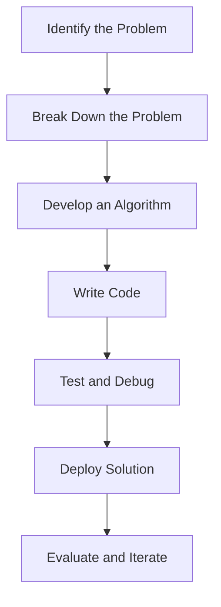

## 1.2 What is Programming?

Welcome to the fascinating world of programming! As we embark on this journey to learn JavaScript, it's essential to understand what programming is and why it is such a powerful tool in today's digital age. Programming is the art and science of creating instructions that a computer can follow to perform specific tasks. It is a means of communication between humans and machines, enabling us to solve problems, automate processes, and create innovative solutions.

### Understanding Programming

At its core, programming is about writing code. Code is a set of instructions written in a programming language that a computer can understand and execute. These instructions tell the computer what to do, how to do it, and when to do it. Programming languages, like JavaScript, provide a structured way to write these instructions, making it easier for humans to communicate with computers.

#### The Purpose of Programming

The fundamental purpose of programming is to solve problems. Whether it's calculating the trajectory of a spacecraft, managing a company's payroll, or creating a fun video game, programming allows us to automate tasks and find solutions to complex challenges. By writing code, we can instruct computers to perform repetitive tasks quickly and accurately, freeing up human resources for more creative and strategic endeavors.

### Communicating with Computers

Computers are incredibly powerful machines, but they cannot think or make decisions on their own. They rely on programmers to provide them with detailed instructions. This is where programming languages come into play. A programming language is a formal language comprising a set of instructions that produce various kinds of output. JavaScript, for example, is a high-level programming language that is widely used for web development.

#### How Programming Languages Work

Programming languages are designed to be understood by both humans and computers. They provide a set of rules and syntax that define how instructions should be written. Let's take a look at a simple JavaScript code example:

```javascript
// This is a simple JavaScript program to add two numbers
let number1 = 5; // Declare a variable and assign a value
let number2 = 10; // Declare another variable and assign a value
let sum = number1 + number2; // Add the two numbers and store the result in a variable
console.log("The sum is: " + sum); // Output the result to the console
```

In this example, we declare two variables, `number1` and `number2`, and assign them values. We then add these values together and store the result in a new variable called `sum`. Finally, we use `console.log()` to display the result. Each line of code is an instruction that the computer follows to perform the task.

#### The Role of Compilers and Interpreters

Programming languages are typically either compiled or interpreted. A **compiler** translates the entire code into machine language before execution, while an **interpreter** translates the code line-by-line during execution. JavaScript is an interpreted language, which means it is executed directly by the web browser without the need for a separate compilation step.

### The Role of Programming in Problem-Solving

Programming is a powerful tool for problem-solving. It allows us to break down complex problems into smaller, manageable parts and tackle each part systematically. This process is known as **algorithmic thinking**. An algorithm is a step-by-step procedure for solving a problem or performing a task. By developing algorithms, programmers can create efficient solutions to a wide range of problems.

#### Problem-Solving with JavaScript

JavaScript is particularly well-suited for solving problems related to web development. It allows developers to create interactive and dynamic web pages, enhancing the user experience. For example, JavaScript can be used to validate user input in a form, create animations, or fetch data from a server without reloading the page.

Let's consider a simple problem: calculating the factorial of a number. The factorial of a number `n` is the product of all positive integers less than or equal to `n`. Here's how we can solve this problem using JavaScript:

```javascript
// Function to calculate the factorial of a number
function factorial(n) {
    if (n === 0 || n === 1) {
        return 1; // Base case: factorial of 0 or 1 is 1
    }
    return n * factorial(n - 1); // Recursive case
}

let number = 5;
let result = factorial(number);
console.log("The factorial of " + number + " is: " + result);
```

In this example, we define a function `factorial` that takes a number `n` as an argument. The function uses recursion to calculate the factorial. If `n` is 0 or 1, it returns 1. Otherwise, it multiplies `n` by the factorial of `n-1`. This approach demonstrates how programming can be used to solve mathematical problems efficiently.

### Automation Through Programming

One of the most significant benefits of programming is automation. By writing code, we can automate repetitive tasks, saving time and reducing the potential for human error. Automation is widely used in various industries, from manufacturing to finance, to streamline processes and improve efficiency.

#### Automating Tasks with JavaScript

JavaScript is a versatile language that can be used to automate tasks on the web. For example, it can be used to automatically update content on a webpage, generate reports, or send notifications. Let's look at a simple example of automating a task using JavaScript:

```javascript
// Function to automatically update the date on a webpage
function updateDate() {
    let dateElement = document.getElementById("current-date"); // Get the HTML element where the date will be displayed
    let currentDate = new Date(); // Get the current date
    dateElement.textContent = currentDate.toDateString(); // Update the element's content with the current date
}

// Call the function to update the date when the page loads
window.onload = updateDate;
```

In this example, we use JavaScript to automatically update the date displayed on a webpage. The `updateDate` function retrieves the current date and updates the content of an HTML element with the ID `current-date`. This automation ensures that the date is always current without requiring manual updates.

### The Impact of Programming

Programming has a profound impact on our daily lives. It powers the technology we use every day, from smartphones and computers to the internet and beyond. As we continue to advance in the digital age, programming will play an increasingly vital role in shaping the future.

#### The Importance of Learning Programming

Learning programming is not just about acquiring a technical skill; it's about developing a mindset that embraces problem-solving and innovation. By learning to program, you gain the ability to create and control technology, opening up a world of possibilities. Whether you want to build websites, develop apps, or analyze data, programming is an essential skill that can help you achieve your goals.

### Try It Yourself

To reinforce your understanding of programming, try modifying the code examples provided in this section. Experiment with different values, add new features, or create your own functions. By actively engaging with the code, you'll gain a deeper understanding of how programming works and how you can use it to solve problems.

### Visualizing Programming Concepts

To help you visualize the concepts we've discussed, let's look at a flowchart that represents the process of solving a problem using programming:



This flowchart illustrates the typical steps involved in solving a problem through programming. It begins with identifying the problem, breaking it down into smaller parts, developing an algorithm, writing code, testing and debugging, deploying the solution, and finally evaluating and iterating on the solution.

### Key Takeaways

- **Programming** is the process of creating instructions for a computer to execute.
- **Programming languages** like JavaScript provide a structured way to write code.
- **Problem-solving** is a fundamental aspect of programming, allowing us to develop efficient solutions.
- **Automation** through programming can save time and reduce errors in repetitive tasks.
- **Learning programming** opens up opportunities for innovation and creativity in technology.

### Further Reading

To deepen your understanding of programming, consider exploring the following resources:

- [MDN Web Docs: JavaScript](https://developer.mozilla.org/en-US/docs/Web/JavaScript)
- [W3Schools: JavaScript Tutorial](https://www.w3schools.com/js/)
- [Codecademy: Learn JavaScript](https://www.codecademy.com/learn/introduction-to-javascript)

These resources provide comprehensive tutorials and documentation to help you continue your programming journey.

## Quiz Time!



### What is the primary purpose of programming?

- [x] To solve problems
- [ ] To create art
- [ ] To entertain people
- [ ] To communicate with animals

> **Explanation:** The primary purpose of programming is to solve problems by creating instructions that a computer can execute.

### What is a programming language?

- [x] A formal language comprising a set of instructions for computers
- [ ] A spoken language used by humans
- [ ] A type of computer hardware
- [ ] A mathematical formula

> **Explanation:** A programming language is a formal language comprising a set of instructions that a computer can execute to perform specific tasks.

### What is the role of a compiler?

- [x] To translate code into machine language before execution
- [ ] To execute code line-by-line
- [ ] To store data in a database
- [ ] To create graphical user interfaces

> **Explanation:** A compiler translates the entire code into machine language before execution, allowing the computer to understand and execute the instructions.

### What is an algorithm?

- [x] A step-by-step procedure for solving a problem
- [ ] A type of computer program
- [ ] A mathematical equation
- [ ] A graphical representation of data

> **Explanation:** An algorithm is a step-by-step procedure for solving a problem or performing a task, often used in programming to develop efficient solutions.

### How does JavaScript execute code?

- [x] By interpreting code line-by-line
- [ ] By compiling code into machine language
- [ ] By storing code in a database
- [ ] By converting code into a graphical interface

> **Explanation:** JavaScript is an interpreted language, meaning it executes code line-by-line directly in the web browser.

### What is automation in programming?

- [x] The process of using code to perform repetitive tasks automatically
- [ ] The creation of new programming languages
- [ ] The design of computer hardware
- [ ] The development of video games

> **Explanation:** Automation in programming involves using code to perform repetitive tasks automatically, saving time and reducing human error.

### What is the function of `console.log()` in JavaScript?

- [x] To output information to the console
- [ ] To store data in a database
- [ ] To create a graphical user interface
- [ ] To execute code

> **Explanation:** The `console.log()` function in JavaScript is used to output information to the console, often for debugging purposes.

### What is recursion in programming?

- [x] A technique where a function calls itself to solve a problem
- [ ] A method of storing data in a database
- [ ] A way to create graphical interfaces
- [ ] A type of programming language

> **Explanation:** Recursion is a technique in programming where a function calls itself to solve a problem, often used for tasks like calculating factorials.

### What is the benefit of learning programming?

- [x] It opens up opportunities for innovation and creativity
- [ ] It guarantees a high-paying job
- [ ] It allows you to communicate with animals
- [ ] It makes you a professional artist

> **Explanation:** Learning programming opens up opportunities for innovation and creativity, allowing individuals to create and control technology.

### True or False: Programming is only used in the technology industry.

- [ ] True
- [x] False

> **Explanation:** False. Programming is used in various industries, including finance, healthcare, manufacturing, and more, to automate processes and solve problems.


