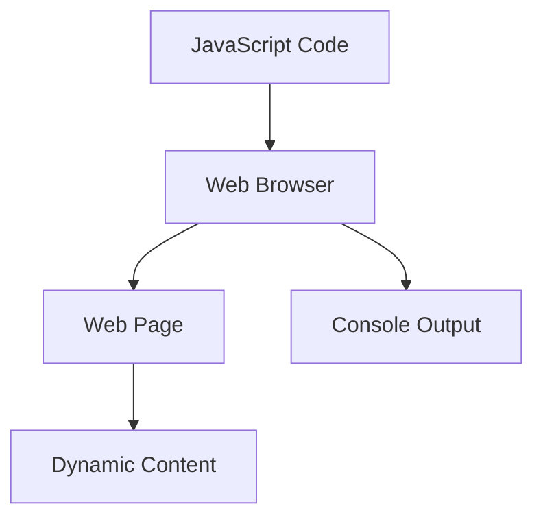

## 1.3 Why Learn JavaScript First?

Embarking on the journey to learn programming can be both exciting and daunting. With numerous languages to choose from, you might wonder which one to start with. In this section, we'll explore why JavaScript is an ideal first programming language for beginners. We'll delve into its beginner-friendly syntax, the immediate feedback it provides through web browsers, and the high demand for JavaScript skills in the job market. Let's dive in and discover why JavaScript should be your first step into the world of programming.

### Beginner-Friendly Syntax

One of the most compelling reasons to start with JavaScript is its straightforward and beginner-friendly syntax. Unlike some programming languages that require understanding complex concepts right from the start, JavaScript allows you to write simple and effective code without overwhelming you with technical details.

#### Simplicity and Readability

JavaScript's syntax is designed to be simple and readable, making it accessible for those new to programming. Let's look at a basic example:

```javascript
// This is a simple JavaScript program that displays a message
console.log("Hello, World!");
```

In this example, we're using the `console.log()` function to print "Hello, World!" to the console. The syntax is intuitive: you call a function and pass a string as an argument. This simplicity allows beginners to focus on learning programming concepts without getting bogged down by complex syntax rules.

#### Minimal Setup Required

JavaScript doesn't require any special setup or installation to get started. All you need is a web browser, which you already have on your computer. This accessibility means you can start coding right away without worrying about configuring a development environment.

### Immediate Feedback via Browsers

Another advantage of learning JavaScript is the immediate feedback you receive through web browsers. This feature is invaluable for beginners, as it allows you to see the results of your code in real-time, helping you understand how your code affects the web page.

#### Using the Browser Console

Every modern web browser comes with built-in developer tools, including a console where you can write and test JavaScript code. Let's explore how to use the console to run JavaScript:

1. **Open the Developer Tools**: In most browsers, you can open the developer tools by pressing `F12` or `Ctrl + Shift + I` (Windows/Linux) or `Cmd + Option + I` (Mac).
2. **Navigate to the Console Tab**: Click on the "Console" tab to access the JavaScript console.
3. **Write and Execute Code**: Type your JavaScript code directly into the console and press `Enter` to execute it.

For example, try typing the following code into the console:

```javascript
let name = "Alice";
console.log("Hello, " + name + "!");
```

You'll see the output "Hello, Alice!" immediately, demonstrating how your code interacts with the browser.

#### Visualizing Changes Instantly

JavaScript is the language of the web, and it allows you to manipulate web pages dynamically. This capability means you can make changes to a web page and see the results instantly. For instance, you can change the content of a web page element with JavaScript:

```html
<!DOCTYPE html>
<html>
<head>
    <title>JavaScript Example</title>
</head>
<body>
    <h1 id="greeting">Welcome!</h1>
    <script>
        // Change the text of the h1 element
        document.getElementById("greeting").innerText = "Hello, JavaScript!";
    </script>
</body>
</html>
```

In this example, we use JavaScript to change the text of an `<h1>` element from "Welcome!" to "Hello, JavaScript!" The change is visible as soon as the page loads, providing immediate feedback on how JavaScript can alter web content.

### High Demand for JavaScript Skills

JavaScript is not only a great language for beginners but also a valuable skill in the job market. As the backbone of web development, JavaScript is in high demand across various industries. Let's explore why JavaScript skills are sought after by employers.

#### Ubiquity in Web Development

JavaScript is an essential part of web development, used by nearly every website on the internet. It enables interactive features, dynamic content, and enhanced user experiences. As a result, web developers with JavaScript skills are highly sought after.

#### Versatility and Flexibility

JavaScript is a versatile language that can be used for both front-end and back-end development. With frameworks like React, Angular, and Vue.js, JavaScript powers modern web applications. On the server side, Node.js allows developers to build scalable and efficient applications. This versatility makes JavaScript a valuable skill for full-stack developers.

#### Growing Ecosystem and Community

JavaScript has a vibrant ecosystem with a wealth of libraries, frameworks, and tools. The community is active and supportive, providing resources, tutorials, and forums for learners at all levels. This supportive environment makes it easier for beginners to find help and continue learning.

### Try It Yourself

Now that we've discussed why JavaScript is an excellent first programming language, let's encourage you to try it yourself. Experiment with the code examples provided, modify them, and see how your changes affect the output. Here are a few suggestions for experimentation:

- Change the message in the `console.log()` example to display your name.
- Modify the HTML example to change the text of a different element.
- Explore the browser console by writing and executing your own JavaScript code.

### Visual Aids

To further illustrate the concepts discussed, let's use a Mermaid.js diagram to visualize the relationship between JavaScript, web browsers, and web pages.



**Diagram Description:** This diagram shows how JavaScript code interacts with the web browser to affect the web page and produce console output. JavaScript code is executed by the web browser, which then updates the web page's content and provides feedback through the console.

### References and Links

For further reading and exploration, here are some reputable resources:

- [MDN Web Docs: JavaScript Guide](https://developer.mozilla.org/en-US/docs/Web/JavaScript/Guide)
- [W3Schools: JavaScript Tutorial](https://www.w3schools.com/js/)
- [JavaScript.info: The Modern JavaScript Tutorial](https://javascript.info/)

### Engagement and Reinforcement

To reinforce your learning, consider the following questions and challenges:

- What makes JavaScript's syntax beginner-friendly?
- How can you use the browser console to test JavaScript code?
- Why is JavaScript in high demand in the job market?

### Exercises

1. Write a JavaScript program that calculates the sum of two numbers and displays the result in the console.
2. Create an HTML page with a button that changes the text of a paragraph when clicked using JavaScript.
3. Explore a JavaScript library or framework and write a short summary of its purpose and features.

### Summary

In this section, we've explored why JavaScript is an ideal first programming language. Its beginner-friendly syntax, immediate feedback through web browsers, and high demand in the job market make it a valuable skill for aspiring programmers. By starting with JavaScript, you'll gain a solid foundation in programming concepts and open doors to exciting opportunities in web development.

## Quiz Time!



### What is one reason JavaScript is considered beginner-friendly?

- [x] Its simple and readable syntax
- [ ] It requires complex setup
- [ ] It is only used for back-end development
- [ ] It has a steep learning curve

> **Explanation:** JavaScript's syntax is simple and readable, making it accessible for beginners.

### How can you run JavaScript code using a web browser?

- [x] By using the browser's developer console
- [ ] By installing a special plugin
- [ ] By writing code in a Word document
- [ ] By using a separate application

> **Explanation:** You can run JavaScript code directly in the browser's developer console.

### What is one advantage of JavaScript's immediate feedback?

- [x] It helps beginners understand code effects in real-time
- [ ] It makes code execution slower
- [ ] It requires additional software
- [ ] It only works on certain operating systems

> **Explanation:** Immediate feedback allows beginners to see the results of their code in real-time, aiding understanding.

### Why is JavaScript in high demand in the job market?

- [x] It is essential for web development
- [ ] It is rarely used in web applications
- [ ] It is only used for mobile apps
- [ ] It is a new language

> **Explanation:** JavaScript is essential for web development, making it highly demanded in the job market.

### What is one feature of JavaScript's versatility?

- [x] It can be used for both front-end and back-end development
- [ ] It is only used for database management
- [ ] It is limited to desktop applications
- [ ] It cannot be used with frameworks

> **Explanation:** JavaScript's versatility allows it to be used for both front-end and back-end development.

### How does JavaScript interact with web pages?

- [x] By manipulating the Document Object Model (DOM)
- [ ] By directly editing HTML files
- [ ] By changing server configurations
- [ ] By modifying CSS stylesheets

> **Explanation:** JavaScript interacts with web pages by manipulating the Document Object Model (DOM).

### What is a benefit of JavaScript's community?

- [x] It provides resources and support for learners
- [ ] It is exclusive to advanced developers
- [ ] It discourages collaboration
- [ ] It has limited online presence

> **Explanation:** JavaScript's community provides resources and support, making it easier for learners to find help.

### What tool can you use to visualize JavaScript's effect on web pages?

- [x] Mermaid.js diagrams
- [ ] Excel spreadsheets
- [ ] PowerPoint presentations
- [ ] Text editors

> **Explanation:** Mermaid.js diagrams can be used to visualize JavaScript's effect on web pages.

### What is one way to experiment with JavaScript code?

- [x] Modify code examples and observe changes
- [ ] Avoid making any changes
- [ ] Only use pre-written code
- [ ] Write code in a different language

> **Explanation:** Experimenting with JavaScript code involves modifying examples and observing the changes.

### True or False: JavaScript requires a special development environment to start coding.

- [x] False
- [ ] True

> **Explanation:** JavaScript does not require a special development environment; you can start coding using a web browser.




