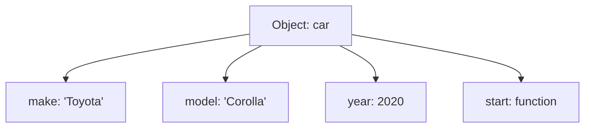

## 10.1 Understanding Objects

In JavaScript, objects are a fundamental part of the language and serve as a versatile data structure. They allow us to store collections of data and more complex entities. In this section, we will explore what objects are, how they are structured, and when to use them. We will also provide real-world analogies to help you grasp these concepts more intuitively.

### What Are Objects?

Objects in JavaScript are collections of **key-value pairs**. Each key is a string (also called a property name), and each value can be any data type, including numbers, strings, arrays, or even other objects. This structure allows objects to represent complex data and relationships.

#### Real-World Analogy

Think of an object as a **filing cabinet**. Each drawer in the cabinet represents a key, and the contents of the drawer represent the value. Just like you can store various types of documents in the drawers, you can store different types of data in an object.

```javascript
// Example of a simple object
let car = {
  make: 'Toyota', // key: 'make', value: 'Toyota'
  model: 'Corolla', // key: 'model', value: 'Corolla'
  year: 2020, // key: 'year', value: 2020
  start: function() { // key: 'start', value: a function
    console.log('Car started');
  }
};
```

In this example, `car` is an object with properties `make`, `model`, `year`, and a method `start`.

### Properties and Methods

- **Properties** are the values associated with an object. They can be of any data type.
- **Methods** are functions stored as object properties. They allow objects to perform actions.

#### Accessing Properties and Methods

You can access properties and methods using dot notation or bracket notation.

```javascript
// Dot notation
console.log(car.make); // Output: Toyota

// Bracket notation
console.log(car['model']); // Output: Corolla

// Calling a method
car.start(); // Output: Car started
```

### When to Use Objects Over Arrays

While both objects and arrays are used to store collections of data, they serve different purposes:

- **Use objects** when you need to store data with named properties. Objects are ideal for representing entities with various attributes.
- **Use arrays** when you need an ordered list of items. Arrays are best for storing sequences of data.

#### Example: Choosing Between Objects and Arrays

Imagine you are building a contact list application:

- **Objects**: Use an object to store information about a single contact, such as name, phone number, and email.
- **Arrays**: Use an array to store multiple contacts, where each contact is an object.

```javascript
// Object for a single contact
let contact = {
  name: 'John Doe',
  phone: '123-456-7890',
  email: 'john.doe@example.com'
};

// Array of contacts
let contacts = [
  { name: 'John Doe', phone: '123-456-7890', email: 'john.doe@example.com' },
  { name: 'Jane Smith', phone: '987-654-3210', email: 'jane.smith@example.com' }
];
```

### Creating and Modifying Objects

#### Creating Objects

You can create objects using object literals or the `new Object()` syntax.

```javascript
// Object literal
let book = {
  title: '1984',
  author: 'George Orwell',
  pages: 328
};

// Using new Object()
let book = new Object();
book.title = '1984';
book.author = 'George Orwell';
book.pages = 328;
```

#### Modifying Objects

You can add, modify, or delete properties and methods of an object.

```javascript
// Adding a new property
car.color = 'red';

// Modifying an existing property
car.year = 2021;

// Deleting a property
delete car.model;
```

### Objects and Memory

Objects in JavaScript are stored in memory as references. This means that when you assign an object to another variable, you are copying the reference, not the actual object.

```javascript
let carCopy = car;
carCopy.make = 'Honda';

console.log(car.make); // Output: Honda
```

In this example, changing `carCopy.make` also changes `car.make` because both variables reference the same object.

### Visualizing Object Structure

To better understand how objects are structured, let's visualize an object using a diagram.



This diagram represents the `car` object with its properties and method.

### Try It Yourself

Now that we've covered the basics, try creating your own object. Experiment by adding properties and methods, and practice accessing them.

1. Create an object representing a **person** with properties like `firstName`, `lastName`, `age`, and a method `greet`.
2. Access and modify the properties.
3. Call the `greet` method to display a greeting message.

### Further Reading

For more information on JavaScript objects, check out the following resources:

- [MDN Web Docs: Working with Objects](https://developer.mozilla.org/en-US/docs/Web/JavaScript/Guide/Working_with_Objects)
- [W3Schools: JavaScript Objects](https://www.w3schools.com/js/js_objects.asp)

### Key Takeaways

- Objects are collections of key-value pairs, used to store complex data.
- Use objects when you need named properties; use arrays for ordered lists.
- Objects can contain properties and methods, allowing them to represent real-world entities.
- Understanding objects is crucial for working with JavaScript effectively.

## Quiz Time!



### What is a JavaScript object?

- [x] A collection of key-value pairs
- [ ] A sequence of elements
- [ ] A single value
- [ ] A function

> **Explanation:** A JavaScript object is a collection of key-value pairs, where each key is a string and each value can be any data type.

### How do you access a property of an object using dot notation?

- [x] objectName.propertyName
- [ ] objectName[propertyName]
- [ ] objectName->propertyName
- [ ] objectName:propertyName

> **Explanation:** Dot notation is used to access properties of an object by specifying the object name followed by a dot and the property name.

### When should you use an object instead of an array?

- [x] When you need to store data with named properties
- [ ] When you need an ordered list of items
- [ ] When you need to perform mathematical operations
- [ ] When you need to store only numbers

> **Explanation:** Objects are used when you need to store data with named properties, allowing for more complex data structures.

### What is a method in a JavaScript object?

- [x] A function stored as a property
- [ ] A string stored as a property
- [ ] A number stored as a property
- [ ] A boolean stored as a property

> **Explanation:** A method in a JavaScript object is a function stored as a property, allowing the object to perform actions.

### How do you add a new property to an existing object?

- [x] objectName.newProperty = value;
- [ ] objectName->newProperty = value;
- [ ] objectName:newProperty = value;
- [ ] objectName[newProperty] = value;

> **Explanation:** You can add a new property to an existing object using dot notation by specifying the object name, a dot, and the new property name.

### What happens when you assign an object to another variable?

- [x] The reference to the object is copied
- [ ] The object is duplicated
- [ ] The object is deleted
- [ ] The object is converted to a string

> **Explanation:** When you assign an object to another variable, the reference to the object is copied, meaning both variables point to the same object in memory.

### How do you delete a property from an object?

- [x] delete objectName.propertyName;
- [ ] remove objectName.propertyName;
- [ ] objectName.propertyName = null;
- [ ] objectName.propertyName = undefined;

> **Explanation:** You can delete a property from an object using the `delete` operator followed by the object name and property name.

### What is the output of the following code?
```javascript
let car = { make: 'Toyota' };
let carCopy = car;
carCopy.make = 'Honda';
console.log(car.make);
```

- [x] Honda
- [ ] Toyota
- [ ] undefined
- [ ] Error

> **Explanation:** Since `carCopy` is a reference to the same object as `car`, changing `carCopy.make` also changes `car.make`.

### Which of the following is a valid way to create an object?

- [x] let obj = {};
- [ ] let obj = [];
- [ ] let obj = new Array();
- [ ] let obj = new Function();

> **Explanation:** An object can be created using an object literal, which is represented by curly braces `{}`.

### True or False: Objects can only store primitive data types as values.

- [ ] True
- [x] False

> **Explanation:** Objects can store any data type as values, including other objects, arrays, and functions.




