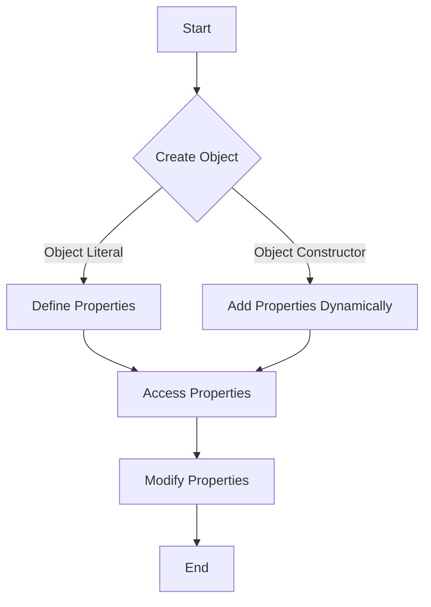

## 10.2 Creating Objects

In JavaScript, objects are a fundamental part of the language, providing a way to store and manipulate data. They are collections of properties, where each property is an association between a name (or key) and a value. Understanding how to create and use objects is crucial for developing robust applications. In this section, we will explore different methods to create objects, including using object literals and the `Object` constructor, and how to define properties dynamically at runtime.

### What is an Object?

Before diving into creating objects, let's briefly revisit what an object is. In JavaScript, an object is a standalone entity, with properties and type. Objects can be thought of as collections of key-value pairs, where the keys are strings (or Symbols) and the values can be any data type, including other objects.

### Creating Objects Using Object Literals

The most straightforward way to create an object in JavaScript is by using an object literal. An object literal is a comma-separated list of key-value pairs wrapped in curly braces `{}`. This method is concise and easy to read, making it a popular choice for creating objects.

#### Example: Creating an Object with an Object Literal

Let's create a simple object representing a car:

```javascript
// Creating an object using an object literal
let car = {
    make: 'Toyota',
    model: 'Camry',
    year: 2020,
    color: 'blue'
};

// Accessing properties of the object
console.log(car.make);  // Output: Toyota
console.log(car['model']);  // Output: Camry
```

In this example, we define an object `car` with four properties: `make`, `model`, `year`, and `color`. We can access these properties using dot notation (`car.make`) or bracket notation (`car['model']`).

#### Advantages of Object Literals

- **Simplicity**: Object literals provide a simple and intuitive way to create objects.
- **Readability**: The structure is easy to read and understand, making it ideal for defining static objects.
- **Flexibility**: You can define properties with any valid identifier, including strings and symbols.

### Creating Objects Using the `Object` Constructor

Another way to create objects in JavaScript is by using the `Object` constructor. This method is less common than using object literals but can be useful in certain situations, such as when you need to create an object dynamically.

#### Example: Creating an Object with the `Object` Constructor

```javascript
// Creating an object using the Object constructor
let person = new Object();

// Adding properties to the object
person.firstName = 'John';
person.lastName = 'Doe';
person.age = 30;

// Accessing properties of the object
console.log(person.firstName);  // Output: John
console.log(person['lastName']);  // Output: Doe
```

In this example, we create an object `person` using the `Object` constructor and then add properties to it using dot notation. This approach allows for more dynamic creation of objects, as properties can be added or modified at runtime.

#### Advantages of the `Object` Constructor

- **Dynamic Property Addition**: You can add properties to an object at runtime, which is useful for scenarios where the object structure is not known in advance.
- **Flexibility**: The `Object` constructor can be used in conjunction with other JavaScript features, such as prototypes and inheritance.

### Defining Properties Dynamically at Runtime

JavaScript allows you to define and modify object properties dynamically at runtime. This feature is particularly useful when dealing with data that may change or when creating objects based on user input or other dynamic sources.

#### Example: Adding Properties Dynamically

```javascript
// Creating an empty object
let book = {};

// Adding properties dynamically
book.title = 'JavaScript Essentials';
book.author = 'Jane Smith';
book.pages = 350;

// Modifying a property
book.pages = 400;

// Accessing properties
console.log(book.title);  // Output: JavaScript Essentials
console.log(book.pages);  // Output: 400
```

In this example, we start with an empty object `book` and add properties to it dynamically. We also demonstrate how to modify an existing property.

#### Using Bracket Notation for Dynamic Property Names

Bracket notation is particularly useful when you need to define property names dynamically, such as when iterating over a list of keys or when the property name is stored in a variable.

```javascript
let propertyName = 'genre';
book[propertyName] = 'Programming';

// Accessing a dynamically named property
console.log(book['genre']);  // Output: Programming
```

In this example, we use a variable `propertyName` to dynamically define a property on the `book` object. This technique is useful for scenarios where property names are not known at compile time.

### Visualizing Object Creation

To better understand how objects are created and modified in JavaScript, let's use a diagram to visualize the process.



**Diagram Description:** This flowchart illustrates the process of creating objects in JavaScript. You can start by creating an object using either an object literal or the `Object` constructor. Once the object is created, properties can be defined, accessed, and modified.

### Try It Yourself

Now that we've covered the basics of creating objects, let's try some hands-on exercises to reinforce your understanding.

#### Exercise 1: Create a Simple Object

Create an object representing a smartphone with properties for the brand, model, and price. Access and log each property to the console.

#### Exercise 2: Add Properties Dynamically

Create an empty object and add properties for a movie, including the title, director, and release year. Modify one of the properties and log the updated object to the console.

### Key Takeaways

- **Object Literals**: Provide a simple and readable way to create objects with predefined properties.
- **Object Constructor**: Allows for dynamic creation and modification of objects, useful when the object structure is not known in advance.
- **Dynamic Properties**: JavaScript supports adding and modifying properties at runtime, offering flexibility in handling dynamic data.

### Further Reading

For more information on JavaScript objects, consider exploring the following resources:

- [MDN Web Docs: Working with Objects](https://developer.mozilla.org/en-US/docs/Web/JavaScript/Guide/Working_with_Objects)
- [W3Schools: JavaScript Objects](https://www.w3schools.com/js/js_objects.asp)

## Quiz Time!



### What is the most common way to create an object in JavaScript?

- [x] Using an object literal
- [ ] Using the `Object` constructor
- [ ] Using a function
- [ ] Using a class

> **Explanation:** The most common way to create an object in JavaScript is by using an object literal, which is simple and concise.

### How do you access a property of an object using dot notation?

- [x] `objectName.propertyName`
- [ ] `objectName[propertyName]`
- [ ] `objectName->propertyName`
- [ ] `objectName:propertyName`

> **Explanation:** Dot notation is used to access a property of an object by specifying the object name followed by a dot and the property name.

### Which method allows for dynamic addition of properties to an object?

- [ ] Object literals
- [x] The `Object` constructor
- [ ] Arrays
- [ ] Functions

> **Explanation:** The `Object` constructor allows for dynamic addition of properties to an object at runtime.

### What is the output of `console.log(car['model']);` if `car` is defined as `{ make: 'Toyota', model: 'Camry' }`?

- [ ] Toyota
- [x] Camry
- [ ] undefined
- [ ] Error

> **Explanation:** The bracket notation is used to access the `model` property of the `car` object, which is 'Camry'.

### How can you define a property name dynamically?

- [ ] Using a function
- [x] Using bracket notation with a variable
- [ ] Using a loop
- [ ] Using a class

> **Explanation:** Bracket notation allows you to define a property name dynamically by using a variable that holds the property name.

### What is the advantage of using object literals?

- [x] Simplicity and readability
- [ ] Dynamic property addition
- [ ] Inheritance
- [ ] Encapsulation

> **Explanation:** Object literals provide simplicity and readability, making them ideal for defining static objects.

### Which notation allows for accessing properties with names stored in variables?

- [ ] Dot notation
- [x] Bracket notation
- [ ] Arrow notation
- [ ] Function notation

> **Explanation:** Bracket notation allows for accessing properties with names stored in variables, providing flexibility in dynamic scenarios.

### What is the output of `console.log(book.title);` if `book` is defined as `{ title: 'JavaScript Essentials' }`?

- [x] JavaScript Essentials
- [ ] undefined
- [ ] Error
- [ ] null

> **Explanation:** The dot notation is used to access the `title` property of the `book` object, which is 'JavaScript Essentials'.

### Can properties be modified after an object is created?

- [x] True
- [ ] False

> **Explanation:** Properties of an object can be modified after the object is created, allowing for dynamic updates.

### Which of the following is NOT a way to create an object in JavaScript?

- [ ] Object literal
- [ ] Object constructor
- [x] Array constructor
- [ ] Class

> **Explanation:** The array constructor is used to create arrays, not objects.



By mastering object creation in JavaScript, you're building a strong foundation for more advanced programming concepts. Keep experimenting and exploring to deepen your understanding!
