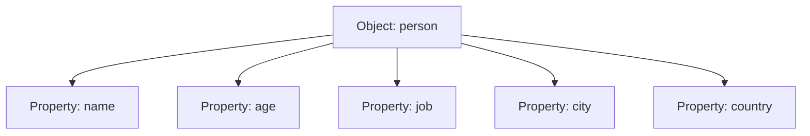

## 10.3 Accessing and Modifying Object Properties

In the world of JavaScript, objects are a fundamental aspect that allows us to store collections of data and more complex entities. Understanding how to access and modify object properties is crucial for any aspiring programmer. In this section, we'll delve into the methods of accessing properties using dot and bracket notation, adding new properties, updating existing ones, and deleting properties. Let's embark on this journey to master object properties in JavaScript!

### Understanding Object Properties

Before we dive into accessing and modifying properties, let's take a moment to understand what object properties are. In JavaScript, an object is a collection of key-value pairs. Each key is a string (or Symbol) that is associated with a value, which can be of any data type, including another object.

Here's a simple example of an object:

```javascript
let person = {
    name: "Alice",
    age: 30,
    job: "Engineer"
};
```

In this example, `name`, `age`, and `job` are properties of the `person` object, with their respective values being `"Alice"`, `30`, and `"Engineer"`.

### Accessing Object Properties

To access the properties of an object, JavaScript provides two primary methods: **dot notation** and **bracket notation**. Each method has its own use cases and advantages.

#### Dot Notation

Dot notation is the most common and straightforward way to access object properties. It involves using a dot (`.`) followed by the property name. This method is concise and easy to read.

```javascript
// Accessing properties using dot notation
console.log(person.name); // Output: Alice
console.log(person.age);  // Output: 30
```

**Key Points:**
- Dot notation is simple and clean.
- The property name must be a valid JavaScript identifier (e.g., no spaces or special characters).

#### Bracket Notation

Bracket notation provides more flexibility than dot notation. It involves using square brackets (`[]`) and a string representing the property name. This method is particularly useful when dealing with dynamic property names or property names that are not valid identifiers.

```javascript
// Accessing properties using bracket notation
console.log(person["name"]); // Output: Alice
console.log(person["age"]);  // Output: 30

// Using variables to access properties
let propertyName = "job";
console.log(person[propertyName]); // Output: Engineer
```

**Key Points:**
- Bracket notation allows the use of variables to access properties.
- It can handle property names with spaces or special characters (e.g., `person["first name"]`).

### Modifying Object Properties

Once you know how to access properties, modifying them becomes straightforward. You can update existing properties or add new ones using both dot and bracket notation.

#### Updating Existing Properties

To update a property, simply assign a new value to it using either dot or bracket notation.

```javascript
// Updating properties
person.age = 31;
console.log(person.age); // Output: 31

person["job"] = "Senior Engineer";
console.log(person.job); // Output: Senior Engineer
```

#### Adding New Properties

Adding new properties to an object is as easy as updating existing ones. If the property does not exist, it will be created.

```javascript
// Adding new properties
person.city = "New York";
console.log(person.city); // Output: New York

person["country"] = "USA";
console.log(person.country); // Output: USA
```

### Deleting Object Properties

Sometimes, you may need to remove a property from an object. JavaScript provides the `delete` operator for this purpose. The `delete` operator removes a property from an object, and the property will no longer exist.

```javascript
// Deleting properties
delete person.age;
console.log(person.age); // Output: undefined

delete person["job"];
console.log(person.job); // Output: undefined
```

**Important Note:**
- The `delete` operator only removes the property from the object; it does not affect other properties or the object itself.

### Practical Examples and Exercises

Let's put our knowledge to the test with some practical examples and exercises. These will help reinforce your understanding of accessing and modifying object properties.

#### Example 1: Dynamic Property Access

Suppose we have an object representing a book, and we want to access its properties dynamically based on user input.

```javascript
let book = {
    title: "JavaScript Essentials",
    author: "John Doe",
    year: 2023
};

function getProperty(propertyName) {
    return book[propertyName];
}

console.log(getProperty("title"));  // Output: JavaScript Essentials
console.log(getProperty("author")); // Output: John Doe
```

#### Example 2: Updating and Adding Properties

Let's update some properties and add a new one to our `book` object.

```javascript
// Updating properties
book.year = 2024;
console.log(book.year); // Output: 2024

// Adding a new property
book.publisher = "Tech Books Publishing";
console.log(book.publisher); // Output: Tech Books Publishing
```

#### Example 3: Removing Properties

Finally, let's remove a property from our `book` object.

```javascript
// Deleting a property
delete book.author;
console.log(book.author); // Output: undefined
```

### Try It Yourself

Now it's your turn to experiment! Try modifying the examples above or create your own objects and practice accessing, updating, adding, and deleting properties. Here are a few suggestions:

- Create an object representing a car with properties like `make`, `model`, and `year`. Access and modify these properties.
- Add a new property `color` to the car object and update its value.
- Delete the `year` property from the car object and verify that it has been removed.

### Visualizing Object Properties

To better understand the structure of an object and its properties, let's use a visual representation. Below is a simple diagram illustrating an object and its properties:



**Diagram Explanation:**
- The diagram represents an object named `person`.
- Each arrow points to a property of the object, showing the relationship between the object and its properties.

### Further Reading and Resources

To deepen your understanding of JavaScript objects and properties, consider exploring the following resources:

- [MDN Web Docs: Working with Objects](https://developer.mozilla.org/en-US/docs/Web/JavaScript/Guide/Working_with_Objects)
- [W3Schools: JavaScript Objects](https://www.w3schools.com/js/js_objects.asp)

These resources provide comprehensive guides and examples to enhance your learning experience.

### Summary

In this section, we've explored how to access and modify object properties in JavaScript using dot and bracket notation. We've learned how to update existing properties, add new ones, and delete properties using the `delete` operator. By practicing these concepts, you'll gain confidence in working with objects, a fundamental aspect of JavaScript programming.

Remember, objects are powerful tools that allow you to organize and manage data effectively. Mastering object properties will open up new possibilities in your programming journey.

## Quiz Time!



### Which notation is used to access object properties using a dot followed by the property name?

- [x] Dot notation
- [ ] Bracket notation
- [ ] Curly brace notation
- [ ] Parenthesis notation

> **Explanation:** Dot notation is used to access object properties by using a dot followed by the property name.

### What is the output of `console.log(person["age"]);` if `person` is an object with an `age` property set to `25`?

- [x] 25
- [ ] "25"
- [ ] undefined
- [ ] null

> **Explanation:** The bracket notation accesses the `age` property of the `person` object, which is set to `25`.

### How do you add a new property `color` with the value `"blue"` to an object `car`?

- [x] car.color = "blue";
- [ ] car["color"] = "blue";
- [x] Both of the above
- [ ] car.addProperty("color", "blue");

> **Explanation:** Both dot notation and bracket notation can be used to add a new property to an object.

### What does the `delete` operator do in JavaScript?

- [x] Removes a property from an object
- [ ] Deletes an entire object
- [ ] Removes all properties from an object
- [ ] Deletes a variable

> **Explanation:** The `delete` operator is used to remove a specific property from an object.

### Which of the following is a valid use of bracket notation?

- [x] person["first name"]
- [ ] person.first name
- [ ] person.[first name]
- [ ] person.(first name)

> **Explanation:** Bracket notation allows the use of property names with spaces or special characters.

### What will be the output of `console.log(car.year);` if the `year` property has been deleted from the `car` object?

- [x] undefined
- [ ] null
- [ ] 0
- [ ] ""

> **Explanation:** Once a property is deleted, accessing it will return `undefined`.

### Which method allows for dynamic property access using variables?

- [ ] Dot notation
- [x] Bracket notation
- [ ] Both dot and bracket notation
- [ ] Neither

> **Explanation:** Bracket notation allows for dynamic property access using variables.

### What is the result of `delete person.name;` if `name` is a property of the `person` object?

- [x] The `name` property is removed from the `person` object.
- [ ] The `name` property is set to `null`.
- [ ] The `name` property is set to `undefined`.
- [ ] The `person` object is deleted.

> **Explanation:** The `delete` operator removes the `name` property from the `person` object.

### Which notation is more flexible for accessing properties with special characters?

- [ ] Dot notation
- [x] Bracket notation
- [ ] Both are equally flexible
- [ ] Neither

> **Explanation:** Bracket notation is more flexible as it can handle property names with special characters.

### True or False: Dot notation can be used to access properties with names that are not valid JavaScript identifiers.

- [ ] True
- [x] False

> **Explanation:** Dot notation requires property names to be valid JavaScript identifiers, whereas bracket notation can handle any string as a property name.


