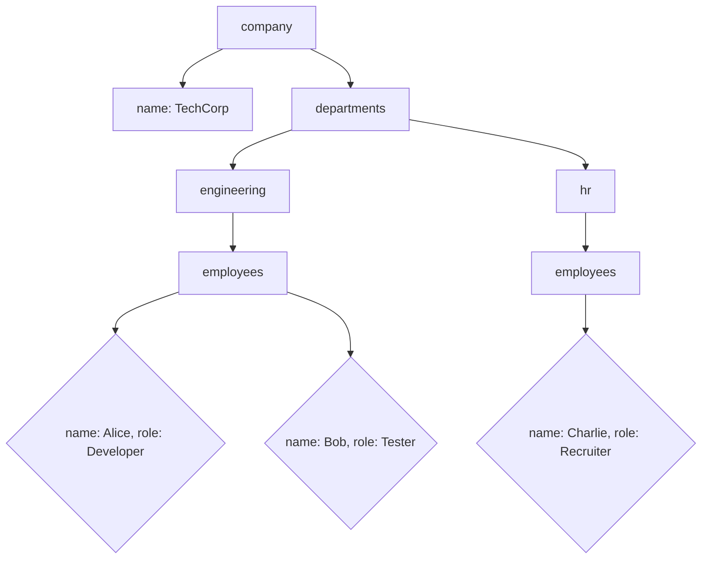

## 10.4 Nested Objects

In the world of JavaScript, objects are fundamental building blocks that allow us to store collections of data and more complex entities. As you advance in your programming journey, you'll encounter scenarios where objects contain other objects, forming what we call **nested objects**. Understanding how to work with these nested structures is crucial for managing complex data efficiently.

### Understanding Nested Objects

Objects in JavaScript can hold various data types, including other objects. This capability allows us to create complex data structures that reflect real-world entities more accurately. For instance, consider a `person` object that contains another object representing an `address`.

```javascript
let person = {
    name: "John Doe",
    age: 30,
    address: {
        street: "123 Main St",
        city: "Anytown",
        country: "USA"
    }
};
```

In this example, the `address` property is itself an object with its own properties: `street`, `city`, and `country`. This nesting allows us to organize related data logically and hierarchically.

### Accessing Nested Properties

To access properties within nested objects, we use dot notation. However, as the nesting becomes deeper, the syntax can become cumbersome. Let's explore how to access the `city` property of the `address` object within the `person` object.

```javascript
let city = person.address.city;
console.log(city); // Output: Anytown
```

Here, `person.address.city` drills down through the object hierarchy to retrieve the `city` value. While this approach works well, it can lead to errors if any part of the chain is undefined.

### Safely Accessing Nested Properties

When dealing with nested objects, it's common to encounter situations where a property might not exist. Accessing a non-existent property can result in a runtime error, disrupting your program's flow. To handle such cases gracefully, we can use conditional checks.

```javascript
if (person && person.address && person.address.city) {
    console.log(person.address.city);
} else {
    console.log("City information is not available.");
}
```

This approach ensures that each part of the chain exists before attempting to access the `city` property. However, this can quickly become verbose and difficult to maintain, especially with deeply nested structures.

### Introducing Optional Chaining (ES2020)

To simplify the process of accessing nested properties safely, JavaScript introduced **optional chaining** in ES2020. Optional chaining allows us to access properties without worrying about intermediate values being `null` or `undefined`.

```javascript
console.log(person?.address?.city); // Output: Anytown
```

In this example, the `?.` operator checks each part of the chain. If any part is `undefined` or `null`, the expression short-circuits and returns `undefined` instead of throwing an error. This feature significantly reduces the need for manual checks and makes the code cleaner and more readable.

### Practical Examples of Nested Objects

Let's explore a few practical scenarios where nested objects are commonly used.

#### Example 1: Representing a Book Library

Consider a library system where each book has multiple authors, and each author has a biography.

```javascript
let library = {
    books: [
        {
            title: "JavaScript Essentials",
            authors: [
                {
                    name: "Alice Smith",
                    bio: "Alice is a seasoned JavaScript developer."
                },
                {
                    name: "Bob Johnson",
                    bio: "Bob is a JavaScript enthusiast and educator."
                }
            ]
        },
        {
            title: "Advanced TypeScript",
            authors: [
                {
                    name: "Charlie Brown",
                    bio: "Charlie specializes in TypeScript."
                }
            ]
        }
    ]
};

// Accessing the biography of the first author of the first book
console.log(library.books[0].authors[0].bio); // Output: Alice is a seasoned JavaScript developer.
```

In this example, we have a `library` object containing an array of `books`, each with an array of `authors`. Accessing nested properties requires chaining through the array indices and object properties.

#### Example 2: Configuring Application Settings

Nested objects are also useful for managing application configurations.

```javascript
let appConfig = {
    theme: {
        color: "dark",
        fontSize: "medium"
    },
    userPreferences: {
        notifications: {
            email: true,
            sms: false
        },
        privacy: {
            tracking: false
        }
    }
};

// Accessing the email notification setting
console.log(appConfig.userPreferences.notifications.email); // Output: true
```

Here, the `appConfig` object contains nested objects for `theme` and `userPreferences`, each with its own properties. This structure allows for organized and easily accessible configuration settings.

### Modifying Nested Objects

Accessing nested properties is only part of the story. We often need to modify these properties as well. Let's see how we can update the `city` property in our earlier `person` example.

```javascript
person.address.city = "New City";
console.log(person.address.city); // Output: New City
```

This operation directly modifies the `city` property within the nested `address` object. Similarly, we can add new properties to nested objects.

```javascript
person.address.zipCode = "12345";
console.log(person.address.zipCode); // Output: 12345
```

### Using Optional Chaining with Function Calls

Optional chaining can also be used with function calls. Suppose we have a nested object representing a user, and we want to call a method that might not exist.

```javascript
let user = {
    name: "Jane Doe",
    getAddress: function() {
        return "123 Elm St, Springfield";
    }
};

// Safely calling the getAddress method
console.log(user.getAddress?.()); // Output: 123 Elm St, Springfield
```

In this example, `user.getAddress?.()` safely calls the `getAddress` method if it exists. If the method is not defined, the expression returns `undefined` without throwing an error.

### Visualizing Nested Objects

To better understand the structure of nested objects, let's visualize them using a diagram. Consider the following nested object:

```javascript
let company = {
    name: "TechCorp",
    departments: {
        engineering: {
            employees: [
                { name: "Alice", role: "Developer" },
                { name: "Bob", role: "Tester" }
            ]
        },
        hr: {
            employees: [
                { name: "Charlie", role: "Recruiter" }
            ]
        }
    }
};
```



This diagram illustrates the hierarchical structure of the `company` object, showing how the `departments` object contains further nested objects and arrays.

### Try It Yourself

To solidify your understanding of nested objects, try the following exercises:

1. **Create a Nested Object:**
   - Define a `car` object with nested objects for `engine` and `features`.
   - Include properties such as `horsepower` and `type` for the engine, and `sunroof` and `navigation` for features.

2. **Access Nested Properties:**
   - Access and log the `horsepower` of the `engine` and the `navigation` feature of the `car`.

3. **Modify Nested Properties:**
   - Update the `type` of the `engine` to "electric" and add a new feature `autopilot` with a value of `true`.

4. **Use Optional Chaining:**
   - Safely access a non-existent property within the `car` object using optional chaining.

### Key Takeaways

- **Nested Objects**: Objects can contain other objects, allowing for complex data structures.
- **Accessing Properties**: Use dot notation to access nested properties, but be cautious of undefined values.
- **Optional Chaining**: Simplifies safe access to nested properties and methods, reducing error-prone code.
- **Practical Applications**: Nested objects are useful for organizing data in real-world scenarios like libraries and application settings.

### Further Reading

For more information on JavaScript objects and optional chaining, explore these resources:

- [MDN Web Docs: Working with Objects](https://developer.mozilla.org/en-US/docs/Web/JavaScript/Guide/Working_with_Objects)
- [MDN Web Docs: Optional Chaining](https://developer.mozilla.org/en-US/docs/Web/JavaScript/Reference/Operators/Optional_chaining)
- [W3Schools: JavaScript Objects](https://www.w3schools.com/js/js_objects.asp)

## Quiz Time!



### Which of the following is an example of a nested object?

- [x] `{ person: { name: "Alice", age: 25 } }`
- [ ] `{ name: "Alice", age: 25 }`
- [ ] `[ { name: "Alice" }, { age: 25 } ]`
- [ ] `null`

> **Explanation:** A nested object is an object that contains another object as a property. The first option is a nested object because it contains an object as a value for the `person` property.

### How can you safely access a deeply nested property in JavaScript?

- [x] Using optional chaining (e.g., `object?.property?.subProperty`)
- [ ] Using a try-catch block
- [ ] Using a for loop
- [ ] Using a while loop

> **Explanation:** Optional chaining allows you to safely access deeply nested properties by checking each level for `undefined` or `null` before attempting to access the next level.

### What will `console.log(person?.address?.city);` output if `person` is `undefined`?

- [x] `undefined`
- [ ] `null`
- [ ] An error
- [ ] `city`

> **Explanation:** Optional chaining (`?.`) returns `undefined` if any part of the chain is `undefined` or `null`, preventing runtime errors.

### Which ES version introduced optional chaining in JavaScript?

- [x] ES2020
- [ ] ES6
- [ ] ES2015
- [ ] ES2018

> **Explanation:** Optional chaining was introduced in ES2020, providing a more concise way to handle nested property access.

### What is the output of `console.log(library.books[0].authors[1].name);` given the library example?

- [x] `Bob Johnson`
- [ ] `Alice Smith`
- [ ] `Charlie Brown`
- [ ] `undefined`

> **Explanation:** The code accesses the second author of the first book in the `library`, which is `Bob Johnson`.

### How do you add a new property to a nested object?

- [x] By using dot notation (e.g., `object.property.newProperty = value`)
- [ ] By using a for loop
- [ ] By using a while loop
- [ ] By using a switch statement

> **Explanation:** You can add a new property to a nested object using dot notation to specify the path to the location where you want to add the property.

### What does the `?.` operator do in JavaScript?

- [x] It allows safe access to nested properties without throwing errors.
- [ ] It creates a new object.
- [ ] It deletes a property from an object.
- [ ] It converts an object to a string.

> **Explanation:** The `?.` operator, known as optional chaining, allows you to access nested properties safely, returning `undefined` if any part of the chain is `null` or `undefined`.

### How can you modify a nested property in an object?

- [x] By directly assigning a new value using dot notation (e.g., `object.property.subProperty = newValue`)
- [ ] By using a for loop
- [ ] By using a while loop
- [ ] By using a switch statement

> **Explanation:** You can modify a nested property by directly assigning a new value using dot notation to specify the path to the property.

### What is the purpose of using nested objects in JavaScript?

- [x] To organize complex data structures logically
- [ ] To make the code run faster
- [ ] To reduce the size of the code
- [ ] To make the code harder to read

> **Explanation:** Nested objects allow you to organize complex data structures logically, reflecting real-world entities and relationships.

### True or False: Optional chaining can be used with function calls.

- [x] True
- [ ] False

> **Explanation:** Optional chaining can be used with function calls to safely invoke a method that might not exist, preventing runtime errors.


