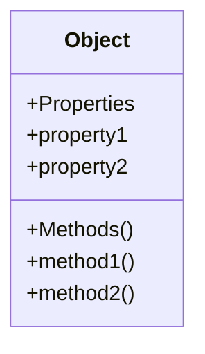

## 10.5 Methods in Objects

In this section, we will delve into the fascinating world of methods in JavaScript objects. Methods are essentially functions that are associated with objects. They enable objects to perform actions, making them dynamic and interactive. Understanding methods is crucial for mastering object-oriented programming in JavaScript.

### Understanding Methods in Objects

Let's start by defining what a method is. In JavaScript, a method is a function that is a property of an object. Methods allow objects to exhibit behaviors, which are actions that the object can perform. These behaviors are defined as functions within the object.

Here's a simple example to illustrate what a method looks like in an object:

```javascript
// Define an object with a method
const person = {
  name: 'Alice',
  greet: function() {
    console.log('Hello, my name is ' + this.name);
  }
};

// Call the method
person.greet(); // Output: Hello, my name is Alice
```

In this example, the `greet` function is a method of the `person` object. When we call `person.greet()`, it executes the function, printing a greeting message to the console.

### The `this` Keyword in Methods

One of the most important aspects of methods in objects is the `this` keyword. The `this` keyword refers to the object that is currently executing the method. It allows methods to access other properties and methods of the same object.

Consider the following example:

```javascript
const car = {
  brand: 'Toyota',
  model: 'Corolla',
  start: function() {
    console.log('Starting ' + this.brand + ' ' + this.model);
  }
};

car.start(); // Output: Starting Toyota Corolla
```

In this example, `this.brand` and `this.model` refer to the `brand` and `model` properties of the `car` object. The `this` keyword is essential for accessing properties within the same object.

### Common Pitfalls with `this`

While the `this` keyword is powerful, it can also be a source of confusion, especially for beginners. Let's explore some common pitfalls and how to avoid them.

#### Pitfall 1: Losing `this` Context

One common issue is losing the `this` context when a method is assigned to a variable or passed as a callback. In such cases, `this` may not refer to the original object.

```javascript
const dog = {
  name: 'Buddy',
  bark: function() {
    console.log(this.name + ' says woof!');
  }
};

const barkFunction = dog.bark;
barkFunction(); // Output: undefined says woof!
```

In this example, `barkFunction` loses the `this` context, resulting in `undefined`. To fix this, we can use the `bind` method to explicitly set the `this` context:

```javascript
const boundBarkFunction = dog.bark.bind(dog);
boundBarkFunction(); // Output: Buddy says woof!
```

#### Pitfall 2: Arrow Functions and `this`

Arrow functions have a different behavior when it comes to `this`. They do not have their own `this` context; instead, they inherit `this` from the surrounding lexical context.

```javascript
const cat = {
  name: 'Whiskers',
  meow: () => {
    console.log(this.name + ' says meow!');
  }
};

cat.meow(); // Output: undefined says meow!
```

In this example, `this.name` is `undefined` because arrow functions do not have their own `this`. To fix this, use a regular function instead:

```javascript
const cat = {
  name: 'Whiskers',
  meow: function() {
    console.log(this.name + ' says meow!');
  }
};

cat.meow(); // Output: Whiskers says meow!
```

### Defining Methods in Objects

Now that we understand the basics of methods and the `this` keyword, let's explore different ways to define methods in objects.

#### Method Definition Syntax

JavaScript provides a shorthand syntax for defining methods in objects, introduced in ECMAScript 6 (ES6). This syntax is more concise and easier to read.

```javascript
const book = {
  title: 'JavaScript Essentials',
  read() {
    console.log('Reading ' + this.title);
  }
};

book.read(); // Output: Reading JavaScript Essentials
```

The `read` method is defined using the shorthand syntax, which omits the `function` keyword.

#### Adding Methods to Existing Objects

You can also add methods to existing objects after they have been created. This is useful when you want to extend the functionality of an object.

```javascript
const student = {
  name: 'John'
};

// Add a method to the student object
student.study = function() {
  console.log(this.name + ' is studying.');
};

student.study(); // Output: John is studying.
```

In this example, we add the `study` method to the `student` object after its creation.

### Methods and Object-Oriented Programming

Methods play a crucial role in object-oriented programming (OOP) by allowing objects to encapsulate both data and behavior. This encapsulation is a key principle of OOP, enabling objects to interact with each other through well-defined interfaces.

#### Encapsulation and Abstraction

Encapsulation is the bundling of data and methods that operate on that data within a single unit, or object. This allows for abstraction, where the internal details of an object are hidden, and only the necessary information is exposed.

```javascript
const bankAccount = {
  balance: 1000,
  deposit(amount) {
    this.balance += amount;
    console.log('Deposited ' + amount + '. New balance: ' + this.balance);
  },
  withdraw(amount) {
    if (amount <= this.balance) {
      this.balance -= amount;
      console.log('Withdrew ' + amount + '. New balance: ' + this.balance);
    } else {
      console.log('Insufficient funds.');
    }
  }
};

bankAccount.deposit(500); // Output: Deposited 500. New balance: 1500
bankAccount.withdraw(200); // Output: Withdrew 200. New balance: 1300
```

In this example, the `bankAccount` object encapsulates the `balance` property and the `deposit` and `withdraw` methods. The internal details of how the balance is updated are hidden from the outside world.

#### Inheritance and Methods

Inheritance is another key concept in OOP, allowing objects to inherit properties and methods from other objects. JavaScript supports inheritance through prototypes.

```javascript
function Animal(name) {
  this.name = name;
}

Animal.prototype.speak = function() {
  console.log(this.name + ' makes a noise.');
};

const dog = new Animal('Rex');
dog.speak(); // Output: Rex makes a noise.
```

In this example, the `Animal` function is a constructor, and the `speak` method is defined on its prototype. Instances of `Animal` inherit the `speak` method.

### Try It Yourself

Now that we've covered the basics of methods in objects, it's time to experiment with your own code. Try creating an object with multiple methods, and use the `this` keyword to access properties within those methods. Here are some ideas to get you started:

- Create a `calculator` object with methods for addition, subtraction, multiplication, and division.
- Build a `library` object with methods to add and remove books, and list all books.
- Design a `gameCharacter` object with methods to attack, defend, and heal.

### Visualizing Object Methods

To help you better understand the relationship between objects and methods, let's visualize it using a Mermaid.js diagram:



This diagram represents an object with properties and methods. The methods are functions associated with the object, allowing it to perform actions.

### References and Further Reading

To deepen your understanding of methods in objects, consider exploring the following resources:

- [MDN Web Docs: Working with Objects](https://developer.mozilla.org/en-US/docs/Web/JavaScript/Guide/Working_with_Objects)
- [JavaScript.info: Objects](https://javascript.info/object)
- [W3Schools: JavaScript Objects](https://www.w3schools.com/js/js_objects.asp)

### Key Takeaways

- Methods are functions associated with objects, allowing them to perform actions.
- The `this` keyword refers to the object executing the method, enabling access to other properties and methods.
- Be mindful of common pitfalls with `this`, such as losing context and using arrow functions.
- Methods are essential for encapsulation and abstraction in object-oriented programming.
- Experiment with creating objects and methods to reinforce your understanding.

## Quiz Time!



### What is a method in JavaScript?

- [x] A function that is a property of an object
- [ ] A variable that stores data
- [ ] A loop that iterates over an array
- [ ] A conditional statement

> **Explanation:** A method is a function associated with an object, allowing the object to perform actions.

### What does the `this` keyword refer to in a method?

- [x] The object that is currently executing the method
- [ ] The global object
- [ ] The parent object
- [ ] The previous object

> **Explanation:** The `this` keyword refers to the object that is currently executing the method, allowing access to its properties and methods.

### How can you avoid losing the `this` context when passing a method as a callback?

- [x] Use the `bind` method to set the `this` context
- [ ] Use an arrow function
- [ ] Use a global variable
- [ ] Use a loop

> **Explanation:** The `bind` method allows you to explicitly set the `this` context, preventing it from being lost when passing a method as a callback.

### What is the shorthand syntax for defining methods in objects?

- [x] Omitting the `function` keyword
- [ ] Using the `var` keyword
- [ ] Using the `let` keyword
- [ ] Using the `const` keyword

> **Explanation:** The shorthand syntax for defining methods in objects omits the `function` keyword, making the code more concise.

### What is encapsulation in object-oriented programming?

- [x] Bundling data and methods within a single unit
- [ ] Inheriting properties from another object
- [ ] Using loops to iterate over data
- [ ] Defining variables globally

> **Explanation:** Encapsulation is the bundling of data and methods within a single unit, allowing for abstraction and hiding internal details.

### What is the purpose of the `bind` method?

- [x] To set the `this` context for a function
- [ ] To create a new object
- [ ] To iterate over an array
- [ ] To define a variable

> **Explanation:** The `bind` method sets the `this` context for a function, ensuring it refers to the correct object when called.

### What happens when you use an arrow function as a method in an object?

- [x] It inherits `this` from the surrounding lexical context
- [ ] It creates a new `this` context
- [ ] It throws an error
- [ ] It behaves like a regular function

> **Explanation:** Arrow functions inherit `this` from the surrounding lexical context, which can lead to unexpected behavior when used as methods in objects.

### How can you add a method to an existing object?

- [x] Assign a function to a property of the object
- [ ] Use the `new` keyword
- [ ] Use a loop
- [ ] Use a conditional statement

> **Explanation:** You can add a method to an existing object by assigning a function to one of its properties.

### What is the role of methods in object-oriented programming?

- [x] To define the behavior of objects
- [ ] To store data
- [ ] To iterate over arrays
- [ ] To create new variables

> **Explanation:** Methods define the behavior of objects, allowing them to perform actions and interact with other objects.

### True or False: The `this` keyword always refers to the global object.

- [ ] True
- [x] False

> **Explanation:** The `this` keyword refers to the object that is currently executing the method, not the global object.


