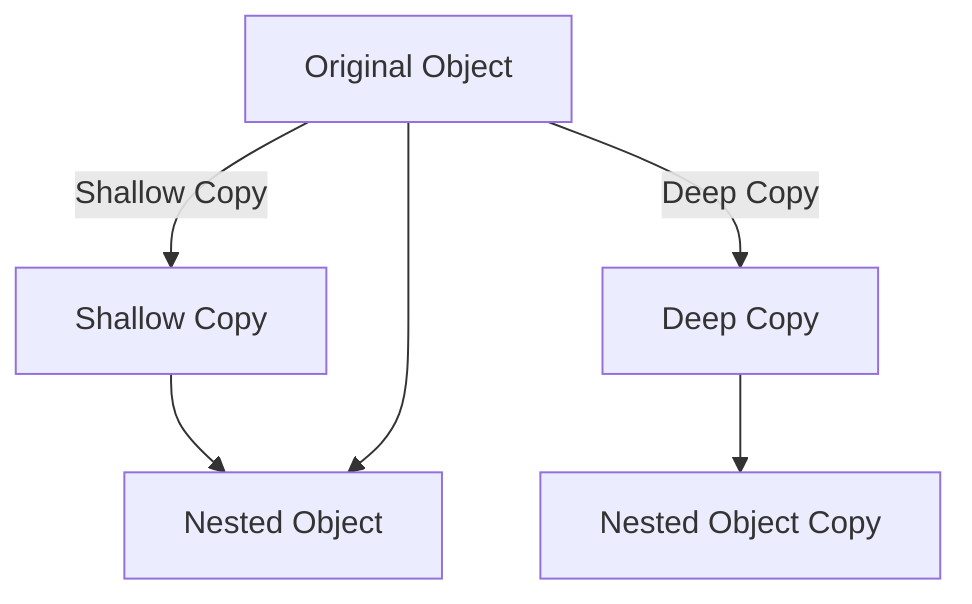

## 10.7 Object Manipulation and Cloning

In this section, we'll explore how to manipulate and clone objects in JavaScript. Objects are a fundamental part of JavaScript, and understanding how to work with them is crucial for any aspiring developer. We'll cover various techniques for copying objects, including both shallow and deep cloning, and demonstrate how to merge objects effectively. By the end of this section, you'll have a solid understanding of how to handle objects in JavaScript, empowering you to write more efficient and effective code.

### Introduction to Object Manipulation

Objects in JavaScript are collections of properties, where each property is a key-value pair. They are used to store and organize data, and they can be manipulated in various ways. Let's start by reviewing some basic object manipulation techniques.

#### Creating and Modifying Objects

To create an object, you can use object literals. Here's a simple example:

```javascript
let person = {
  name: "Alice",
  age: 30,
  job: "Engineer"
};

// Accessing properties
console.log(person.name); // Output: Alice

// Modifying properties
person.age = 31;
console.log(person.age); // Output: 31

// Adding new properties
person.city = "New York";
console.log(person.city); // Output: New York
```

In this example, we create an object `person` with properties `name`, `age`, and `job`. We then access, modify, and add properties to this object.

### Shallow Copying with `Object.assign()`

When you copy an object in JavaScript, you need to decide whether you want a shallow or deep copy. A shallow copy means that only the top-level properties are copied, while a deep copy duplicates all nested objects as well.

#### Using `Object.assign()` for Shallow Copies

The `Object.assign()` method is a common way to create a shallow copy of an object. It copies the values of all enumerable own properties from one or more source objects to a target object. Here's how it works:

```javascript
let original = { a: 1, b: 2 };
let copy = Object.assign({}, original);

console.log(copy); // Output: { a: 1, b: 2 }

// Modifying the copy does not affect the original
copy.a = 10;
console.log(original.a); // Output: 1
console.log(copy.a); // Output: 10
```

In this example, `Object.assign()` creates a new object `copy` that is a shallow copy of `original`. Changes to `copy` do not affect `original`, and vice versa.

#### Limitations of Shallow Copying

Shallow copying is straightforward, but it has limitations. If the object contains nested objects, `Object.assign()` will only copy references to those nested objects, not the objects themselves. This means changes to nested objects in the copy will affect the original:

```javascript
let original = { a: 1, b: { c: 2 } };
let copy = Object.assign({}, original);

copy.b.c = 10;
console.log(original.b.c); // Output: 10
```

In this case, modifying the nested object `b` in `copy` also changes `b` in `original`.

### Deep Cloning Techniques

To create a deep copy of an object, you need to ensure that all nested objects are also copied. There are several techniques for deep cloning in JavaScript.

#### Deep Cloning with JSON Methods

One of the simplest ways to perform deep cloning is to use JSON serialization and deserialization. This method is effective for objects that can be represented as JSON:

```javascript
let original = { a: 1, b: { c: 2 } };
let copy = JSON.parse(JSON.stringify(original));

copy.b.c = 10;
console.log(original.b.c); // Output: 2
```

Here, `JSON.stringify()` converts the object to a JSON string, and `JSON.parse()` converts it back to an object. This creates a deep copy, as changes to `copy` do not affect `original`.

**Limitations**: This method does not work for objects with functions, `undefined`, `Symbol`, or circular references, as these cannot be represented in JSON.

#### Deep Cloning with Recursion

For more complex objects, you can implement a deep cloning function using recursion. This approach manually copies each property, ensuring that nested objects are also cloned:

```javascript
function deepClone(obj) {
  if (obj === null || typeof obj !== 'object') {
    return obj;
  }

  let clone = Array.isArray(obj) ? [] : {};

  for (let key in obj) {
    if (obj.hasOwnProperty(key)) {
      clone[key] = deepClone(obj[key]);
    }
  }

  return clone;
}

let original = { a: 1, b: { c: 2 } };
let copy = deepClone(original);

copy.b.c = 10;
console.log(original.b.c); // Output: 2
```

This function checks if the object is an array or an object and recursively clones each property. It handles nested objects and arrays effectively.

### Merging Objects

Merging objects involves combining properties from multiple objects into a single object. This can be useful for combining configurations, settings, or data from different sources.

#### Merging with `Object.assign()`

`Object.assign()` can also be used to merge objects. It copies properties from source objects to a target object:

```javascript
let obj1 = { a: 1, b: 2 };
let obj2 = { b: 3, c: 4 };

let merged = Object.assign({}, obj1, obj2);
console.log(merged); // Output: { a: 1, b: 3, c: 4 }
```

In this example, `obj2` overwrites the property `b` from `obj1` in the merged object.

#### Merging with the Spread Operator

The spread operator (`...`) provides a more concise way to merge objects:

```javascript
let obj1 = { a: 1, b: 2 };
let obj2 = { b: 3, c: 4 };

let merged = { ...obj1, ...obj2 };
console.log(merged); // Output: { a: 1, b: 3, c: 4 }
```

The spread operator spreads the properties of `obj1` and `obj2` into a new object, achieving the same result as `Object.assign()`.

### Try It Yourself

Now that we've covered the basics of object manipulation and cloning, let's try some exercises to reinforce your understanding.

1. **Create a Shallow Copy**: Use `Object.assign()` to create a shallow copy of an object with nested properties. Modify the nested properties in the copy and observe the effect on the original object.

2. **Deep Clone with JSON**: Use JSON methods to deep clone an object. Verify that changes to the clone do not affect the original, even for nested properties.

3. **Implement a Recursive Deep Clone**: Write a function to deep clone an object using recursion. Test it with objects containing nested arrays and objects.

4. **Merge Objects**: Use both `Object.assign()` and the spread operator to merge multiple objects. Compare the results and consider the advantages of each method.

### Visualizing Object Cloning

To better understand the difference between shallow and deep cloning, let's visualize the process using a diagram.



**Diagram Explanation**: In this diagram, the original object is copied using both shallow and deep cloning. The shallow copy shares the same nested object as the original, while the deep copy creates a separate copy of the nested object.

### References and Further Reading

For more information on object manipulation and cloning in JavaScript, consider exploring the following resources:

- [MDN Web Docs: Working with Objects](https://developer.mozilla.org/en-US/docs/Web/JavaScript/Guide/Working_with_Objects)
- [JavaScript.info: Objects](https://javascript.info/object)
- [W3Schools: JavaScript Objects](https://www.w3schools.com/js/js_objects.asp)

### Summary

In this section, we've explored the essentials of object manipulation and cloning in JavaScript. We learned how to create shallow copies using `Object.assign()`, perform deep cloning with JSON methods and recursion, and merge objects using `Object.assign()` and the spread operator. Understanding these techniques is crucial for working effectively with objects in JavaScript, enabling you to manage and manipulate data with confidence.

## Quiz Time!



### What does `Object.assign()` do?

- [x] Creates a shallow copy of an object
- [ ] Creates a deep copy of an object
- [ ] Merges objects without overwriting properties
- [ ] Converts an object to a JSON string

> **Explanation:** `Object.assign()` creates a shallow copy by copying properties from source objects to a target object.

### Which method can be used for deep cloning an object?

- [ ] `Object.assign()`
- [x] JSON methods
- [ ] The spread operator
- [ ] `Object.keys()`

> **Explanation:** JSON methods (`JSON.stringify()` and `JSON.parse()`) can be used to create a deep copy of an object.

### What is a limitation of using JSON methods for deep cloning?

- [x] Cannot clone functions or `undefined`
- [ ] Cannot clone arrays
- [ ] Cannot clone primitive values
- [ ] Cannot clone objects with numbers

> **Explanation:** JSON methods cannot clone functions, `undefined`, `Symbol`, or circular references, as these are not representable in JSON.

### How does the spread operator help in object manipulation?

- [x] It spreads properties of objects into a new object
- [ ] It converts objects to arrays
- [ ] It creates a deep copy of an object
- [ ] It removes properties from an object

> **Explanation:** The spread operator spreads properties of objects into a new object, useful for merging.

### What happens when you modify a nested object in a shallow copy?

- [x] Changes affect the original object
- [ ] Changes do not affect the original object
- [ ] The nested object is deleted
- [ ] The nested object is converted to a string

> **Explanation:** In a shallow copy, nested objects are shared between the original and the copy, so changes affect both.

### Which method can merge objects with property overwriting?

- [x] `Object.assign()`
- [ ] JSON methods
- [ ] `Object.keys()`
- [ ] `Object.values()`

> **Explanation:** `Object.assign()` merges objects, with later properties overwriting earlier ones.

### How can you create a shallow copy of an object using the spread operator?

- [x] `{ ...originalObject }`
- [ ] `Object.assign({}, originalObject)`
- [ ] `JSON.parse(JSON.stringify(originalObject))`
- [ ] `Object.keys(originalObject)`

> **Explanation:** The spread operator `{ ...originalObject }` creates a shallow copy of the object.

### What is the result of merging two objects with conflicting properties using `Object.assign()`?

- [x] The last object's properties overwrite the first
- [ ] The first object's properties overwrite the last
- [ ] Both properties are kept
- [ ] An error is thrown

> **Explanation:** `Object.assign()` overwrites properties with the same key from the last object.

### Which of the following is a correct statement about deep cloning?

- [x] It duplicates all nested objects
- [ ] It only copies top-level properties
- [ ] It is the same as shallow copying
- [ ] It cannot be done in JavaScript

> **Explanation:** Deep cloning duplicates all nested objects, unlike shallow copying.

### True or False: The spread operator can be used for deep cloning.

- [ ] True
- [x] False

> **Explanation:** The spread operator only performs shallow copying, not deep cloning.


