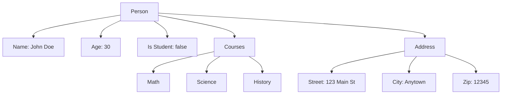

## 10.8 Introduction to JSON

In the world of web development, data interchange between a client and a server is a fundamental task. One of the most popular formats for this purpose is JSON, which stands for JavaScript Object Notation. JSON is a lightweight data interchange format that is easy for humans to read and write, and easy for machines to parse and generate. In this section, we'll explore what JSON is, how it works, and how you can use it in your JavaScript programming.

### What is JSON?

JSON is a text-based format for representing structured data based on JavaScript object syntax. Despite its origins in JavaScript, JSON is language-independent, meaning it can be used with many programming languages, making it a versatile choice for data interchange.

#### Key Characteristics of JSON:

- **Lightweight**: JSON is designed to be easy to read and write, making it a lightweight format.
- **Textual**: JSON data is represented as plain text, which can be easily transmitted over networks.
- **Structured**: JSON uses a simple structure of key-value pairs and arrays to represent data.
- **Language-Independent**: Although JSON is based on JavaScript syntax, it is supported by most programming languages.

### JSON Syntax

JSON syntax is a subset of JavaScript object syntax. Here are the basic rules:

- **Data is in name/value pairs**: A name (or key) is followed by a colon and then the value. For example, `"name": "John"`.
- **Data is separated by commas**: Multiple key-value pairs are separated by commas.
- **Curly braces hold objects**: An object is enclosed in curly braces `{}`.
- **Square brackets hold arrays**: An array is enclosed in square brackets `[]`.

Here's a simple JSON example representing a person:

```json
{
  "name": "John Doe",
  "age": 30,
  "isStudent": false,
  "courses": ["Math", "Science", "History"],
  "address": {
    "street": "123 Main St",
    "city": "Anytown",
    "zip": "12345"
  }
}
```

### Converting Objects to JSON Strings

In JavaScript, you can easily convert an object to a JSON string using the `JSON.stringify()` method. This is particularly useful when you need to send data to a server or save it in a file.

#### Using `JSON.stringify()`

The `JSON.stringify()` method converts a JavaScript object or value to a JSON string. Let's see how it works with an example:

```javascript
// Define a JavaScript object
const person = {
  name: "John Doe",
  age: 30,
  isStudent: false,
  courses: ["Math", "Science", "History"],
  address: {
    street: "123 Main St",
    city: "Anytown",
    zip: "12345"
  }
};

// Convert the object to a JSON string
const jsonString = JSON.stringify(person);

// Output the JSON string
console.log(jsonString);
```

**Output:**

```json
{"name":"John Doe","age":30,"isStudent":false,"courses":["Math","Science","History"],"address":{"street":"123 Main St","city":"Anytown","zip":"12345"}}
```

#### Customizing `JSON.stringify()`

The `JSON.stringify()` method can take two optional parameters: a replacer function and a space value for formatting.

- **Replacer Function**: Allows you to filter or modify the values being stringified.
- **Space Value**: Adds indentation, white space, and line break characters to the return value JSON text to make it more readable.

Example with formatting:

```javascript
// Convert the object to a formatted JSON string
const formattedJsonString = JSON.stringify(person, null, 2);

// Output the formatted JSON string
console.log(formattedJsonString);
```

**Output:**

```json
{
  "name": "John Doe",
  "age": 30,
  "isStudent": false,
  "courses": [
    "Math",
    "Science",
    "History"
  ],
  "address": {
    "street": "123 Main St",
    "city": "Anytown",
    "zip": "12345"
  }
}
```

### Parsing JSON Strings Back into Objects

Once you have a JSON string, you can convert it back into a JavaScript object using the `JSON.parse()` method. This is useful when you receive JSON data from a server or read it from a file.

#### Using `JSON.parse()`

The `JSON.parse()` method parses a JSON string and constructs the JavaScript value or object described by the string. Here's an example:

```javascript
// JSON string
const jsonString = '{"name":"John Doe","age":30,"isStudent":false,"courses":["Math","Science","History"],"address":{"street":"123 Main St","city":"Anytown","zip":"12345"}}';

// Parse the JSON string into a JavaScript object
const personObject = JSON.parse(jsonString);

// Access the object's properties
console.log(personObject.name); // Output: John Doe
console.log(personObject.age); // Output: 30
```

### JSON in Data Exchange

JSON is widely used in web development for data exchange between a client and a server. It is the backbone of many web APIs, allowing different systems to communicate with each other.

#### Using JSON with APIs

APIs (Application Programming Interfaces) often use JSON to send and receive data. Let's look at a simple example of how JSON might be used in an API request and response.

**Example: Fetching Data from an API**

Suppose we have an API endpoint that returns information about a user in JSON format. We can use the `fetch` API in JavaScript to retrieve this data:

```javascript
// Fetch user data from an API
fetch('https://api.example.com/user/123')
  .then(response => response.json()) // Parse the JSON from the response
  .then(data => {
    // Access the data
    console.log(data.name); // Output: John Doe
    console.log(data.age); // Output: 30
  })
  .catch(error => console.error('Error fetching data:', error));
```

In this example, the `fetch` function is used to make an HTTP request to the API. The response is then parsed as JSON using the `.json()` method, and we can access the data just like any JavaScript object.

### Try It Yourself

Now that we've covered the basics of JSON, let's encourage you to try it out yourself. Here are a few exercises to solidify your understanding:

1. **Convert an Object to JSON**: Create a JavaScript object representing a book with properties like title, author, and year. Use `JSON.stringify()` to convert it to a JSON string.

2. **Parse JSON to an Object**: Take a JSON string representing a car with properties like make, model, and year. Use `JSON.parse()` to convert it to a JavaScript object and access its properties.

3. **Fetch JSON Data from an API**: Use the `fetch` API to retrieve JSON data from a public API (e.g., a weather API) and display some of the data in the console.

### Visualizing JSON Structure

To better understand how JSON structures data, let's use a diagram to illustrate a simple JSON object representing a person.



**Diagram Description:** This diagram represents a JSON object with a root element "Person" that contains properties such as "Name", "Age", "Is Student", and nested objects like "Courses" and "Address".

### Summary

In this section, we've explored the fundamentals of JSON, a powerful and versatile data interchange format. We learned how to convert JavaScript objects to JSON strings using `JSON.stringify()` and parse JSON strings back into objects with `JSON.parse()`. We also saw how JSON is used in data exchange, particularly with APIs, making it an essential tool in modern web development.

### Further Reading

For more information on JSON and its uses, consider exploring the following resources:

- [MDN Web Docs: JSON](https://developer.mozilla.org/en-US/docs/Web/JavaScript/Reference/Global_Objects/JSON)
- [W3Schools: JSON Tutorial](https://www.w3schools.com/js/js_json_intro.asp)

## Quiz Time!



### What does JSON stand for?

- [x] JavaScript Object Notation
- [ ] JavaScript Online Network
- [ ] JavaScript Object Network
- [ ] JavaScript Open Notation

> **Explanation:** JSON stands for JavaScript Object Notation, a lightweight data interchange format.

### Which method is used to convert a JavaScript object to a JSON string?

- [x] JSON.stringify()
- [ ] JSON.parse()
- [ ] JSON.convert()
- [ ] JSON.toString()

> **Explanation:** The `JSON.stringify()` method is used to convert a JavaScript object to a JSON string.

### How do you parse a JSON string into a JavaScript object?

- [x] JSON.parse()
- [ ] JSON.stringify()
- [ ] JSON.convert()
- [ ] JSON.toObject()

> **Explanation:** The `JSON.parse()` method is used to parse a JSON string into a JavaScript object.

### What is the primary use of JSON in web development?

- [x] Data interchange between a client and a server
- [ ] Styling web pages
- [ ] Creating animations
- [ ] Managing user sessions

> **Explanation:** JSON is primarily used for data interchange between a client and a server in web development.

### Which of the following is a valid JSON format?

- [x] {"name": "John", "age": 30}
- [ ] {name: "John", age: 30}
- [ ] {"name": John, "age": 30}
- [ ] {name: John, age: 30}

> **Explanation:** JSON requires keys and string values to be enclosed in double quotes.

### What does the `fetch` API return when requesting JSON data?

- [x] A Promise
- [ ] A JSON object
- [ ] A string
- [ ] An array

> **Explanation:** The `fetch` API returns a Promise that resolves to the Response object representing the response to the request.

### Which of the following is NOT a characteristic of JSON?

- [ ] Lightweight
- [ ] Textual
- [ ] Structured
- [x] Binary

> **Explanation:** JSON is a text-based format, not binary.

### What is the output of `JSON.stringify({a: undefined})`?

- [x] "{}"
- [ ] "{"a": undefined}"
- [ ] "{"a": null}"
- [ ] "{"a": ""}"

> **Explanation:** JSON does not support `undefined` values, so they are omitted from the result.

### Can JSON be used with languages other than JavaScript?

- [x] True
- [ ] False

> **Explanation:** JSON is language-independent and can be used with many programming languages.

### What is the purpose of the second parameter in `JSON.stringify()`?

- [x] To filter or modify values being stringified
- [ ] To specify the output file
- [ ] To convert JSON to XML
- [ ] To parse JSON strings

> **Explanation:** The second parameter in `JSON.stringify()` is a replacer function that can filter or modify values being stringified.


