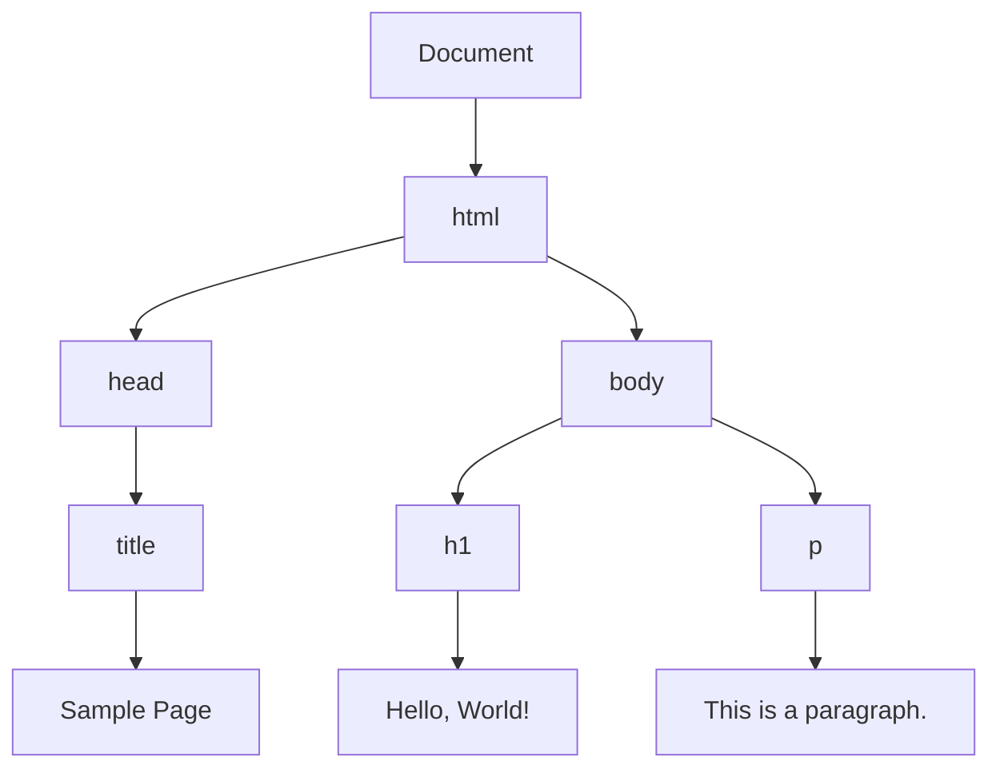
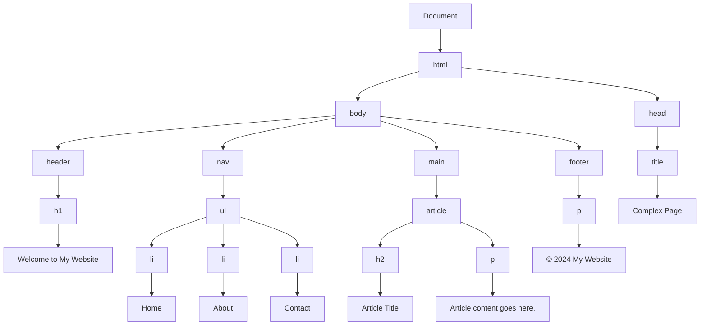

## 11.1 What is the DOM?

Welcome to the fascinating world of the Document Object Model, or DOM for short. If you're just starting your journey into web development, understanding the DOM is crucial. It serves as the bridge between your web pages and JavaScript, allowing you to create dynamic, interactive experiences for users. In this section, we'll explore what the DOM is, how it works, and how JavaScript uses it to manipulate web pages.

### Understanding the DOM: A Representation of the Web Page Structure

The DOM is a programming interface for web documents. It represents the page so that programs can change the document structure, style, and content. The DOM represents the document as a tree of nodes, where each node is an object representing a part of the document.

#### The DOM Tree

The DOM is often visualized as a tree structure. Each element in an HTML document becomes a node in this tree. Nodes can represent elements, attributes, text, and more. Here's a simple example of an HTML document and its corresponding DOM tree:

```html
<!DOCTYPE html>
<html>
  <head>
    <title>Sample Page</title>
  </head>
  <body>
    <h1>Hello, World!</h1>
    <p>This is a paragraph.</p>
  </body>
</html>
```

In the DOM, this document would be represented as follows:



In this diagram, each rectangle represents a node in the DOM tree. The `Document` node is the root, and it branches out to other nodes like `html`, `head`, `body`, and so on. Each node can have child nodes, forming a hierarchical structure.

### How JavaScript Interacts with the DOM

JavaScript can interact with the DOM to manipulate the content and structure of a web page. This interaction allows developers to create dynamic and interactive web applications. Let's explore some key concepts and methods used in this interaction.

#### Accessing DOM Elements

To manipulate the DOM, we first need to access its elements. JavaScript provides several methods to do this:

- **`document.getElementById(id)`**: Returns the element with the specified `id`.
- **`document.getElementsByClassName(className)`**: Returns a collection of elements with the specified class name.
- **`document.getElementsByTagName(tagName)`**: Returns a collection of elements with the specified tag name.
- **`document.querySelector(selector)`**: Returns the first element that matches a specified CSS selector.
- **`document.querySelectorAll(selector)`**: Returns a collection of all elements that match a specified CSS selector.

Here's an example of accessing a DOM element using `getElementById`:

```html
<!DOCTYPE html>
<html>
  <body>
    <h1 id="header">Hello, World!</h1>
    <script>
      // Access the element with id "header"
      var headerElement = document.getElementById("header");
      console.log(headerElement.textContent); // Output: Hello, World!
    </script>
  </body>
</html>
```

#### Modifying DOM Elements

Once we've accessed a DOM element, we can modify its content, attributes, and styles. Here are some common methods used for modification:

- **`element.textContent`**: Sets or returns the text content of a node.
- **`element.innerHTML`**: Sets or returns the HTML content of an element.
- **`element.setAttribute(attributeName, value)`**: Sets the value of an attribute on the specified element.
- **`element.style.propertyName`**: Sets the style property of an element.

Let's see an example of modifying a DOM element:

```html
<!DOCTYPE html>
<html>
  <body>
    <h1 id="header">Hello, World!</h1>
    <script>
      // Access the element with id "header"
      var headerElement = document.getElementById("header");
      
      // Change the text content
      headerElement.textContent = "Welcome to the DOM!";
      
      // Change the style
      headerElement.style.color = "blue";
    </script>
  </body>
</html>
```

In this example, we change the text content of the `h1` element and set its text color to blue.

### The Hierarchy of Nodes in the DOM Tree

The DOM tree is composed of different types of nodes, each serving a specific purpose. Understanding these node types is essential for effectively manipulating the DOM.

#### Types of Nodes

1. **Element Nodes**: Represent HTML elements. For example, `<div>`, `<p>`, `<h1>`, etc.
2. **Text Nodes**: Contain the text content of an element or attribute.
3. **Attribute Nodes**: Represent attributes of elements. However, in modern DOM manipulation, attributes are accessed directly through element properties.
4. **Comment Nodes**: Represent comments in the HTML.

#### Navigating the DOM Tree

JavaScript provides several properties to navigate the DOM tree:

- **`parentNode`**: Returns the parent node of the specified node.
- **`childNodes`**: Returns a collection of a node's child nodes.
- **`firstChild`**: Returns the first child node of the specified node.
- **`lastChild`**: Returns the last child node of the specified node.
- **`nextSibling`**: Returns the node immediately following the specified node.
- **`previousSibling`**: Returns the node immediately preceding the specified node.

Here's an example demonstrating DOM navigation:

```html
<!DOCTYPE html>
<html>
  <body>
    <div id="container">
      <p>First paragraph.</p>
      <p>Second paragraph.</p>
    </div>
    <script>
      // Access the container element
      var container = document.getElementById("container");
      
      // Access the first child of the container
      var firstChild = container.firstChild;
      console.log(firstChild.textContent); // Output: First paragraph.
      
      // Access the next sibling of the first child
      var nextSibling = firstChild.nextSibling;
      console.log(nextSibling.textContent); // Output: Second paragraph.
    </script>
  </body>
</html>
```

### Manipulating the DOM: Adding, Removing, and Modifying Elements

JavaScript allows us to dynamically add, remove, and modify elements in the DOM. This capability is essential for creating interactive web applications.

#### Adding Elements

To add new elements to the DOM, we can use the following methods:

- **`document.createElement(tagName)`**: Creates a new element node with the specified tag name.
- **`parentNode.appendChild(newNode)`**: Adds a new child node to the end of the list of children of a specified parent node.
- **`parentNode.insertBefore(newNode, referenceNode)`**: Inserts a new node before a specified existing child node.

Here's an example of adding a new element to the DOM:

```html
<!DOCTYPE html>
<html>
  <body>
    <div id="container">
      <p>First paragraph.</p>
    </div>
    <script>
      // Create a new paragraph element
      var newParagraph = document.createElement("p");
      newParagraph.textContent = "This is a new paragraph.";
      
      // Access the container element
      var container = document.getElementById("container");
      
      // Append the new paragraph to the container
      container.appendChild(newParagraph);
    </script>
  </body>
</html>
```

#### Removing Elements

To remove elements from the DOM, we can use the `removeChild` method:

- **`parentNode.removeChild(childNode)`**: Removes a child node from the DOM and returns the removed node.

Here's an example of removing an element from the DOM:

```html
<!DOCTYPE html>
<html>
  <body>
    <div id="container">
      <p id="removeMe">This paragraph will be removed.</p>
    </div>
    <script>
      // Access the paragraph to be removed
      var paragraphToRemove = document.getElementById("removeMe");
      
      // Access the container element
      var container = document.getElementById("container");
      
      // Remove the paragraph from the container
      container.removeChild(paragraphToRemove);
    </script>
  </body>
</html>
```

### Try It Yourself

Now that we've covered the basics of the DOM, let's put your skills to the test. Try modifying the examples above by:

- Changing the text content of different elements.
- Adding new elements with different styles.
- Removing elements based on user interaction (e.g., a button click).

Experimenting with these examples will help solidify your understanding of how JavaScript interacts with the DOM.

### Visualizing the DOM with Mermaid.js

To further enhance your understanding of the DOM, let's visualize a more complex DOM tree using Mermaid.js. Consider the following HTML document:

```html
<!DOCTYPE html>
<html>
  <head>
    <title>Complex Page</title>
  </head>
  <body>
    <header>
      <h1>Welcome to My Website</h1>
    </header>
    <nav>
      <ul>
        <li>Home</li>
        <li>About</li>
        <li>Contact</li>
      </ul>
    </nav>
    <main>
      <article>
        <h2>Article Title</h2>
        <p>Article content goes here.</p>
      </article>
    </main>
    <footer>
      <p>&copy; 2024 My Website</p>
    </footer>
  </body>
</html>
```

Here's how this document would be represented as a DOM tree:



This diagram illustrates the hierarchical structure of the DOM, with each element and text node represented as a node in the tree.

### Key Takeaways

- The DOM is a programming interface for web documents, representing the document as a tree of nodes.
- JavaScript interacts with the DOM to manipulate the content, structure, and style of web pages.
- The DOM tree is composed of different types of nodes, including element nodes, text nodes, and more.
- JavaScript provides methods to access, modify, add, and remove elements in the DOM.
- Visualizing the DOM as a tree helps understand the hierarchical structure of web documents.

### Further Reading

For more information on the DOM and JavaScript, consider exploring the following resources:

- [MDN Web Docs: Introduction to the DOM](https://developer.mozilla.org/en-US/docs/Web/API/Document_Object_Model/Introduction)
- [W3Schools: JavaScript HTML DOM](https://www.w3schools.com/js/js_htmldom.asp)

By understanding the DOM, you'll be well-equipped to create dynamic and interactive web applications. Keep experimenting with the examples and exploring new ways to manipulate the DOM with JavaScript.

## Quiz Time!



### What does the DOM stand for?

- [x] Document Object Model
- [ ] Document Oriented Model
- [ ] Data Object Model
- [ ] Dynamic Object Model

> **Explanation:** The DOM stands for Document Object Model, which is a programming interface for web documents.

### What is the DOM used for?

- [x] To represent the structure of a web page
- [ ] To style web pages
- [ ] To store user data
- [ ] To create server-side applications

> **Explanation:** The DOM is used to represent the structure of a web page, allowing programs to change the document structure, style, and content.

### How does JavaScript interact with the DOM?

- [x] By accessing and manipulating DOM nodes
- [ ] By creating new HTML files
- [ ] By compiling CSS styles
- [ ] By sending HTTP requests

> **Explanation:** JavaScript interacts with the DOM by accessing and manipulating DOM nodes to change the content and structure of web pages.

### Which method is used to access an element by its ID?

- [x] `document.getElementById(id)`
- [ ] `document.querySelector(id)`
- [ ] `document.getElementByClassName(id)`
- [ ] `document.getElementsByTagName(id)`

> **Explanation:** The `document.getElementById(id)` method is used to access an element by its ID.

### What is the output of `element.textContent`?

- [x] The text content of a node
- [ ] The HTML content of a node
- [ ] The CSS styles of a node
- [ ] The attributes of a node

> **Explanation:** The `element.textContent` property sets or returns the text content of a node.

### Which method is used to create a new element in the DOM?

- [x] `document.createElement(tagName)`
- [ ] `document.appendChild(tagName)`
- [ ] `document.insertBefore(tagName)`
- [ ] `document.removeChild(tagName)`

> **Explanation:** The `document.createElement(tagName)` method is used to create a new element in the DOM.

### What does `parentNode.appendChild(newNode)` do?

- [x] Adds a new child node to the end of the list of children of a specified parent node
- [ ] Removes a child node from the DOM
- [ ] Inserts a new node before a specified existing child node
- [ ] Changes the content of a node

> **Explanation:** The `parentNode.appendChild(newNode)` method adds a new child node to the end of the list of children of a specified parent node.

### What is the purpose of `element.style.propertyName`?

- [x] To set the style property of an element
- [ ] To get the text content of an element
- [ ] To remove an element from the DOM
- [ ] To create a new element in the DOM

> **Explanation:** The `element.style.propertyName` is used to set the style property of an element.

### What does the `childNodes` property return?

- [x] A collection of a node's child nodes
- [ ] The parent node of the specified node
- [ ] The first child node of the specified node
- [ ] The last child node of the specified node

> **Explanation:** The `childNodes` property returns a collection of a node's child nodes.

### True or False: The DOM is a static representation of a web page.

- [ ] True
- [x] False

> **Explanation:** False. The DOM is not static; it can be dynamically manipulated using JavaScript to change the structure, style, and content of a web page.


