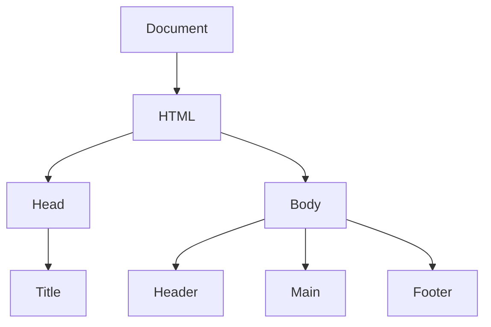

## 11.2 Selecting DOM Elements

In this section, we will explore how to select elements from the Document Object Model (DOM) using JavaScript. Selecting DOM elements is a fundamental skill for web developers, as it allows us to manipulate and interact with the content of a web page dynamically. Let's dive into the different methods available for selecting DOM elements.

### Understanding the DOM

Before we begin selecting elements, it's essential to understand what the DOM is. The DOM is a programming interface for web documents. It represents the page so that programs can change the document structure, style, and content. The DOM represents the document as a tree of nodes, where each node is an object representing a part of the document.



*Figure 1: A simplified DOM tree structure.*

### Selecting Elements by ID

The simplest way to select an element is by its ID using the `document.getElementById()` method. This method returns the element that has the ID attribute with the specified value. Since IDs are unique within a page, this method is efficient and straightforward.

#### Example

```html
<!DOCTYPE html>
<html lang="en">
<head>
    <meta charset="UTF-8">
    <title>DOM Selection Example</title>
</head>
<body>
    <h1 id="main-title">Welcome to JavaScript Essentials</h1>
    <script>
        // Select the element with the ID 'main-title'
        var titleElement = document.getElementById('main-title');
        console.log(titleElement.textContent); // Output: Welcome to JavaScript Essentials
    </script>
</body>
</html>
```

In this example, we select the `<h1>` element with the ID `main-title` and log its text content to the console.

### Selecting Elements by Class Name

To select elements by their class name, we use the `document.getElementsByClassName()` method. This method returns a live HTMLCollection of elements with the specified class name. Since multiple elements can share the same class, this method is useful for selecting groups of elements.

#### Example

```html
<!DOCTYPE html>
<html lang="en">
<head>
    <meta charset="UTF-8">
    <title>DOM Selection Example</title>
</head>
<body>
    <p class="info">JavaScript is versatile.</p>
    <p class="info">It is used for web development.</p>
    <script>
        // Select elements with the class 'info'
        var infoElements = document.getElementsByClassName('info');
        console.log(infoElements.length); // Output: 2
        console.log(infoElements[0].textContent); // Output: JavaScript is versatile.
    </script>
</body>
</html>
```

Here, we select all `<p>` elements with the class `info` and log the number of elements and the text content of the first element.

### Selecting Elements by Tag Name

The `document.getElementsByTagName()` method allows us to select elements by their tag name. This method returns a live HTMLCollection of elements with the specified tag name.

#### Example

```html
<!DOCTYPE html>
<html lang="en">
<head>
    <meta charset="UTF-8">
    <title>DOM Selection Example</title>
</head>
<body>
    <div>First div</div>
    <div>Second div</div>
    <script>
        // Select all <div> elements
        var divElements = document.getElementsByTagName('div');
        console.log(divElements.length); // Output: 2
        console.log(divElements[1].textContent); // Output: Second div
    </script>
</body>
</html>
```

In this example, we select all `<div>` elements and log the number of elements and the text content of the second element.

### Using CSS Selectors with `querySelector` and `querySelectorAll`

The `document.querySelector()` and `document.querySelectorAll()` methods are powerful tools that allow us to select elements using CSS selectors. These methods provide more flexibility and precision in selecting elements compared to the previous methods.

#### `querySelector`

The `querySelector()` method returns the first element that matches the specified CSS selector.

#### Example

```html
<!DOCTYPE html>
<html lang="en">
<head>
    <meta charset="UTF-8">
    <title>DOM Selection Example</title>
</head>
<body>
    <p class="info">JavaScript is versatile.</p>
    <p class="info">It is used for web development.</p>
    <script>
        // Select the first element with the class 'info'
        var firstInfoElement = document.querySelector('.info');
        console.log(firstInfoElement.textContent); // Output: JavaScript is versatile.
    </script>
</body>
</html>
```

Here, we use `querySelector()` to select the first `<p>` element with the class `info`.

#### `querySelectorAll`

The `querySelectorAll()` method returns a static NodeList of all elements that match the specified CSS selector.

#### Example

```html
<!DOCTYPE html>
<html lang="en">
<head>
    <meta charset="UTF-8">
    <title>DOM Selection Example</title>
</head>
<body>
    <p class="info">JavaScript is versatile.</p>
    <p class="info">It is used for web development.</p>
    <script>
        // Select all elements with the class 'info'
        var allInfoElements = document.querySelectorAll('.info');
        console.log(allInfoElements.length); // Output: 2
        allInfoElements.forEach(function(element) {
            console.log(element.textContent);
        });
    </script>
</body>
</html>
```

In this example, we use `querySelectorAll()` to select all `<p>` elements with the class `info` and log their text content.

### Try It Yourself

Now that we've covered the basics of selecting DOM elements, try experimenting with the following tasks:

1. Create an HTML page with multiple elements, each having different IDs, classes, and tag names.
2. Use `document.getElementById()` to select an element by its ID and change its text content.
3. Use `document.getElementsByClassName()` to select elements by their class name and change their background color.
4. Use `document.getElementsByTagName()` to select elements by their tag name and add a border around them.
5. Use `document.querySelector()` to select an element using a CSS selector and change its font size.
6. Use `document.querySelectorAll()` to select multiple elements using a CSS selector and log their text content.

### Summary

In this section, we learned how to select DOM elements using various methods in JavaScript. We explored `document.getElementById()`, `document.getElementsByClassName()`, `document.getElementsByTagName()`, `document.querySelector()`, and `document.querySelectorAll()`. Each method has its use cases and advantages, allowing us to interact with web pages dynamically and efficiently.

### Further Reading

For more information on DOM manipulation and JavaScript, check out the following resources:

- [MDN Web Docs: Document Object Model (DOM)](https://developer.mozilla.org/en-US/docs/Web/API/Document_Object_Model)
- [W3Schools: JavaScript HTML DOM](https://www.w3schools.com/js/js_htmldom.asp)

## Quiz Time!



### Which method is used to select an element by its unique ID?

- [x] `document.getElementById()`
- [ ] `document.getElementsByClassName()`
- [ ] `document.getElementsByTagName()`
- [ ] `document.querySelector()`

> **Explanation:** `document.getElementById()` is used to select an element by its unique ID.

### What does `document.getElementsByClassName()` return?

- [ ] A single element
- [x] A live HTMLCollection
- [ ] A static NodeList
- [ ] An array of elements

> **Explanation:** `document.getElementsByClassName()` returns a live HTMLCollection of elements with the specified class name.

### Which method would you use to select the first element that matches a CSS selector?

- [ ] `document.getElementsByTagName()`
- [ ] `document.getElementsByClassName()`
- [x] `document.querySelector()`
- [ ] `document.querySelectorAll()`

> **Explanation:** `document.querySelector()` returns the first element that matches the specified CSS selector.

### What type of collection does `document.querySelectorAll()` return?

- [ ] An array
- [ ] A live HTMLCollection
- [x] A static NodeList
- [ ] A single element

> **Explanation:** `document.querySelectorAll()` returns a static NodeList of all elements that match the specified CSS selector.

### Which method is best for selecting multiple elements with the same tag name?

- [ ] `document.getElementById()`
- [ ] `document.querySelector()`
- [x] `document.getElementsByTagName()`
- [ ] `document.querySelectorAll()`

> **Explanation:** `document.getElementsByTagName()` is used to select multiple elements with the same tag name.

### How would you select all elements with the class name "example" using a CSS selector?

- [x] `.example`
- [ ] `#example`
- [ ] `example`
- [ ] `div.example`

> **Explanation:** `.example` is the correct CSS selector for selecting all elements with the class name "example".

### Which method allows for the use of complex CSS selectors?

- [ ] `document.getElementById()`
- [ ] `document.getElementsByClassName()`
- [ ] `document.getElementsByTagName()`
- [x] `document.querySelector()`

> **Explanation:** `document.querySelector()` allows for the use of complex CSS selectors.

### What is the output of `document.getElementsByTagName('p').length` if there are three `<p>` elements in the document?

- [ ] 0
- [ ] 1
- [x] 3
- [ ] 4

> **Explanation:** `document.getElementsByTagName('p').length` returns the number of `<p>` elements in the document, which is 3.

### Can `document.querySelectorAll()` be used to select elements by ID?

- [x] True
- [ ] False

> **Explanation:** `document.querySelectorAll()` can be used with any CSS selector, including ID selectors.

### Which method would you use to select all `<div>` elements on a page?

- [ ] `document.getElementById()`
- [ ] `document.querySelector()`
- [x] `document.getElementsByTagName()`
- [ ] `document.querySelectorAll()`

> **Explanation:** `document.getElementsByTagName()` is used to select all `<div>` elements on a page.


