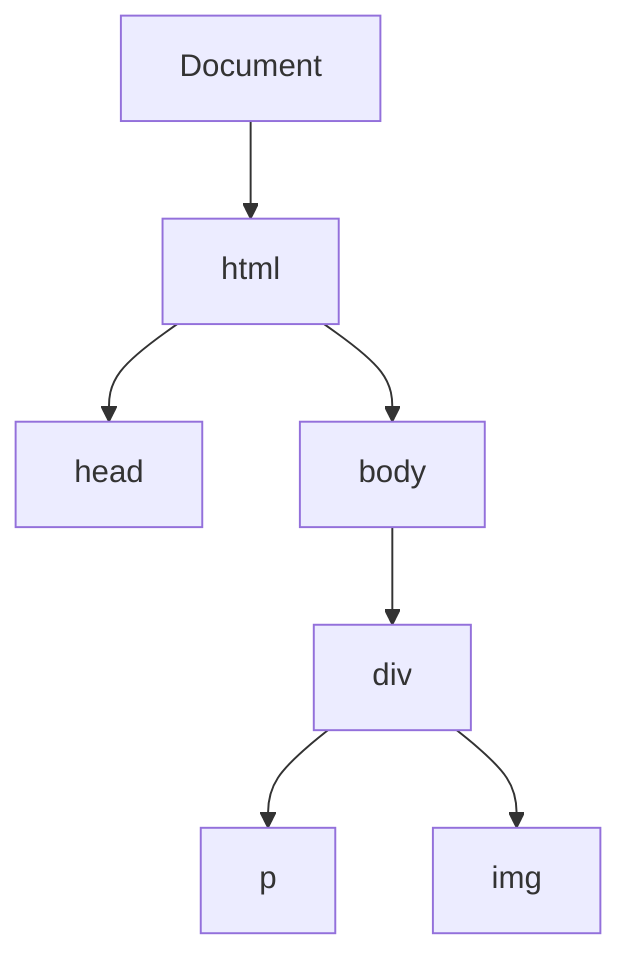

## 11.3 Manipulating Content and Attributes

In this section, we will explore how to manipulate content and attributes within the Document Object Model (DOM) using JavaScript. This is a crucial skill for creating dynamic and interactive web pages. By the end of this chapter, you'll be able to change text, update HTML content, and modify attributes of HTML elements with confidence.

### Understanding the Basics

Before we dive into manipulating content and attributes, let's briefly recap what the DOM is. The DOM is a programming interface for web documents. It represents the page so that programs can change the document structure, style, and content. The DOM represents the document as a tree of nodes, where each node is an object representing a part of the document.

### Changing Text Content

One of the simplest ways to manipulate the DOM is by changing the text content of an element. JavaScript provides several properties and methods to do this, including `textContent` and `innerText`.

#### Using `textContent`

The `textContent` property is used to get or set the text content of an element and its descendants. It includes all text, even if the element is hidden with CSS.

```javascript
// Select the element
let paragraph = document.querySelector('#myParagraph');

// Get the current text content
console.log(paragraph.textContent);

// Set new text content
paragraph.textContent = 'This is the new text content!';
```

**Key Points:**

- `textContent` retrieves all text within an element, including hidden elements.
- Setting `textContent` will replace all existing child nodes with a single text node.

#### Using `innerText`

The `innerText` property is similar to `textContent`, but it respects the styling of the text, such as `display: none` or `visibility: hidden`.

```javascript
// Select the element
let paragraph = document.querySelector('#myParagraph');

// Get the current inner text
console.log(paragraph.innerText);

// Set new inner text
paragraph.innerText = 'This is the new inner text!';
```

**Key Points:**

- `innerText` retrieves only the visible text within an element.
- It is more performance-intensive than `textContent` because it triggers a reflow to ensure the text is visible.

### Updating HTML Content with `innerHTML`

The `innerHTML` property allows you to get or set the HTML content of an element. This is powerful but comes with safety concerns.

```javascript
// Select the element
let container = document.querySelector('#myContainer');

// Get the current HTML content
console.log(container.innerHTML);

// Set new HTML content
container.innerHTML = '<p>This is a new paragraph with <strong>bold</strong> text!</p>';
```

**Safety Concerns:**

- **Security Risks:** Setting `innerHTML` can introduce security vulnerabilities, such as Cross-Site Scripting (XSS), if the content is not properly sanitized.
- **Performance:** Modifying `innerHTML` can be slower than other methods because it re-parses the entire content of the element.

**Best Practices:**

- Avoid using `innerHTML` with user-generated content unless you sanitize it first.
- Consider using `textContent` or `innerText` when only text needs to be updated.

### Modifying Attributes

Attributes provide additional information about HTML elements. JavaScript provides methods to manipulate these attributes.

#### Using `setAttribute()` and `getAttribute()`

The `setAttribute()` method is used to set the value of an attribute on an element, while `getAttribute()` retrieves the value of an attribute.

```javascript
// Select the image element
let image = document.querySelector('#myImage');

// Get the current 'src' attribute
let srcValue = image.getAttribute('src');
console.log(srcValue);

// Set a new 'src' attribute
image.setAttribute('src', 'newImage.jpg');
```

**Key Points:**

- `getAttribute()` retrieves the current value of an attribute.
- `setAttribute()` sets a new value for an attribute.

#### Direct Property Access

In addition to `setAttribute()` and `getAttribute()`, you can directly access and modify attributes using properties.

```javascript
// Select the image element
let image = document.querySelector('#myImage');

// Get the current 'src' attribute
console.log(image.src);

// Set a new 'src' attribute
image.src = 'anotherImage.jpg';
```

**Key Points:**

- Direct property access is often more convenient and readable.
- Not all attributes have corresponding properties, so `setAttribute()` and `getAttribute()` are sometimes necessary.

### Practical Examples

Let's put these concepts into practice with a few examples.

#### Example 1: Changing Text Content

```html
<!DOCTYPE html>
<html lang="en">
<head>
    <meta charset="UTF-8">
    <title>Change Text Content</title>
</head>
<body>
    <p id="myParagraph">Original text content.</p>
    <button onclick="changeText()">Change Text</button>

    <script>
        function changeText() {
            let paragraph = document.querySelector('#myParagraph');
            paragraph.textContent = 'This is the updated text content!';
        }
    </script>
</body>
</html>
```

**Explanation:**

- We select the paragraph element and change its text content when the button is clicked.

#### Example 2: Updating HTML Content

```html
<!DOCTYPE html>
<html lang="en">
<head>
    <meta charset="UTF-8">
    <title>Update HTML Content</title>
</head>
<body>
    <div id="myContainer">
        <p>Original paragraph.</p>
    </div>
    <button onclick="updateHTML()">Update HTML</button>

    <script>
        function updateHTML() {
            let container = document.querySelector('#myContainer');
            container.innerHTML = '<p>New paragraph with <strong>bold</strong> text!</p>';
        }
    </script>
</body>
</html>
```

**Explanation:**

- We replace the entire content of the `div` with new HTML when the button is clicked.

#### Example 3: Modifying Attributes

```html
<!DOCTYPE html>
<html lang="en">
<head>
    <meta charset="UTF-8">
    <title>Modify Attributes</title>
</head>
<body>
    
    <button onclick="changeImage()">Change Image</button>

    <script>
        function changeImage() {
            let image = document.querySelector('#myImage');
            image.setAttribute('src', 'newImage.jpg');
            image.alt = 'New Image';
        }
    </script>
</body>
</html>
```

**Explanation:**

- We change the `src` and `alt` attributes of the image when the button is clicked.

### Try It Yourself

Experiment with the examples provided. Try changing the text, HTML, and attributes to see how the DOM updates in real time. Here are some suggestions:

- Modify the text content of multiple elements at once.
- Use `innerHTML` to add new elements dynamically.
- Change the attributes of different types of elements, such as links or buttons.

### Visualizing the DOM

To better understand how the DOM is structured, let's visualize it using a simple DOM tree diagram:



**Diagram Explanation:**

- The DOM tree starts with the `Document` node.
- The `html` element is a child of the `Document`.
- The `head` and `body` elements are children of `html`.
- The `div` element is a child of `body`, containing a `p` and an `img` element.

### Summary

In this section, we've learned how to manipulate content and attributes in the DOM using JavaScript. We explored:

- Changing text content with `textContent` and `innerText`.
- Updating HTML content with `innerHTML` and understanding the associated safety concerns.
- Modifying attributes using `setAttribute()` and `getAttribute()`, as well as direct property access.

By mastering these techniques, you can create dynamic and interactive web pages that respond to user actions.

## Quiz Time!



### What does the `textContent` property do?

- [x] Retrieves or sets the text content of an element, including hidden text.
- [ ] Retrieves only the visible text of an element.
- [ ] Retrieves or sets the HTML content of an element.
- [ ] Sets the value of an attribute on an element.

> **Explanation:** `textContent` retrieves or sets the text content of an element, including hidden text.

### Which property should you use to get only the visible text of an element?

- [ ] textContent
- [x] innerText
- [ ] innerHTML
- [ ] getAttribute()

> **Explanation:** `innerText` retrieves only the visible text within an element.

### What is a potential security risk of using `innerHTML`?

- [ ] It can introduce Cross-Site Scripting (XSS) vulnerabilities.
- [ ] It can slow down the page loading time.
- [ ] It can change the text content of an element.
- [ ] It can modify attributes of an element.

> **Explanation:** Using `innerHTML` can introduce Cross-Site Scripting (XSS) vulnerabilities if the content is not properly sanitized.

### How do you set a new value for an attribute using JavaScript?

- [ ] Use `getAttribute()`.
- [x] Use `setAttribute()`.
- [ ] Use `innerHTML`.
- [ ] Use `textContent`.

> **Explanation:** `setAttribute()` is used to set a new value for an attribute on an element.

### Which method is used to retrieve the value of an attribute?

- [x] getAttribute()
- [ ] setAttribute()
- [ ] innerHTML
- [ ] textContent

> **Explanation:** `getAttribute()` retrieves the current value of an attribute on an element.

### What does `innerHTML` allow you to do?

- [x] Get or set the HTML content of an element.
- [ ] Get or set the text content of an element.
- [ ] Modify the attributes of an element.
- [ ] Retrieve only the visible text of an element.

> **Explanation:** `innerHTML` allows you to get or set the HTML content of an element.

### How can you directly access an attribute of an element?

- [x] By using the property name, like `element.src`.
- [ ] By using `getAttribute()`.
- [ ] By using `setAttribute()`.
- [ ] By using `innerHTML`.

> **Explanation:** You can directly access an attribute of an element using the property name, like `element.src`.

### What is the difference between `textContent` and `innerText`?

- [x] `textContent` includes all text, while `innerText` includes only visible text.
- [ ] `innerText` includes all text, while `textContent` includes only visible text.
- [ ] Both include only visible text.
- [ ] Both include all text.

> **Explanation:** `textContent` includes all text, while `innerText` includes only visible text.

### What is the main purpose of the `setAttribute()` method?

- [x] To set the value of an attribute on an element.
- [ ] To get the value of an attribute on an element.
- [ ] To change the text content of an element.
- [ ] To update the HTML content of an element.

> **Explanation:** The `setAttribute()` method is used to set the value of an attribute on an element.

### True or False: `innerHTML` can be used to add new elements dynamically.

- [x] True
- [ ] False

> **Explanation:** `innerHTML` can be used to add new elements dynamically by setting new HTML content.


