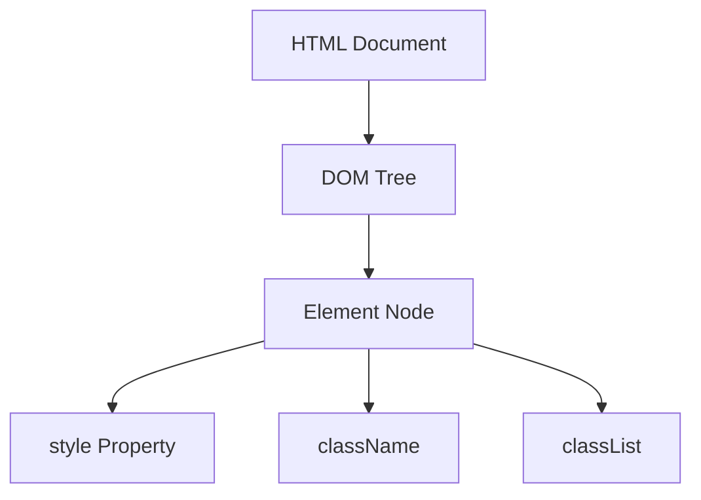

## 11.4 Modifying Styles

In this section, we will explore how to modify the appearance of web pages using JavaScript. Styling is a crucial aspect of web development, and JavaScript provides powerful tools to dynamically change styles, making web pages interactive and visually appealing. We will cover how to change inline styles using the `style` property and manipulate CSS classes using `className` and `classList` methods.

### Understanding Inline Styles

Inline styles are CSS properties applied directly to an HTML element via the `style` attribute. JavaScript allows us to modify these styles dynamically, which can be particularly useful for creating interactive effects. Let's start by understanding how to access and change these styles.

#### Accessing and Modifying Inline Styles

To change an element's inline style, we use the `style` property in JavaScript. This property provides access to all CSS properties of an element. Here's a simple example:

```html
<!DOCTYPE html>
<html lang="en">
<head>
    <meta charset="UTF-8">
    <meta name="viewport" content="width=device-width, initial-scale=1.0">
    <title>Modify Styles Example</title>
</head>
<body>
    <p id="myParagraph">Hello, World!</p>
    <button onclick="changeColor()">Change Color</button>

    <script>
        function changeColor() {
            // Access the paragraph element
            var paragraph = document.getElementById('myParagraph');
            // Change the color to blue
            paragraph.style.color = 'blue';
        }
    </script>
</body>
</html>
```

In this example, when the button is clicked, the `changeColor` function is called. The function accesses the paragraph element using `document.getElementById('myParagraph')` and changes its text color to blue using `paragraph.style.color = 'blue';`.

#### Important Points to Remember

- **CSS Property Names**: When using the `style` property, CSS property names are written in camelCase. For example, `background-color` becomes `backgroundColor`.
- **Units**: When setting properties that require units (like `width`, `height`, `margin`, etc.), you must include the unit (e.g., `element.style.width = '100px';`).

### Manipulating CSS Classes

While inline styles are useful for quick changes, manipulating CSS classes is a more powerful and flexible way to apply styles. Classes allow you to define a set of styles in a stylesheet and apply them to multiple elements.

#### Using `className`

The `className` property allows you to get or set the entire class attribute of an element. Here's an example:

```html
<!DOCTYPE html>
<html lang="en">
<head>
    <meta charset="UTF-8">
    <meta name="viewport" content="width=device-width, initial-scale=1.0">
    <title>Class Name Example</title>
    <style>
        .highlight {
            background-color: yellow;
        }
    </style>
</head>
<body>
    <p id="myText">Hover over this text to highlight it.</p>

    <script>
        var text = document.getElementById('myText');

        text.onmouseover = function() {
            // Add the 'highlight' class
            text.className = 'highlight';
        };

        text.onmouseout = function() {
            // Remove the 'highlight' class
            text.className = '';
        };
    </script>
</body>
</html>
```

In this example, when you hover over the paragraph, the `highlight` class is added, changing the background color to yellow. When the mouse leaves, the class is removed.

#### Using `classList`

The `classList` property provides a more flexible way to work with classes. It offers methods like `add()`, `remove()`, and `toggle()`, which are very convenient for manipulating classes.

##### Adding and Removing Classes

```html
<!DOCTYPE html>
<html lang="en">
<head>
    <meta charset="UTF-8">
    <meta name="viewport" content="width=device-width, initial-scale=1.0">
    <title>Class List Example</title>
    <style>
        .active {
            font-weight: bold;
            color: red;
        }
    </style>
</head>
<body>
    <p id="myParagraph">Click me to activate!</p>

    <script>
        var paragraph = document.getElementById('myParagraph');

        paragraph.onclick = function() {
            // Toggle the 'active' class
            paragraph.classList.toggle('active');
        };
    </script>
</body>
</html>
```

In this example, clicking the paragraph toggles the `active` class, which changes the text to bold and red.

##### Using `toggle()`

The `toggle()` method is particularly useful for adding or removing a class based on its current presence:

```javascript
element.classList.toggle('className');
```

This single line of code will add the class if it's not present and remove it if it is, making it perfect for creating toggle buttons or interactive elements.

### Try It Yourself

Experiment with the examples provided:

1. **Change the Background Color**: Modify the `changeColor` function to change the background color instead of the text color.
2. **Add Multiple Classes**: Use `classList.add()` to add multiple classes to an element.
3. **Create a Toggle Button**: Use `classList.toggle()` to create a button that toggles between two styles.

### Visualizing the DOM and Styles

To better understand how styles are applied and modified, let's visualize the DOM structure and how JavaScript interacts with it.



**Diagram Explanation**: This diagram shows the relationship between the HTML document, the DOM tree, and the style manipulation properties (`style`, `className`, `classList`). JavaScript interacts with the DOM tree to modify styles dynamically.

### Further Reading

- [MDN Web Docs: Using the style property](https://developer.mozilla.org/en-US/docs/Web/API/HTMLElement/style)
- [MDN Web Docs: Element.classList](https://developer.mozilla.org/en-US/docs/Web/API/Element/classList)
- [W3Schools: HTML DOM Style Object](https://www.w3schools.com/jsref/dom_obj_style.asp)

### Key Takeaways

- **Inline Styles**: Use the `style` property to change individual CSS properties directly on an element.
- **CSS Classes**: Use `className` to set the entire class attribute or `classList` for more flexible class manipulation.
- **Dynamic Styling**: JavaScript allows for dynamic changes to styles, enabling interactive and responsive web pages.

### Practice Problems

1. **Modify Styles with JavaScript**: Write a function that changes the font size of a paragraph when a button is clicked.
2. **Toggle Visibility**: Use `classList.toggle()` to hide and show an element with a button click.
3. **Style Multiple Elements**: Use JavaScript to apply a style to all elements of a specific class.

By mastering these techniques, you'll be able to create dynamic and visually appealing web pages that respond to user interactions. Keep experimenting and exploring to deepen your understanding of JavaScript and web development.

## Quiz Time!



### What is the correct way to change the background color of an element using JavaScript?

- [x] `element.style.backgroundColor = 'red';`
- [ ] `element.style.background-color = 'red';`
- [ ] `element.style['background-color'] = 'red';`
- [ ] `element.style.background = 'red';`

> **Explanation:** In JavaScript, CSS properties are written in camelCase, so `background-color` becomes `backgroundColor`.

### How do you add a class to an element using `classList`?

- [x] `element.classList.add('newClass');`
- [ ] `element.className.add('newClass');`
- [ ] `element.classList = 'newClass';`
- [ ] `element.addClass('newClass');`

> **Explanation:** The `classList.add()` method is used to add a class to an element.

### Which method would you use to remove a class from an element?

- [x] `element.classList.remove('className');`
- [ ] `element.className.remove('className');`
- [ ] `element.removeClass('className');`
- [ ] `element.classList.delete('className');`

> **Explanation:** The `classList.remove()` method removes a specified class from an element.

### What does the `toggle()` method do?

- [x] Adds the class if it's not present and removes it if it is
- [ ] Only adds the class
- [ ] Only removes the class
- [ ] Does nothing if the class is present

> **Explanation:** The `toggle()` method adds the class if it's not present and removes it if it is, making it useful for toggling styles.

### Which property would you use to change the text color of an element?

- [x] `element.style.color`
- [ ] `element.style.textColor`
- [ ] `element.style.fontColor`
- [ ] `element.style.text`

> **Explanation:** The `color` property is used to change the text color of an element.

### What is the purpose of the `className` property?

- [x] To get or set the entire class attribute of an element
- [ ] To add a single class to an element
- [ ] To remove a single class from an element
- [ ] To toggle classes on an element

> **Explanation:** The `className` property allows you to get or set the entire class attribute of an element.

### How can you apply multiple classes to an element using `classList`?

- [x] `element.classList.add('class1', 'class2');`
- [ ] `element.classList.add(['class1', 'class2']);`
- [ ] `element.classList = 'class1 class2';`
- [ ] `element.addClasses('class1', 'class2');`

> **Explanation:** The `classList.add()` method can take multiple class names as arguments to add them to an element.

### Which of the following is true about inline styles?

- [x] They are applied directly to an element using the `style` attribute.
- [ ] They are defined in a separate CSS file.
- [ ] They cannot be modified using JavaScript.
- [ ] They are less specific than external styles.

> **Explanation:** Inline styles are applied directly to an element using the `style` attribute and can be modified using JavaScript.

### What is the result of `element.style.fontSize = '20px';`?

- [x] Sets the font size of the element to 20 pixels
- [ ] Sets the font size of the element to 20 points
- [ ] Sets the font size of the element to 20 em
- [ ] Sets the font size of the element to 20 percent

> **Explanation:** The `fontSize` property sets the font size of the element to 20 pixels when the unit 'px' is specified.

### True or False: The `classList` property is only available in modern browsers.

- [x] True
- [ ] False

> **Explanation:** The `classList` property is a modern addition to the DOM API and may not be available in very old browsers.


