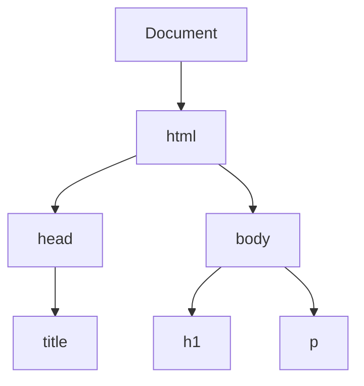
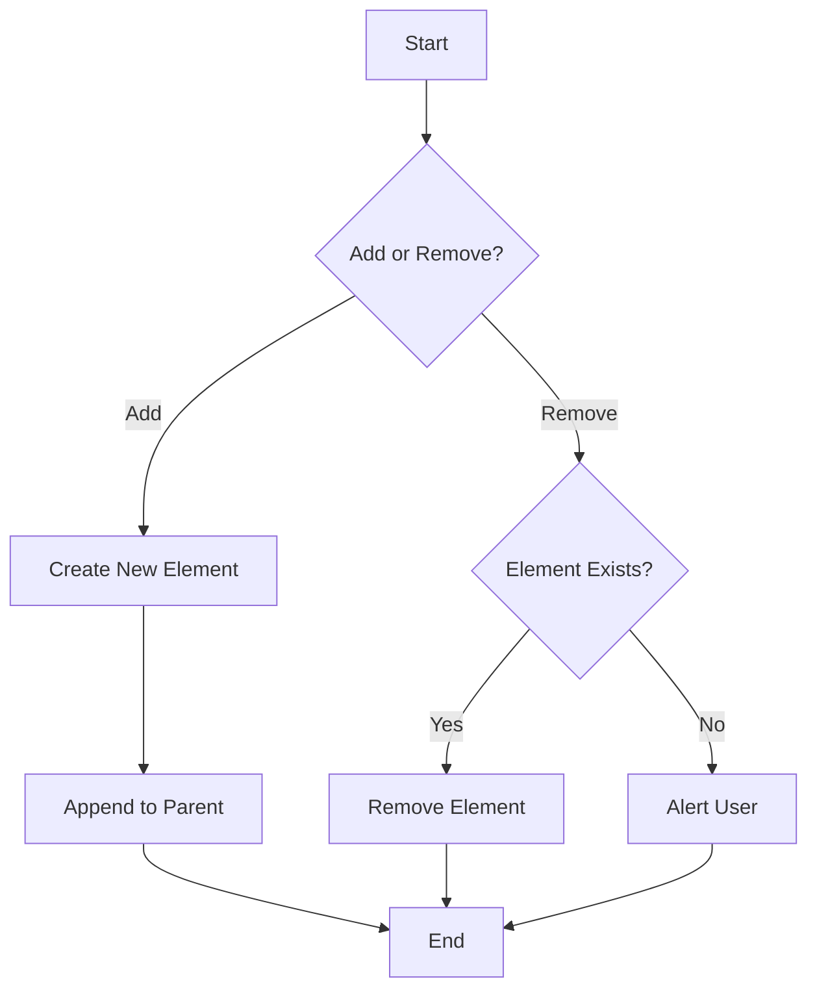

## 11.5 Creating and Removing Elements in the DOM

In this section, we will explore how to dynamically create and remove HTML elements using JavaScript. This is a powerful feature that allows us to build interactive and dynamic web pages. By the end of this section, you'll be able to create new elements, add them to the DOM, and remove them when necessary.

### Understanding the Basics

Before we dive into creating and removing elements, let's briefly revisit what the Document Object Model (DOM) is. The DOM is a programming interface for web documents. It represents the page so that programs can change the document structure, style, and content. The DOM represents the document as a tree of nodes, where each node is an object representing a part of the document.

#### The DOM Tree Structure

Here's a simple representation of a DOM tree for a basic HTML document:



In this diagram, the `Document` is the root node, and it branches out into `html`, which further branches into `head` and `body`. Each of these nodes can have child nodes, forming a tree structure.

### Creating New Elements with `document.createElement()`

To create a new element in the DOM, we use the `document.createElement()` method. This method creates an element node with the specified tag name, but it does not automatically add it to the document.

#### Syntax

```javascript
let newElement = document.createElement('tagName');
```

- **`tagName`**: A string that specifies the type of element to be created. For example, `'div'`, `'p'`, `'span'`, etc.

#### Example: Creating a New Paragraph Element

Let's create a new paragraph element and add some text to it:

```javascript
// Create a new paragraph element
let newParagraph = document.createElement('p');

// Create a text node
let textNode = document.createTextNode('This is a new paragraph.');

// Append the text node to the paragraph
newParagraph.appendChild(textNode);

// Log the new paragraph to the console
console.log(newParagraph);
```

In this example, we created a new paragraph element and a text node. We then appended the text node to the paragraph element. However, at this point, the new paragraph is not yet part of the document.

### Adding Elements to the DOM

To add the newly created element to the DOM, we need to specify where it should be placed. We can use methods like `appendChild()` and `insertBefore()` to achieve this.

#### Using `appendChild()`

The `appendChild()` method adds a node to the end of the list of children of a specified parent node.

##### Example: Appending a New Paragraph to the Body

```javascript
// Select the body element
let body = document.querySelector('body');

// Append the new paragraph to the body
body.appendChild(newParagraph);
```

Now, the new paragraph is part of the document and will be displayed on the page.

#### Using `insertBefore()`

The `insertBefore()` method inserts a node before a reference node as a child of a specified parent node.

##### Example: Inserting a New Paragraph Before an Existing Element

```javascript
// Select an existing element
let existingElement = document.querySelector('h1');

// Insert the new paragraph before the existing element
body.insertBefore(newParagraph, existingElement);
```

In this example, the new paragraph is inserted before the `h1` element within the body.

### Removing Elements from the DOM

Just as we can add elements to the DOM, we can also remove them. There are two primary methods for removing elements: `removeChild()` and `element.remove()`.

#### Using `removeChild()`

The `removeChild()` method removes a specified child node from the DOM and returns the removed node.

##### Example: Removing a Specific Element

```javascript
// Select the element to be removed
let elementToRemove = document.querySelector('p');

// Remove the element
body.removeChild(elementToRemove);
```

In this example, we selected a paragraph element and removed it from the body.

#### Using `element.remove()`

The `element.remove()` method is a more straightforward way to remove an element from the DOM. It does not require a reference to the parent node.

##### Example: Removing an Element Directly

```javascript
// Select the element to be removed
let elementToRemove = document.querySelector('p');

// Remove the element
elementToRemove.remove();
```

This method is more concise and is supported in modern browsers.

### Building a Simple Dynamic Content Feature

Let's put these concepts into practice by building a simple feature that allows users to add and remove items from a list dynamically.

#### HTML Structure

First, let's set up a basic HTML structure:

```html
<!DOCTYPE html>
<html lang="en">
<head>
    <meta charset="UTF-8">
    <meta name="viewport" content="width=device-width, initial-scale=1.0">
    <title>Dynamic List</title>
</head>
<body>
    <h1>My Dynamic List</h1>
    <ul id="myList">
        <li>Item 1</li>
        <li>Item 2</li>
    </ul>
    <button id="addItem">Add Item</button>
    <button id="removeItem">Remove Last Item</button>
    <script src="script.js"></script>
</body>
</html>
```

#### JavaScript for Dynamic List

Now, let's write the JavaScript to handle adding and removing list items:

```javascript
// Select the list and buttons
let myList = document.getElementById('myList');
let addItemButton = document.getElementById('addItem');
let removeItemButton = document.getElementById('removeItem');

// Add an event listener to the "Add Item" button
addItemButton.addEventListener('click', function() {
    // Create a new list item
    let newItem = document.createElement('li');
    newItem.textContent = `Item ${myList.children.length + 1}`;
    
    // Append the new item to the list
    myList.appendChild(newItem);
});

// Add an event listener to the "Remove Last Item" button
removeItemButton.addEventListener('click', function() {
    // Check if there are any items to remove
    if (myList.children.length > 0) {
        // Remove the last item from the list
        myList.removeChild(myList.lastChild);
    } else {
        alert('No more items to remove!');
    }
});
```

In this script, we add event listeners to the buttons. When the "Add Item" button is clicked, a new list item is created and appended to the list. When the "Remove Last Item" button is clicked, the last item in the list is removed.

### Try It Yourself

Now that you've seen how to create and remove elements, try modifying the code to add new features. For example, you could:

- Add an input field to allow users to specify the text for new list items.
- Implement a feature to remove a specific item by its index.
- Add a button to clear all items from the list.

### Visualizing the Process

To help visualize how elements are added and removed, let's look at a flowchart of the process:



This flowchart illustrates the decision-making process for adding or removing elements based on user interaction.

### References and Further Reading

For more information on DOM manipulation, you can explore the following resources:

- [MDN Web Docs: Document.createElement()](https://developer.mozilla.org/en-US/docs/Web/API/Document/createElement)
- [MDN Web Docs: Node.appendChild()](https://developer.mozilla.org/en-US/docs/Web/API/Node/appendChild)
- [MDN Web Docs: Node.removeChild()](https://developer.mozilla.org/en-US/docs/Web/API/Node/removeChild)
- [MDN Web Docs: Element.remove()](https://developer.mozilla.org/en-US/docs/Web/API/Element/remove)

### Key Takeaways

- **Creating Elements**: Use `document.createElement()` to create new elements.
- **Adding Elements**: Use `appendChild()` or `insertBefore()` to add elements to the DOM.
- **Removing Elements**: Use `removeChild()` or `element.remove()` to remove elements from the DOM.
- **Dynamic Features**: Combine these methods to create interactive features on your web pages.

By mastering these techniques, you'll be able to build more dynamic and interactive web applications. Keep practicing and experimenting with different ways to manipulate the DOM to enhance your skills.

## Quiz Time!



### What method is used to create a new HTML element in JavaScript?

- [x] `document.createElement()`
- [ ] `document.newElement()`
- [ ] `document.addElement()`
- [ ] `document.makeElement()`

> **Explanation:** The `document.createElement()` method is used to create a new HTML element in JavaScript.

### Which method adds a node to the end of the list of children of a specified parent node?

- [x] `appendChild()`
- [ ] `insertBefore()`
- [ ] `removeChild()`
- [ ] `element.remove()`

> **Explanation:** The `appendChild()` method adds a node to the end of the list of children of a specified parent node.

### How can you remove an element directly without referencing its parent node?

- [x] `element.remove()`
- [ ] `removeChild()`
- [ ] `deleteElement()`
- [ ] `removeElement()`

> **Explanation:** The `element.remove()` method allows you to remove an element directly without referencing its parent node.

### What does the `insertBefore()` method require in addition to the new node?

- [x] A reference node
- [ ] A parent node
- [ ] A child node
- [ ] An attribute node

> **Explanation:** The `insertBefore()` method requires a reference node to insert the new node before it.

### Which method is more concise for removing an element in modern browsers?

- [x] `element.remove()`
- [ ] `removeChild()`
- [ ] `deleteElement()`
- [ ] `removeElement()`

> **Explanation:** The `element.remove()` method is more concise and is supported in modern browsers.

### What is the purpose of the `createTextNode()` method?

- [x] To create a text node
- [ ] To create a new element
- [ ] To remove a text node
- [ ] To append a text node

> **Explanation:** The `createTextNode()` method is used to create a text node that can be appended to an element.

### What will happen if you try to remove a non-existent child node using `removeChild()`?

- [x] An error will be thrown
- [ ] The operation will silently fail
- [ ] The parent node will be removed
- [ ] Nothing will happen

> **Explanation:** If you try to remove a non-existent child node using `removeChild()`, an error will be thrown.

### What does the `appendChild()` method return?

- [x] The appended child node
- [ ] The parent node
- [ ] `null`
- [ ] `undefined`

> **Explanation:** The `appendChild()` method returns the appended child node.

### True or False: The `insertBefore()` method can only be used with elements that have children.

- [ ] True
- [x] False

> **Explanation:** False. The `insertBefore()` method can be used with any element, regardless of whether it has children.

### True or False: The `removeChild()` method requires a reference to the parent node.

- [x] True
- [ ] False

> **Explanation:** True. The `removeChild()` method requires a reference to the parent node to remove a specified child node.


