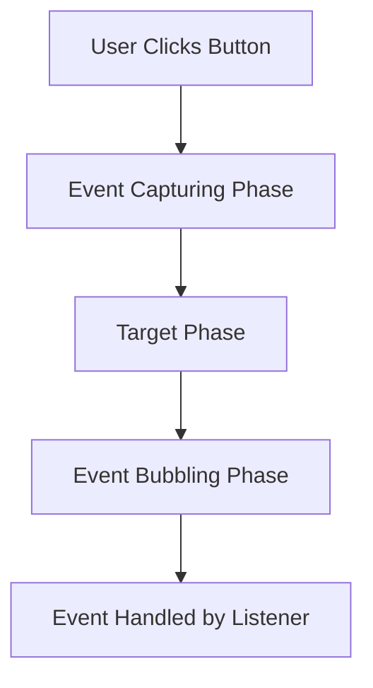

## 11.6 Event Handling in the DOM

In the world of web development, creating interactive and dynamic web pages is essential. JavaScript, with its ability to handle events, plays a crucial role in achieving this interactivity. In this section, we will explore how to attach event listeners to DOM elements, handle events at the document and window levels, and discuss best practices for efficient event handling and memory management.

### Understanding Events and Event Listeners

**Events** are actions or occurrences that happen in the browser, such as a user clicking a button, moving the mouse, or pressing a key. **Event listeners** are functions that wait for a specific event to occur on a particular element and then execute a block of code in response.

#### Attaching Event Listeners to DOM Elements

To make our web pages interactive, we need to attach event listeners to DOM elements. Let's start with a simple example where we attach a click event listener to a button.

```html
<!DOCTYPE html>
<html lang="en">
<head>
    <meta charset="UTF-8">
    <meta name="viewport" content="width=device-width, initial-scale=1.0">
    <title>Event Handling Example</title>
</head>
<body>
    <button id="myButton">Click Me!</button>

    <script>
        // Select the button element
        const button = document.getElementById('myButton');

        // Define the event listener function
        function handleClick() {
            alert('Button was clicked!');
        }

        // Attach the event listener to the button
        button.addEventListener('click', handleClick);
    </script>
</body>
</html>
```

In this example, we select the button using `document.getElementById()` and attach a click event listener using `addEventListener()`. When the button is clicked, the `handleClick` function is executed, displaying an alert message.

#### Handling Events at the Document and Window Levels

Event handling is not limited to individual elements. We can also handle events at the document and window levels. This is useful for capturing events that occur anywhere on the page or when the page itself is loaded.

##### Document-Level Event Handling

Let's consider an example where we listen for a keypress event on the entire document.

```html
<!DOCTYPE html>
<html lang="en">
<head>
    <meta charset="UTF-8">
    <meta name="viewport" content="width=device-width, initial-scale=1.0">
    <title>Document-Level Event Handling</title>
</head>
<body>
    <p>Press any key to see the key code.</p>

    <script>
        // Define the event listener function
        function handleKeyPress(event) {
            alert(`Key pressed: ${event.key}`);
        }

        // Attach the event listener to the document
        document.addEventListener('keypress', handleKeyPress);
    </script>
</body>
</html>
```

Here, we attach a `keypress` event listener to the document. Whenever a key is pressed, the `handleKeyPress` function is executed, displaying an alert with the key pressed.

##### Window-Level Event Handling

We can also handle events that occur at the window level, such as when the page is loaded or resized.

```html
<!DOCTYPE html>
<html lang="en">
<head>
    <meta charset="UTF-8">
    <meta name="viewport" content="width=device-width, initial-scale=1.0">
    <title>Window-Level Event Handling</title>
</head>
<body>
    <p>Resize the window to see the new dimensions.</p>

    <script>
        // Define the event listener function
        function handleResize() {
            console.log(`Window dimensions: ${window.innerWidth}x${window.innerHeight}`);
        }

        // Attach the event listener to the window
        window.addEventListener('resize', handleResize);
    </script>
</body>
</html>
```

In this example, we attach a `resize` event listener to the window. Whenever the window is resized, the `handleResize` function logs the new dimensions to the console.

### Best Practices for Event Handling

Efficient event handling is crucial for maintaining performance and preventing memory leaks in your web applications. Here are some best practices to consider:

#### 1. Use Event Delegation

Event delegation involves attaching a single event listener to a parent element to handle events for multiple child elements. This reduces the number of event listeners and improves performance.

```html
<!DOCTYPE html>
<html lang="en">
<head>
    <meta charset="UTF-8">
    <meta name="viewport" content="width=device-width, initial-scale=1.0">
    <title>Event Delegation Example</title>
</head>
<body>
    <ul id="myList">
        <li>Item 1</li>
        <li>Item 2</li>
        <li>Item 3</li>
    </ul>

    <script>
        // Select the parent element
        const list = document.getElementById('myList');

        // Define the event listener function
        function handleItemClick(event) {
            if (event.target.tagName === 'LI') {
                alert(`You clicked on ${event.target.textContent}`);
            }
        }

        // Attach the event listener to the parent element
        list.addEventListener('click', handleItemClick);
    </script>
</body>
</html>
```

In this example, we attach a single click event listener to the `ul` element. The `handleItemClick` function checks if the clicked target is an `li` element and displays an alert with the item's text.

#### 2. Remove Event Listeners When No Longer Needed

To prevent memory leaks, it's important to remove event listeners when they are no longer needed. This is especially important for single-page applications or when dynamically adding and removing elements.

```javascript
// Define the event listener function
function handleClick() {
    alert('Button was clicked!');
}

// Attach the event listener to the button
button.addEventListener('click', handleClick);

// Remove the event listener when no longer needed
button.removeEventListener('click', handleClick);
```

#### 3. Use Passive Event Listeners for Performance

For certain events like `scroll` and `touch`, using passive event listeners can improve performance by allowing the browser to optimize scrolling.

```javascript
// Attach a passive event listener
window.addEventListener('scroll', handleScroll, { passive: true });
```

### Memory Management in Event Handling

Efficient memory management is crucial for ensuring that your web applications run smoothly. Here are some tips for managing memory when handling events:

- **Avoid Memory Leaks**: Memory leaks occur when objects are no longer needed but are not released, consuming memory unnecessarily. Removing event listeners when they are no longer needed helps prevent memory leaks.
- **Use Closures Wisely**: Closures can capture variables from their surrounding scope, which can lead to memory leaks if not managed properly. Be mindful of what variables are captured and ensure they are released when no longer needed.
- **Profile and Monitor Memory Usage**: Use browser developer tools to profile and monitor memory usage. This can help identify memory leaks and optimize your code.

### Visualizing Event Flow

To better understand how events flow through the DOM, let's visualize the event flow using a Mermaid.js diagram.



In this diagram, we see the flow of an event from the user clicking a button through the capturing phase, target phase, and bubbling phase, until it is handled by the event listener.

### Try It Yourself

Experiment with the code examples provided in this section. Try modifying the event listeners to handle different events, such as `mouseover` or `mouseout`. You can also experiment with event delegation by adding more list items dynamically and observing how the event listener still works without modification.

### Summary

In this section, we explored how to attach event listeners to DOM elements, handle events at the document and window levels, and discussed best practices for efficient event handling and memory management. By understanding and implementing these concepts, you can create interactive and dynamic web applications that provide a seamless user experience.

## Quiz Time!



### What is an event listener in JavaScript?

- [x] A function that waits for an event to occur and executes code in response
- [ ] A method that automatically executes when the page loads
- [ ] A tool for debugging JavaScript code
- [ ] A way to style HTML elements

> **Explanation:** An event listener is a function that waits for a specific event to occur on a particular element and then executes a block of code in response.

### Which method is used to attach an event listener to a DOM element?

- [x] `addEventListener()`
- [ ] `attachEvent()`
- [ ] `bindEvent()`
- [ ] `setEventListener()`

> **Explanation:** The `addEventListener()` method is used to attach an event listener to a DOM element.

### What is event delegation?

- [x] Attaching a single event listener to a parent element to handle events for multiple child elements
- [ ] Using multiple event listeners for a single element
- [ ] Delegating events to a third-party library
- [ ] Handling events only at the window level

> **Explanation:** Event delegation involves attaching a single event listener to a parent element to handle events for multiple child elements, reducing the number of event listeners and improving performance.

### How can you prevent memory leaks in event handling?

- [x] Remove event listeners when they are no longer needed
- [ ] Use more event listeners
- [ ] Avoid using closures
- [ ] Use only global variables

> **Explanation:** Removing event listeners when they are no longer needed helps prevent memory leaks by releasing objects that are no longer required.

### What is the purpose of using passive event listeners?

- [x] To improve performance by allowing the browser to optimize scrolling
- [ ] To prevent events from bubbling
- [ ] To capture events during the capturing phase
- [ ] To handle events only once

> **Explanation:** Passive event listeners improve performance by allowing the browser to optimize scrolling and other events.

### Which event phase occurs first in the event flow?

- [x] Capturing phase
- [ ] Target phase
- [ ] Bubbling phase
- [ ] Handling phase

> **Explanation:** The capturing phase occurs first in the event flow, followed by the target phase and then the bubbling phase.

### What is the `removeEventListener()` method used for?

- [x] To remove an event listener from a DOM element
- [ ] To attach an event listener to a DOM element
- [ ] To pause an event listener temporarily
- [ ] To change the event type of an event listener

> **Explanation:** The `removeEventListener()` method is used to remove an event listener from a DOM element.

### How can you attach an event listener to the window object?

- [x] `window.addEventListener('event', listener)`
- [ ] `window.attachEvent('event', listener)`
- [ ] `window.bindEvent('event', listener)`
- [ ] `window.setEventListener('event', listener)`

> **Explanation:** You can attach an event listener to the window object using `window.addEventListener('event', listener)`.

### What does the `event.target` property represent?

- [x] The element that triggered the event
- [ ] The parent element of the event
- [ ] The window object
- [ ] The document object

> **Explanation:** The `event.target` property represents the element that triggered the event.

### True or False: Event listeners can only be attached to individual elements, not the document or window.

- [ ] True
- [x] False

> **Explanation:** Event listeners can be attached to individual elements, as well as the document and window, allowing for more flexible event handling.


