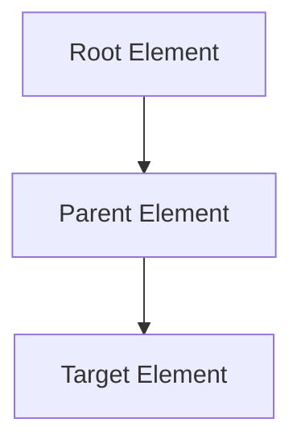
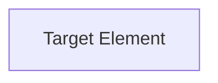
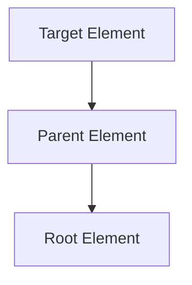
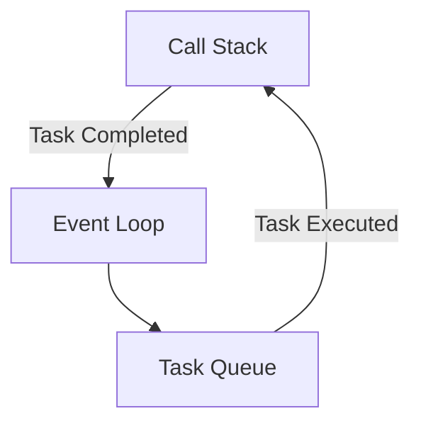
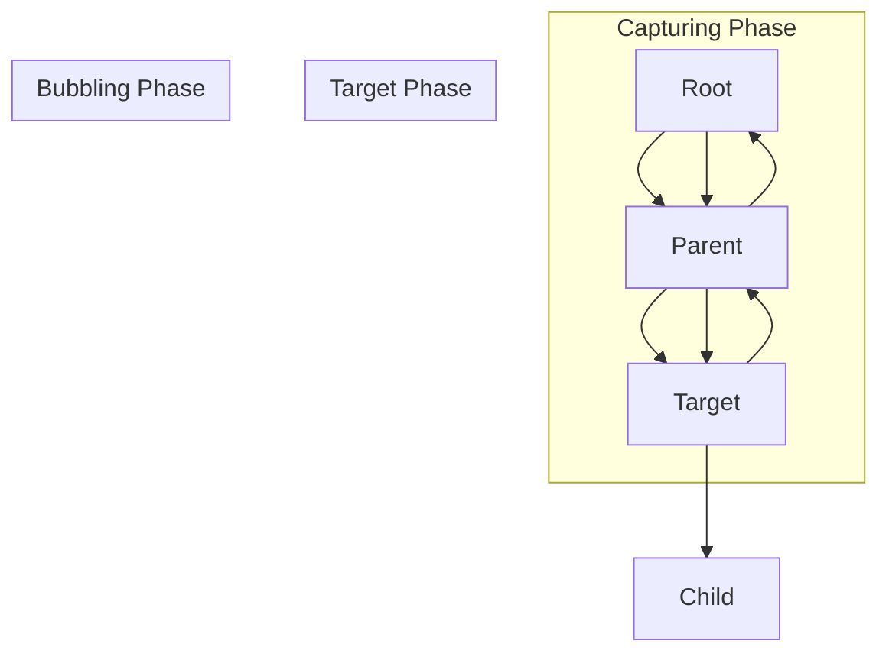

## 12.1 Understanding Events

In the world of web development, **events** are the cornerstone of creating interactive and dynamic web applications. Events allow your JavaScript code to respond to user actions, such as clicking a button, typing in a text field, or moving the mouse. Understanding how events work is crucial for anyone looking to build engaging web experiences. In this section, we will delve into the concept of events, explore the event flow, and introduce the event loop and asynchronous behavior.

### What Are Events?

In the context of web browsers, an **event** is an action or occurrence that happens in the browser, which can be detected by JavaScript. Events can be triggered by user interactions, such as clicks, key presses, or mouse movements, as well as by other actions, such as loading a webpage or submitting a form.

#### Common Types of Events

- **Mouse Events**: `click`, `dblclick`, `mousedown`, `mouseup`, `mousemove`, `mouseover`, `mouseout`
- **Keyboard Events**: `keydown`, `keyup`, `keypress`
- **Form Events**: `submit`, `change`, `focus`, `blur`
- **Window Events**: `load`, `resize`, `scroll`, `unload`

### Event Flow: Capturing, Target, and Bubbling Phases

When an event occurs, it doesn't just happen at a single point. Instead, it follows a specific path through the Document Object Model (DOM). This path is known as the **event flow**, which consists of three phases: capturing, target, and bubbling.

#### 1. Capturing Phase

The capturing phase is the first phase of the event flow. During this phase, the event travels from the root of the DOM tree down to the target element. This phase allows parent elements to intercept the event before it reaches the target element.



#### 2. Target Phase

The target phase is where the event has reached the target element. This is the element that triggered the event, such as the button that was clicked.



#### 3. Bubbling Phase

After the event has been processed at the target element, it enters the bubbling phase. In this phase, the event travels back up the DOM tree from the target element to the root, allowing parent elements to handle the event after the target element has had its chance.



### Event Propagation

Event propagation refers to the order in which events are received on the page. By default, most events in JavaScript use the bubbling phase, but you can choose to handle events during the capturing phase by specifying an option when adding an event listener.

#### Example: Event Propagation

Let's look at a simple example to illustrate event propagation:

```html
<!DOCTYPE html>
<html lang="en">
<head>
    <meta charset="UTF-8">
    <title>Event Propagation Example</title>
    <style>
        .parent { padding: 20px; background-color: lightblue; }
        .child { padding: 20px; background-color: lightcoral; }
    </style>
</head>
<body>
    <div class="parent">
        Parent
        <div class="child">
            Child
        </div>
    </div>

    <script>
        const parent = document.querySelector('.parent');
        const child = document.querySelector('.child');

        parent.addEventListener('click', () => {
            console.log('Parent clicked!');
        });

        child.addEventListener('click', (event) => {
            console.log('Child clicked!');
            // Stop the event from bubbling up to the parent
            event.stopPropagation();
        });
    </script>
</body>
</html>
```

In this example, clicking on the child element logs "Child clicked!" to the console. Normally, the event would bubble up to the parent element, logging "Parent clicked!" as well. However, by calling `event.stopPropagation()`, we prevent the event from bubbling up, so only "Child clicked!" is logged.

### The Event Loop and Asynchronous Behavior

JavaScript is a single-threaded language, meaning it can only execute one task at a time. However, web applications often need to perform multiple tasks simultaneously, such as handling user input while waiting for data from a server. This is where the **event loop** and **asynchronous behavior** come into play.

#### Understanding the Event Loop

The event loop is a mechanism that allows JavaScript to perform non-blocking operations, despite being single-threaded. It continuously checks the call stack and the task queue, executing tasks from the queue when the stack is empty.



#### Asynchronous JavaScript

Asynchronous operations allow JavaScript to perform tasks without blocking the main thread. Common asynchronous operations include:

- **Timers**: `setTimeout`, `setInterval`
- **Network Requests**: `fetch`, `XMLHttpRequest`
- **Event Listeners**: User interactions

#### Example: Asynchronous JavaScript

Let's look at an example of asynchronous JavaScript using `setTimeout`:

```javascript
console.log('Start');

setTimeout(() => {
    console.log('Timeout');
}, 2000);

console.log('End');
```

In this example, "Start" is logged first, followed by "End". After a 2-second delay, "Timeout" is logged. This demonstrates how `setTimeout` allows the code to continue executing while waiting for the timer to complete.

### Try It Yourself

Now that we've covered the basics of events, event flow, and the event loop, let's try a simple exercise. Modify the event propagation example to use the capturing phase instead of the bubbling phase. Hint: You can specify the capturing phase by passing `true` as the third argument to `addEventListener`.

### Visualizing the Event Flow

To better understand the event flow, let's visualize it using a diagram. The following diagram represents the event flow through the DOM tree:



### Key Takeaways

- **Events** are actions or occurrences that happen in the browser, which can be detected by JavaScript.
- **Event flow** consists of three phases: capturing, target, and bubbling.
- **Event propagation** determines the order in which events are received on the page.
- The **event loop** allows JavaScript to perform non-blocking operations, enabling asynchronous behavior.

### Further Reading

For more information on JavaScript events, check out the following resources:

- [MDN Web Docs: Introduction to events](https://developer.mozilla.org/en-US/docs/Learn/JavaScript/Building_blocks/Events)
- [W3Schools: JavaScript Events](https://www.w3schools.com/js/js_events.asp)

## Quiz Time!



### What is an event in the context of web browsers?

- [x] An action or occurrence that happens in the browser and can be detected by JavaScript
- [ ] A function that automatically executes when the page loads
- [ ] A method for styling HTML elements
- [ ] A type of variable used in JavaScript

> **Explanation:** An event is an action or occurrence that happens in the browser, such as a click or keypress, which can be detected by JavaScript.

### Which phase of the event flow occurs first?

- [x] Capturing phase
- [ ] Target phase
- [ ] Bubbling phase
- [ ] Execution phase

> **Explanation:** The capturing phase is the first phase of the event flow, where the event travels from the root of the DOM tree down to the target element.

### What does the `stopPropagation()` method do?

- [x] Prevents the event from bubbling up to parent elements
- [ ] Stops the event from being captured
- [ ] Cancels the event entirely
- [ ] Delays the event execution

> **Explanation:** The `stopPropagation()` method prevents the event from continuing to bubble up to parent elements after being handled by the target element.

### What is the purpose of the event loop in JavaScript?

- [x] To allow JavaScript to perform non-blocking operations
- [ ] To execute functions in a specific order
- [ ] To handle errors in asynchronous code
- [ ] To manage memory allocation

> **Explanation:** The event loop allows JavaScript to perform non-blocking operations, enabling asynchronous behavior in a single-threaded environment.

### Which of the following is an example of an asynchronous operation in JavaScript?

- [x] `setTimeout`
- [ ] `console.log`
- [x] `fetch`
- [ ] `alert`

> **Explanation:** `setTimeout` and `fetch` are examples of asynchronous operations that allow JavaScript to perform tasks without blocking the main thread.

### What is the default phase used by most events in JavaScript?

- [x] Bubbling phase
- [ ] Capturing phase
- [ ] Target phase
- [ ] Execution phase

> **Explanation:** By default, most events in JavaScript use the bubbling phase, where the event travels from the target element back up to the root.

### How can you specify the capturing phase when adding an event listener?

- [x] By passing `true` as the third argument to `addEventListener`
- [ ] By using the `capture` method
- [ ] By setting a property on the event object
- [ ] By calling `stopPropagation()`

> **Explanation:** You can specify the capturing phase by passing `true` as the third argument to `addEventListener`.

### What is the target phase in the event flow?

- [x] The phase where the event has reached the target element
- [ ] The phase where the event is captured by the root element
- [ ] The phase where the event is bubbling up to parent elements
- [ ] The phase where the event is canceled

> **Explanation:** The target phase is where the event has reached the target element, which is the element that triggered the event.

### Which method is used to handle events in JavaScript?

- [x] `addEventListener`
- [ ] `setTimeout`
- [ ] `console.log`
- [ ] `querySelector`

> **Explanation:** The `addEventListener` method is used to attach event handlers to elements in JavaScript.

### True or False: JavaScript is a multi-threaded language.

- [ ] True
- [x] False

> **Explanation:** JavaScript is a single-threaded language, meaning it can only execute one task at a time. However, it uses the event loop to manage asynchronous operations.



By understanding events and their flow, you can create interactive and dynamic web applications that respond to user actions seamlessly. Keep experimenting with different event types and propagation methods to deepen your understanding of this essential JavaScript concept.
