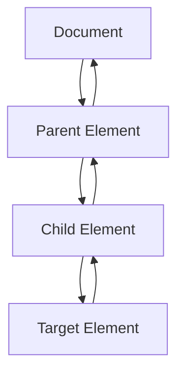

## 12.2 Event Listeners

In the world of web development, interactivity is key to creating engaging user experiences. JavaScript event listeners play a crucial role in making web pages responsive to user actions. In this section, we'll explore how to use event listeners to attach event handlers to HTML elements, compare inline event handlers with external script handlers, and learn how to remove event listeners when they are no longer needed.

### Understanding Event Listeners

An **event listener** is a procedure in JavaScript that waits for an event to occur. Events can be anything from a user clicking a button, typing on the keyboard, or moving the mouse. By using event listeners, we can execute specific code in response to these events, making our web pages dynamic and interactive.

#### Attaching Event Handlers with `addEventListener()`

The `addEventListener()` method is the most common way to attach event handlers to HTML elements. It allows us to specify the type of event we want to listen for and the function that should be executed when that event occurs.

Here's the basic syntax:

```javascript
element.addEventListener(event, function, useCapture);
```

- **`element`**: The HTML element you want to attach the event listener to.
- **`event`**: A string representing the event type (e.g., 'click', 'mouseover').
- **`function`**: The function to execute when the event occurs.
- **`useCapture`**: An optional boolean parameter that specifies whether the event should be captured or bubbled. By default, it is set to `false` (bubbling).

Let's see a simple example:

```html
<!DOCTYPE html>
<html lang="en">
<head>
    <meta charset="UTF-8">
    <meta name="viewport" content="width=device-width, initial-scale=1.0">
    <title>Event Listener Example</title>
</head>
<body>
    <button id="myButton">Click Me!</button>

    <script>
        // Select the button element
        const button = document.getElementById('myButton');

        // Define the function to be executed when the button is clicked
        function showAlert() {
            alert('Button was clicked!');
        }

        // Attach the event listener to the button
        button.addEventListener('click', showAlert);
    </script>
</body>
</html>
```

In this example, when the button is clicked, the `showAlert` function is executed, displaying an alert message.

#### Inline Event Handlers vs. External Script Handlers

There are different ways to attach event handlers to HTML elements. Let's compare inline event handlers with external script handlers.

**Inline Event Handlers**

Inline event handlers are defined directly within the HTML element's tag using attributes like `onclick`, `onmouseover`, etc.

Example:

```html
<button onclick="alert('Button was clicked!')">Click Me!</button>
```

**Pros:**
- Simple and quick to implement for small projects.
- Easy to understand for beginners.

**Cons:**
- Can lead to cluttered HTML code.
- Difficult to maintain and scale for larger projects.
- Limited to handling only one event per element.

**External Script Handlers**

External script handlers use JavaScript to attach event listeners, typically using `addEventListener()`.

Example:

```html
<button id="myButton">Click Me!</button>

<script>
    const button = document.getElementById('myButton');
    button.addEventListener('click', function() {
        alert('Button was clicked!');
    });
</script>
```

**Pros:**
- Keeps HTML clean and separate from JavaScript logic.
- Easier to maintain and scale.
- Allows multiple event listeners for the same element.

**Cons:**
- Requires a basic understanding of JavaScript and DOM manipulation.

#### Removing Event Listeners with `removeEventListener()`

Sometimes, we may need to remove an event listener when it is no longer needed, such as when cleaning up resources or preventing memory leaks. The `removeEventListener()` method is used for this purpose.

Here's the syntax:

```javascript
element.removeEventListener(event, function, useCapture);
```

To successfully remove an event listener, the parameters passed to `removeEventListener()` must match those used in `addEventListener()`.

Example:

```html
<button id="myButton">Click Me!</button>

<script>
    const button = document.getElementById('myButton');

    function showAlert() {
        alert('Button was clicked!');
    }

    // Attach the event listener
    button.addEventListener('click', showAlert);

    // Remove the event listener after 5 seconds
    setTimeout(() => {
        button.removeEventListener('click', showAlert);
        alert('Event listener removed!');
    }, 5000);
</script>
```

In this example, the event listener is removed after 5 seconds, so clicking the button afterward will not trigger the alert.

### Event Propagation: Capturing and Bubbling

Understanding event propagation is essential when working with event listeners. Event propagation refers to the order in which events are handled in the DOM. There are two main phases: capturing and bubbling.

- **Capturing Phase**: The event starts from the root of the DOM tree and travels down to the target element.
- **Bubbling Phase**: The event starts from the target element and travels up to the root of the DOM tree.

By default, event listeners are set to the bubbling phase. However, you can specify the capturing phase by setting the `useCapture` parameter to `true` in `addEventListener()`.

Example:

```html
<div id="parent">
    <button id="child">Click Me!</button>
</div>

<script>
    const parent = document.getElementById('parent');
    const child = document.getElementById('child');

    parent.addEventListener('click', () => {
        alert('Parent clicked!');
    }, true); // Capturing phase

    child.addEventListener('click', () => {
        alert('Child clicked!');
    }, false); // Bubbling phase
</script>
```

In this example, clicking the button will first trigger the parent alert due to the capturing phase, followed by the child alert in the bubbling phase.

### Try It Yourself

Experiment with the following code snippets to deepen your understanding of event listeners:

1. **Modify the Event Type**: Change the event type in the `addEventListener()` method to 'mouseover' or 'dblclick' and observe the behavior.

2. **Multiple Event Listeners**: Attach multiple event listeners to the same element for different events (e.g., 'click' and 'mouseover').

3. **Dynamic Event Handling**: Use `removeEventListener()` to dynamically add and remove event listeners based on certain conditions.

### Visualizing Event Propagation

Let's use a Mermaid.js diagram to visualize event propagation:



- **Capturing Phase**: A → B → C → D
- **Bubbling Phase**: D → C → B → A

### Best Practices for Using Event Listeners

- **Use External Script Handlers**: Keep your HTML clean and separate from JavaScript logic.
- **Avoid Memory Leaks**: Remove event listeners when they are no longer needed.
- **Use Named Functions**: Define named functions instead of anonymous functions for better readability and maintainability.
- **Leverage Event Delegation**: Use a single event listener on a parent element to manage events for multiple child elements.

### Further Reading

For more information on JavaScript event listeners and DOM manipulation, check out the following resources:

- [MDN Web Docs: EventTarget.addEventListener()](https://developer.mozilla.org/en-US/docs/Web/API/EventTarget/addEventListener)
- [W3Schools: JavaScript HTML DOM EventListener](https://www.w3schools.com/js/js_htmldom_eventlistener.asp)

### Summary

In this section, we've explored the power of JavaScript event listeners in creating interactive web pages. We've learned how to attach and remove event handlers using `addEventListener()` and `removeEventListener()`, compared inline event handlers with external script handlers, and understood the concept of event propagation. By mastering event listeners, you can enhance the interactivity and responsiveness of your web applications.

## Quiz Time!



### What is the primary purpose of an event listener in JavaScript?

- [x] To execute code in response to user actions
- [ ] To style HTML elements
- [ ] To create new HTML elements
- [ ] To manage server requests

> **Explanation:** Event listeners are used to execute specific code when an event occurs, such as a user clicking a button.

### Which method is used to attach an event listener to an HTML element?

- [ ] attachEvent()
- [x] addEventListener()
- [ ] setEventListener()
- [ ] bindEvent()

> **Explanation:** The `addEventListener()` method is used to attach event listeners to HTML elements in JavaScript.

### What is the default phase for event listeners in JavaScript?

- [ ] Capturing
- [x] Bubbling
- [ ] Propagation
- [ ] Target

> **Explanation:** By default, event listeners are set to the bubbling phase, where the event propagates from the target element up to the root.

### How can you remove an event listener in JavaScript?

- [ ] detachEvent()
- [ ] deleteEventListener()
- [x] removeEventListener()
- [ ] unbindEvent()

> **Explanation:** The `removeEventListener()` method is used to remove an event listener from an HTML element.

### What is the purpose of the `useCapture` parameter in `addEventListener()`?

- [x] To specify whether the event should be captured or bubbled
- [ ] To define the event type
- [ ] To set the event handler function
- [ ] To determine the event's target element

> **Explanation:** The `useCapture` parameter specifies whether the event should be captured (true) or bubbled (false).

### Which of the following is a disadvantage of using inline event handlers?

- [ ] They are easy to implement
- [ ] They keep HTML clean
- [x] They can lead to cluttered HTML code
- [ ] They are suitable for large projects

> **Explanation:** Inline event handlers can lead to cluttered HTML code and are not suitable for large projects.

### What is event delegation in JavaScript?

- [ ] Attaching multiple event listeners to a single element
- [x] Using a single event listener on a parent element to manage events for multiple child elements
- [ ] Removing event listeners when they are no longer needed
- [ ] Using inline event handlers for simplicity

> **Explanation:** Event delegation involves using a single event listener on a parent element to manage events for multiple child elements.

### Which of the following is a best practice for using event listeners?

- [ ] Use inline event handlers for all events
- [x] Remove event listeners when they are no longer needed
- [ ] Avoid using named functions
- [ ] Attach event listeners directly in HTML

> **Explanation:** Removing event listeners when they are no longer needed helps prevent memory leaks and improve performance.

### True or False: Event listeners can only be attached to HTML elements.

- [ ] True
- [x] False

> **Explanation:** Event listeners can be attached to various objects, including HTML elements, the document, and the window.

### True or False: The `addEventListener()` method allows multiple event listeners for the same event type on a single element.

- [x] True
- [ ] False

> **Explanation:** The `addEventListener()` method allows multiple event listeners for the same event type on a single element, enabling different functions to be executed.


