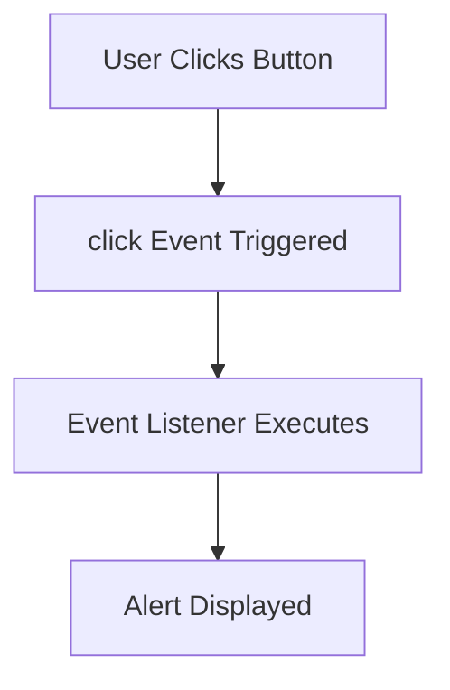

## 12.3 Common Event Types

JavaScript events are the heart of creating interactive web applications. They allow us to respond to user actions, such as clicking a button, typing on the keyboard, or submitting a form. In this section, we'll explore some of the most common event types you'll encounter in JavaScript programming. By the end of this chapter, you'll have a solid understanding of how to handle these events to make your web pages more dynamic and user-friendly.

### Mouse Events

Mouse events are triggered by interactions with the mouse, such as clicking or hovering over elements. Let's dive into some of the most common mouse events:

#### `click` Event

The `click` event is triggered when a user clicks on an element. This is one of the most frequently used events in web development.

```javascript
// Example: Handling a click event
document.getElementById('myButton').addEventListener('click', function() {
    alert('Button clicked!');
});
```

In this example, we attach a `click` event listener to a button with the ID `myButton`. When the button is clicked, an alert box will appear.

#### `dblclick` Event

The `dblclick` event is triggered when a user double-clicks on an element. It's similar to the `click` event but requires two consecutive clicks.

```javascript
// Example: Handling a double-click event
document.getElementById('myButton').addEventListener('dblclick', function() {
    alert('Button double-clicked!');
});
```

#### `mouseenter` Event

The `mouseenter` event is fired when the mouse pointer enters the boundaries of an element. It's useful for creating hover effects.

```javascript
// Example: Handling a mouseenter event
document.getElementById('myDiv').addEventListener('mouseenter', function() {
    this.style.backgroundColor = 'lightblue';
});
```

In this example, when the mouse enters the `myDiv` element, its background color changes to light blue.

### Keyboard Events

Keyboard events are triggered by interactions with the keyboard. These events are essential for capturing user input in text fields and other interactive elements.

#### `keydown` Event

The `keydown` event is triggered when a key is pressed down. It's useful for detecting when a user starts pressing a key.

```javascript
// Example: Handling a keydown event
document.addEventListener('keydown', function(event) {
    console.log('Key pressed:', event.key);
});
```

In this example, we log the key that was pressed to the console.

#### `keyup` Event

The `keyup` event is triggered when a key is released. It's useful for detecting when a user stops pressing a key.

```javascript
// Example: Handling a keyup event
document.addEventListener('keyup', function(event) {
    console.log('Key released:', event.key);
});
```

#### `keypress` Event

The `keypress` event is triggered when a key is pressed and released. It's similar to `keydown` but only fires for keys that produce a character value.

```javascript
// Example: Handling a keypress event
document.addEventListener('keypress', function(event) {
    console.log('Character typed:', event.key);
});
```

> **Note:** The `keypress` event is deprecated and may not be supported in all browsers. It's recommended to use `keydown` or `keyup` instead.

#### Handling Key Codes

When handling keyboard events, you may need to determine which key was pressed. You can do this using the `event.key` or `event.code` properties.

```javascript
// Example: Handling specific key codes
document.addEventListener('keydown', function(event) {
    if (event.key === 'Enter') {
        console.log('Enter key pressed');
    }
});
```

In this example, we check if the Enter key was pressed and log a message to the console.

### Form Events

Form events are triggered by interactions with form elements, such as input fields and buttons. These events are crucial for validating and submitting forms.

#### `submit` Event

The `submit` event is triggered when a form is submitted. It's often used to validate form data before sending it to the server.

```javascript
// Example: Handling a form submit event
document.getElementById('myForm').addEventListener('submit', function(event) {
    event.preventDefault(); // Prevent form submission
    alert('Form submitted!');
});
```

In this example, we prevent the default form submission behavior and display an alert instead.

#### `change` Event

The `change` event is triggered when the value of a form element changes. It's commonly used with input fields, select boxes, and textareas.

```javascript
// Example: Handling a change event
document.getElementById('mySelect').addEventListener('change', function() {
    console.log('Selected value:', this.value);
});
```

#### `input` Event

The `input` event is triggered when the value of an input field changes. It's similar to `change` but fires immediately as the user types.

```javascript
// Example: Handling an input event
document.getElementById('myInput').addEventListener('input', function() {
    console.log('Input value:', this.value);
});
```

#### `focus` and `blur` Events

The `focus` event is triggered when an element gains focus, while the `blur` event is triggered when an element loses focus. These events are useful for managing user interactions with form fields.

```javascript
// Example: Handling focus and blur events
document.getElementById('myInput').addEventListener('focus', function() {
    this.style.borderColor = 'blue';
});

document.getElementById('myInput').addEventListener('blur', function() {
    this.style.borderColor = '';
});
```

In this example, the input field's border color changes when it gains or loses focus.

### Document Events

Document events are triggered by changes to the document's state. These events are essential for controlling the loading and rendering of web pages.

#### `DOMContentLoaded` Event

The `DOMContentLoaded` event is triggered when the initial HTML document has been completely loaded and parsed, without waiting for stylesheets, images, and subframes to finish loading.

```javascript
// Example: Handling DOMContentLoaded event
document.addEventListener('DOMContentLoaded', function() {
    console.log('DOM fully loaded and parsed');
});
```

#### `readystatechange` Event

The `readystatechange` event is triggered when the readyState of the document changes. It can be used to detect when the document is ready for interaction.

```javascript
// Example: Handling readystatechange event
document.addEventListener('readystatechange', function() {
    console.log('Document readyState:', document.readyState);
});
```

### Window Events

Window events are triggered by changes to the browser window. These events are useful for managing the layout and behavior of web pages.

#### `load` Event

The `load` event is triggered when the entire page, including all dependent resources like stylesheets and images, has finished loading.

```javascript
// Example: Handling load event
window.addEventListener('load', function() {
    console.log('Page fully loaded');
});
```

#### `resize` Event

The `resize` event is triggered when the browser window is resized. It's useful for adjusting the layout of a page in response to changes in window size.

```javascript
// Example: Handling resize event
window.addEventListener('resize', function() {
    console.log('Window resized to:', window.innerWidth, 'x', window.innerHeight);
});
```

#### `scroll` Event

The `scroll` event is triggered when the document view is scrolled. It's commonly used for creating scroll-based animations and effects.

```javascript
// Example: Handling scroll event
window.addEventListener('scroll', function() {
    console.log('Page scrolled to:', window.scrollY);
});
```

### Try It Yourself

To reinforce your understanding of these common event types, try modifying the code examples above. For instance, change the background color in the `mouseenter` example or log different messages in the `keydown` example. Experiment with combining multiple events to create more complex interactions.

### Visual Aids

To help visualize how events interact with elements on a webpage, let's look at a simple flowchart that represents the sequence of events when a user interacts with a button.



This flowchart shows the process from the user clicking a button to the alert being displayed, highlighting the role of the `click` event and the event listener.

### Further Reading

For more information on JavaScript events, you can explore the following resources:

- [MDN Web Docs: Introduction to events](https://developer.mozilla.org/en-US/docs/Learn/JavaScript/Building_blocks/Events)
- [W3Schools: JavaScript Events](https://www.w3schools.com/js/js_events.asp)

### Summary

In this section, we've covered some of the most common event types in JavaScript, including mouse, keyboard, form, document, and window events. By understanding how these events work, you can create more interactive and engaging web applications. Remember to experiment with the code examples and explore additional resources to deepen your knowledge.

## Quiz Time!



### Which event is triggered when a user clicks on an element?

- [x] click
- [ ] dblclick
- [ ] mouseenter
- [ ] keydown

> **Explanation:** The `click` event is triggered when a user clicks on an element.

### What event is fired when a key is released?

- [ ] keydown
- [x] keyup
- [ ] keypress
- [ ] change

> **Explanation:** The `keyup` event is triggered when a key is released.

### Which event is useful for detecting changes in an input field as the user types?

- [ ] change
- [x] input
- [ ] focus
- [ ] blur

> **Explanation:** The `input` event is triggered immediately as the user types, making it useful for detecting changes in an input field.

### What event is triggered when the mouse pointer enters the boundaries of an element?

- [ ] click
- [ ] dblclick
- [x] mouseenter
- [ ] keydown

> **Explanation:** The `mouseenter` event is triggered when the mouse pointer enters the boundaries of an element.

### Which event is triggered when a form is submitted?

- [x] submit
- [ ] change
- [ ] input
- [ ] focus

> **Explanation:** The `submit` event is triggered when a form is submitted.

### What event is triggered when the entire page, including all dependent resources, has finished loading?

- [ ] DOMContentLoaded
- [x] load
- [ ] resize
- [ ] scroll

> **Explanation:** The `load` event is triggered when the entire page, including all dependent resources, has finished loading.

### Which event is triggered when the browser window is resized?

- [ ] load
- [x] resize
- [ ] scroll
- [ ] change

> **Explanation:** The `resize` event is triggered when the browser window is resized.

### What event is triggered when the document view is scrolled?

- [ ] load
- [ ] resize
- [x] scroll
- [ ] change

> **Explanation:** The `scroll` event is triggered when the document view is scrolled.

### Which event is triggered when the initial HTML document has been completely loaded and parsed?

- [x] DOMContentLoaded
- [ ] load
- [ ] resize
- [ ] scroll

> **Explanation:** The `DOMContentLoaded` event is triggered when the initial HTML document has been completely loaded and parsed.

### True or False: The `keypress` event is deprecated and may not be supported in all browsers.

- [x] True
- [ ] False

> **Explanation:** The `keypress` event is deprecated and may not be supported in all browsers. It's recommended to use `keydown` or `keyup` instead.


