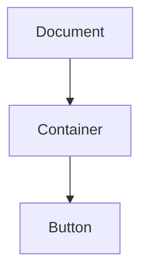

## 12.4 The Event Object

In the world of web development, events are a cornerstone of interactivity. They allow us to respond to user actions such as clicks, key presses, and mouse movements. At the heart of handling these events in JavaScript is the **Event Object**. This object provides valuable information about the event that occurred and allows us to control the event's behavior. In this section, we'll explore the properties of the Event Object, learn how to prevent default actions, and understand how to manage event propagation.

### Understanding the Event Object

When an event occurs, the browser creates an Event Object that contains details about the event. This object is automatically passed to the event handler function, allowing us to access information about the event and manipulate its behavior.

#### Key Properties of the Event Object

Let's delve into some of the most commonly used properties of the Event Object:

- **`event.type`**: This property returns the type of the event (e.g., "click", "mouseover", "keydown"). It helps us identify what kind of event has occurred.

- **`event.target`**: The `target` property refers to the element that triggered the event. This is particularly useful when the event handler is attached to a parent element, and we need to know which child element initiated the event.

- **`event.currentTarget`**: This property refers to the element to which the event handler is attached. It's useful for distinguishing between the element that triggered the event and the element handling the event.

- **`event.clientX` and `event.clientY`**: These properties provide the horizontal and vertical coordinates of the mouse pointer relative to the viewport when the event was triggered.

- **`event.key`**: For keyboard events, this property returns the key value of the key that was pressed.

- **`event.preventDefault()`**: This method prevents the default action associated with the event from occurring. For example, it can prevent a form from submitting or a link from being followed.

- **`event.stopPropagation()`**: This method stops the event from propagating (bubbling) up the DOM tree, preventing any parent handlers from being notified of the event.

### Accessing Event Properties

To better understand how these properties work, let's look at some examples.

#### Example 1: Accessing Event Type and Target

```javascript
document.querySelector('button').addEventListener('click', function(event) {
    console.log('Event type:', event.type); // Logs: "Event type: click"
    console.log('Event target:', event.target); // Logs the button element
});
```

In this example, we attach a click event listener to a button. When the button is clicked, we log the event type and the target element to the console.

#### Example 2: Using Client Coordinates

```javascript
document.addEventListener('mousemove', function(event) {
    console.log('Mouse X:', event.clientX, 'Mouse Y:', event.clientY);
});
```

Here, we listen for mousemove events on the document. As the mouse moves, we log the X and Y coordinates of the mouse pointer relative to the viewport.

### Preventing Default Behavior

Sometimes, we want to prevent the default action associated with an event. This is where `event.preventDefault()` comes in handy.

#### Example 3: Preventing Form Submission

```html
<form id="myForm">
    <input type="text" placeholder="Enter your name">
    <button type="submit">Submit</button>
</form>
```

```javascript
document.getElementById('myForm').addEventListener('submit', function(event) {
    event.preventDefault(); // Prevents the form from submitting
    console.log('Form submission prevented');
});
```

In this example, we prevent the form from submitting when the submit button is clicked. This allows us to handle form validation or other logic before submission.

### Stopping Event Propagation

Event propagation refers to the process by which an event moves through the DOM tree. By default, events bubble up from the target element to the root of the document. We can stop this propagation using `event.stopPropagation()`.

#### Example 4: Stopping Event Propagation

```html
<div id="parent">
    <button id="child">Click Me</button>
</div>
```

```javascript
document.getElementById('parent').addEventListener('click', function() {
    console.log('Parent clicked');
});

document.getElementById('child').addEventListener('click', function(event) {
    event.stopPropagation(); // Stops the event from bubbling up to the parent
    console.log('Child clicked');
});
```

In this example, clicking the button logs "Child clicked" to the console, but it does not trigger the parent's click event handler because we stopped the event from propagating.

### Event Object in Action

Let's put everything together in a more comprehensive example.

#### Example 5: Comprehensive Event Handling

```html
<div id="container">
    <button id="actionButton">Click Me!</button>
</div>
```

```javascript
document.getElementById('container').addEventListener('click', function(event) {
    console.log('Container clicked');
    console.log('Event type:', event.type);
    console.log('Event target:', event.target);
    console.log('Event currentTarget:', event.currentTarget);
});

document.getElementById('actionButton').addEventListener('click', function(event) {
    event.preventDefault();
    event.stopPropagation();
    console.log('Button clicked');
});
```

In this example, we have a container with a button inside. Clicking the button logs "Button clicked" and prevents the default action and propagation. Clicking anywhere else in the container logs details about the event.

### Visualizing Event Propagation

To better understand how event propagation works, let's visualize it using a diagram.



In this diagram, the event starts at the Button and bubbles up to the Container and then to the Document. By using `event.stopPropagation()`, we can stop this bubbling process at any level.

### Try It Yourself

Experiment with the examples provided by modifying the HTML and JavaScript code. Try adding more elements and event listeners to see how the Event Object behaves in different scenarios. Here are some suggestions:

- Add a new button inside the container and observe how event propagation works with multiple elements.
- Change the event type from "click" to "mouseover" and see how the Event Object properties change.
- Use `event.preventDefault()` on a link to prevent navigation and log a message instead.

### References and Further Reading

For more information on the Event Object and event handling in JavaScript, check out these resources:

- [MDN Web Docs: Event](https://developer.mozilla.org/en-US/docs/Web/API/Event)
- [W3Schools: JavaScript Events](https://www.w3schools.com/js/js_events.asp)

### Summary

The Event Object is a powerful tool in JavaScript that provides essential information about events and allows us to control their behavior. By understanding its properties and methods, we can create more interactive and user-friendly web applications. Remember to experiment with the examples and explore the resources provided to deepen your understanding of event handling in JavaScript.

## Quiz Time!



### What does the `event.type` property return?

- [x] The type of the event (e.g., "click", "mouseover")
- [ ] The target element of the event
- [ ] The coordinates of the mouse pointer
- [ ] The default action of the event

> **Explanation:** The `event.type` property returns the type of the event, such as "click" or "mouseover".

### Which method prevents the default action associated with an event?

- [ ] `event.stopPropagation()`
- [x] `event.preventDefault()`
- [ ] `event.stopDefault()`
- [ ] `event.prevent()`

> **Explanation:** The `event.preventDefault()` method prevents the default action associated with the event from occurring.

### What does `event.target` refer to?

- [x] The element that triggered the event
- [ ] The element handling the event
- [ ] The type of the event
- [ ] The default action of the event

> **Explanation:** The `event.target` property refers to the element that triggered the event.

### How can you stop an event from propagating up the DOM tree?

- [ ] `event.preventDefault()`
- [x] `event.stopPropagation()`
- [ ] `event.stopDefault()`
- [ ] `event.prevent()`

> **Explanation:** The `event.stopPropagation()` method stops the event from propagating up the DOM tree.

### Which property provides the horizontal and vertical coordinates of the mouse pointer?

- [x] `event.clientX` and `event.clientY`
- [ ] `event.pageX` and `event.pageY`
- [ ] `event.screenX` and `event.screenY`
- [ ] `event.offsetX` and `event.offsetY`

> **Explanation:** The `event.clientX` and `event.clientY` properties provide the horizontal and vertical coordinates of the mouse pointer relative to the viewport.

### What does `event.currentTarget` refer to?

- [ ] The element that triggered the event
- [x] The element to which the event handler is attached
- [ ] The type of the event
- [ ] The default action of the event

> **Explanation:** The `event.currentTarget` property refers to the element to which the event handler is attached.

### Which method would you use to prevent a form from submitting?

- [x] `event.preventDefault()`
- [ ] `event.stopPropagation()`
- [ ] `event.stopDefault()`
- [ ] `event.prevent()`

> **Explanation:** The `event.preventDefault()` method is used to prevent a form from submitting.

### What is the purpose of `event.stopPropagation()`?

- [x] To stop the event from bubbling up the DOM tree
- [ ] To prevent the default action of the event
- [ ] To log the event type
- [ ] To change the event target

> **Explanation:** The `event.stopPropagation()` method stops the event from bubbling up the DOM tree.

### True or False: The `event.preventDefault()` method can be used to stop event propagation.

- [ ] True
- [x] False

> **Explanation:** The `event.preventDefault()` method prevents the default action but does not stop event propagation.

### True or False: The `event.target` and `event.currentTarget` properties always refer to the same element.

- [ ] True
- [x] False

> **Explanation:** The `event.target` refers to the element that triggered the event, while `event.currentTarget` refers to the element to which the event handler is attached. They can be different.


