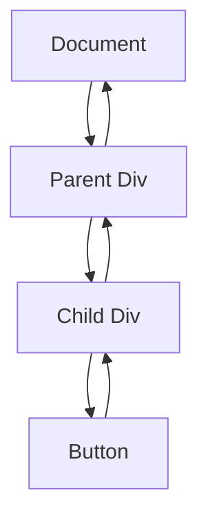

## 12.5 Event Propagation

In the world of web development, understanding how events work is crucial for creating interactive and dynamic web applications. JavaScript provides a robust event model that allows developers to handle user interactions effectively. In this section, we will delve into the concept of event propagation, which includes the capturing and bubbling phases, and introduce the powerful technique of event delegation. By the end of this section, you'll have a solid understanding of how events propagate through the DOM and how you can leverage this knowledge to build efficient and responsive web applications.

### Understanding Event Propagation

Event propagation is the mechanism by which an event travels through the Document Object Model (DOM) tree. When an event occurs, such as a user clicking a button, it doesn't just affect the target element. Instead, it moves through the DOM tree in a specific order, allowing different elements to respond to the event. This process consists of three phases:

1. **Capturing Phase**: The event travels from the root of the DOM tree down to the target element.
2. **Target Phase**: The event reaches the target element.
3. **Bubbling Phase**: The event travels back up from the target element to the root.

Let's break down each phase in more detail.

#### Capturing Phase

The capturing phase, also known as the "trickle-down" phase, is the first phase of event propagation. During this phase, the event descends from the root of the DOM tree to the target element. At each level of the DOM, event listeners can be set to capture the event before it reaches its target. This phase is less commonly used but can be useful in specific scenarios where you want to intercept an event before it reaches the target element.

#### Bubbling Phase

The bubbling phase, also known as the "bubble-up" phase, is the final phase of event propagation. After the event reaches the target element, it bubbles back up through the DOM tree to the root. This phase is more commonly used in web development because it allows for event delegation, which we'll discuss shortly. Event listeners attached to parent elements can handle events that occur on their child elements during this phase.

#### Visualizing Event Propagation

To better understand event propagation, let's visualize how an event moves through the DOM tree. Consider the following HTML structure:

```html
<div id="parent">
    <div id="child">
        <button id="button">Click Me!</button>
    </div>
</div>
```

When you click the button, the event propagation process can be visualized as follows:



In this diagram, the event starts at the document level and moves down to the button during the capturing phase. After reaching the button, it bubbles back up to the document level during the bubbling phase.

### Event Delegation

Event delegation is a powerful technique that leverages event propagation to efficiently manage events on multiple child elements. Instead of attaching event listeners to each individual child element, you attach a single event listener to a common parent element. This approach is particularly beneficial when dealing with dynamic content, where child elements are frequently added or removed.

#### Benefits of Event Delegation

- **Efficiency**: Reduces the number of event listeners, leading to improved performance, especially in applications with many dynamic elements.
- **Simplicity**: Simplifies code by managing events in a centralized location.
- **Flexibility**: Easily handles events on dynamically added elements without the need to reattach listeners.

#### Implementing Event Delegation

Let's explore how to implement event delegation with a practical example. Consider a list of items where clicking on an item displays an alert with the item's text. Instead of attaching a click event listener to each item, we can use event delegation.

```html
<ul id="itemList">
    <li>Item 1</li>
    <li>Item 2</li>
    <li>Item 3</li>
</ul>
```

Here's how you can implement event delegation:

```javascript
// Select the parent element
const itemList = document.getElementById('itemList');

// Attach a single event listener to the parent element
itemList.addEventListener('click', function(event) {
    // Check if the clicked element is a list item
    if (event.target.tagName === 'LI') {
        alert(`You clicked on ${event.target.textContent}`);
    }
});
```

In this example, the click event listener is attached to the `ul` element. When a `li` element is clicked, the event bubbles up to the `ul` element, where the listener checks if the event's target is a `li` and displays an alert with the item's text.

### Practical Examples of Event Delegation

Let's explore more practical examples of event delegation to solidify your understanding.

#### Example 1: Dynamic Form Fields

Imagine a form where users can dynamically add input fields. You want to validate each input field when it loses focus. Instead of attaching a `blur` event listener to each input field, you can use event delegation.

```html
<div id="formContainer">
    <input type="text" placeholder="Enter text">
    <button id="addField">Add Field</button>
</div>
```

```javascript
const formContainer = document.getElementById('formContainer');

formContainer.addEventListener('blur', function(event) {
    if (event.target.tagName === 'INPUT') {
        // Validate the input field
        if (event.target.value.trim() === '') {
            alert('Field cannot be empty');
        }
    }
}, true); // Use capturing phase to catch blur event
```

In this example, the `blur` event listener is attached to the `div` element. When an input field loses focus, the event is captured, and the listener validates the input.

#### Example 2: Interactive Menu

Consider a menu with multiple items, where clicking an item highlights it. Instead of attaching a click event listener to each menu item, you can use event delegation.

```html
<ul id="menu">
    <li>Home</li>
    <li>About</li>
    <li>Contact</li>
</ul>
```

```javascript
const menu = document.getElementById('menu');

menu.addEventListener('click', function(event) {
    if (event.target.tagName === 'LI') {
        // Remove highlight from all items
        Array.from(menu.children).forEach(item => item.classList.remove('highlight'));
        
        // Highlight the clicked item
        event.target.classList.add('highlight');
    }
});
```

In this example, the click event listener is attached to the `ul` element. When a `li` element is clicked, the listener removes the highlight from all items and highlights the clicked item.

### Try It Yourself

Now that you've learned about event propagation and delegation, it's time to experiment with these concepts. Try modifying the examples above to:

- Add new items to the list dynamically and see how event delegation handles them.
- Change the event type from `click` to `mouseover` and observe the behavior.
- Implement a simple to-do list where clicking an item marks it as completed.

### Key Takeaways

- **Event propagation** consists of three phases: capturing, target, and bubbling.
- **Event delegation** allows you to manage events efficiently by attaching a single listener to a parent element.
- Event delegation is beneficial for handling events on dynamic content and improving performance.

### Further Reading

For more in-depth information on event propagation and delegation, check out the following resources:

- [MDN Web Docs: Event Propagation](https://developer.mozilla.org/en-US/docs/Learn/JavaScript/Building_blocks/Events#event_propagation)
- [W3Schools: JavaScript Event Propagation](https://www.w3schools.com/js/js_htmldom_eventlistener.asp)

## Quiz Time!



### What is the first phase of event propagation?

- [x] Capturing Phase
- [ ] Bubbling Phase
- [ ] Target Phase
- [ ] Initialization Phase

> **Explanation:** The capturing phase is the first phase of event propagation, where the event travels from the root to the target element.

### During which phase does the event reach the target element?

- [ ] Capturing Phase
- [ ] Bubbling Phase
- [x] Target Phase
- [ ] Initialization Phase

> **Explanation:** The target phase is when the event reaches the target element.

### What is the main advantage of event delegation?

- [x] Reduces the number of event listeners
- [ ] Increases the number of event listeners
- [ ] Makes code more complex
- [ ] Decreases performance

> **Explanation:** Event delegation reduces the number of event listeners, leading to improved performance and simpler code management.

### In event propagation, what is the phase after the target phase?

- [ ] Capturing Phase
- [x] Bubbling Phase
- [ ] Initialization Phase
- [ ] Execution Phase

> **Explanation:** The bubbling phase follows the target phase, where the event bubbles up from the target to the root.

### Which method is used to stop an event from propagating?

- [x] stopPropagation()
- [ ] preventDefault()
- [ ] stopImmediatePropagation()
- [ ] cancelEvent()

> **Explanation:** The `stopPropagation()` method is used to stop an event from propagating further.

### What is event delegation commonly used for?

- [x] Handling events on dynamic content
- [ ] Increasing the number of event listeners
- [ ] Decreasing code readability
- [ ] Slowing down performance

> **Explanation:** Event delegation is commonly used for handling events on dynamic content efficiently.

### Which phase is less commonly used in web development?

- [x] Capturing Phase
- [ ] Bubbling Phase
- [ ] Target Phase
- [ ] Initialization Phase

> **Explanation:** The capturing phase is less commonly used compared to the bubbling phase in web development.

### What does the `event.target` property refer to?

- [x] The element that triggered the event
- [ ] The parent element of the event
- [ ] The root element of the DOM
- [ ] The document object

> **Explanation:** The `event.target` property refers to the element that triggered the event.

### How can you handle events on elements added dynamically?

- [x] Use event delegation
- [ ] Attach listeners to each new element
- [ ] Use inline event handlers
- [ ] Avoid handling events

> **Explanation:** Event delegation allows you to handle events on elements added dynamically by attaching a listener to a common parent.

### True or False: Event delegation can improve performance in applications with many dynamic elements.

- [x] True
- [ ] False

> **Explanation:** True. Event delegation can improve performance by reducing the number of event listeners needed.



By understanding event propagation and delegation, you can create more efficient and maintainable web applications. Keep experimenting with these concepts to deepen your understanding and enhance your skills in JavaScript event handling.
