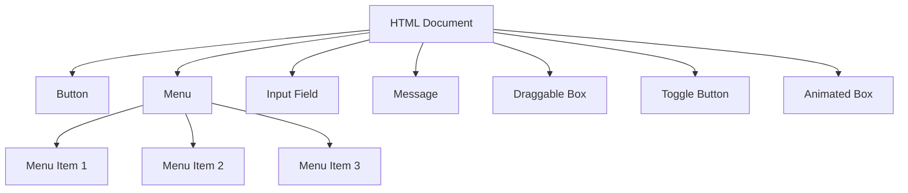
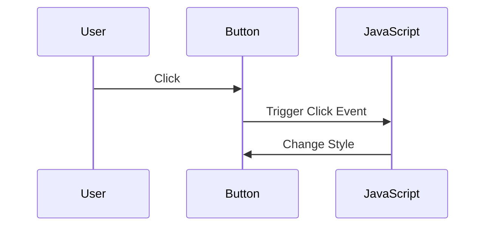

## 12.6 Building Interactive Elements with JavaScript

In this section, we will explore how to make web pages more interactive using JavaScript. We will guide you through creating interactive buttons and menus, validating user input dynamically, implementing basic drag-and-drop functionality, and creating simple animations. By the end of this section, you will have the skills to enhance user experiences on your web pages.

### Creating Interactive Buttons and Menus

Interactive buttons and menus are essential components of modern web applications. They allow users to navigate and interact with your site seamlessly.

#### Interactive Buttons

Let's start by creating a simple interactive button. We'll use an event listener to change the button's color when clicked.

```html
<!DOCTYPE html>
<html lang="en">
<head>
    <meta charset="UTF-8">
    <meta name="viewport" content="width=device-width, initial-scale=1.0">
    <title>Interactive Button</title>
    <style>
        #myButton {
            padding: 10px 20px;
            background-color: lightblue;
            border: none;
            cursor: pointer;
        }
    </style>
</head>
<body>
    <button id="myButton">Click Me!</button>

    <script>
        const button = document.getElementById('myButton');
        
        button.addEventListener('click', function() {
            button.style.backgroundColor = 'lightgreen';
            button.textContent = 'Clicked!';
        });
    </script>
</body>
</html>
```

**Explanation:**

- We use `document.getElementById` to select the button element.
- We attach an event listener to the button that listens for a 'click' event.
- When the button is clicked, we change its background color and text.

#### Interactive Menus

Next, let's create a simple dropdown menu that displays options when a button is clicked.

```html
<!DOCTYPE html>
<html lang="en">
<head>
    <meta charset="UTF-8">
    <meta name="viewport" content="width=device-width, initial-scale=1.0">
    <title>Interactive Menu</title>
    <style>
        #menu {
            display: none;
            list-style-type: none;
            padding: 0;
            margin: 0;
            background-color: lightgray;
            position: absolute;
        }

        #menu li {
            padding: 8px;
            cursor: pointer;
        }

        #menu li:hover {
            background-color: darkgray;
        }
    </style>
</head>
<body>
    <button id="menuButton">Toggle Menu</button>
    <ul id="menu">
        <li>Option 1</li>
        <li>Option 2</li>
        <li>Option 3</li>
    </ul>

    <script>
        const menuButton = document.getElementById('menuButton');
        const menu = document.getElementById('menu');

        menuButton.addEventListener('click', function() {
            if (menu.style.display === 'none') {
                menu.style.display = 'block';
            } else {
                menu.style.display = 'none';
            }
        });
    </script>
</body>
</html>
```

**Explanation:**

- We use CSS to initially hide the menu (`display: none`).
- We toggle the menu's visibility by changing its `display` style between 'none' and 'block' when the button is clicked.

### Validating User Input Dynamically

Validating user input is crucial for ensuring data integrity and providing feedback to users. Let's create a simple form that validates an email address in real-time.

```html
<!DOCTYPE html>
<html lang="en">
<head>
    <meta charset="UTF-8">
    <meta name="viewport" content="width=device-width, initial-scale=1.0">
    <title>Email Validation</title>
    <style>
        #email {
            margin-bottom: 10px;
        }

        #message {
            color: red;
        }
    </style>
</head>
<body>
    <input type="text" id="email" placeholder="Enter your email">
    <div id="message"></div>

    <script>
        const emailInput = document.getElementById('email');
        const message = document.getElementById('message');

        emailInput.addEventListener('input', function() {
            const emailPattern = /^[^\s@]+@[^\s@]+\.[^\s@]+$/;
            if (emailPattern.test(emailInput.value)) {
                message.textContent = 'Valid email!';
                message.style.color = 'green';
            } else {
                message.textContent = 'Invalid email!';
                message.style.color = 'red';
            }
        });
    </script>
</body>
</html>
```

**Explanation:**

- We use a regular expression to check if the input matches a basic email pattern.
- We provide feedback by updating the `message` element's text and color based on the input's validity.

### Implementing Basic Drag-and-Drop Functionality

Drag-and-drop functionality can enhance user interaction by allowing users to move elements around the page. Let's create a simple example where you can drag a box to a new location.

```html
<!DOCTYPE html>
<html lang="en">
<head>
    <meta charset="UTF-8">
    <meta name="viewport" content="width=device-width, initial-scale=1.0">
    <title>Drag and Drop</title>
    <style>
        #dragBox {
            width: 100px;
            height: 100px;
            background-color: lightcoral;
            position: absolute;
            cursor: move;
        }
    </style>
</head>
<body>
    <div id="dragBox"></div>

    <script>
        const dragBox = document.getElementById('dragBox');

        dragBox.addEventListener('mousedown', function(e) {
            let shiftX = e.clientX - dragBox.getBoundingClientRect().left;
            let shiftY = e.clientY - dragBox.getBoundingClientRect().top;

            function moveAt(pageX, pageY) {
                dragBox.style.left = pageX - shiftX + 'px';
                dragBox.style.top = pageY - shiftY + 'px';
            }

            function onMouseMove(event) {
                moveAt(event.pageX, event.pageY);
            }

            document.addEventListener('mousemove', onMouseMove);

            dragBox.onmouseup = function() {
                document.removeEventListener('mousemove', onMouseMove);
                dragBox.onmouseup = null;
            };
        });

        dragBox.ondragstart = function() {
            return false;
        };
    </script>
</body>
</html>
```

**Explanation:**

- We calculate the shift between the mouse pointer and the box's top-left corner when the drag starts.
- We update the box's position as the mouse moves, using `mousemove` and `mouseup` events to track and stop the movement.

### Simple Animations with JavaScript

Animations can make your web pages more dynamic and engaging. Let's create a simple animation that toggles the visibility of an element.

```html
<!DOCTYPE html>
<html lang="en">
<head>
    <meta charset="UTF-8">
    <meta name="viewport" content="width=device-width, initial-scale=1.0">
    <title>Simple Animation</title>
    <style>
        #box {
            width: 100px;
            height: 100px;
            background-color: lightseagreen;
            transition: opacity 0.5s;
        }
    </style>
</head>
<body>
    <button id="toggleButton">Toggle Visibility</button>
    <div id="box"></div>

    <script>
        const toggleButton = document.getElementById('toggleButton');
        const box = document.getElementById('box');

        toggleButton.addEventListener('click', function() {
            if (box.style.opacity === '0') {
                box.style.opacity = '1';
            } else {
                box.style.opacity = '0';
            }
        });
    </script>
</body>
</html>
```

**Explanation:**

- We use CSS transitions to animate the change in opacity.
- We toggle the `opacity` property between '0' and '1' to show and hide the box.

### Try It Yourself

Now that we've covered the basics, try experimenting with the code examples. Here are some suggestions:

- **Change the Button Color:** Modify the button's color to change to a different color when clicked.
- **Add More Menu Options:** Add more items to the dropdown menu and style them differently.
- **Enhance Email Validation:** Improve the email validation by checking for more complex patterns.
- **Customize Drag-and-Drop:** Allow multiple elements to be draggable or restrict the drag area.
- **Create More Animations:** Try animating other properties like `width`, `height`, or `background-color`.

### Visual Aids

To better understand the concepts, let's visualize the DOM structure and event flow using Mermaid.js diagrams.

#### DOM Structure for Interactive Elements



**Description:** This diagram represents the DOM structure for the interactive elements we've created, showing the hierarchy of elements within the HTML document.

#### Event Flow for Button Click



**Description:** This sequence diagram illustrates the flow of events when a user clicks a button, highlighting the interaction between the user, the button, and the JavaScript code.

### References and Links

- [MDN Web Docs: Event Reference](https://developer.mozilla.org/en-US/docs/Web/Events)
- [W3Schools: JavaScript HTML DOM EventListener](https://www.w3schools.com/js/js_htmldom_eventlistener.asp)
- [MDN Web Docs: Drag and Drop API](https://developer.mozilla.org/en-US/docs/Web/API/HTML_Drag_and_Drop_API)

### Engagement and Reinforcement

To reinforce your learning, try answering these questions:

- How would you modify the button to change its text back to "Click Me!" after a second click?
- Can you create a menu that slides down instead of just appearing?
- How would you validate a phone number input in real-time?
- What changes would you make to allow dragging the box only within a certain area?
- How can you create a fade-in effect for the box instead of toggling visibility?

### Summary

In this section, we've explored how to build interactive elements using JavaScript. We covered creating interactive buttons and menus, validating user input dynamically, implementing drag-and-drop functionality, and creating simple animations. These skills are fundamental for enhancing user experiences on web pages.

## Quiz Time!



### What is the purpose of an event listener in JavaScript?

- [x] To execute code in response to user actions
- [ ] To style HTML elements
- [ ] To create new HTML elements
- [ ] To store data in variables

> **Explanation:** Event listeners are used to execute code when specific events occur, such as user clicks or key presses.

### How can you toggle the visibility of an element using JavaScript?

- [x] By changing the element's `display` style property
- [ ] By deleting the element from the DOM
- [ ] By changing the element's `textContent`
- [ ] By changing the element's `innerHTML`

> **Explanation:** Toggling visibility can be achieved by changing the `display` style property between 'none' and 'block'.

### What is the role of the `mousedown` event in drag-and-drop functionality?

- [x] To initiate the dragging process
- [ ] To end the dragging process
- [ ] To change the element's color
- [ ] To create a new element

> **Explanation:** The `mousedown` event is used to initiate the dragging process by capturing the initial position and setting up event listeners for movement.

### Which CSS property is commonly used to create animations?

- [x] `transition`
- [ ] `background-color`
- [ ] `font-size`
- [ ] `border`

> **Explanation:** The `transition` property is used to create smooth animations by defining the duration and timing of changes to CSS properties.

### How can you validate an email input in real-time?

- [x] By using an `input` event listener with a regular expression
- [ ] By submitting the form and checking the server response
- [ ] By changing the input type to `email`
- [ ] By using a `click` event listener

> **Explanation:** Real-time validation can be achieved by using an `input` event listener to check the input against a regular expression pattern.

### What is the purpose of the `mousemove` event in drag-and-drop functionality?

- [x] To update the position of the dragged element
- [ ] To change the element's color
- [ ] To create a new element
- [ ] To end the dragging process

> **Explanation:** The `mousemove` event is used to update the position of the dragged element as the mouse moves.

### How can you provide feedback to users during input validation?

- [x] By updating a message element with validation results
- [ ] By changing the input field's background color
- [ ] By hiding the input field
- [ ] By disabling the input field

> **Explanation:** Providing feedback can be done by updating a message element to inform users of validation results.

### What is the effect of setting an element's `opacity` to '0'?

- [x] The element becomes invisible
- [ ] The element is removed from the DOM
- [ ] The element's size is reduced
- [ ] The element's color changes

> **Explanation:** Setting `opacity` to '0' makes the element invisible without removing it from the DOM.

### Which event is used to stop the drag-and-drop process?

- [x] `mouseup`
- [ ] `mousedown`
- [ ] `mousemove`
- [ ] `click`

> **Explanation:** The `mouseup` event is used to stop the drag-and-drop process by removing the `mousemove` event listener.

### True or False: You can only attach one event listener to an element.

- [ ] True
- [x] False

> **Explanation:** False. You can attach multiple event listeners to an element for different events or even the same event type.



By practicing these concepts and experimenting with the examples, you'll gain confidence in building interactive web elements using JavaScript. Happy coding!
