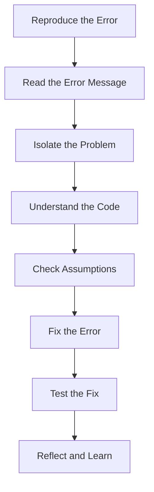

## 13.1 Introduction to Debugging

Debugging is an essential skill in software development. It is the process of identifying, analyzing, and removing errors or bugs from your code. As a beginner, understanding how to effectively debug your JavaScript code will not only help you write better programs but also deepen your understanding of how your code works. In this section, we will explore the importance of debugging, discuss common types of errors, and encourage adopting a debugging mindset and systematic approach.

### Why is Debugging Important?

Debugging is crucial because it ensures that your code behaves as expected. Even experienced developers make mistakes, and debugging helps to catch these errors before they cause problems. Here are a few reasons why debugging is important:

- **Ensures Code Quality**: Debugging helps maintain high-quality code by identifying and fixing errors that could lead to unexpected behavior.
- **Improves Understanding**: The process of debugging can deepen your understanding of how your code works and how different parts interact.
- **Saves Time**: While debugging might seem time-consuming initially, it saves time in the long run by preventing future issues.
- **Enhances Problem-Solving Skills**: Debugging requires analytical thinking and problem-solving, which are valuable skills in programming and beyond.

### Common Types of Errors

In JavaScript, errors can generally be categorized into three main types: syntax errors, runtime errors, and logical errors. Understanding these error types is the first step in effective debugging.

#### Syntax Errors

Syntax errors occur when the code violates the rules of the JavaScript language. These errors are usually detected by the JavaScript engine when the code is parsed, and they prevent the code from executing. Common causes of syntax errors include:

- Missing or misplaced punctuation (e.g., missing semicolons, unmatched brackets).
- Incorrect use of keywords or reserved words.
- Typographical errors in variable or function names.

**Example of a Syntax Error:**

```javascript
// Missing closing parenthesis
console.log("Hello, World!";
```

In this example, the missing closing parenthesis will cause a syntax error, preventing the code from running.

#### Runtime Errors

Runtime errors occur while the program is running. These errors happen when the code is syntactically correct but encounters an issue during execution. Common causes of runtime errors include:

- Attempting to access a variable or function that does not exist.
- Performing operations on incompatible data types.
- Running out of memory or other resources.

**Example of a Runtime Error:**

```javascript
let numbers = [1, 2, 3];
console.log(numbers[5]); // Trying to access an index that doesn't exist
```

In this example, trying to access an index that doesn't exist in the array will result in `undefined`, which might lead to further errors if not handled properly.

#### Logical Errors

Logical errors occur when the code runs without crashing but produces incorrect results. These errors are often the most challenging to identify because the code appears to work but doesn't do what you intended. Logical errors can stem from:

- Incorrect algorithm implementation.
- Misunderstanding of the problem requirements.
- Off-by-one errors in loops or conditions.

**Example of a Logical Error:**

```javascript
function calculateArea(width, height) {
    return width + height; // Incorrect calculation for area
}

console.log(calculateArea(5, 10)); // Outputs 15 instead of 50
```

In this example, the function is supposed to calculate the area of a rectangle, but it incorrectly adds the width and height instead of multiplying them.

### Adopting a Debugging Mindset

Debugging is not just about fixing errors; it's about understanding why they occur and how to prevent them. Adopting a debugging mindset involves:

- **Curiosity**: Be curious about how your code works and why it might not be working as expected.
- **Patience**: Debugging can be frustrating, but patience is key to finding and fixing errors.
- **Attention to Detail**: Pay close attention to the details of your code, as small mistakes can lead to significant issues.
- **Systematic Approach**: Use a systematic approach to identify and fix errors, rather than randomly changing code and hoping for the best.

### A Systematic Approach to Debugging

A systematic approach to debugging involves several steps that help you efficiently identify and fix errors in your code. Here's a step-by-step guide to debugging:

1. **Reproduce the Error**: Ensure you can consistently reproduce the error. This helps you understand the conditions under which the error occurs.

2. **Read the Error Message**: JavaScript error messages can provide valuable information about what went wrong. Pay attention to the error type, message, and line number.

3. **Isolate the Problem**: Narrow down the part of the code where the error occurs. This might involve commenting out sections of code or using `console.log()` statements to trace the execution flow.

4. **Understand the Code**: Make sure you understand what the code is supposed to do and how it is supposed to work. This helps you identify where it deviates from the expected behavior.

5. **Check Assumptions**: Verify any assumptions you have about the code, such as variable values or function outputs. Use `console.log()` to print these values and confirm they are as expected.

6. **Fix the Error**: Once you've identified the cause of the error, make the necessary changes to fix it. Be careful not to introduce new errors in the process.

7. **Test the Fix**: After fixing the error, test the code to ensure the fix works and hasn't caused any new issues.

8. **Reflect and Learn**: Take a moment to reflect on the error and what you learned from fixing it. This can help you avoid similar errors in the future.

### Using `console.log()` for Debugging

One of the simplest and most effective tools for debugging in JavaScript is `console.log()`. By printing values to the console, you can gain insights into how your code is executing and where it might be going wrong.

**Example of Using `console.log()` for Debugging:**

```javascript
function calculateSum(a, b) {
    console.log("a:", a); // Log the value of a
    console.log("b:", b); // Log the value of b
    let sum = a + b;
    console.log("sum:", sum); // Log the calculated sum
    return sum;
}

calculateSum(5, 10);
```

In this example, `console.log()` statements are used to print the values of `a`, `b`, and `sum`, helping you verify that the function is working as expected.

### Try It Yourself

To practice debugging, try modifying the following code to introduce an error, then use `console.log()` to identify and fix it.

```javascript
function multiplyNumbers(x, y) {
    return x * y;
}

console.log(multiplyNumbers(3, 4)); // Outputs 12
```

**Challenge**: Introduce an error by changing the multiplication operator (`*`) to addition (`+`). Use `console.log()` to identify the error and fix it.

### Visualizing Debugging with Diagrams

To better understand the debugging process, let's visualize it using a flowchart. This flowchart represents the systematic approach to debugging we discussed earlier.



**Diagram Description**: This flowchart illustrates the steps involved in a systematic approach to debugging, from reproducing the error to reflecting on the fix.

### References and Further Reading

For more information on debugging in JavaScript, check out the following resources:

- [MDN Web Docs: Debugging JavaScript](https://developer.mozilla.org/en-US/docs/Learn/JavaScript/First_steps/What_went_wrong)
- [W3Schools: JavaScript Debugging](https://www.w3schools.com/js/js_debugging.asp)

### Engagement and Reinforcement

To reinforce your understanding of debugging, try the following exercises:

1. **Exercise 1**: Write a JavaScript function that calculates the factorial of a number. Introduce a logical error and use the systematic approach to identify and fix it.

2. **Exercise 2**: Create a simple JavaScript program that reads input from the user and performs a calculation. Introduce a syntax error and use `console.log()` to identify and fix it.

3. **Exercise 3**: Write a JavaScript program that uses a loop to iterate over an array. Introduce a runtime error and use the systematic approach to identify and fix it.

### Summary of Key Takeaways

- Debugging is an essential skill in software development that ensures code quality and improves understanding.
- Common types of errors in JavaScript include syntax errors, runtime errors, and logical errors.
- Adopting a debugging mindset involves curiosity, patience, attention to detail, and a systematic approach.
- A systematic approach to debugging involves reproducing the error, reading the error message, isolating the problem, understanding the code, checking assumptions, fixing the error, testing the fix, and reflecting on the process.
- `console.log()` is a simple yet powerful tool for debugging in JavaScript.

By mastering the art of debugging, you'll become a more effective and confident programmer, capable of tackling even the most challenging coding problems.

## Quiz Time!



### What is the primary purpose of debugging in software development?

- [x] To identify and fix errors in the code
- [ ] To write new features
- [ ] To compile the code
- [ ] To design user interfaces

> **Explanation:** Debugging is primarily about identifying and fixing errors in the code to ensure it behaves as expected.

### Which of the following is NOT a type of error in JavaScript?

- [ ] Syntax Error
- [ ] Runtime Error
- [x] Compilation Error
- [ ] Logical Error

> **Explanation:** JavaScript is an interpreted language, so it does not have compilation errors. Syntax, runtime, and logical errors are common in JavaScript.

### What tool can you use to print values to the console for debugging purposes?

- [ ] alert()
- [x] console.log()
- [ ] prompt()
- [ ] document.write()

> **Explanation:** `console.log()` is used to print values to the console, which is helpful for debugging.

### What is a common cause of syntax errors?

- [x] Missing or misplaced punctuation
- [ ] Incorrect algorithm implementation
- [ ] Running out of memory
- [ ] Accessing an undefined variable

> **Explanation:** Syntax errors often occur due to missing or misplaced punctuation, such as missing semicolons or unmatched brackets.

### Which step is NOT part of the systematic approach to debugging?

- [ ] Reproduce the error
- [x] Randomly change code
- [ ] Isolate the problem
- [ ] Test the fix

> **Explanation:** Randomly changing code is not a systematic approach. Debugging should be methodical and logical.

### What type of error occurs when the code runs but produces incorrect results?

- [ ] Syntax Error
- [ ] Runtime Error
- [x] Logical Error
- [ ] Compilation Error

> **Explanation:** Logical errors occur when the code runs without crashing but produces incorrect results.

### What mindset is important to adopt when debugging?

- [x] Curiosity and patience
- [ ] Frustration and haste
- [ ] Indifference and neglect
- [ ] Overconfidence and arrogance

> **Explanation:** Curiosity and patience are important when debugging to understand and fix errors effectively.

### Which of the following is a runtime error?

- [ ] Missing semicolon
- [x] Accessing an undefined variable
- [ ] Incorrect loop condition
- [ ] Typographical error in a function name

> **Explanation:** Accessing an undefined variable is a runtime error that occurs during the execution of the code.

### What is the first step in the systematic approach to debugging?

- [x] Reproduce the error
- [ ] Fix the error
- [ ] Test the fix
- [ ] Reflect and learn

> **Explanation:** Reproducing the error is the first step, as it helps you understand the conditions under which the error occurs.

### True or False: Debugging is only necessary for beginners.

- [ ] True
- [x] False

> **Explanation:** Debugging is necessary for programmers of all levels, as even experienced developers encounter errors.




