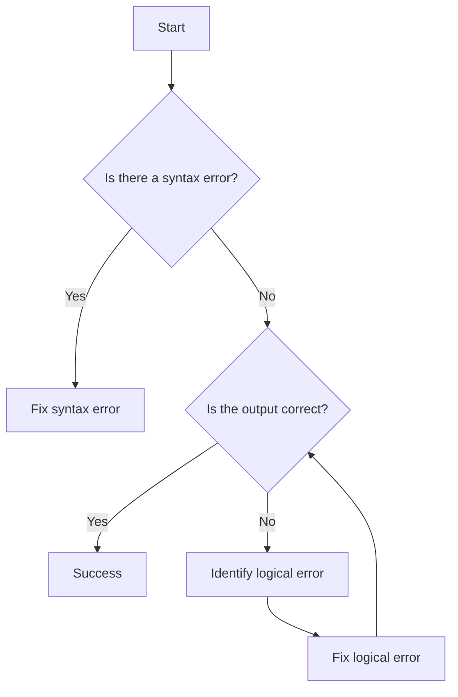

## 13.2 Syntax Errors vs. Logical Errors

In the journey of learning JavaScript, or any programming language for that matter, encountering errors is an inevitable part of the process. Understanding these errors is crucial for debugging and improving your code. In this section, we will explore two primary types of errors: **syntax errors** and **logical errors**. We will define each, provide examples, and discuss strategies for identifying and resolving them.

### Understanding Syntax Errors

**Syntax errors** occur when the code you write does not conform to the rules of the programming language. These errors prevent the code from being executed because the JavaScript engine cannot interpret the instructions. Think of syntax errors as grammatical mistakes in a sentence; if the grammar is incorrect, the sentence doesn't make sense.

#### Characteristics of Syntax Errors

- **Immediate Feedback**: Syntax errors are usually detected by the JavaScript engine as soon as the code is run. This means you get immediate feedback about the error.
- **Error Messages**: The browser or development environment will typically provide an error message indicating the nature and location of the syntax error.
- **Prevents Execution**: Because the code cannot be parsed correctly, it will not execute until the syntax error is resolved.

#### Common Causes of Syntax Errors

1. **Missing or Misplaced Punctuation**: Forgetting a semicolon, comma, or bracket.
2. **Incorrect Use of Keywords**: Using reserved words incorrectly or misspelling them.
3. **Improper Function Declaration**: Missing parentheses or braces in function definitions.
4. **Mismatched Brackets or Parentheses**: Having an unequal number of opening and closing brackets or parentheses.

#### Example of a Syntax Error

Let's look at a simple example of a syntax error:

```javascript
// Example of a syntax error: missing closing parenthesis
function greet(name {
    console.log("Hello, " + name);
}
```

In this example, the function `greet` is missing a closing parenthesis after `name`. The JavaScript engine will throw an error because it cannot parse the function declaration correctly.

#### Strategies for Identifying Syntax Errors

- **Read Error Messages Carefully**: Error messages often indicate the line number and nature of the syntax error.
- **Use a Code Editor with Syntax Highlighting**: Editors like Visual Studio Code or Sublime Text highlight syntax errors, making them easier to spot.
- **Check for Common Mistakes**: Look for missing punctuation, mismatched brackets, and incorrect keyword usage.

### Understanding Logical Errors

**Logical errors** occur when the code runs without crashing but produces incorrect or unintended results. These errors are more challenging to identify because the code appears to work, but it doesn't do what you expect.

#### Characteristics of Logical Errors

- **No Error Messages**: Unlike syntax errors, logical errors do not produce error messages. The code runs, but the output is not as intended.
- **Difficult to Detect**: Since the code executes, identifying logical errors requires careful examination of the output and the logic used in the code.
- **Result of Flawed Logic**: These errors stem from mistakes in the algorithm or logic used to solve a problem.

#### Common Causes of Logical Errors

1. **Incorrect Assumptions**: Assuming incorrect data types or values.
2. **Faulty Logic**: Using the wrong operators or conditions in control structures.
3. **Off-by-One Errors**: Common in loops, where the loop iterates one time too many or too few.
4. **Misunderstanding Requirements**: Implementing a solution that doesn't meet the problem's requirements.

#### Example of a Logical Error

Consider the following example of a logical error:

```javascript
// Example of a logical error: incorrect condition in the loop
function calculateSum(n) {
    let sum = 0;
    for (let i = 1; i <= n; i++) {
        sum += i;
    }
    return sum;
}

console.log(calculateSum(5)); // Expected output: 15
```

In this example, the function `calculateSum` is intended to calculate the sum of numbers from 1 to `n`. However, if we mistakenly use `i < n` instead of `i <= n`, the function will not include `n` in the sum, resulting in an incorrect output.

#### Strategies for Identifying Logical Errors

- **Use `console.log()` Statements**: Insert `console.log()` statements to print variable values and track the flow of execution.
- **Review Code Logic**: Carefully review the logic and algorithms used in the code.
- **Write Test Cases**: Create test cases to verify the code's behavior under different conditions.
- **Peer Review**: Have someone else review your code to catch errors you might have missed.

### Code Examples and Exercises

Let's explore some examples and exercises to reinforce our understanding of syntax and logical errors.

#### Syntax Error Example

```javascript
// Syntax error: missing semicolon
let number = 10
console.log("The number is: " + number);
```

**Exercise**: Correct the syntax error by adding the missing semicolon.

#### Logical Error Example

```javascript
// Logical error: incorrect calculation
function multiply(a, b) {
    return a + b; // Should be a * b
}

console.log(multiply(2, 3)); // Expected output: 6
```

**Exercise**: Correct the logical error by changing the `+` operator to `*`.

### Visualizing Error Types

To better understand the differences between syntax and logical errors, let's visualize the process using a flowchart.



**Diagram Description**: This flowchart illustrates the process of debugging code. If a syntax error is present, it must be fixed before the code can run. Once the code runs, we check if the output is correct. If not, we identify and fix logical errors.

### References and Further Reading

- [MDN Web Docs: JavaScript Errors](https://developer.mozilla.org/en-US/docs/Web/JavaScript/Guide/Control_flow_and_error_handling#exceptions)
- [W3Schools: JavaScript Errors](https://www.w3schools.com/js/js_errors.asp)

### Engagement and Reinforcement

To reinforce your understanding, consider the following questions:

- What are the key differences between syntax and logical errors?
- How can you use `console.log()` to identify logical errors?
- Why is it important to read error messages carefully?

### Summary

In this section, we explored the differences between syntax errors and logical errors in JavaScript. Syntax errors prevent code execution due to incorrect language rules, while logical errors produce unintended results despite error-free code. By understanding these errors and employing strategies to identify and resolve them, you can improve your debugging skills and write more reliable code.

## Quiz Time!



### What is a syntax error?

- [x] An error that occurs when the code does not conform to the rules of the programming language.
- [ ] An error that occurs when the code produces incorrect results.
- [ ] An error that occurs when the program crashes unexpectedly.
- [ ] An error that occurs due to incorrect data types.

> **Explanation:** A syntax error occurs when the code violates the language's grammar rules, preventing execution.

### What is a logical error?

- [ ] An error that prevents code execution.
- [x] An error that produces unintended behavior despite error-free code.
- [ ] An error that occurs due to incorrect use of punctuation.
- [ ] An error that occurs when the program crashes unexpectedly.

> **Explanation:** A logical error occurs when the code runs but produces incorrect results due to flawed logic.

### Which of the following is a common cause of syntax errors?

- [x] Missing or misplaced punctuation.
- [ ] Incorrect assumptions about data types.
- [ ] Off-by-one errors in loops.
- [ ] Misunderstanding requirements.

> **Explanation:** Syntax errors often result from missing or misplaced punctuation, such as semicolons or brackets.

### How can you identify a logical error?

- [ ] By reading error messages.
- [x] By reviewing code logic and using `console.log()` statements.
- [ ] By using a code editor with syntax highlighting.
- [ ] By checking for missing punctuation.

> **Explanation:** Logical errors require reviewing the code logic and using `console.log()` to track variable values and execution flow.

### What should you do if you encounter a syntax error?

- [x] Read the error message and fix the syntax error.
- [ ] Ignore the error and continue coding.
- [ ] Use `console.log()` to identify the error.
- [ ] Review the code logic for mistakes.

> **Explanation:** Syntax errors prevent code execution, so it's important to read the error message and fix the issue.

### Which tool can help you spot syntax errors in your code?

- [x] Code editor with syntax highlighting.
- [ ] Test cases.
- [ ] Peer review.
- [ ] `console.log()` statements.

> **Explanation:** Code editors with syntax highlighting can help you spot syntax errors by highlighting them in the code.

### What is a common cause of logical errors?

- [ ] Missing semicolons.
- [x] Faulty logic or incorrect assumptions.
- [ ] Mismatched brackets.
- [ ] Incorrect use of keywords.

> **Explanation:** Logical errors often result from faulty logic or incorrect assumptions about the code's behavior.

### How can peer review help in identifying errors?

- [x] By providing a fresh perspective to catch errors you might have missed.
- [ ] By automatically fixing syntax errors.
- [ ] By generating error messages.
- [ ] By highlighting syntax errors.

> **Explanation:** Peer review provides a fresh perspective, helping to identify errors you might have overlooked.

### What is the role of `console.log()` in debugging?

- [ ] It highlights syntax errors.
- [x] It helps track variable values and execution flow to identify logical errors.
- [ ] It automatically fixes logical errors.
- [ ] It generates error messages.

> **Explanation:** `console.log()` is used to print variable values and track execution flow, aiding in identifying logical errors.

### True or False: Logical errors always produce error messages.

- [ ] True
- [x] False

> **Explanation:** Logical errors do not produce error messages; the code runs but produces incorrect results.



By understanding and effectively handling syntax and logical errors, you can enhance your programming skills and create more robust JavaScript applications. Keep practicing, and don't hesitate to seek help from the community when needed. Happy coding!
