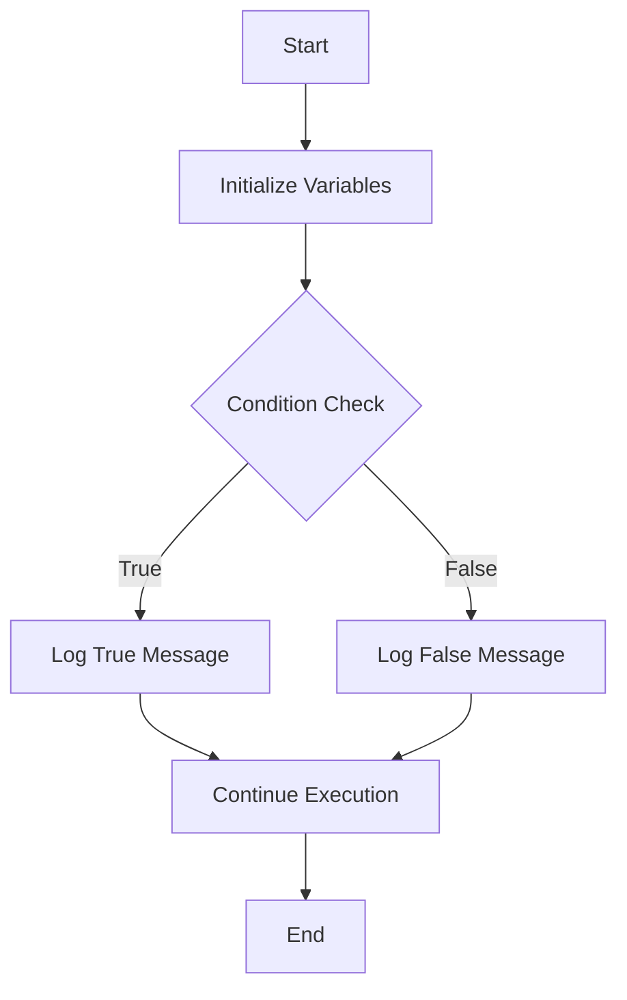

## 13.3 Using `console.log()` Effectively

In the world of programming, debugging is an essential skill. As you write code, you will inevitably encounter errors or unexpected behavior. One of the simplest yet most powerful tools at your disposal for debugging JavaScript is the `console.log()` function. In this section, we will explore how to use `console.log()` effectively to monitor your code's execution, understand its flow, and identify issues.

### Understanding `console.log()`

The `console.log()` function is a built-in JavaScript method that outputs messages to the web console. This console is part of your browser's developer tools, which you can access by right-clicking on a webpage and selecting "Inspect" or by pressing `F12` on your keyboard. The console is a powerful tool for developers, as it allows you to view messages, errors, and other information about your code.

#### Basic Usage

Let's start with a simple example of using `console.log()`:

```javascript
console.log("Hello, World!");
```

This line of code will print the message "Hello, World!" to the console. You can use `console.log()` to output any kind of data, including strings, numbers, arrays, and objects.

### Strategic Placement of `console.log()`

To use `console.log()` effectively, you need to strategically place it within your code. This involves understanding where to log information to gain insights into your program's execution.

#### Logging Variables and Outputs

One of the most common uses of `console.log()` is to log the values of variables at different points in your code. This helps you verify that your variables contain the expected values.

Consider the following example:

```javascript
let a = 5;
let b = 10;
let sum = a + b;

console.log("The value of a is:", a);
console.log("The value of b is:", b);
console.log("The sum of a and b is:", sum);
```

In this example, we log the values of `a`, `b`, and `sum` to the console. This allows us to confirm that the variables are being assigned the correct values and that the calculation is performed correctly.

#### Monitoring Code Execution

You can also use `console.log()` to monitor the flow of your program. By placing log statements at key points in your code, you can track which parts of your code are being executed and in what order.

Here's an example using a simple `if...else` statement:

```javascript
let number = 7;

if (number > 5) {
    console.log("The number is greater than 5.");
} else {
    console.log("The number is 5 or less.");
}
```

By logging messages within the `if` and `else` blocks, you can determine which branch of the code is executed based on the value of `number`.

### Using Placeholders and String Interpolation

To make your log messages more informative and easier to read, you can use placeholders and string interpolation. This allows you to embed variable values directly within your log messages.

#### Placeholders

JavaScript allows you to use placeholders in your log messages. Placeholders are represented by `%` followed by a character that indicates the type of data. For example, `%s` is used for strings, and `%d` is used for numbers.

Here's an example:

```javascript
let name = "Alice";
let age = 30;

console.log("Name: %s, Age: %d", name, age);
```

In this example, `%s` is replaced by the value of `name`, and `%d` is replaced by the value of `age`.

#### String Interpolation

String interpolation is another powerful feature that allows you to embed expressions within string literals. In JavaScript, you can use template literals, which are enclosed by backticks (`` ` ``), to achieve this.

Here's an example:

```javascript
let product = "laptop";
let price = 999.99;

console.log(`The price of the ${product} is $${price}.`);
```

In this example, `${product}` and `${price}` are placeholders that are replaced by the values of the `product` and `price` variables, respectively.

### Advanced `console.log()` Techniques

While `console.log()` is simple to use, there are advanced techniques that can enhance its effectiveness.

#### Logging Objects

When working with objects, you can log the entire object to the console to inspect its properties and values.

```javascript
let person = {
    name: "John",
    age: 25,
    occupation: "Engineer"
};

console.log(person);
```

This will output the entire `person` object, allowing you to see all its properties and their values.

#### Grouping Log Messages

If you have multiple related log messages, you can group them using `console.group()` and `console.groupEnd()`. This organizes your log messages into collapsible groups in the console.

```javascript
console.group("User Details");
console.log("Name: John");
console.log("Age: 25");
console.log("Occupation: Engineer");
console.groupEnd();
```

This will create a group labeled "User Details" with the individual log messages inside it.

#### Using `console.table()`

For arrays of objects, `console.table()` provides a tabular view of the data, making it easier to read and understand.

```javascript
let users = [
    { name: "Alice", age: 30 },
    { name: "Bob", age: 25 },
    { name: "Charlie", age: 35 }
];

console.table(users);
```

This will display the `users` array in a table format, with columns for `name` and `age`.

### Common Pitfalls and Best Practices

While `console.log()` is a powerful tool, there are some common pitfalls to avoid and best practices to follow.

#### Avoid Overusing `console.log()`

While it's tempting to log everything, excessive logging can clutter your console and make it difficult to find relevant information. Use `console.log()` judiciously and remove unnecessary log statements once you've resolved issues.

#### Use Descriptive Messages

Ensure your log messages are descriptive and provide enough context to understand what is being logged. Avoid vague messages like "Error" or "Value".

#### Clean Up Logs Before Deployment

Before deploying your code to production, remove or disable `console.log()` statements to prevent unnecessary output and potential performance issues.

### Try It Yourself

To reinforce your understanding, try experimenting with the following code:

```javascript
let fruits = ["apple", "banana", "cherry"];
let selectedFruit = fruits[1];

console.log(`Selected fruit: ${selectedFruit}`);

fruits.forEach((fruit, index) => {
    console.log(`Fruit ${index + 1}: ${fruit}`);
});
```

**Challenge:** Modify the code to log the length of the `fruits` array and the index of the selected fruit.

### Visual Representation

To better understand how `console.log()` fits into the debugging process, let's look at a simple flowchart:



This flowchart illustrates a basic program flow where `console.log()` is used to log messages based on a condition.

### Further Reading

For more information on `console.log()` and other console methods, check out the following resources:

- [MDN Web Docs: Console](https://developer.mozilla.org/en-US/docs/Web/API/Console)
- [W3Schools: JavaScript Console](https://www.w3schools.com/js/js_console.asp)

### Summary

In this section, we've explored how to use `console.log()` effectively for debugging and monitoring code execution. By strategically placing log statements, using placeholders and string interpolation, and employing advanced techniques, you can gain valuable insights into your program's behavior. Remember to follow best practices and clean up your logs before deploying your code.

## Quiz Time!



### What is the primary use of `console.log()` in JavaScript?

- [x] To output messages to the web console for debugging purposes.
- [ ] To create graphical user interfaces.
- [ ] To compile JavaScript code.
- [ ] To execute server-side scripts.

> **Explanation:** `console.log()` is used to output messages to the web console, which helps in debugging and monitoring code execution.

### How can you log the value of a variable using `console.log()`?

- [x] By placing the variable inside the parentheses of `console.log()`.
- [ ] By using the `alert()` function.
- [ ] By writing the variable name in quotes.
- [ ] By using the `document.write()` method.

> **Explanation:** You can log the value of a variable by placing it inside the parentheses of `console.log()`, like `console.log(variableName);`.

### What is the purpose of using placeholders in `console.log()`?

- [x] To embed variable values within log messages for clarity.
- [ ] To create a new variable.
- [ ] To execute a function.
- [ ] To define a loop.

> **Explanation:** Placeholders allow you to embed variable values within log messages, making them more informative and easier to read.

### What is the benefit of using `console.group()` and `console.groupEnd()`?

- [x] To organize related log messages into collapsible groups.
- [ ] To create a new array.
- [ ] To terminate a loop.
- [ ] To define a function.

> **Explanation:** `console.group()` and `console.groupEnd()` organize related log messages into collapsible groups in the console.

### How can you display an array of objects in a tabular format using the console?

- [x] By using `console.table()`.
- [ ] By using `console.log()`.
- [ ] By using `console.warn()`.
- [ ] By using `console.error()`.

> **Explanation:** `console.table()` displays an array of objects in a tabular format, making it easier to read and understand.

### Why should you avoid overusing `console.log()`?

- [x] Excessive logging can clutter the console and make it difficult to find relevant information.
- [ ] It can create new variables.
- [ ] It can execute server-side scripts.
- [ ] It can compile JavaScript code.

> **Explanation:** Overusing `console.log()` can clutter the console, making it hard to find relevant information. Use it judiciously.

### What should you do with `console.log()` statements before deploying code to production?

- [x] Remove or disable them to prevent unnecessary output and potential performance issues.
- [ ] Convert them to `alert()` statements.
- [ ] Change them to `document.write()` statements.
- [ ] Leave them as they are.

> **Explanation:** It's best to remove or disable `console.log()` statements before deploying code to production to avoid unnecessary output.

### What is the advantage of using string interpolation in `console.log()`?

- [x] It allows embedding expressions within string literals for clearer messages.
- [ ] It creates a new array.
- [ ] It defines a loop.
- [ ] It executes a function.

> **Explanation:** String interpolation allows embedding expressions within string literals, making log messages clearer and more informative.

### What is the output of the following code: `console.log("Name: %s, Age: %d", "Alice", 30);`?

- [x] Name: Alice, Age: 30
- [ ] Name: %s, Age: %d
- [ ] Name: Alice, Age: %s
- [ ] Name: %d, Age: 30

> **Explanation:** The placeholders `%s` and `%d` are replaced by "Alice" and 30, respectively, resulting in "Name: Alice, Age: 30".

### True or False: `console.log()` can only be used to log strings.

- [ ] True
- [x] False

> **Explanation:** `console.log()` can log various data types, including strings, numbers, arrays, and objects.


