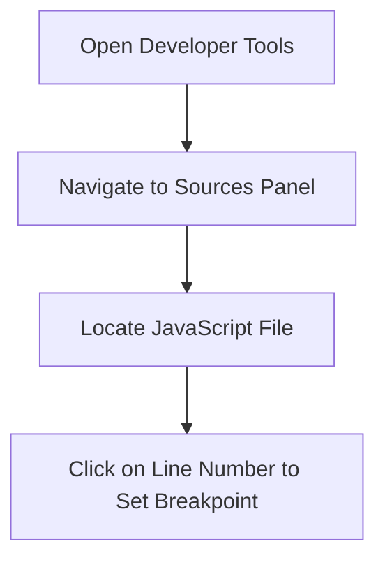
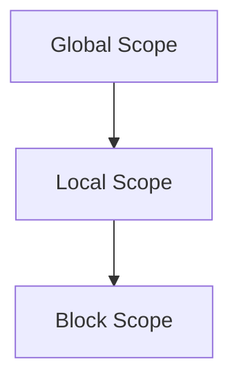

## 13.4 Breakpoints and the Debugger

Debugging is an essential skill for any programmer. It allows us to identify and fix errors in our code, ensuring that our programs run smoothly and correctly. In this section, we'll explore how to use breakpoints and the debugger in JavaScript, focusing on browser developer tools. We'll guide you through setting breakpoints, stepping through code line by line, and inspecting variables, the call stack, and scope during execution.

### Understanding Breakpoints

**Breakpoints** are markers that you can set in your code to pause execution at a specific line. This allows you to examine the current state of your program and understand how it is behaving at that point. Breakpoints are a powerful tool for identifying and resolving issues in your code.

#### Setting Breakpoints

To set a breakpoint, follow these steps:

1. **Open Developer Tools**: In most browsers, you can open developer tools by pressing `F12` or `Ctrl + Shift + I` (Windows) or `Cmd + Option + I` (Mac).

2. **Navigate to the Sources Panel**: The Sources panel is where you can view and edit your code. It also allows you to set breakpoints.

3. **Locate Your JavaScript File**: In the Sources panel, find the JavaScript file you want to debug. You can usually find it in the left sidebar under the "Page" or "Filesystem" section.

4. **Set a Breakpoint**: Click on the line number where you want to set a breakpoint. A blue marker will appear, indicating that a breakpoint has been set.

Here's a visual representation of setting a breakpoint:



### Stepping Through Code

Once you've set a breakpoint, you can step through your code to examine its execution. This involves executing your code one line at a time, allowing you to observe how variables change and how the program flows.

#### Step Over, Step Into, and Step Out

- **Step Over**: Executes the current line of code and moves to the next line. If the current line contains a function call, it executes the entire function without stepping into it.

- **Step Into**: Moves into the function call on the current line, allowing you to debug the function's internal code.

- **Step Out**: Completes the execution of the current function and returns to the calling function.

These actions are typically represented by buttons in the developer tools:

- Step Over: 
- Step Into: 
- Step Out: 

### Inspecting Variables

While debugging, it's crucial to inspect the values of variables to understand the state of your program. The developer tools provide several ways to do this:

#### Watch Expressions

Watch expressions allow you to monitor specific variables or expressions. You can add a watch expression by right-clicking on a variable in your code and selecting "Add to Watch."

#### Scope Pane

The Scope pane displays all the variables in the current scope, including local, closure, and global variables. You can expand each scope to view the variables and their values.

### Understanding the Call Stack

The **call stack** is a mechanism that keeps track of function calls in your program. It helps you understand the sequence of function calls that led to the current point in your code.

#### Viewing the Call Stack

In the developer tools, the Call Stack pane shows the list of functions that have been called, with the most recent call at the top. You can click on any function in the call stack to view its code and variables.

### Exploring Scope

**Scope** refers to the context in which variables are accessible. Understanding scope is crucial for debugging, as it helps you determine where variables are defined and how they are used.

#### Types of Scope

- **Global Scope**: Variables defined outside any function are in the global scope and can be accessed from anywhere in the program.

- **Local Scope**: Variables defined within a function are in the local scope and can only be accessed within that function.

- **Block Scope**: Variables defined within a block (e.g., inside an `if` statement) are in block scope and can only be accessed within that block.

Here's a visual representation of scope:



### Practical Example

Let's walk through a practical example of using breakpoints and the debugger. Consider the following JavaScript code:

```javascript
function calculateSum(a, b) {
    let sum = a + b;
    return sum;
}

function displayResult() {
    let result = calculateSum(5, 10);
    console.log("The result is: " + result);
}

displayResult();
```

#### Setting a Breakpoint

1. Open the developer tools and navigate to the Sources panel.
2. Locate the JavaScript file containing the code.
3. Set a breakpoint on the line `let result = calculateSum(5, 10);`.

#### Stepping Through Code

1. Run the code. The execution will pause at the breakpoint.
2. Use "Step Into" to enter the `calculateSum` function.
3. Observe the values of `a` and `b` in the Scope pane.
4. Use "Step Over" to execute the line `let sum = a + b;`.
5. Check the value of `sum` in the Scope pane.
6. Use "Step Out" to return to the `displayResult` function.
7. Continue stepping through the code to observe the final result.

### Try It Yourself

Now it's your turn to experiment with breakpoints and the debugger. Try modifying the code example above by changing the values of `a` and `b`, or by adding additional functions. Set breakpoints at different points in the code and use the debugger to step through the execution. Observe how the variables and call stack change as you step through the code.

### Key Takeaways

- Breakpoints allow you to pause execution at specific lines of code, enabling you to inspect the program's state.
- The debugger provides tools to step through code, inspect variables, and understand the call stack and scope.
- Understanding scope is crucial for debugging, as it determines where variables are accessible.
- Practice using breakpoints and the debugger to become more proficient at identifying and resolving issues in your code.

### Further Reading

For more information on debugging in JavaScript, check out the following resources:

- [MDN Web Docs: Debugging JavaScript](https://developer.mozilla.org/en-US/docs/Learn/JavaScript/Asynchronous/Debugging)
- [W3Schools: JavaScript Debugging](https://www.w3schools.com/js/js_debugging.asp)

## Quiz Time!



### What is a breakpoint in JavaScript debugging?

- [x] A marker that pauses code execution at a specific line
- [ ] A tool for writing code
- [ ] A function that fixes errors automatically
- [ ] A method for optimizing code performance

> **Explanation:** A breakpoint is a marker that pauses code execution at a specific line, allowing you to inspect the program's state.

### Which action allows you to execute the current line and move to the next line without stepping into a function?

- [x] Step Over
- [ ] Step Into
- [ ] Step Out
- [ ] Continue

> **Explanation:** Step Over executes the current line and moves to the next line without stepping into any functions.

### What does the Scope pane in the debugger display?

- [x] Variables in the current scope
- [ ] The entire codebase
- [ ] Only global variables
- [ ] Only function names

> **Explanation:** The Scope pane displays variables in the current scope, including local, closure, and global variables.

### What is the call stack used for in debugging?

- [x] Tracking the sequence of function calls
- [ ] Storing variable values
- [ ] Managing memory allocation
- [ ] Optimizing code execution

> **Explanation:** The call stack is used to track the sequence of function calls in your program.

### Which type of scope allows variables to be accessed from anywhere in the program?

- [x] Global Scope
- [ ] Local Scope
- [ ] Block Scope
- [ ] Function Scope

> **Explanation:** Global scope allows variables to be accessed from anywhere in the program.

### How can you add a watch expression in the developer tools?

- [x] Right-click on a variable and select "Add to Watch"
- [ ] Double-click on a variable
- [ ] Use the console to log the variable
- [ ] Drag the variable to the Watch pane

> **Explanation:** You can add a watch expression by right-clicking on a variable and selecting "Add to Watch."

### What does the "Step Into" action do?

- [x] Moves into the function call on the current line
- [ ] Executes the entire program
- [ ] Skips the current line
- [ ] Moves to the next function call

> **Explanation:** Step Into moves into the function call on the current line, allowing you to debug the function's internal code.

### What is the purpose of the "Step Out" action?

- [x] Completes the execution of the current function and returns to the calling function
- [ ] Pauses the program
- [ ] Restarts the program
- [ ] Skips to the end of the program

> **Explanation:** Step Out completes the execution of the current function and returns to the calling function.

### Which scope is limited to variables defined within a block, such as an `if` statement?

- [x] Block Scope
- [ ] Global Scope
- [ ] Local Scope
- [ ] Function Scope

> **Explanation:** Block scope is limited to variables defined within a block, such as an `if` statement.

### True or False: The call stack shows the list of variables in the current scope.

- [ ] True
- [x] False

> **Explanation:** False. The call stack shows the list of function calls, not variables.


