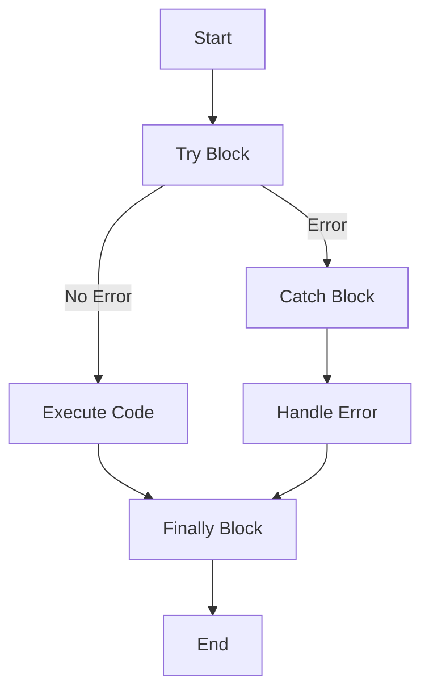

## 13.5 Handling Exceptions with `try...catch`

As we dive deeper into JavaScript programming, it's essential to understand how to handle errors gracefully. Errors are inevitable in programming, but how we manage them can make a significant difference in the robustness and user-friendliness of our applications. In this section, we'll explore how to handle exceptions using the `try...catch` statement, throw custom errors, and implement practical error handling scenarios.

### Understanding `try...catch` Syntax

The `try...catch` statement is a powerful tool in JavaScript that allows us to handle exceptions, or errors, that may occur during the execution of our code. The basic syntax includes the `try` block, the `catch` block, and optionally, the `finally` block.

```javascript
try {
    // Code that may throw an error
} catch (error) {
    // Code to handle the error
} finally {
    // Code that will always run, regardless of an error
}
```

#### The `try` Block

The `try` block contains the code that you want to execute. If an error occurs in this block, the control is immediately passed to the `catch` block.

#### The `catch` Block

The `catch` block is where you handle the error. It receives an error object that contains information about the error. You can use this object to understand what went wrong and take appropriate action.

#### The `finally` Block

The `finally` block is optional and contains code that will execute after the `try` and `catch` blocks, regardless of whether an error was thrown or not. This is useful for cleanup tasks, such as closing files or releasing resources.

### Catching Specific Errors

In JavaScript, you can catch specific errors and handle them differently. This is particularly useful when you want to perform different actions based on the type of error that occurred.

```javascript
try {
    // Code that may throw different types of errors
    let result = someFunction();
} catch (error) {
    if (error instanceof TypeError) {
        console.error("A TypeError occurred: " + error.message);
    } else if (error instanceof ReferenceError) {
        console.error("A ReferenceError occurred: " + error.message);
    } else {
        console.error("An unknown error occurred: " + error.message);
    }
}
```

In this example, we use the `instanceof` operator to check the type of error and handle it accordingly.

### Throwing Custom Errors

Sometimes, you may want to throw your own errors to indicate that something went wrong in your code. You can do this using the `throw` statement along with the `Error` constructor.

```javascript
function divide(a, b) {
    if (b === 0) {
        throw new Error("Division by zero is not allowed.");
    }
    return a / b;
}

try {
    let result = divide(10, 0);
} catch (error) {
    console.error("Error: " + error.message);
}
```

In this example, we define a `divide` function that throws an error if the divisor is zero. We then use a `try...catch` block to handle the error gracefully.

### Practical Examples of Error Handling Scenarios

Let's explore some practical scenarios where error handling is crucial.

#### Scenario 1: User Input Validation

When dealing with user input, it's important to validate the data and handle any errors that may arise.

```javascript
function getUserAge() {
    let age = prompt("Enter your age:");

    try {
        if (isNaN(age)) {
            throw new Error("Invalid input. Please enter a number.");
        }
        console.log("Your age is " + age);
    } catch (error) {
        console.error("Error: " + error.message);
    }
}

getUserAge();
```

In this example, we prompt the user to enter their age and check if the input is a number. If not, we throw an error and handle it in the `catch` block.

#### Scenario 2: Network Requests

When making network requests, errors can occur due to connectivity issues or server errors. It's important to handle these errors to provide a better user experience.

```javascript
async function fetchData(url) {
    try {
        let response = await fetch(url);
        if (!response.ok) {
            throw new Error("Network response was not ok.");
        }
        let data = await response.json();
        console.log(data);
    } catch (error) {
        console.error("Fetch error: " + error.message);
    }
}

fetchData("https://api.example.com/data");
```

In this example, we use the `fetch` API to make a network request. We check if the response is not okay and throw an error if necessary. The `catch` block handles any errors that occur during the request.

#### Scenario 3: File Operations

When working with files, errors can occur if the file does not exist or cannot be accessed. Handling these errors is crucial for robust file operations.

```javascript
const fs = require('fs');

function readFile(filePath) {
    try {
        let data = fs.readFileSync(filePath, 'utf8');
        console.log(data);
    } catch (error) {
        console.error("File read error: " + error.message);
    } finally {
        console.log("Finished file operation.");
    }
}

readFile("example.txt");
```

In this Node.js example, we use the `fs` module to read a file. If an error occurs, such as the file not being found, we catch it and handle it appropriately. The `finally` block ensures that a message is logged regardless of whether an error occurred.

### Visualizing Error Handling Flow

To better understand the flow of error handling, let's visualize it using a flowchart.



This flowchart illustrates the sequence of execution in a `try...catch` statement. If no error occurs, the code in the `try` block executes, followed by the `finally` block. If an error occurs, control passes to the `catch` block, and then the `finally` block executes.

### Best Practices for Error Handling

- **Anticipate Errors:** Think about potential errors that could occur in your code and handle them proactively.
- **Provide Meaningful Messages:** When throwing or logging errors, provide clear and informative messages to help diagnose the issue.
- **Use `finally` for Cleanup:** Use the `finally` block to perform cleanup tasks, such as closing connections or freeing resources.
- **Avoid Silent Failures:** Ensure that errors are logged or reported, so they don't go unnoticed.

### Try It Yourself

Now that we've covered the basics of error handling with `try...catch`, it's time to practice. Modify the code examples provided to experiment with different error scenarios. For instance, try changing the divisor in the `divide` function to see how the error handling works. Or, simulate a network error by using an invalid URL in the `fetchData` function.

### Further Reading

For more information on error handling in JavaScript, check out these resources:

- [MDN Web Docs: `try...catch`](https://developer.mozilla.org/en-US/docs/Web/JavaScript/Reference/Statements/try...catch)
- [W3Schools: JavaScript Errors](https://www.w3schools.com/js/js_errors.asp)

### Summary

In this section, we've explored how to handle exceptions in JavaScript using the `try...catch` statement. We've learned how to catch specific errors, throw custom errors, and implement practical error handling scenarios. By mastering these techniques, you can write more robust and user-friendly applications.

## Quiz Time!



### What is the purpose of the `try` block in a `try...catch` statement?

- [x] To contain code that may throw an error
- [ ] To handle errors that occur
- [ ] To execute code after the `catch` block
- [ ] To log errors to the console

> **Explanation:** The `try` block contains code that may throw an error. If an error occurs, control is passed to the `catch` block.

### What does the `catch` block do in a `try...catch` statement?

- [ ] It contains code that may throw an error
- [x] It handles errors that occur in the `try` block
- [ ] It executes code after the `finally` block
- [ ] It logs errors to the console

> **Explanation:** The `catch` block handles errors that occur in the `try` block. It receives an error object with information about the error.

### What is the role of the `finally` block in a `try...catch` statement?

- [ ] To handle errors that occur
- [ ] To contain code that may throw an error
- [x] To execute code regardless of whether an error occurred
- [ ] To log errors to the console

> **Explanation:** The `finally` block executes code regardless of whether an error occurred in the `try` block. It's useful for cleanup tasks.

### How can you catch specific types of errors in a `catch` block?

- [ ] By using the `typeof` operator
- [x] By using the `instanceof` operator
- [ ] By using the `catch` keyword
- [ ] By using the `throw` statement

> **Explanation:** You can catch specific types of errors in a `catch` block by using the `instanceof` operator to check the type of error.

### What is the purpose of the `throw` statement in JavaScript?

- [ ] To handle errors that occur
- [ ] To execute code after the `catch` block
- [x] To throw custom errors
- [ ] To log errors to the console

> **Explanation:** The `throw` statement is used to throw custom errors in JavaScript. It can be used to indicate that something went wrong in your code.

### Which of the following is a best practice for error handling?

- [x] Anticipate potential errors and handle them proactively
- [ ] Ignore errors to avoid cluttering the console
- [ ] Use `finally` blocks only when necessary
- [ ] Provide vague error messages to avoid confusion

> **Explanation:** Anticipating potential errors and handling them proactively is a best practice for error handling. It helps prevent unexpected issues in your code.

### What does the `Error` constructor do in JavaScript?

- [ ] It handles errors that occur
- [ ] It executes code after the `catch` block
- [x] It creates a new error object
- [ ] It logs errors to the console

> **Explanation:** The `Error` constructor creates a new error object in JavaScript. It can be used with the `throw` statement to throw custom errors.

### How can you simulate a network error in the `fetchData` function example?

- [x] By using an invalid URL
- [ ] By using a valid URL
- [ ] By removing the `catch` block
- [ ] By removing the `try` block

> **Explanation:** You can simulate a network error in the `fetchData` function example by using an invalid URL. This will cause the `fetch` request to fail.

### What is the purpose of the `finally` block in the file operations example?

- [ ] To handle errors that occur
- [ ] To contain code that may throw an error
- [x] To log a message indicating the end of the file operation
- [ ] To log errors to the console

> **Explanation:** In the file operations example, the `finally` block logs a message indicating the end of the file operation, regardless of whether an error occurred.

### True or False: The `try...catch` statement can only be used in synchronous code.

- [ ] True
- [x] False

> **Explanation:** False. The `try...catch` statement can be used in both synchronous and asynchronous code. However, it only catches errors that occur in the `try` block, not in asynchronous callbacks.


