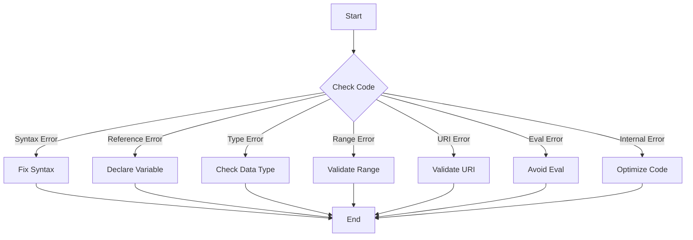

## 13.6 Common JavaScript Errors

As you embark on your journey to master JavaScript, encountering errors is an inevitable part of the learning process. Understanding these errors and knowing how to fix them is crucial for becoming a proficient programmer. In this section, we will explore some of the most common JavaScript errors, what causes them, and how you can resolve them. By the end of this chapter, you'll be better equipped to handle errors and debug your code effectively.

### Understanding JavaScript Errors

JavaScript errors are messages that the JavaScript engine throws when it encounters something unexpected in your code. These errors can be broadly categorized into several types, each indicating a specific kind of problem. Let's delve into the most common types of errors you might encounter:

1. **SyntaxError**
2. **ReferenceError**
3. **TypeError**
4. **RangeError**
5. **URIError**
6. **EvalError**
7. **InternalError**

We'll explore each of these errors in detail, providing examples and solutions to help you understand and fix them.

### 1. SyntaxError

A `SyntaxError` occurs when the JavaScript engine encounters code that does not conform to the language's syntax rules. This is akin to making a grammatical mistake in a sentence. Common causes include missing punctuation, incorrect use of operators, or unmatched brackets.

#### Example and Solution

```javascript
// Example of a SyntaxError
let x = 10
if (x > 5) {
    console.log("x is greater than 5");
} // Missing closing parenthesis for the if statement

// Corrected Code
let x = 10;
if (x > 5) {
    console.log("x is greater than 5");
}
```

In the example above, the missing semicolon and closing parenthesis after the `if` statement cause a `SyntaxError`. Adding the semicolon and ensuring all brackets are matched resolves the error.

#### How to Fix SyntaxErrors

- **Check for Missing or Extra Characters:** Ensure all parentheses, brackets, and braces are properly matched.
- **Look for Typos:** Verify that all keywords and variable names are spelled correctly.
- **Use a Code Editor:** Utilize a code editor with syntax highlighting and error detection to catch mistakes early.

### 2. ReferenceError

A `ReferenceError` occurs when you try to access a variable that hasn't been declared. This error often arises from typos in variable names or attempting to use a variable before it's defined.

#### Example and Solution

```javascript
// Example of a ReferenceError
console.log(myVariable); // myVariable is not defined

// Corrected Code
let myVariable = "Hello, World!";
console.log(myVariable);
```

In the example above, attempting to log `myVariable` before it is declared results in a `ReferenceError`. Declaring the variable before using it resolves the error.

#### How to Fix ReferenceErrors

- **Check Variable Declarations:** Ensure all variables are declared before they are used.
- **Verify Spelling:** Double-check the spelling of variable names to avoid typos.
- **Use `let` and `const`:** Prefer `let` and `const` over `var` to reduce the risk of hoisting-related issues.

### 3. TypeError

A `TypeError` occurs when an operation is performed on a value of the wrong type. This can happen when you try to call a method on `undefined` or `null`, or when you attempt to perform an invalid operation on a data type.

#### Example and Solution

```javascript
// Example of a TypeError
let num = 5;
num.toUpperCase(); // TypeError: num.toUpperCase is not a function

// Corrected Code
let str = "Hello";
console.log(str.toUpperCase());
```

In the example above, attempting to call `toUpperCase()` on a number results in a `TypeError`. Ensuring that the method is called on a string resolves the error.

#### How to Fix TypeErrors

- **Check Data Types:** Verify that operations are performed on the correct data types.
- **Use `typeof`:** Utilize the `typeof` operator to check variable types before performing operations.
- **Handle `null` and `undefined`:** Ensure that variables are not `null` or `undefined` before calling methods on them.

### 4. RangeError

A `RangeError` occurs when a value is not within the set or expected range. This can happen with functions that expect a specific range of values, such as `toFixed()` or `toPrecision()`.

#### Example and Solution

```javascript
// Example of a RangeError
let num = 1.2345;
num.toFixed(100); // RangeError: toFixed() digits argument must be between 0 and 100

// Corrected Code
console.log(num.toFixed(2)); // Correct usage
```

In the example above, passing an invalid argument to `toFixed()` results in a `RangeError`. Ensuring the argument is within the valid range resolves the error.

#### How to Fix RangeErrors

- **Check Function Arguments:** Verify that arguments passed to functions are within the expected range.
- **Consult Documentation:** Refer to the function's documentation to understand its limitations and requirements.

### 5. URIError

A `URIError` occurs when there is an issue with encoding or decoding a URI (Uniform Resource Identifier). This can happen when using functions like `encodeURI()` or `decodeURIComponent()` with malformed URIs.

#### Example and Solution

```javascript
// Example of a URIError
let malformedURI = "%";
decodeURIComponent(malformedURI); // URIError: URI malformed

// Corrected Code
let validURI = encodeURIComponent("Hello World!");
console.log(decodeURIComponent(validURI));
```

In the example above, attempting to decode a malformed URI results in a `URIError`. Ensuring the URI is properly encoded before decoding resolves the error.

#### How to Fix URIErrors

- **Validate URIs:** Ensure URIs are correctly formatted before encoding or decoding.
- **Use Encoding Functions:** Utilize `encodeURI()` and `encodeURIComponent()` to properly encode URIs.

### 6. EvalError

An `EvalError` is thrown when there is an issue with the `eval()` function, which executes a string of JavaScript code. Although `EvalError` is rarely encountered in modern JavaScript, it's important to understand its implications.

#### Example and Solution

```javascript
// Example of an EvalError
eval("alert('Hello World!')"); // No error, but eval is discouraged

// Corrected Code
alert('Hello World!');
```

In the example above, using `eval()` to execute code is not recommended due to security and performance concerns. Directly executing the code without `eval()` is a better approach.

#### How to Fix EvalErrors

- **Avoid `eval()`:** Refrain from using `eval()` whenever possible due to security risks.
- **Use Alternatives:** Consider using other methods to achieve the desired functionality without `eval()`.

### 7. InternalError

An `InternalError` occurs when the JavaScript engine runs into an internal problem, such as exceeding the call stack size. This error is rare and often indicates a deeper issue with the code.

#### Example and Solution

```javascript
// Example of an InternalError
function recursiveFunction() {
    return recursiveFunction(); // Infinite recursion
}
recursiveFunction(); // InternalError: too much recursion

// Corrected Code
function safeFunction() {
    // Implement logic to prevent infinite recursion
}
```

In the example above, an infinite recursion leads to an `InternalError`. Implementing logic to prevent infinite recursion resolves the error.

#### How to Fix InternalErrors

- **Avoid Infinite Loops:** Ensure recursive functions have a base case to prevent infinite recursion.
- **Optimize Code:** Refactor code to reduce complexity and prevent excessive resource usage.

### Visualizing Error Types

To better understand the flow of how these errors occur, let's visualize the process using a flowchart. This can help you identify where errors might arise in your code.



### References and Links

For more information on JavaScript errors and debugging, consider exploring the following resources:

- [MDN Web Docs: JavaScript Errors](https://developer.mozilla.org/en-US/docs/Web/JavaScript/Reference/Errors)
- [W3Schools: JavaScript Errors](https://www.w3schools.com/js/js_errors.asp)
- [JavaScript.info: Error Handling](https://javascript.info/error-handling)

### Engagement and Reinforcement

To reinforce your understanding of common JavaScript errors, try the following exercises:

1. **Identify Errors:** Review a piece of code and identify any errors present. Explain what type of error it is and how to fix it.
2. **Fix Errors:** Write a small program with intentional errors. Debug and fix the errors to ensure the program runs correctly.
3. **Create Error Scenarios:** Create scenarios that would lead to each type of error discussed. Share your scenarios with a peer and challenge them to fix the errors.

### Summary

In this section, we've explored common JavaScript errors, including `SyntaxError`, `ReferenceError`, `TypeError`, and more. Understanding these errors and knowing how to resolve them is essential for any JavaScript developer. By practicing error identification and resolution, you'll become more confident in your coding abilities and better equipped to tackle complex programming challenges.

## Quiz Time!



### What is a SyntaxError?

- [x] An error caused by incorrect syntax in the code.
- [ ] An error caused by accessing an undefined variable.
- [ ] An error caused by performing an operation on the wrong data type.
- [ ] An error caused by exceeding the call stack size.

> **Explanation:** A SyntaxError occurs when the JavaScript engine encounters code that does not conform to the language's syntax rules.

### How can you fix a ReferenceError?

- [x] Declare the variable before using it.
- [ ] Use `eval()` to define the variable.
- [ ] Change the data type of the variable.
- [ ] Ignore the error and continue coding.

> **Explanation:** A ReferenceError occurs when you try to access a variable that hasn't been declared. Declaring the variable before using it resolves the error.

### What causes a TypeError?

- [ ] Incorrect syntax in the code.
- [ ] Accessing an undefined variable.
- [x] Performing an operation on the wrong data type.
- [ ] Exceeding the call stack size.

> **Explanation:** A TypeError occurs when an operation is performed on a value of the wrong type.

### Which error occurs when a value is not within the expected range?

- [ ] SyntaxError
- [ ] ReferenceError
- [x] RangeError
- [ ] TypeError

> **Explanation:** A RangeError occurs when a value is not within the set or expected range.

### How can you avoid URIError?

- [ ] Use `eval()` to encode URIs.
- [x] Ensure URIs are correctly formatted before encoding or decoding.
- [ ] Use `typeof` to check URI types.
- [ ] Declare URIs as constants.

> **Explanation:** A URIError occurs when there is an issue with encoding or decoding a URI. Ensuring URIs are correctly formatted before encoding or decoding prevents this error.

### What is an EvalError?

- [ ] An error caused by incorrect syntax in the code.
- [ ] An error caused by accessing an undefined variable.
- [ ] An error caused by performing an operation on the wrong data type.
- [x] An error related to the `eval()` function.

> **Explanation:** An EvalError is thrown when there is an issue with the `eval()` function.

### How can you fix an InternalError?

- [ ] Use `eval()` to resolve the error.
- [ ] Ignore the error and continue coding.
- [x] Optimize the code to prevent excessive resource usage.
- [ ] Change the data type of variables.

> **Explanation:** An InternalError occurs when the JavaScript engine runs into an internal problem, such as exceeding the call stack size. Optimizing the code to prevent excessive resource usage resolves the error.

### What is the best practice to avoid TypeErrors?

- [ ] Use `eval()` to define variables.
- [x] Verify that operations are performed on the correct data types.
- [ ] Ignore the error and continue coding.
- [ ] Declare all variables as constants.

> **Explanation:** To avoid TypeErrors, verify that operations are performed on the correct data types.

### Which error is rarely encountered in modern JavaScript?

- [ ] SyntaxError
- [ ] ReferenceError
- [ ] TypeError
- [x] EvalError

> **Explanation:** EvalError is rarely encountered in modern JavaScript as the use of `eval()` is discouraged.

### True or False: A SyntaxError can occur due to unmatched brackets.

- [x] True
- [ ] False

> **Explanation:** A SyntaxError can occur when there are unmatched brackets in the code, as this violates the syntax rules.


