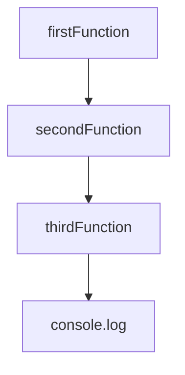
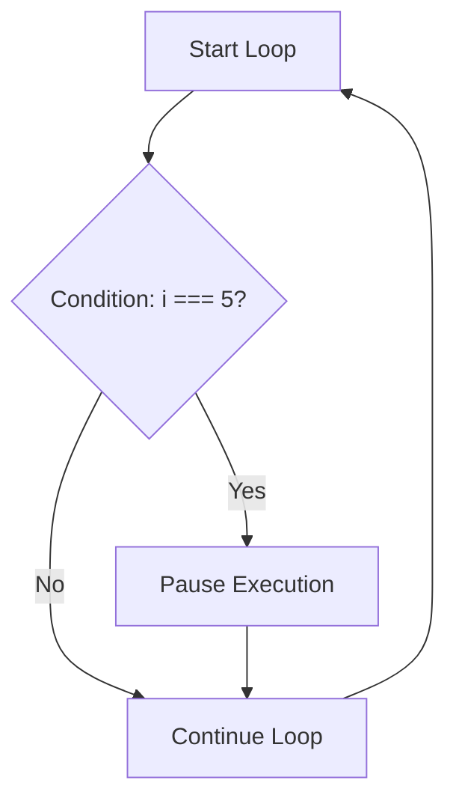

## 13.7 Debugging Tools and Techniques

Debugging is an essential skill for any programmer. It involves identifying and fixing errors or bugs in your code. In this section, we will explore various debugging tools and techniques that can help you become more efficient and effective in solving problems in your JavaScript programs. We'll cover advanced features like watch expressions, call stack panels, conditional breakpoints, and briefly touch on profiling performance and memory usage.

### Understanding the Debugging Process

Before diving into specific tools and techniques, let's first understand the debugging process. Debugging is often an iterative process that involves:

1. **Identifying the Problem**: Recognizing that there is an issue in the code.
2. **Locating the Bug**: Finding the exact location in the code where the problem occurs.
3. **Analyzing the Bug**: Understanding why the problem is happening.
4. **Fixing the Bug**: Modifying the code to resolve the issue.
5. **Testing the Fix**: Ensuring that the fix works and does not introduce new issues.

### Using Developer Tools

Modern web browsers come equipped with powerful developer tools that can assist in debugging JavaScript code. These tools provide a range of features that make it easier to inspect, debug, and optimize your code. Let's explore some of these features.

#### Breakpoints

Breakpoints are one of the most fundamental tools in debugging. They allow you to pause the execution of your code at a specific line, so you can inspect the current state of your program.

- **Setting a Breakpoint**: To set a breakpoint, open the developer tools in your browser (usually by pressing `F12` or `Ctrl+Shift+I`), navigate to the "Sources" tab, and click on the line number where you want to pause execution.

```javascript
function calculateSum(a, b) {
    let sum = a + b; // Set a breakpoint here
    return sum;
}

let result = calculateSum(5, 10);
console.log(result);
```

- **Using Breakpoints**: Once a breakpoint is set, run your code. The execution will pause at the breakpoint, allowing you to inspect variables and the call stack.

#### Conditional Breakpoints

Conditional breakpoints are an advanced feature that allows you to pause execution only when a specific condition is met. This is useful when you want to debug a loop or a function that is called multiple times.

- **Setting a Conditional Breakpoint**: Right-click on the line number in the "Sources" tab and select "Add conditional breakpoint." Enter the condition under which you want the breakpoint to trigger.

```javascript
for (let i = 0; i < 10; i++) {
    console.log(i); // Set a conditional breakpoint here with condition: i === 5
}
```

#### Watch Expressions

Watch expressions allow you to monitor the value of variables or expressions as your code executes. This is particularly useful for tracking changes in variables over time.

- **Adding a Watch Expression**: In the "Sources" tab, find the "Watch" panel and click on the "+" icon to add a new expression. Enter the variable or expression you want to watch.

```javascript
let x = 10;
let y = 20;
let z = x + y; // Watch the expression: x + y
console.log(z);
```

#### Call Stack Panel

The call stack panel shows the sequence of function calls that led to the current point in execution. This is helpful for understanding the flow of your program and identifying where errors occur.

- **Viewing the Call Stack**: When your code is paused at a breakpoint, the call stack panel will display the list of functions that have been called. You can click on each function to see its source code.

```javascript
function firstFunction() {
    secondFunction();
}

function secondFunction() {
    thirdFunction();
}

function thirdFunction() {
    console.log('Hello, World!'); // Set a breakpoint here to view the call stack
}

firstFunction();
```

### Profiling Performance and Memory Usage

Profiling is the process of analyzing your code to identify performance bottlenecks and optimize resource usage. While this is a more advanced topic, it's important to be aware of the tools available for profiling.

#### Performance Profiling

Performance profiling helps you understand how your code executes over time and identify slow or inefficient parts of your program.

- **Using the Performance Tab**: In the developer tools, navigate to the "Performance" tab. Click "Record" to start profiling, perform the actions you want to analyze, and then click "Stop" to view the results.

#### Memory Profiling

Memory profiling allows you to analyze how your program uses memory and identify potential memory leaks.

- **Using the Memory Tab**: In the developer tools, go to the "Memory" tab. You can take heap snapshots to capture the state of memory at different points in time and compare them to identify leaks.

### Practical Debugging Techniques

Now that we've covered the tools, let's explore some practical techniques for debugging JavaScript code.

#### Console Logging

Console logging is one of the simplest and most common debugging techniques. By inserting `console.log()` statements in your code, you can print variable values and messages to the console to understand what's happening.

```javascript
function multiply(a, b) {
    console.log('a:', a, 'b:', b); // Log the values of a and b
    return a * b;
}

let product = multiply(3, 4);
console.log('Product:', product);
```

#### Step-by-Step Execution

Stepping through your code line by line is a powerful way to understand its execution flow and identify issues.

- **Step Over**: Execute the current line and move to the next one.
- **Step Into**: Enter the function call on the current line to see its execution.
- **Step Out**: Exit the current function and return to the caller.

#### Error Messages

Pay close attention to error messages in the console. They often provide valuable information about what went wrong and where to look for the problem.

```javascript
function divide(a, b) {
    if (b === 0) {
        throw new Error('Division by zero'); // Error message
    }
    return a / b;
}

try {
    let result = divide(10, 0);
} catch (error) {
    console.error(error.message); // Log the error message
}
```

#### Debugger Statement

The `debugger` statement is a built-in JavaScript feature that acts like a breakpoint. When the JavaScript engine encounters this statement, it will pause execution if developer tools are open.

```javascript
function greet(name) {
    debugger; // Execution will pause here
    console.log('Hello, ' + name);
}

greet('Alice');
```

### Visual Aids for Debugging

To enhance your understanding of debugging concepts, let's use some visual aids.

#### Call Stack Diagram

Here's a simple diagram to illustrate the concept of a call stack:



**Diagram Description**: This diagram represents the call stack when the `console.log` statement is executed. The functions are called in the order: `firstFunction`, `secondFunction`, `thirdFunction`, and finally `console.log`.

#### Program Flow in Conditional Breakpoints

Let's visualize how conditional breakpoints work in a loop:



**Diagram Description**: This flowchart shows the execution flow of a loop with a conditional breakpoint. The loop continues until the condition `i === 5` is met, at which point execution pauses.

### References and Further Reading

To deepen your understanding of debugging in JavaScript, consider exploring the following resources:

- [MDN Web Docs: Debugging JavaScript](https://developer.mozilla.org/en-US/docs/Learn/JavaScript/First_steps/What_is_JavaScript#debugging_javascript)
- [Google Chrome DevTools](https://developer.chrome.com/docs/devtools/)
- [W3Schools: JavaScript Debugging](https://www.w3schools.com/js/js_debugging.asp)

### Engagement and Reinforcement

To reinforce your learning, try the following exercises:

1. **Exercise 1**: Set a breakpoint in a simple JavaScript program and inspect the variables at that point.
2. **Exercise 2**: Use a conditional breakpoint in a loop and observe how it affects execution.
3. **Exercise 3**: Add watch expressions for key variables in a program and monitor their values as the program runs.
4. **Exercise 4**: Use the `debugger` statement in a function and step through the code to understand its flow.

### Summary

In this section, we've explored various debugging tools and techniques that can help you identify and fix issues in your JavaScript code. By mastering these tools, you'll be better equipped to write efficient, error-free programs. Remember, debugging is a skill that improves with practice, so keep experimenting and learning.

## Quiz Time!



### What is the purpose of a breakpoint in debugging?

- [x] To pause the execution of code at a specific line
- [ ] To automatically fix errors in the code
- [ ] To delete unnecessary code lines
- [ ] To optimize the performance of the code

> **Explanation:** A breakpoint is used to pause the execution of code at a specific line, allowing you to inspect the current state of your program.

### How do you set a conditional breakpoint in most developer tools?

- [x] Right-click on the line number and select "Add conditional breakpoint"
- [ ] Double-click on the line number
- [ ] Press `Ctrl+B` on the line
- [ ] Use the `debugger` statement

> **Explanation:** To set a conditional breakpoint, right-click on the line number and select "Add conditional breakpoint" to specify the condition.

### What is the purpose of the call stack panel?

- [x] To show the sequence of function calls leading to the current point in execution
- [ ] To display all variables in the program
- [ ] To optimize memory usage
- [ ] To automatically fix syntax errors

> **Explanation:** The call stack panel shows the sequence of function calls that led to the current point in execution, helping you understand the flow of your program.

### What does the `debugger` statement do in JavaScript?

- [x] Pauses the execution of code if developer tools are open
- [ ] Automatically logs errors to the console
- [ ] Fixes syntax errors in the code
- [ ] Optimizes the code for performance

> **Explanation:** The `debugger` statement pauses the execution of code if developer tools are open, allowing you to inspect the program's state.

### Which tool would you use to monitor the value of a variable over time?

- [x] Watch expressions
- [ ] Breakpoints
- [ ] Call stack
- [ ] Memory profiler

> **Explanation:** Watch expressions allow you to monitor the value of variables or expressions as your code executes.

### What is the purpose of performance profiling?

- [x] To analyze how code executes over time and identify slow parts
- [ ] To automatically fix bugs in the code
- [ ] To delete unnecessary code lines
- [ ] To optimize memory usage

> **Explanation:** Performance profiling helps you analyze how your code executes over time and identify slow or inefficient parts of your program.

### How can you capture the state of memory at different points in time?

- [x] By taking heap snapshots in the Memory tab
- [ ] By setting breakpoints
- [ ] By using the `debugger` statement
- [ ] By logging variables to the console

> **Explanation:** You can capture the state of memory at different points in time by taking heap snapshots in the Memory tab of developer tools.

### What is the first step in the debugging process?

- [x] Identifying the problem
- [ ] Fixing the bug
- [ ] Testing the fix
- [ ] Analyzing the bug

> **Explanation:** The first step in the debugging process is identifying the problem, recognizing that there is an issue in the code.

### Which of the following is NOT a step in the debugging process?

- [x] Automatically generating code
- [ ] Locating the bug
- [ ] Analyzing the bug
- [ ] Testing the fix

> **Explanation:** Automatically generating code is not a step in the debugging process. Debugging involves identifying, locating, analyzing, fixing, and testing issues.

### True or False: Conditional breakpoints pause execution every time the line is reached.

- [ ] True
- [x] False

> **Explanation:** False. Conditional breakpoints pause execution only when a specific condition is met, not every time the line is reached.


