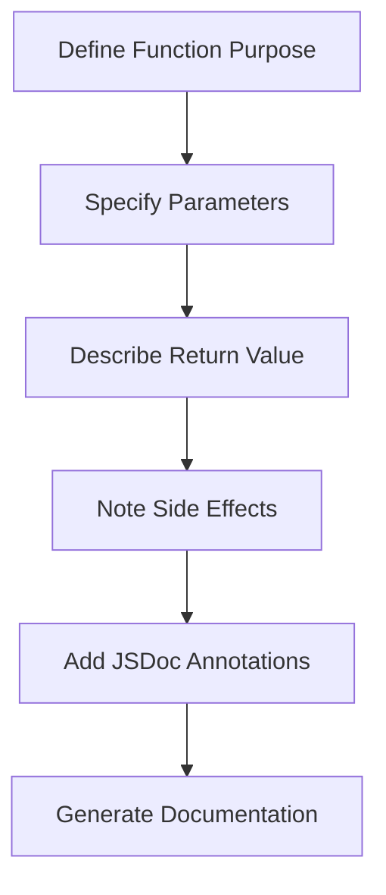

## 14.2 Commenting and Documentation

In this section, we'll delve into the art of commenting and documenting your JavaScript code. As you embark on your programming journey, you'll soon realize that writing code is only part of the process. Making your code understandable to others (and to yourself in the future) is equally important. Let's explore how comments and documentation can help achieve this goal.

### Why Commenting and Documentation Matter

Comments and documentation are essential tools in programming. They serve several purposes:

- **Clarification**: They explain what a piece of code is doing, making it easier for others (and yourself) to understand.
- **Maintenance**: Well-documented code is easier to maintain and update. It helps you remember why you wrote the code in a particular way.
- **Collaboration**: When working in a team, comments and documentation ensure everyone is on the same page.
- **Learning**: For beginners, comments can serve as a learning tool, reinforcing what each part of the code does.

### Types of Comments in JavaScript

JavaScript provides two main types of comments: inline comments and block comments. Let's explore each type and see how they can be used effectively.

#### Inline Comments

Inline comments are used to explain a single line of code. They are created using two forward slashes (`//`). Inline comments are best suited for brief explanations or notes.

```javascript
let total = 0; // Initialize total to zero
total += 5; // Add 5 to total
```

**When to Use Inline Comments:**

- To clarify a complex line of code.
- To note a temporary fix or workaround.
- To indicate a TODO or reminder.

#### Block Comments

Block comments are used to comment out multiple lines of code or to provide more detailed explanations. They start with `/*` and end with `*/`.

```javascript
/*
  This function calculates the sum of two numbers.
  It takes two parameters: num1 and num2.
  It returns the sum of num1 and num2.
*/
function sum(num1, num2) {
  return num1 + num2;
}
```

**When to Use Block Comments:**

- To explain the purpose of a function or module.
- To provide detailed information about a complex algorithm.
- To temporarily disable multiple lines of code during debugging.

### Best Practices for Commenting

To make the most of comments, follow these best practices:

1. **Be Clear and Concise**: Comments should be easy to read and understand. Avoid unnecessary jargon and keep them concise.

2. **Keep Comments Up-to-Date**: As you update your code, ensure your comments reflect those changes. Outdated comments can be misleading.

3. **Avoid Obvious Comments**: Don't comment on code that is self-explanatory. For example, `let x = 10; // Set x to 10` is unnecessary.

4. **Use Comments to Explain Why, Not What**: Focus on explaining why the code exists or why a particular approach was taken, rather than what the code does.

5. **Use Consistent Style**: Adopt a consistent commenting style throughout your codebase to maintain readability.

### Documenting Functions and Modules

Beyond simple comments, documenting functions and modules is crucial for creating maintainable code. Documentation provides a high-level overview of what a function or module does, its parameters, return values, and any side effects.

#### Documenting Functions

When documenting functions, it's helpful to include the following information:

- **Function Name**: Clearly state the name of the function.
- **Purpose**: Describe what the function does.
- **Parameters**: List and describe each parameter, including its type and purpose.
- **Return Value**: Explain what the function returns, if anything.
- **Side Effects**: Note any side effects the function may have.

Here's an example of a well-documented function:

```javascript
/**
 * Calculates the area of a rectangle.
 * 
 * @param {number} width - The width of the rectangle.
 * @param {number} height - The height of the rectangle.
 * @returns {number} The area of the rectangle.
 */
function calculateRectangleArea(width, height) {
  return width * height;
}
```

#### Documenting Modules

Modules, which are collections of functions and variables, should also be documented. A module's documentation should include:

- **Module Name**: The name of the module.
- **Purpose**: A brief description of what the module does.
- **Key Functions**: A list of the module's key functions and their purposes.
- **Dependencies**: Any dependencies the module has on other modules or libraries.

Here's an example of module documentation:

```javascript
/**
 * Math Utilities Module
 * 
 * This module provides utility functions for mathematical operations.
 * 
 * Key Functions:
 * - calculateRectangleArea: Calculates the area of a rectangle.
 * - calculateCircleArea: Calculates the area of a circle.
 * 
 * Dependencies:
 * - None
 */
```

### Tools for Documentation

Several tools can help automate and standardize the documentation process. These tools generate documentation from comments in your code, making it easier to maintain.

#### JSDoc

[JSDoc](https://jsdoc.app/) is a popular tool for generating HTML documentation from JavaScript comments. It uses special annotations to describe the code, which are then converted into a structured documentation format.

Here's an example of a JSDoc comment:

```javascript
/**
 * Adds two numbers together.
 * 
 * @param {number} a - The first number.
 * @param {number} b - The second number.
 * @returns {number} The sum of the two numbers.
 */
function add(a, b) {
  return a + b;
}
```

To generate documentation using JSDoc, you would run a command like `jsdoc yourfile.js`, and it would produce an HTML file with the documentation.

#### Markdown

For projects hosted on platforms like GitHub, using [Markdown](https://www.markdownguide.org/) for documentation is a great choice. Markdown is a lightweight markup language that is easy to write and read. It can be used to create README files, which provide an overview of the project and its usage.

Here's a simple example of a README file in Markdown:

```markdown

This project provides utility functions for mathematical operations.

## Functions

- `calculateRectangleArea(width, height)`: Calculates the area of a rectangle.
- `calculateCircleArea(radius)`: Calculates the area of a circle.

## Usage

To use these functions, include the `math-utils.js` file in your project.
```

### Try It Yourself

Now that we've covered the basics of commenting and documentation, let's put it into practice. Here's a simple JavaScript program with comments. Try modifying it and adding your own comments to reinforce what you've learned.

```javascript
// This program calculates the area of a rectangle and a circle

/**
 * Calculates the area of a rectangle.
 * 
 * @param {number} width - The width of the rectangle.
 * @param {number} height - The height of the rectangle.
 * @returns {number} The area of the rectangle.
 */
function calculateRectangleArea(width, height) {
  return width * height;
}

/**
 * Calculates the area of a circle.
 * 
 * @param {number} radius - The radius of the circle.
 * @returns {number} The area of the circle.
 */
function calculateCircleArea(radius) {
  return Math.PI * radius * radius;
}

// Calculate and log the area of a rectangle with width 5 and height 10
let rectangleArea = calculateRectangleArea(5, 10);
console.log("Rectangle Area:", rectangleArea); // Output: Rectangle Area: 50

// Calculate and log the area of a circle with radius 7
let circleArea = calculateCircleArea(7);
console.log("Circle Area:", circleArea); // Output: Circle Area: 153.93804002589985
```

### Visual Aids

To further enhance your understanding, let's visualize the structure of a well-documented function using a flowchart. This flowchart represents the process of documenting a function, from defining its purpose to specifying its parameters and return value.



**Description:** This flowchart outlines the steps involved in documenting a function, starting with defining its purpose and ending with generating documentation using tools like JSDoc.

### References and Links

For more information on commenting and documentation in JavaScript, check out these resources:

- [MDN Web Docs: Comments](https://developer.mozilla.org/en-US/docs/Web/JavaScript/Guide/Grammar_and_types#comments)
- [JSDoc Official Website](https://jsdoc.app/)
- [Markdown Guide](https://www.markdownguide.org/)

### Engagement and Reinforcement

To reinforce your understanding, consider the following questions:

- Why is it important to keep comments up-to-date?
- How can comments improve collaboration in a team setting?
- What are the benefits of using tools like JSDoc for documentation?

### Exercises

1. **Exercise 1**: Take a simple JavaScript program you've written and add comments to explain each part of the code.

2. **Exercise 2**: Write a function that calculates the circumference of a circle and document it using JSDoc annotations.

3. **Exercise 3**: Create a README file in Markdown for a small project, including a brief description and usage instructions.

### Summary

In this section, we've explored the importance of commenting and documentation in JavaScript. We've learned about the different types of comments, best practices for commenting, and how to document functions and modules effectively. By incorporating these techniques into your coding practice, you'll create code that is not only functional but also easy to understand and maintain.

## Quiz Time!



### What is the primary purpose of comments in code?

- [x] To explain the logic and intention behind the code
- [ ] To increase the file size
- [ ] To make the code run faster
- [ ] To confuse other developers

> **Explanation:** Comments are used to explain the logic and intention behind the code, making it easier to understand and maintain.

### Which type of comment is used for a single line in JavaScript?

- [x] Inline comment
- [ ] Block comment
- [ ] Multiline comment
- [ ] Documentation comment

> **Explanation:** Inline comments are used for single lines of code and are created using two forward slashes (`//`).

### What is the syntax for a block comment in JavaScript?

- [x] `/* comment */`
- [ ] `// comment`
- [ ] `<!-- comment -->`
- [ ] `# comment`

> **Explanation:** Block comments in JavaScript are enclosed between `/*` and `*/`.

### What should be included when documenting a function?

- [x] Function name, purpose, parameters, return value, side effects
- [ ] Only the function name
- [ ] Only the parameters
- [ ] Only the return value

> **Explanation:** A well-documented function should include its name, purpose, parameters, return value, and any side effects.

### Which tool is commonly used to generate HTML documentation from JavaScript comments?

- [x] JSDoc
- [ ] Markdown
- [ ] GitHub
- [ ] Node.js

> **Explanation:** JSDoc is a popular tool for generating HTML documentation from JavaScript comments.

### What is the benefit of using Markdown for documentation?

- [x] It's easy to write and read
- [ ] It requires special software
- [ ] It makes the code run faster
- [ ] It is only used for comments

> **Explanation:** Markdown is a lightweight markup language that is easy to write and read, making it ideal for documentation.

### Why should comments be kept up-to-date?

- [x] To ensure they accurately reflect the current code
- [ ] To make the code run faster
- [ ] To increase file size
- [ ] To confuse other developers

> **Explanation:** Keeping comments up-to-date ensures they accurately reflect the current state of the code, preventing confusion.

### What is a common mistake when writing comments?

- [x] Commenting on self-explanatory code
- [ ] Using consistent style
- [ ] Explaining complex logic
- [ ] Keeping comments concise

> **Explanation:** Commenting on self-explanatory code is unnecessary and can clutter the codebase.

### How can comments improve collaboration?

- [x] By ensuring everyone understands the code
- [ ] By making the code run faster
- [ ] By increasing file size
- [ ] By confusing other developers

> **Explanation:** Comments help ensure everyone on a team understands the code, improving collaboration.

### True or False: Comments should focus on explaining what the code does, not why it exists.

- [ ] True
- [x] False

> **Explanation:** Comments should focus on explaining why the code exists or why a particular approach was taken, rather than just what the code does.


