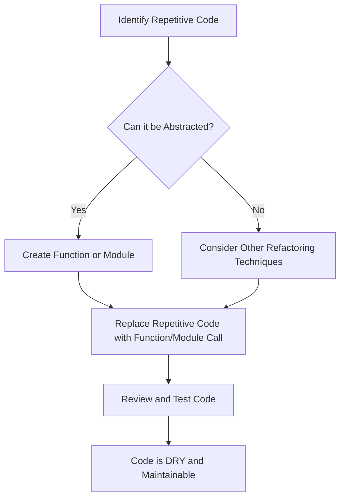

## 14.3 Keeping Code DRY (Don't Repeat Yourself)

In the world of programming, one of the most important principles to embrace is DRY, which stands for "Don't Repeat Yourself." This principle encourages developers to reduce repetition within their code, leading to cleaner, more maintainable, and efficient programs. In this section, we will explore the concept of DRY in detail, focusing on how you can apply it in JavaScript using functions, loops, and modular code design.

### Understanding the DRY Principle

The DRY principle is a fundamental concept in software development. It emphasizes the importance of reducing repetition of software patterns, replacing them with abstractions, or using data normalization to avoid redundancy. The goal is to have a single, unambiguous, authoritative representation of every piece of knowledge within a system.

#### Why is DRY Important?

1. **Maintainability**: When code is repeated, any change or bug fix needs to be made in multiple places. This increases the risk of errors and inconsistencies.
2. **Readability**: DRY code is often more concise and easier to read, making it simpler for others (or yourself) to understand and work with.
3. **Efficiency**: Writing DRY code can lead to more efficient programs, as it often involves identifying and eliminating unnecessary operations.
4. **Scalability**: As projects grow, maintaining DRY code can make it easier to scale and extend functionality.

### Identifying Code Duplication

Before we can eliminate repetition, we need to identify it. Here are some common signs of code duplication:

- **Identical Code Blocks**: The same lines of code appear in multiple places.
- **Similar Logic**: Different parts of the codebase perform similar operations with slight variations.
- **Repeated Patterns**: Similar structures or patterns that could be abstracted into a single function or module.

### Using Functions to Reduce Repetition

Functions are one of the most powerful tools in JavaScript for keeping your code DRY. They allow you to encapsulate a block of code that performs a specific task and reuse it throughout your program.

#### Declaring and Using Functions

Let's start with a simple example. Suppose you have a program that calculates the area of a rectangle in multiple places:

```javascript
// Without DRY principle
let length1 = 5;
let width1 = 10;
let area1 = length1 * width1;

let length2 = 8;
let width2 = 12;
let area2 = length2 * width2;

console.log(area1); // Output: 50
console.log(area2); // Output: 96
```

In this example, the calculation `length * width` is repeated. We can make our code DRY by using a function:

```javascript
// With DRY principle
function calculateArea(length, width) {
    return length * width;
}

let area1 = calculateArea(5, 10);
let area2 = calculateArea(8, 12);

console.log(area1); // Output: 50
console.log(area2); // Output: 96
```

By using the `calculateArea` function, we encapsulate the logic for calculating the area, making our code more maintainable and reusable.

#### Try It Yourself

Try modifying the `calculateArea` function to handle different shapes, such as a triangle or circle. This will help you understand how functions can be adapted for various tasks.

### Leveraging Loops for Repetitive Tasks

Loops are another essential tool for keeping your code DRY. They allow you to execute a block of code multiple times without having to write it out repeatedly.

#### Using Loops to Avoid Repetition

Consider a scenario where you need to print numbers from 1 to 5:

```javascript
// Without DRY principle
console.log(1);
console.log(2);
console.log(3);
console.log(4);
console.log(5);
```

This code is repetitive and not scalable. Instead, we can use a loop:

```javascript
// With DRY principle
for (let i = 1; i <= 5; i++) {
    console.log(i);
}
```

By using a `for` loop, we eliminate repetition and make it easy to adjust the range of numbers if needed.

#### Try It Yourself

Experiment with different types of loops, such as `while` and `do...while`, to perform similar tasks. Try creating a loop that prints only even numbers between 1 and 10.

### Principles of Modular Code Design

Modular code design is a strategy that involves breaking down a program into smaller, manageable, and reusable pieces or modules. This approach aligns with the DRY principle by promoting code reuse and separation of concerns.

#### Benefits of Modular Design

1. **Reusability**: Modules can be reused across different parts of a program or even in different projects.
2. **Maintainability**: Smaller modules are easier to understand, test, and maintain.
3. **Scalability**: Modular design makes it easier to add new features or modify existing ones without affecting the entire system.

#### Creating Modular Code

Let's consider a simple example of a program that manages a list of tasks. Instead of writing all the logic in one place, we can break it down into modules:

```javascript
// taskManager.js
let tasks = [];

function addTask(task) {
    tasks.push(task);
}

function removeTask(task) {
    let index = tasks.indexOf(task);
    if (index > -1) {
        tasks.splice(index, 1);
    }
}

function listTasks() {
    console.log("Tasks:", tasks);
}

module.exports = { addTask, removeTask, listTasks };
```

In this example, we have a module `taskManager.js` that manages tasks. It exports functions for adding, removing, and listing tasks, allowing us to use them in other parts of our program.

#### Try It Yourself

Create a new module for managing a list of contacts. Include functions for adding, removing, and listing contacts. This exercise will help you practice modular design and understand its benefits.

### Visualizing DRY with Diagrams

To better understand how DRY principles can be applied, let's visualize the process of refactoring repetitive code into DRY code using a flowchart.



This flowchart outlines the steps to identify repetitive code, determine if it can be abstracted, and refactor it into a DRY solution.

### References and Further Reading

- [MDN Web Docs: Functions](https://developer.mozilla.org/en-US/docs/Web/JavaScript/Guide/Functions)
- [MDN Web Docs: Loops and Iteration](https://developer.mozilla.org/en-US/docs/Web/JavaScript/Guide/Loops_and_iteration)
- [W3Schools: JavaScript Functions](https://www.w3schools.com/js/js_functions.asp)
- [W3Schools: JavaScript Loops](https://www.w3schools.com/js/js_loop_for.asp)

### Engagement and Reinforcement

To reinforce your understanding of the DRY principle, try refactoring a piece of code you've written recently. Identify areas of repetition and apply the techniques discussed in this section to make your code DRY.

### Summary

In this section, we've explored the DRY principle and its importance in writing clean and maintainable JavaScript code. By using functions, loops, and modular design, we can reduce repetition, improve code readability, and make our programs more efficient and scalable. Remember, keeping your code DRY is not just about reducing lines of code; it's about creating a more robust and adaptable codebase.

## Quiz Time!



### What does DRY stand for in programming?

- [x] Don't Repeat Yourself
- [ ] Do Repeat Yourself
- [ ] Don't Reuse Yourself
- [ ] Do Reuse Yourself

> **Explanation:** DRY stands for "Don't Repeat Yourself," a principle aimed at reducing code duplication.

### Which of the following is a benefit of keeping code DRY?

- [x] Improved maintainability
- [x] Enhanced readability
- [ ] Increased code complexity
- [ ] More lines of code

> **Explanation:** DRY code is more maintainable and readable, reducing complexity and the number of lines.

### What is a common tool used to keep JavaScript code DRY?

- [x] Functions
- [ ] Variables
- [ ] Comments
- [ ] Alerts

> **Explanation:** Functions encapsulate code logic, allowing reuse and reducing repetition.

### How can loops help in keeping code DRY?

- [x] By executing repetitive tasks without writing the same code multiple times
- [ ] By increasing code redundancy
- [ ] By making code less readable
- [ ] By adding more lines of code

> **Explanation:** Loops help execute repetitive tasks efficiently without duplicating code.

### What is a key benefit of modular code design?

- [x] Reusability
- [x] Maintainability
- [ ] Increased code duplication
- [ ] Decreased code readability

> **Explanation:** Modular design enhances reusability and maintainability by breaking code into smaller, manageable pieces.

### What should you do if you identify repetitive code that cannot be abstracted?

- [x] Consider other refactoring techniques
- [ ] Ignore it
- [ ] Add more comments
- [ ] Duplicate it

> **Explanation:** If code cannot be abstracted, consider other refactoring techniques to improve it.

### What is the purpose of the `calculateArea` function in the example?

- [x] To encapsulate the logic for calculating the area of a rectangle
- [ ] To print numbers from 1 to 5
- [ ] To manage a list of tasks
- [ ] To create a new module

> **Explanation:** The `calculateArea` function encapsulates the logic for calculating a rectangle's area.

### Which of the following is NOT a sign of code duplication?

- [ ] Identical code blocks
- [ ] Similar logic
- [ ] Repeated patterns
- [x] Unique algorithms

> **Explanation:** Unique algorithms do not indicate code duplication, as they perform distinct tasks.

### What is the main goal of the DRY principle?

- [x] To have a single, authoritative representation of every piece of knowledge
- [ ] To write as much code as possible
- [ ] To increase code redundancy
- [ ] To make code less readable

> **Explanation:** The DRY principle aims to have a single, authoritative representation of each piece of knowledge.

### True or False: DRY code is often more concise and easier to read.

- [x] True
- [ ] False

> **Explanation:** DRY code is more concise and easier to read, making it simpler to understand and maintain.


