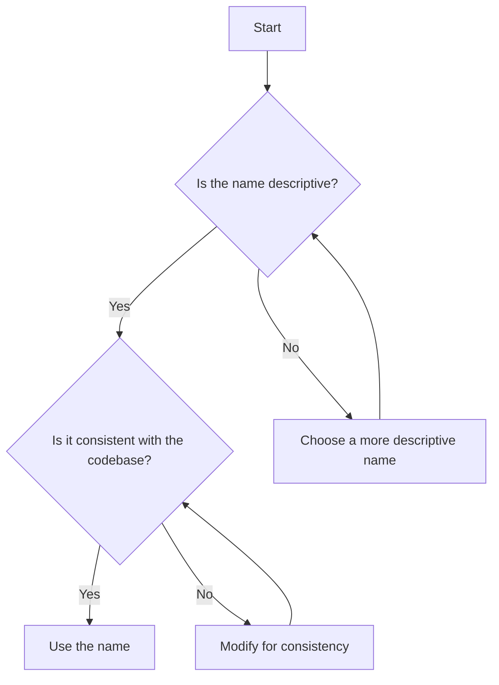

## 14.4 Naming Conventions

In programming, naming conventions are more than just a stylistic choice—they are a fundamental aspect of writing clean, readable, and maintainable code. In this section, we will delve into the importance of naming conventions in JavaScript, explore best practices for choosing meaningful and descriptive names, and demonstrate how consistency can greatly enhance your codebase.

### Why Naming Conventions Matter

Naming conventions play a crucial role in programming for several reasons:

1. **Readability**: Clear and descriptive names make your code easier to read and understand, not only for you but also for others who may work with your code in the future.
2. **Maintainability**: Consistent naming conventions help maintain the code over time, making it easier to update and debug.
3. **Collaboration**: When working in teams, a standardized naming convention ensures everyone is on the same page, reducing confusion and errors.
4. **Self-Documentation**: Well-named variables, functions, and classes can serve as documentation, explaining their purpose without needing additional comments.

### Best Practices for Naming Conventions

Let's explore some best practices for naming conventions in JavaScript:

#### 1. Use Descriptive and Meaningful Names

**Explain**: Choose names that clearly describe the purpose or function of the variable, function, or class. Avoid vague or generic names that do not convey any meaningful information.

**Example**:

```javascript
// Bad naming
let x = 10;
let y = 20;

// Good naming
let width = 10;
let height = 20;
```

**Demonstrate**: In the example above, `width` and `height` are more descriptive than `x` and `y`, making it clear what the variables represent.

#### 2. Avoid Abbreviations and Single-Letter Names

**Explain**: While abbreviations and single-letter names may save time when typing, they often lead to confusion and misunderstandings. It's better to use full words that clearly convey the meaning.

**Example**:

```javascript
// Bad naming
let usrNm = "JohnDoe";
let addr = "123 Main St";

// Good naming
let userName = "JohnDoe";
let address = "123 Main St";
```

**Demonstrate**: In this example, `userName` and `address` are more understandable than `usrNm` and `addr`.

#### 3. Be Consistent with Naming Conventions

**Explain**: Consistency is key in maintaining a clean codebase. Stick to a single naming convention throughout your code. Common conventions in JavaScript include camelCase, PascalCase, and snake_case.

**Example**:

```javascript
// Consistent camelCase naming
let firstName = "Jane";
let lastName = "Doe";

// Consistent PascalCase naming for classes
class UserAccount {
  constructor(name) {
    this.name = name;
  }
}
```

**Demonstrate**: In the example, camelCase is used for variables, and PascalCase is used for class names, maintaining consistency.

#### 4. Use CamelCase for Variables and Functions

**Explain**: CamelCase is a common convention in JavaScript for naming variables and functions. It starts with a lowercase letter, and each subsequent word starts with an uppercase letter.

**Example**:

```javascript
// Variable and function naming in camelCase
let userAge = 25;

function calculateTotalPrice(price, tax) {
  return price + tax;
}
```

**Demonstrate**: `userAge` and `calculateTotalPrice` follow the camelCase convention, making them easy to read.

#### 5. Use PascalCase for Classes and Constructors

**Explain**: PascalCase is typically used for class names and constructor functions in JavaScript. It starts with an uppercase letter, and each subsequent word also starts with an uppercase letter.

**Example**:

```javascript
// Class and constructor naming in PascalCase
class ShoppingCart {
  constructor() {
    this.items = [];
  }
}

let myCart = new ShoppingCart();
```

**Demonstrate**: `ShoppingCart` follows the PascalCase convention, indicating it is a class.

#### 6. Use Descriptive Function Names

**Explain**: Function names should clearly describe what the function does. This helps others understand the purpose of the function without needing to read the entire implementation.

**Example**:

```javascript
// Bad function naming
function doSomething() {
  // Function implementation
}

// Good function naming
function calculateDiscount(price, discountRate) {
  return price * (1 - discountRate);
}
```

**Demonstrate**: `calculateDiscount` is a descriptive name that indicates the function's purpose, unlike `doSomething`.

#### 7. Prefix Boolean Variables with "is", "has", or "can"

**Explain**: When naming Boolean variables, use prefixes like "is", "has", or "can" to indicate that the variable represents a true/false value.

**Example**:

```javascript
// Boolean variable naming
let isUserLoggedIn = true;
let hasAdminPrivileges = false;
let canEditProfile = true;
```

**Demonstrate**: The prefixes make it clear that these variables hold Boolean values.

#### 8. Use Nouns for Variables and Verbs for Functions

**Explain**: Variables often represent objects or data, so use nouns for their names. Functions perform actions, so use verbs to describe what they do.

**Example**:

```javascript
// Noun for variable, verb for function
let userProfile = {
  name: "Alice",
  age: 30
};

function updateProfile(profile, newName, newAge) {
  profile.name = newName;
  profile.age = newAge;
}
```

**Demonstrate**: `userProfile` is a noun, while `updateProfile` is a verb, clearly indicating their roles.

#### 9. Avoid Using Reserved Words

**Explain**: JavaScript has a set of reserved words that cannot be used as identifiers. Avoid using these words as variable or function names.

**Example**:

```javascript
// Reserved words
// let function = "test"; // This will cause an error

// Correct naming
let myFunction = "test";
```

**Demonstrate**: `myFunction` is a valid name, while `function` is a reserved word and cannot be used.

#### 10. Use Consistent Naming for Similar Concepts

**Explain**: When naming similar concepts, use consistent naming patterns to make the code more intuitive.

**Example**:

```javascript
// Consistent naming for similar concepts
let userFirstName = "John";
let userLastName = "Doe";
let userEmailAddress = "john.doe@example.com";
```

**Demonstrate**: The prefix `user` is consistently used for related variables, indicating their association.

### Try It Yourself

Now that we've covered the best practices for naming conventions, let's put them into practice. Try modifying the following code snippet to improve its naming conventions:

```javascript
// Original code
let a = 5;
let b = 10;

function c(x, y) {
  return x + y;
}

let d = c(a, b);
console.log(d);
```

**Challenge**: Rename the variables and function to make the code more readable and descriptive.

### Visual Aids

To further illustrate the importance of naming conventions, let's look at a flowchart that represents the decision-making process when choosing a name:



**Description**: This flowchart guides you through the process of selecting a name, ensuring it is both descriptive and consistent.

### References and Links

For further reading on JavaScript naming conventions and best practices, consider exploring the following resources:

- [MDN Web Docs: JavaScript Guide](https://developer.mozilla.org/en-US/docs/Web/JavaScript/Guide)
- [W3Schools: JavaScript Naming Conventions](https://www.w3schools.com/js/js_conventions.asp)
- [Airbnb JavaScript Style Guide](https://github.com/airbnb/javascript)

### Engagement and Reinforcement

To reinforce what you've learned, consider the following questions:

- Why is it important to use descriptive names in your code?
- How can consistent naming conventions improve collaboration in a team?
- What are some common naming conventions used in JavaScript?

### Exercises

1. **Exercise 1**: Review a piece of your own code and identify any variables or functions with unclear names. Rename them to improve clarity.
2. **Exercise 2**: Write a small JavaScript program that calculates the area of a rectangle. Use descriptive names for all variables and functions.
3. **Exercise 3**: Pair up with a friend and review each other's code. Provide feedback on naming conventions and suggest improvements.

### Key Takeaways

- Naming conventions are essential for writing clean, readable, and maintainable code.
- Use descriptive and meaningful names to convey the purpose of variables and functions.
- Avoid abbreviations and single-letter names to prevent confusion.
- Maintain consistency in naming conventions throughout your codebase.
- Use camelCase for variables and functions, and PascalCase for classes and constructors.

By following these best practices, you'll be well on your way to writing code that is not only functional but also easy to read and maintain.

## Quiz Time!



### Why is it important to use descriptive names in your code?

- [x] To make the code more readable and understandable
- [ ] To make the code run faster
- [ ] To reduce the file size
- [ ] To make the code look more complex

> **Explanation:** Descriptive names improve readability and understanding, making it easier for others to work with your code.

### What is a common naming convention for variables and functions in JavaScript?

- [x] camelCase
- [ ] snake_case
- [ ] UPPERCASE
- [ ] kebab-case

> **Explanation:** camelCase is commonly used for variables and functions in JavaScript, starting with a lowercase letter and capitalizing subsequent words.

### Which naming convention is typically used for class names in JavaScript?

- [x] PascalCase
- [ ] camelCase
- [ ] snake_case
- [ ] lowercase

> **Explanation:** PascalCase is used for class names, starting with an uppercase letter and capitalizing each subsequent word.

### What prefix is recommended for Boolean variables?

- [x] is, has, or can
- [ ] get, set, or fetch
- [ ] var, let, or const
- [ ] add, remove, or delete

> **Explanation:** Prefixes like "is", "has", or "can" indicate that the variable holds a Boolean value.

### What should you avoid when naming variables?

- [x] Abbreviations and single-letter names
- [ ] Descriptive and meaningful names
- [ ] Consistent naming patterns
- [ ] Using camelCase for variables

> **Explanation:** Abbreviations and single-letter names can lead to confusion and misunderstandings.

### Why is consistency important in naming conventions?

- [x] It helps maintain the code and reduces confusion
- [ ] It makes the code run faster
- [ ] It reduces the file size
- [ ] It makes the code look more complex

> **Explanation:** Consistency helps maintain the code and reduces confusion, making it easier to update and debug.

### What is a reserved word in JavaScript?

- [x] A word that cannot be used as an identifier
- [ ] A word that is commonly used in code
- [ ] A word that is used for comments
- [ ] A word that is used for styling

> **Explanation:** Reserved words have special meaning in JavaScript and cannot be used as identifiers.

### How can you make your code self-documenting?

- [x] By using well-named variables, functions, and classes
- [ ] By adding more comments
- [ ] By using single-letter variable names
- [ ] By using abbreviations

> **Explanation:** Well-named variables, functions, and classes can serve as documentation, explaining their purpose without needing additional comments.

### What is the benefit of using nouns for variables and verbs for functions?

- [x] It clearly indicates their roles in the code
- [ ] It makes the code run faster
- [ ] It reduces the file size
- [ ] It makes the code look more complex

> **Explanation:** Using nouns for variables and verbs for functions clearly indicates their roles, improving readability.

### True or False: Using descriptive names can help reduce the need for comments in your code.

- [x] True
- [ ] False

> **Explanation:** Descriptive names can serve as documentation, reducing the need for additional comments.


