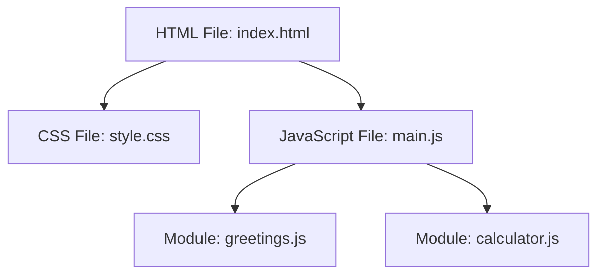

## 14.5 Organizing Code Files

As we delve deeper into programming, one of the essential skills to develop is organizing your code effectively. This not only makes your code more readable and maintainable but also helps you collaborate with others more efficiently. In this section, we will explore how to structure your JavaScript code into multiple files, understand the separation of concerns, and introduce ES6 modules to keep your codebase clean and organized.

### Understanding Separation of Concerns

Separation of concerns is a design principle for separating a computer program into distinct sections, such that each section addresses a separate concern. This principle is crucial in web development, where HTML, CSS, and JavaScript each play different roles.

#### HTML, CSS, and JavaScript: The Trio of Web Development

- **HTML (HyperText Markup Language)**: This is the backbone of any web page. It structures the content and defines elements like headings, paragraphs, links, and more.
- **CSS (Cascading Style Sheets)**: CSS is responsible for the presentation of the web page. It styles the HTML elements, controlling layout, colors, fonts, and more.
- **JavaScript**: JavaScript adds interactivity and dynamic behavior to web pages. It can manipulate HTML and CSS, respond to user actions, and communicate with servers.

By separating these three technologies into their respective files, we adhere to the separation of concerns, making our code easier to manage and understand.

#### Structuring Your Project

Let's consider a simple example of a web project. Here's how you might organize your files:

```
project-folder/
│
├── index.html
├── styles/
│   └── style.css
└── scripts/
    └── main.js
```

- **`index.html`**: This file contains the HTML structure of your web page.
- **`styles/style.css`**: This file contains all the CSS styles for your web page.
- **`scripts/main.js`**: This file contains the JavaScript code that adds interactivity to your web page.

By organizing your files in this manner, you can easily manage and update each aspect of your web page without affecting the others.

### Linking HTML, CSS, and JavaScript

To make these files work together, you need to link them in your HTML file. Here's how you can do it:

```html
<!DOCTYPE html>
<html lang="en">
<head>
    <meta charset="UTF-8">
    <meta name="viewport" content="width=device-width, initial-scale=1.0">
    <title>My Web Page</title>
    <link rel="stylesheet" href="styles/style.css">
</head>
<body>
    <h1>Welcome to My Web Page</h1>
    <button id="myButton">Click Me!</button>

    <script src="scripts/main.js"></script>
</body>
</html>
```

- **CSS Link**: The `<link>` tag in the `<head>` section links the CSS file to the HTML, allowing the styles to be applied.
- **JavaScript Script**: The `<script>` tag at the bottom of the `<body>` section links the JavaScript file. Placing it at the bottom ensures that the HTML elements are fully loaded before the script runs.

### JavaScript Code Example

Let's add some interactivity to our web page using JavaScript. In `scripts/main.js`, we can write:

```javascript
// Select the button element
const button = document.getElementById('myButton');

// Add an event listener to the button
button.addEventListener('click', () => {
    alert('Button was clicked!');
});
```

This simple script selects the button element and adds a click event listener to it. When the button is clicked, an alert box will appear with the message "Button was clicked!".

### Introducing ES6 Modules

As your projects grow, you may find that a single JavaScript file becomes too large and difficult to manage. This is where ES6 modules come into play. Modules allow you to break your code into smaller, reusable pieces, each with its own file.

#### Basic Concepts of ES6 Modules

- **Modules**: A module is a file containing JavaScript code. By default, variables and functions declared in a module are scoped to that module.
- **Export**: You can make variables, functions, or classes available to other modules using the `export` keyword.
- **Import**: You can use the `import` keyword to bring in variables, functions, or classes from other modules.

#### Creating and Using Modules

Let's create a simple module. First, create a file named `greetings.js`:

```javascript
// greetings.js

// Export a function
export function greet(name) {
    return `Hello, ${name}!`;
}
```

In this file, we define a function `greet` and export it using the `export` keyword.

Now, let's use this module in our `main.js` file:

```javascript
// main.js

// Import the greet function from greetings.js
import { greet } from './greetings.js';

// Use the imported function
const message = greet('World');
console.log(message); // Output: Hello, World!
```

Here, we import the `greet` function from `greetings.js` using the `import` keyword and use it to log a greeting message to the console.

#### Default Exports

In addition to named exports, modules can have a default export. A default export is a value that is exported by default when no specific export is requested.

Here's how you can create a default export:

```javascript
// math.js

// Default export a function
export default function add(a, b) {
    return a + b;
}
```

And here's how you can import a default export:

```javascript
// main.js

// Import the default export from math.js
import add from './math.js';

// Use the imported function
const sum = add(2, 3);
console.log(sum); // Output: 5
```

Notice that when importing a default export, you don't use curly braces `{}`.

### Benefits of Using Modules

Using modules offers several benefits:

- **Maintainability**: Breaking code into smaller modules makes it easier to read, understand, and maintain.
- **Reusability**: Modules can be reused across different projects or parts of a project.
- **Encapsulation**: Modules encapsulate code, reducing the risk of variable name conflicts and unintended interactions.
- **Collaboration**: Modules make it easier for multiple developers to work on different parts of a project simultaneously.

### Try It Yourself

Now that we've covered the basics of organizing code files and using modules, let's try a small exercise:

1. Create a new JavaScript file named `calculator.js`.
2. In `calculator.js`, define and export two functions: `add` and `subtract`.
3. In `main.js`, import these functions and use them to perform some calculations.
4. Log the results to the console.

Here's a possible solution:

```javascript
// calculator.js

// Export add and subtract functions
export function add(a, b) {
    return a + b;
}

export function subtract(a, b) {
    return a - b;
}
```

```javascript
// main.js

// Import add and subtract functions from calculator.js
import { add, subtract } from './calculator.js';

// Perform calculations
const sum = add(5, 3);
const difference = subtract(5, 3);

// Log results
console.log(`Sum: ${sum}`); // Output: Sum: 8
console.log(`Difference: ${difference}`); // Output: Difference: 2
```

### Visualizing Code Organization

To better understand how files and modules interact, let's visualize the structure using a Mermaid.js diagram:



This diagram shows how the `index.html` file links to `style.css` and `main.js`, and how `main.js` imports modules from `greetings.js` and `calculator.js`.

### Summary

In this section, we've explored the importance of organizing code files for better maintainability and readability. We've learned about the separation of concerns among HTML, CSS, and JavaScript, and how to link these files together. Additionally, we've introduced ES6 modules, which allow us to break our code into smaller, reusable pieces. By applying these principles, you can create clean, organized, and efficient codebases.

### Further Reading

For more information on organizing code files and using modules, check out these resources:

- [MDN Web Docs: JavaScript modules](https://developer.mozilla.org/en-US/docs/Web/JavaScript/Guide/Modules)
- [W3Schools: JavaScript Modules](https://www.w3schools.com/js/js_modules.asp)

## Quiz Time!



### What is the main purpose of separating HTML, CSS, and JavaScript into different files?

- [x] To adhere to the separation of concerns principle
- [ ] To make the website load faster
- [ ] To reduce the number of files in a project
- [ ] To ensure that JavaScript runs before HTML loads

> **Explanation:** Separating HTML, CSS, and JavaScript into different files adheres to the separation of concerns principle, making the code more manageable and maintainable.

### Which tag is used to link a CSS file in an HTML document?

- [x] `<link>`
- [ ] `<style>`
- [ ] `<script>`
- [ ] `<css>`

> **Explanation:** The `<link>` tag is used in the `<head>` section of an HTML document to link a CSS file.

### Where should you place the `<script>` tag in an HTML document for optimal performance?

- [x] At the end of the `<body>` section
- [ ] In the `<head>` section
- [ ] At the beginning of the `<body>` section
- [ ] In the `<footer>` section

> **Explanation:** Placing the `<script>` tag at the end of the `<body>` section ensures that the HTML elements are fully loaded before the script runs.

### What keyword is used to export a function from a module in ES6?

- [x] `export`
- [ ] `import`
- [ ] `module`
- [ ] `function`

> **Explanation:** The `export` keyword is used to make a function, variable, or class available to other modules.

### How do you import a named export from a module?

- [x] Using curly braces `{}` with the `import` keyword
- [ ] Using parentheses `()` with the `import` keyword
- [ ] Using square brackets `[]` with the `import` keyword
- [ ] Using the `require` function

> **Explanation:** Named exports are imported using curly braces `{}` with the `import` keyword.

### What is a default export?

- [x] A value exported by default when no specific export is requested
- [ ] A function that is always exported
- [ ] A variable that cannot be changed
- [ ] An export that cannot be imported

> **Explanation:** A default export is a value that is exported by default when no specific export is requested.

### How do you import a default export?

- [x] Without using curly braces
- [ ] Using curly braces
- [ ] Using parentheses
- [ ] Using square brackets

> **Explanation:** Default exports are imported without using curly braces.

### What is one benefit of using modules?

- [x] Improved maintainability
- [ ] Faster execution
- [ ] Reduced file size
- [ ] Increased complexity

> **Explanation:** Modules improve maintainability by breaking code into smaller, more manageable pieces.

### What is the purpose of the `addEventListener` method in JavaScript?

- [x] To attach an event handler to an element
- [ ] To remove an event handler from an element
- [ ] To create a new HTML element
- [ ] To change the style of an element

> **Explanation:** The `addEventListener` method is used to attach an event handler to an element, allowing it to respond to user actions.

### True or False: ES6 modules can only export functions.

- [ ] True
- [x] False

> **Explanation:** ES6 modules can export functions, variables, and classes, not just functions.


