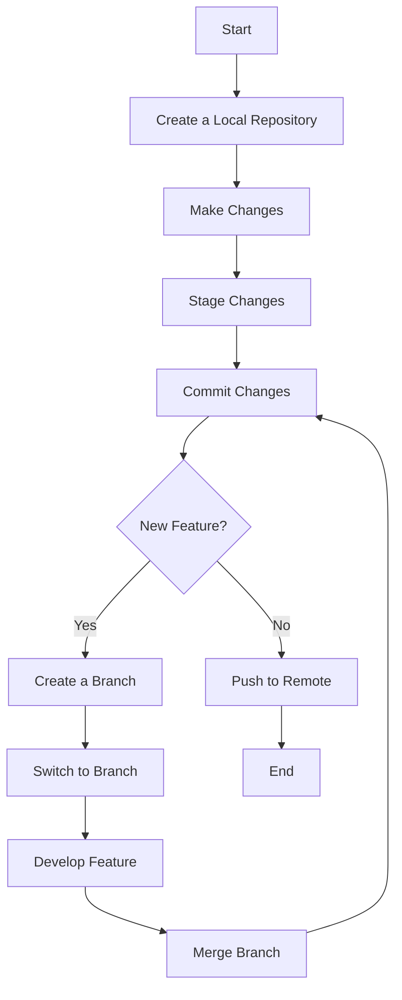

## 14.6 Introduction to Version Control (Optional)

As we dive deeper into the world of programming, it's crucial to understand how to manage and track changes in your code efficiently. This is where version control systems come into play. In this section, we will explore the benefits of using version control systems like Git, learn some basic commands, and discuss how to host repositories on platforms like GitHub.

### What is Version Control?

Version control is a system that records changes to a file or set of files over time so that you can recall specific versions later. It's like a time machine for your code, allowing you to travel back and forth between different states of your project. This is especially useful in collaborative environments where multiple developers are working on the same codebase.

### Benefits of Using Version Control

Let's explore some of the key benefits of using version control systems:

1. **Collaboration**: Version control systems allow multiple developers to work on the same project simultaneously without overwriting each other's changes. This is achieved through branching and merging, which we'll discuss later.

2. **Backup and Restore**: With version control, every change you make is saved. If something goes wrong, you can easily revert to a previous version of your code.

3. **Track Changes**: You can see who made what changes and when. This is particularly useful for tracking down bugs or understanding the history of a project.

4. **Experiment Freely**: You can create branches to experiment with new features or ideas without affecting the main codebase. If your experiment fails, you can simply delete the branch.

5. **Code Review and Quality Control**: Version control systems facilitate code reviews, allowing team members to review each other's code before it is merged into the main branch.

### Introduction to Git

Git is one of the most popular version control systems used by developers today. It is a distributed version control system, meaning that every developer has a complete copy of the project history on their local machine. This allows for fast operations and offline work.

#### Basic Git Commands

Let's go through some basic Git commands that will help you get started with version control.

1. **`git init`**: This command initializes a new Git repository. It creates a `.git` directory in your project, which contains all the metadata and history of your project.

    ```bash
    git init
    ```

2. **`git add`**: This command adds changes in your working directory to the staging area. The staging area is like a clipboard where you prepare changes before committing them.

    ```bash
    git add <filename>
    ```

    You can also add all changes in the current directory with:

    ```bash
    git add .
    ```

3. **`git commit`**: This command records the changes in the staging area to the repository. Each commit has a unique ID and a message describing the changes.

    ```bash
    git commit -m "Your commit message"
    ```

4. **`git push`**: This command uploads your local repository changes to a remote repository, such as GitHub.

    ```bash
    git push origin main
    ```

    Here, `origin` is the default name for the remote repository, and `main` is the branch you're pushing to.

### Hosting Repositories on GitHub

GitHub is a platform that hosts Git repositories and provides tools for collaboration, code review, and project management. Let's discuss how you can host your repositories on GitHub.

#### Creating a GitHub Account

To get started with GitHub, you'll need to create an account. Visit [GitHub](https://github.com/) and sign up for a free account. Once you've signed up, you can create repositories and collaborate with other developers.

#### Creating a Repository on GitHub

1. **Log in to GitHub** and click on the "New" button to create a new repository.

2. **Fill in the repository details**: Give your repository a name, add a description, and choose whether it should be public or private.

3. **Initialize the repository**: You can choose to initialize the repository with a README file, which is a markdown file that describes your project.

4. **Create the repository**: Click on the "Create repository" button to create your repository.

#### Connecting Your Local Repository to GitHub

Once you've created a repository on GitHub, you can connect your local repository to it. Here's how:

1. **Open your terminal** and navigate to your local repository.

2. **Add the remote repository**: Use the `git remote add` command to add your GitHub repository as a remote.

    ```bash
    git remote add origin https://github.com/your-username/your-repository.git
    ```

3. **Push your changes**: Use the `git push` command to push your local changes to the GitHub repository.

    ```bash
    git push -u origin main
    ```

    The `-u` flag sets the upstream branch, so you can use `git push` without specifying the remote and branch in the future.

### Understanding Branching and Merging

Branching and merging are powerful features of Git that allow you to work on different parts of a project simultaneously.

#### Branching

A branch in Git is like a separate line of development. You can create a branch to work on a new feature or fix a bug without affecting the main codebase.

- **Create a new branch**: Use the `git branch` command to create a new branch.

    ```bash
    git branch new-feature
    ```

- **Switch to the new branch**: Use the `git checkout` command to switch to the new branch.

    ```bash
    git checkout new-feature
    ```

    Alternatively, you can use the `git checkout -b` command to create and switch to a new branch in one step.

    ```bash
    git checkout -b new-feature
    ```

#### Merging

Once you've completed your work on a branch, you can merge it back into the main branch.

- **Switch to the main branch**: Use the `git checkout` command to switch to the main branch.

    ```bash
    git checkout main
    ```

- **Merge the branch**: Use the `git merge` command to merge the changes from the new branch into the main branch.

    ```bash
    git merge new-feature
    ```

### Visualizing Git Workflow

To better understand how Git works, let's visualize a typical Git workflow using a flowchart.



**Description**: This flowchart illustrates a typical Git workflow, starting from creating a local repository, making changes, staging and committing those changes, branching for new features, and finally pushing to a remote repository.

### Try It Yourself

Now that we've covered the basics of Git and GitHub, it's time to try it yourself. Here's a small challenge:

1. **Create a new local repository** and initialize it with `git init`.

2. **Create a new file** and add some content to it.

3. **Stage and commit** the changes with `git add` and `git commit`.

4. **Create a new branch** and make some changes to the file.

5. **Merge the branch** back into the main branch.

6. **Push your changes** to a new repository on GitHub.

### Further Reading and Resources

To deepen your understanding of Git and GitHub, consider exploring the following resources:

- [Git Documentation](https://git-scm.com/doc)
- [GitHub Guides](https://guides.github.com/)
- [Pro Git Book](https://git-scm.com/book/en/v2)

### Summary

In this section, we've introduced the concept of version control and explored the benefits of using systems like Git. We've covered basic Git commands, discussed how to host repositories on GitHub, and explained the concepts of branching and merging. By mastering these tools, you'll be well-equipped to manage your code efficiently and collaborate with other developers.

## Quiz Time!



### What is the primary purpose of version control?

- [x] To track changes in code over time
- [ ] To compile code into executable files
- [ ] To design user interfaces
- [ ] To manage databases

> **Explanation:** Version control systems are used to track changes in code over time, allowing developers to revert to previous versions if needed.

### Which command initializes a new Git repository?

- [x] `git init`
- [ ] `git start`
- [ ] `git create`
- [ ] `git new`

> **Explanation:** The `git init` command initializes a new Git repository in the current directory.

### How do you add changes to the staging area in Git?

- [x] `git add <filename>`
- [ ] `git stage <filename>`
- [ ] `git commit <filename>`
- [ ] `git push <filename>`

> **Explanation:** The `git add <filename>` command adds changes to the staging area, preparing them for a commit.

### What is the purpose of the `git commit` command?

- [x] To record changes in the repository
- [ ] To upload changes to a remote repository
- [ ] To delete files from the repository
- [ ] To initialize a new repository

> **Explanation:** The `git commit` command records changes in the repository with a unique ID and message.

### Which platform is commonly used to host Git repositories?

- [x] GitHub
- [ ] Docker
- [ ] Jenkins
- [ ] Kubernetes

> **Explanation:** GitHub is a popular platform for hosting Git repositories and facilitating collaboration.

### How do you create a new branch in Git?

- [x] `git branch new-feature`
- [ ] `git create new-feature`
- [ ] `git switch new-feature`
- [ ] `git init new-feature`

> **Explanation:** The `git branch new-feature` command creates a new branch called `new-feature`.

### What command is used to switch between branches in Git?

- [x] `git checkout <branch-name>`
- [ ] `git switch <branch-name>`
- [ ] `git change <branch-name>`
- [ ] `git move <branch-name>`

> **Explanation:** The `git checkout <branch-name>` command is used to switch between branches in Git.

### How do you merge changes from one branch into another?

- [x] `git merge <branch-name>`
- [ ] `git add <branch-name>`
- [ ] `git commit <branch-name>`
- [ ] `git push <branch-name>`

> **Explanation:** The `git merge <branch-name>` command merges changes from the specified branch into the current branch.

### What is the significance of the `-u` flag in the `git push` command?

- [x] It sets the upstream branch for future pushes
- [ ] It uploads all branches to the remote repository
- [ ] It deletes the remote branch
- [ ] It initializes a new repository

> **Explanation:** The `-u` flag in the `git push` command sets the upstream branch, allowing for future pushes without specifying the remote and branch.

### True or False: Git is a centralized version control system.

- [ ] True
- [x] False

> **Explanation:** Git is a distributed version control system, meaning each developer has a complete copy of the project history on their local machine.


