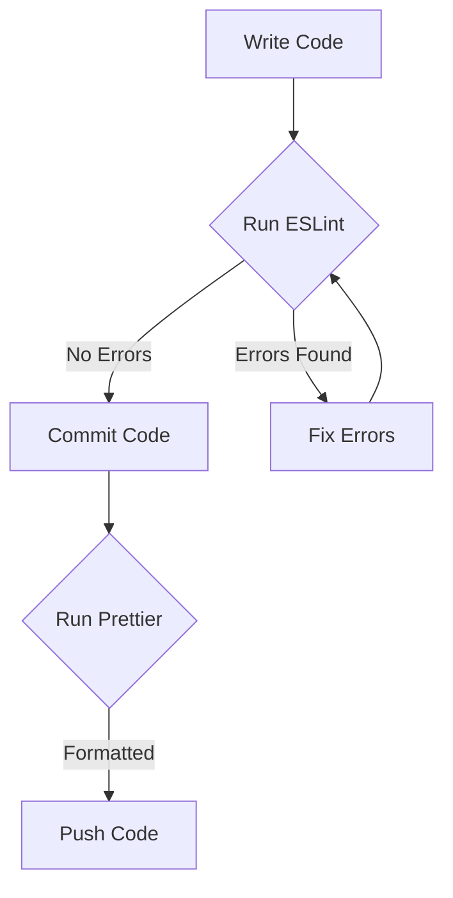

## 14.7 Code Linting and Formatting Tools

As we dive deeper into the world of programming, maintaining clean and consistent code becomes increasingly important. Code that is easy to read and understand not only helps you as a developer but also aids others who might work on your code in the future. In this section, we'll explore two essential tools for achieving this: **linters** and **code formatters**. Specifically, we'll focus on **ESLint** and **Prettier**, two popular tools in the JavaScript ecosystem.

### What is Code Linting?

Code linting is the process of analyzing source code to flag programming errors, bugs, stylistic errors, and suspicious constructs. A linter is a tool that performs this analysis. By using a linter, you can catch potential issues early in the development process, ensuring that your code adheres to certain standards and best practices.

#### Introducing ESLint

**ESLint** is a widely-used linter for JavaScript. It helps developers maintain consistent coding styles and catch errors before they become problems. ESLint is highly configurable, allowing you to define your own rules or use predefined sets of rules.

#### Why Use ESLint?

- **Error Detection**: ESLint can catch syntax errors, potential bugs, and other issues early.
- **Code Consistency**: By enforcing a consistent coding style, ESLint makes your code easier to read and maintain.
- **Customizable**: You can tailor ESLint to fit your specific coding standards and preferences.

### Setting Up ESLint

Let's walk through setting up ESLint for a JavaScript project.

#### Step 1: Install ESLint

First, you'll need Node.js and npm (Node Package Manager) installed on your machine. Once you have these, you can install ESLint globally or locally to your project.

To install ESLint locally, navigate to your project directory in the terminal and run:

```bash
npm init -y
npm install eslint --save-dev
```

#### Step 2: Initialize ESLint

After installation, you need to initialize ESLint in your project. This will create a configuration file where you can define your linting rules.

```bash
npx eslint --init
```

You'll be prompted with a series of questions to set up ESLint according to your preferences. You can choose a popular style guide, such as Airbnb or Google, or define your own rules.

#### Step 3: Create an ESLint Configuration File

The initialization process will create a configuration file, usually named `.eslintrc.json`. Here's a simple example of what it might look like:

```json
{
  "env": {
    "browser": true,
    "es2021": true
  },
  "extends": "eslint:recommended",
  "parserOptions": {
    "ecmaVersion": 12,
    "sourceType": "module"
  },
  "rules": {
    "indent": ["error", 2],
    "quotes": ["error", "double"],
    "semi": ["error", "always"]
  }
}
```

- **env**: Specifies the environments your script is designed to run in. Each environment brings with it a certain set of predefined global variables.
- **extends**: Allows you to use a set of predefined rules.
- **parserOptions**: Specifies the JavaScript language options you want to support.
- **rules**: Defines the rules you want to enforce or disable.

#### Step 4: Run ESLint

To lint your files, you can run ESLint from the command line:

```bash
npx eslint yourfile.js
```

This command will analyze `yourfile.js` and report any issues based on the rules you've set.

### Automatic Code Formatting with Prettier

While ESLint helps with code quality and consistency, **Prettier** is a tool focused on formatting your code. It automatically formats your code to a consistent style, making it easier to read and maintain.

#### Why Use Prettier?

- **Consistency**: Prettier enforces a consistent style across your entire codebase.
- **Time-Saving**: By automating code formatting, Prettier saves you time and effort.
- **Integration**: Prettier can be easily integrated with various editors and tools.

### Setting Up Prettier

Let's set up Prettier in your project.

#### Step 1: Install Prettier

Navigate to your project directory and run:

```bash
npm install --save-dev prettier
```

#### Step 2: Create a Prettier Configuration File

You can create a `.prettierrc` file to define your formatting preferences. Here's an example:

```json
{
  "printWidth": 80,
  "tabWidth": 2,
  "useTabs": false,
  "semi": true,
  "singleQuote": true,
  "trailingComma": "es5",
  "bracketSpacing": true
}
```

- **printWidth**: Specifies the line length that the printer will wrap on.
- **tabWidth**: Specifies the number of spaces per indentation-level.
- **useTabs**: Indents lines with tabs instead of spaces.
- **semi**: Adds a semicolon at the end of every statement.
- **singleQuote**: Uses single quotes instead of double quotes.
- **trailingComma**: Controls the printing of trailing commas wherever possible.
- **bracketSpacing**: Controls the printing of spaces between brackets in object literals.

#### Step 3: Format Your Code

To format your code with Prettier, you can run:

```bash
npx prettier --write yourfile.js
```

This command will format `yourfile.js` according to the rules specified in your `.prettierrc` file.

### Integrating ESLint and Prettier

While ESLint and Prettier serve different purposes, they can be used together to ensure both code quality and consistent formatting.

#### Step 1: Install ESLint-Prettier Plugin

To integrate ESLint with Prettier, you'll need to install a few additional packages:

```bash
npm install --save-dev eslint-config-prettier eslint-plugin-prettier
```

- **eslint-config-prettier**: Disables ESLint rules that might conflict with Prettier.
- **eslint-plugin-prettier**: Runs Prettier as an ESLint rule.

#### Step 2: Update ESLint Configuration

Modify your `.eslintrc.json` to include Prettier:

```json
{
  "extends": ["eslint:recommended", "plugin:prettier/recommended"],
  "plugins": ["prettier"],
  "rules": {
    "prettier/prettier": "error"
  }
}
```

This configuration ensures that Prettier's formatting rules are enforced as ESLint rules.

### Integrating Linters and Formatters into Your Workflow

To maximize the benefits of ESLint and Prettier, it's important to integrate them into your development workflow. Here are some tips:

#### Use Editor Integrations

Most modern code editors, such as Visual Studio Code, Atom, and Sublime Text, have plugins or extensions for ESLint and Prettier. These integrations provide real-time feedback and automatic formatting, making it easier to maintain code quality.

#### Set Up Pre-Commit Hooks

You can use tools like **Husky** and **lint-staged** to run ESLint and Prettier automatically before each commit. This ensures that only clean and formatted code is committed to your repository.

```bash
npm install --save-dev husky lint-staged
```

Add the following to your `package.json`:

```json
"husky": {
  "hooks": {
    "pre-commit": "lint-staged"
  }
},
"lint-staged": {
  "*.js": [
    "eslint --fix",
    "prettier --write"
  ]
}
```

This setup will automatically lint and format your JavaScript files before each commit.

### Try It Yourself

Now that we've covered the basics of ESLint and Prettier, let's put your knowledge to the test. Try setting up these tools in a new JavaScript project. Experiment with different configurations and see how they affect your code.

### Visualizing the Workflow

To help you understand how ESLint and Prettier fit into the development workflow, here's a simple flowchart:



This flowchart illustrates the typical process of writing, linting, formatting, and committing code.

### References and Further Reading

- [ESLint Documentation](https://eslint.org/docs/user-guide/getting-started)
- [Prettier Documentation](https://prettier.io/docs/en/index.html)
- [MDN Web Docs on JavaScript](https://developer.mozilla.org/en-US/docs/Web/JavaScript)

### Summary

In this section, we've explored the importance of code linting and formatting in maintaining clean and consistent JavaScript code. By using tools like ESLint and Prettier, you can catch errors early, enforce coding standards, and ensure a consistent style across your codebase. Integrating these tools into your workflow will not only improve your code quality but also make collaboration with other developers smoother.

## Quiz Time!



### What is the primary purpose of a linter like ESLint?

- [x] To analyze code for errors and enforce coding standards
- [ ] To automatically format code
- [ ] To compile JavaScript code to machine code
- [ ] To manage project dependencies

> **Explanation:** A linter like ESLint analyzes code for errors and enforces coding standards, helping maintain code quality.

### Which command is used to initialize ESLint in a project?

- [x] `npx eslint --init`
- [ ] `npm install eslint`
- [ ] `eslint start`
- [ ] `npx eslint --setup`

> **Explanation:** The command `npx eslint --init` is used to initialize ESLint and create a configuration file.

### What does Prettier primarily focus on?

- [ ] Detecting syntax errors
- [ ] Enforcing security best practices
- [x] Formatting code consistently
- [ ] Managing project dependencies

> **Explanation:** Prettier is a tool that focuses on formatting code consistently according to specified rules.

### How can you integrate Prettier with ESLint?

- [x] By using `eslint-config-prettier` and `eslint-plugin-prettier`
- [ ] By installing `eslint-prettier-integration`
- [ ] By configuring `eslint-prettier-setup`
- [ ] By using `eslint-prettier-merge`

> **Explanation:** `eslint-config-prettier` and `eslint-plugin-prettier` are used to integrate Prettier with ESLint.

### What is the purpose of the `pre-commit` hook in Husky?

- [x] To run scripts before committing code
- [ ] To automatically deploy code
- [ ] To manage project dependencies
- [ ] To initialize a new project

> **Explanation:** The `pre-commit` hook in Husky runs scripts before committing code, ensuring code quality checks are performed.

### Which of the following is NOT a feature of ESLint?

- [ ] Catching syntax errors
- [ ] Enforcing coding standards
- [x] Automatically formatting code
- [ ] Customizable rules

> **Explanation:** ESLint does not automatically format code; it analyzes code for errors and enforces coding standards.

### What file extension is typically used for ESLint configuration files?

- [x] `.eslintrc.json`
- [ ] `.eslintconfig`
- [ ] `.eslint`
- [ ] `.config.eslint`

> **Explanation:** The typical file extension for ESLint configuration files is `.eslintrc.json`.

### What command is used to format a file with Prettier?

- [x] `npx prettier --write yourfile.js`
- [ ] `prettier yourfile.js`
- [ ] `npm prettier yourfile.js`
- [ ] `prettier --format yourfile.js`

> **Explanation:** The command `npx prettier --write yourfile.js` is used to format a file with Prettier.

### Which of the following is a benefit of using code formatters like Prettier?

- [x] Consistent code style across the codebase
- [ ] Faster code execution
- [ ] Improved security
- [ ] Automatic bug fixing

> **Explanation:** Code formatters like Prettier ensure a consistent code style across the codebase, making it easier to read and maintain.

### True or False: Prettier can replace ESLint entirely.

- [ ] True
- [x] False

> **Explanation:** False. Prettier and ESLint serve different purposes; Prettier focuses on code formatting, while ESLint focuses on code quality and error detection.


