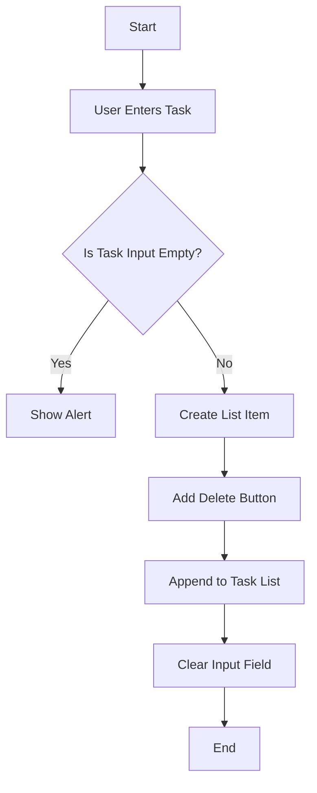

## 15.1 Building Your First Project

Congratulations on reaching this exciting milestone in your JavaScript learning journey! Building your first project is not only a rewarding experience but also an essential step in solidifying your understanding of programming concepts. In this section, we'll guide you through the process of selecting, planning, and developing your first JavaScript project. Let's dive in!

### Selecting Your First Project

Choosing the right project is crucial for maintaining motivation and ensuring a successful learning experience. Here are some tips to help you select a project that aligns with your interests and skill level:

1. **Identify Your Interests**: Think about what excites you. Do you enjoy games, productivity tools, or interactive websites? Choose a project that resonates with your interests to keep you engaged.

2. **Start Small**: As a beginner, it's important to start with a manageable project. Consider building a simple to-do list app, a calculator, or a basic quiz game. These projects are achievable and will help you apply fundamental JavaScript concepts.

3. **Consider Your Goals**: Reflect on what you hope to achieve with this project. Are you looking to practice specific skills, such as DOM manipulation or event handling? Choose a project that aligns with your learning objectives.

### Planning Your Project

Once you've selected a project, it's time to plan and outline its features. A well-thought-out plan will serve as a roadmap, guiding you through the development process. Follow these steps to create a solid project plan:

1. **Define the Project Scope**: Clearly outline what your project will do. For example, if you're building a to-do list app, decide on the core features, such as adding, editing, and deleting tasks.

2. **Break Down Features**: Divide the project into smaller, manageable tasks. For instance, you might start by creating the user interface, then move on to implementing task addition and deletion functionality.

3. **Create a Timeline**: Set realistic deadlines for each task. This will help you stay organized and track your progress. Remember to allow time for testing and debugging.

4. **Gather Resources**: Identify any resources you'll need, such as tutorials, documentation, or libraries. Bookmark helpful websites like [MDN Web Docs](https://developer.mozilla.org/en-US/docs/Web/JavaScript) and [W3Schools](https://www.w3schools.com/js/) for quick reference.

### Developing Your Project

With your plan in place, it's time to start coding! Follow these best practices to ensure a smooth development process:

1. **Iterative Development**: Build your project incrementally, testing each feature as you go. This approach allows you to catch and fix errors early, preventing them from snowballing into larger issues.

2. **Write Clean Code**: Maintain readability by using meaningful variable names, consistent indentation, and comments to explain complex logic. This will make your code easier to understand and debug.

3. **Test Regularly**: Test each feature thoroughly before moving on to the next. Use `console.log()` statements to check the values of variables and ensure your code is working as expected.

4. **Seek Feedback**: Share your progress with peers or online communities. Constructive feedback can provide valuable insights and help you improve your project.

### Example Project: To-Do List App

To illustrate the process, let's walk through building a simple to-do list app. This project will help you practice DOM manipulation, event handling, and basic JavaScript logic.

#### Step 1: Set Up Your HTML Structure

Start by creating an HTML file with the basic structure of your app:

```html
<!DOCTYPE html>
<html lang="en">
<head>
    <meta charset="UTF-8">
    <meta name="viewport" content="width=device-width, initial-scale=1.0">
    <title>To-Do List App</title>
    <link rel="stylesheet" href="styles.css">
</head>
<body>
    <h1>To-Do List</h1>
    <input type="text" id="taskInput" placeholder="Add a new task">
    <button id="addTaskButton">Add Task</button>
    <ul id="taskList"></ul>
    <script src="script.js"></script>
</body>
</html>
```

#### Step 2: Style Your App with CSS

Next, add some basic styles to make your app visually appealing. Create a `styles.css` file:

```css
body {
    font-family: Arial, sans-serif;
    max-width: 600px;
    margin: 0 auto;
    padding: 20px;
    background-color: #f4f4f9;
}

h1 {
    text-align: center;
}

input {
    width: calc(100% - 22px);
    padding: 10px;
    margin-bottom: 10px;
}

button {
    padding: 10px;
    background-color: #007bff;
    color: white;
    border: none;
    cursor: pointer;
}

ul {
    list-style-type: none;
    padding: 0;
}

li {
    background-color: #ffffff;
    margin-bottom: 5px;
    padding: 10px;
    border-radius: 5px;
    display: flex;
    justify-content: space-between;
    align-items: center;
}

li button {
    background-color: #dc3545;
}
```

#### Step 3: Implement JavaScript Functionality

Now, let's add the JavaScript to make your app functional. Create a `script.js` file:

```javascript
// Select DOM elements
const taskInput = document.getElementById('taskInput');
const addTaskButton = document.getElementById('addTaskButton');
const taskList = document.getElementById('taskList');

// Function to add a new task
function addTask() {
    const taskText = taskInput.value.trim();
    if (taskText === '') {
        alert('Please enter a task.');
        return;
    }

    // Create a new list item
    const listItem = document.createElement('li');
    listItem.textContent = taskText;

    // Create a delete button
    const deleteButton = document.createElement('button');
    deleteButton.textContent = 'Delete';
    deleteButton.onclick = function() {
        taskList.removeChild(listItem);
    };

    // Append the delete button to the list item
    listItem.appendChild(deleteButton);

    // Append the list item to the task list
    taskList.appendChild(listItem);

    // Clear the input field
    taskInput.value = '';
}

// Add event listener to the add task button
addTaskButton.addEventListener('click', addTask);
```

#### Step 4: Test Your App

Open your HTML file in a web browser to test your app. Try adding and deleting tasks to ensure everything works as expected. If you encounter any issues, use `console.log()` to debug your code.

### Iterative Development and Testing

As you build your project, remember to iterate and test frequently. This approach will help you identify and resolve issues early, making the development process smoother and more enjoyable.

1. **Start with a Basic Version**: Implement the core functionality first. For the to-do list app, this means being able to add and delete tasks.

2. **Test Each Feature**: After implementing a feature, test it thoroughly. Check for edge cases, such as trying to add an empty task, and handle them gracefully.

3. **Enhance Your Project**: Once the basic version is working, consider adding additional features, such as task editing, task prioritization, or saving tasks to local storage.

### Visualizing the Development Process

To help you visualize the development process, here's a flowchart of the to-do list app's functionality:



This flowchart illustrates the logical flow of adding a task to the to-do list app. It highlights key decision points and actions, providing a clear overview of the app's functionality.

### Encouragement and Next Steps

Building your first project is a significant achievement, and you should be proud of your progress. As you continue to learn and grow as a programmer, consider tackling more complex projects and exploring advanced JavaScript topics. Remember, practice makes perfect, and each project you build will enhance your skills and confidence.

### Additional Resources

For further reading and inspiration, check out these resources:

- [JavaScript Projects for Beginners](https://www.freecodecamp.org/news/javascript-projects-for-beginners/)
- [MDN Web Docs: JavaScript Guide](https://developer.mozilla.org/en-US/docs/Web/JavaScript/Guide)
- [W3Schools JavaScript Tutorial](https://www.w3schools.com/js/)

### Try It Yourself

Now it's your turn! Experiment with the to-do list app by adding new features or modifying existing ones. Here are some ideas to get you started:

- Implement task editing functionality.
- Add a feature to mark tasks as completed.
- Save tasks to local storage so they persist across page reloads.

By experimenting and building upon your project, you'll deepen your understanding of JavaScript and gain valuable hands-on experience.

## Quiz Time!



### What is the first step in planning your project?

- [x] Define the project scope
- [ ] Write the JavaScript code
- [ ] Test the project
- [ ] Deploy the project

> **Explanation:** Defining the project scope is the first step in planning, as it outlines the project's purpose and features.

### Why is iterative development important?

- [x] It allows you to catch and fix errors early
- [ ] It makes the project more complex
- [ ] It requires less testing
- [ ] It speeds up the development process

> **Explanation:** Iterative development helps identify and resolve issues early, preventing them from becoming larger problems.

### What should you do if your task input is empty in the to-do list app?

- [x] Show an alert
- [ ] Add an empty task
- [ ] Ignore the input
- [ ] Refresh the page

> **Explanation:** Showing an alert informs the user that they need to enter a task before adding it.

### What is the purpose of the `console.log()` function?

- [x] To debug and check variable values
- [ ] To style the webpage
- [ ] To delete tasks
- [ ] To create HTML elements

> **Explanation:** `console.log()` is used for debugging by displaying variable values and messages in the console.

### Which HTML element is used to display the list of tasks?

- [x] `<ul>`
- [ ] `<div>`
- [ ] `<span>`
- [ ] `<p>`

> **Explanation:** The `<ul>` element is used to create an unordered list, which is suitable for displaying tasks.

### What should you do after implementing a feature?

- [x] Test it thoroughly
- [ ] Move on to the next project
- [ ] Delete the code
- [ ] Change the project scope

> **Explanation:** Testing each feature ensures it works correctly and helps identify any issues.

### How can you enhance the to-do list app?

- [x] Add task editing functionality
- [x] Implement task prioritization
- [ ] Remove the delete button
- [ ] Disable task addition

> **Explanation:** Enhancements like task editing and prioritization add valuable functionality to the app.

### What is the role of the delete button in the to-do list app?

- [x] To remove tasks from the list
- [ ] To add tasks to the list
- [ ] To edit tasks
- [ ] To style tasks

> **Explanation:** The delete button allows users to remove tasks from the list.

### What should you do if you encounter issues while building your project?

- [x] Use `console.log()` to debug
- [ ] Ignore the issues
- [ ] Start a new project
- [ ] Delete the project

> **Explanation:** Using `console.log()` helps identify and resolve issues by displaying variable values and messages.

### True or False: It's important to gather resources before starting your project.

- [x] True
- [ ] False

> **Explanation:** Gathering resources like tutorials and documentation provides valuable support and guidance during development.



Building your first project is an exciting and rewarding experience. By following the steps outlined in this guide, you'll gain valuable skills and confidence as a JavaScript developer. Remember to start small, iterate, and test frequently, and don't hesitate to seek feedback and explore additional resources. Happy coding!
