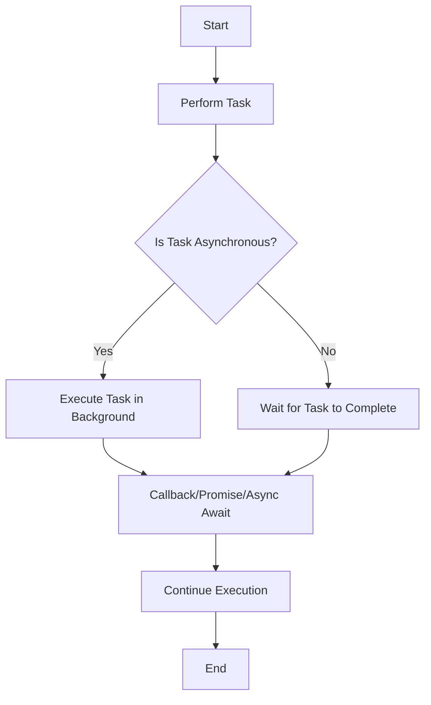
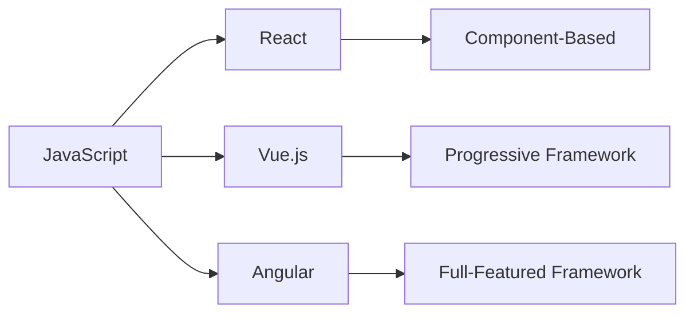
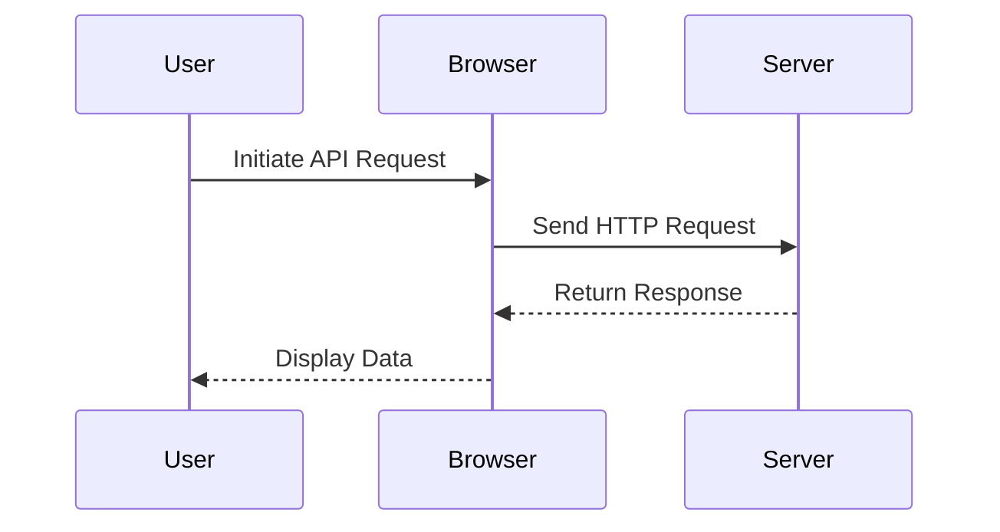

## 15.3 Exploring Advanced Topics

As you continue your journey in learning JavaScript, it's time to explore some advanced topics that will broaden your understanding and open up new possibilities for creating dynamic and interactive web applications. In this section, we'll delve into asynchronous JavaScript, introduce popular JavaScript frameworks and libraries, and explore working with APIs and making AJAX requests.

### Asynchronous JavaScript

JavaScript is inherently single-threaded, meaning it can only execute one task at a time. However, web applications often need to perform multiple tasks simultaneously, such as fetching data from a server while allowing the user to interact with the page. This is where asynchronous JavaScript comes into play.

#### Callbacks

A callback is a function passed into another function as an argument, which is then invoked inside the outer function to complete some kind of routine or action. Callbacks are one of the simplest ways to handle asynchronous operations in JavaScript.

```javascript
// Example of a callback function
function fetchData(callback) {
    setTimeout(() => {
        const data = "Data fetched from server";
        callback(data);
    }, 2000);
}

function displayData(data) {
    console.log(data);
}

// Using the callback
fetchData(displayData);
```

In this example, `fetchData` simulates a data fetch operation that takes 2 seconds to complete. Once the data is fetched, the `displayData` function is called with the fetched data.

#### Promises

Promises provide a more robust way to handle asynchronous operations. A promise represents a value that may be available now, or in the future, or never. It has three states: pending, fulfilled, and rejected.

```javascript
// Example of a promise
function fetchData() {
    return new Promise((resolve, reject) => {
        setTimeout(() => {
            const success = true; // Simulate success or failure
            if (success) {
                resolve("Data fetched successfully");
            } else {
                reject("Failed to fetch data");
            }
        }, 2000);
    });
}

// Using the promise
fetchData()
    .then(data => console.log(data))
    .catch(error => console.error(error));
```

In this example, `fetchData` returns a promise that resolves with a success message or rejects with an error message after 2 seconds.

#### Async/Await

Async/await is a syntactic sugar built on top of promises, making asynchronous code look and behave more like synchronous code. It allows you to write asynchronous code in a more readable and maintainable way.

```javascript
// Example of async/await
async function fetchData() {
    try {
        const data = await new Promise((resolve, reject) => {
            setTimeout(() => {
                resolve("Data fetched successfully");
            }, 2000);
        });
        console.log(data);
    } catch (error) {
        console.error(error);
    }
}

// Calling the async function
fetchData();
```

In this example, the `fetchData` function uses `await` to wait for the promise to resolve, and `try/catch` to handle any errors.

### Popular JavaScript Frameworks and Libraries

JavaScript frameworks and libraries provide pre-written code to help you build complex applications more efficiently. Here are three popular ones:

#### React

React is a JavaScript library for building user interfaces, particularly single-page applications where you need a fast, interactive user experience. It allows you to create reusable UI components.

```javascript
// Example of a simple React component
import React from 'react';

function HelloWorld() {
    return <h1>Hello, World!</h1>;
}

export default HelloWorld;
```

React uses a virtual DOM to optimize rendering and updates, making it very efficient for dynamic applications.

#### Vue.js

Vue.js is a progressive JavaScript framework for building user interfaces. It is designed to be incrementally adoptable, meaning you can use as much or as little of it as you need.

```javascript
// Example of a simple Vue component
<template>
  <h1>{{ message }}</h1>
</template>

<script>
export default {
  data() {
    return {
      message: 'Hello, World!'
    };
  }
};
</script>
```

Vue's simplicity and flexibility make it a great choice for both small and large-scale applications.

#### Angular

Angular is a platform and framework for building single-page client applications using HTML and TypeScript. It provides a comprehensive solution that includes everything you need to build robust applications.

```typescript
// Example of a simple Angular component
import { Component } from '@angular/core';

@Component({
  selector: 'app-hello-world',
  template: '<h1>Hello, World!</h1>'
})
export class HelloWorldComponent {}
```

Angular's strong typing and extensive tooling make it ideal for large-scale enterprise applications.

### Working with APIs and Making AJAX Requests

APIs (Application Programming Interfaces) allow different software applications to communicate with each other. In web development, APIs are often used to fetch data from a server.

#### AJAX

AJAX (Asynchronous JavaScript and XML) is a technique for creating fast and dynamic web pages. It allows web pages to be updated asynchronously by exchanging data with a web server behind the scenes.

```javascript
// Example of an AJAX request using Fetch API
fetch('https://api.example.com/data')
    .then(response => response.json())
    .then(data => console.log(data))
    .catch(error => console.error('Error:', error));
```

In this example, the Fetch API is used to make an AJAX request to a server and log the response data.

#### Making API Requests

When working with APIs, you often need to make HTTP requests to retrieve or send data. The Fetch API and Axios are two popular methods for making these requests.

```javascript
// Example of making an API request with Axios
import axios from 'axios';

axios.get('https://api.example.com/data')
    .then(response => console.log(response.data))
    .catch(error => console.error('Error:', error));
```

Axios provides a more powerful and flexible way to make HTTP requests, with features like interceptors and request cancellation.

### Try It Yourself

Now that you've learned about asynchronous JavaScript, frameworks, and APIs, try experimenting with these concepts:

1. **Modify the Callback Example:** Change the callback function to perform a different action, such as updating the text on a webpage.

2. **Create a Simple React Component:** Build a React component that displays a list of items fetched from an API.

3. **Use Vue.js to Bind Data:** Create a Vue.js application that binds data to a form input and displays the input value in real-time.

4. **Make an API Request with Axios:** Use Axios to make a POST request to an API and handle the response.

### Visual Aids

To help you better understand these concepts, let's look at some visual aids.

#### Asynchronous JavaScript Flow



This flowchart illustrates how asynchronous tasks are handled in JavaScript, allowing the main thread to continue executing while waiting for tasks to complete.

#### Frameworks and Libraries



This diagram shows the relationship between JavaScript and popular frameworks, highlighting their unique features.

#### API Request Flow



This sequence diagram depicts the flow of an API request from the user to the server and back, illustrating how data is fetched and displayed.

### References and Links

For further reading and deeper dives into these topics, check out the following resources:

- [MDN Web Docs: Asynchronous JavaScript](https://developer.mozilla.org/en-US/docs/Learn/JavaScript/Asynchronous)
- [React Official Documentation](https://reactjs.org/docs/getting-started.html)
- [Vue.js Guide](https://vuejs.org/v2/guide/)
- [Angular Documentation](https://angular.io/docs)
- [MDN Web Docs: Fetch API](https://developer.mozilla.org/en-US/docs/Web/API/Fetch_API)
- [Axios GitHub Repository](https://github.com/axios/axios)

### Engagement and Reinforcement

To reinforce your learning, try answering these questions:

- What is the difference between a callback and a promise?
- How does async/await improve the readability of asynchronous code?
- What are the main features of React, Vue.js, and Angular?
- How do you make an AJAX request using the Fetch API?
- What are some common use cases for APIs in web development?

### Summary

In this section, we've explored advanced JavaScript topics, including asynchronous programming, popular frameworks, and working with APIs. By understanding these concepts, you'll be better equipped to build dynamic and interactive web applications. Remember to practice and experiment with the examples provided to solidify your understanding.

## Quiz Time!



### What is a callback in JavaScript?

- [x] A function passed into another function as an argument
- [ ] A function that returns a promise
- [ ] A function that executes immediately
- [ ] A function that is synchronous

> **Explanation:** A callback is a function passed into another function as an argument, which is then invoked inside the outer function.

### What are the states of a promise?

- [x] Pending, Fulfilled, Rejected
- [ ] Started, In Progress, Completed
- [ ] Open, Closed, Error
- [ ] Initialized, Executing, Finished

> **Explanation:** A promise has three states: pending, fulfilled, and rejected.

### How does async/await improve code readability?

- [x] By making asynchronous code look like synchronous code
- [ ] By eliminating the need for promises
- [ ] By using callbacks instead of promises
- [ ] By making code run faster

> **Explanation:** Async/await allows asynchronous code to be written in a way that looks and behaves like synchronous code, improving readability.

### Which framework is known for its component-based architecture?

- [x] React
- [ ] Vue.js
- [ ] Angular
- [ ] jQuery

> **Explanation:** React is known for its component-based architecture, allowing developers to create reusable UI components.

### What is the Fetch API used for?

- [x] Making HTTP requests
- [ ] Manipulating the DOM
- [ ] Creating animations
- [ ] Handling events

> **Explanation:** The Fetch API is used for making HTTP requests to fetch or send data to a server.

### What is AJAX?

- [x] A technique for creating fast and dynamic web pages
- [ ] A JavaScript framework
- [ ] A type of database
- [ ] A CSS library

> **Explanation:** AJAX is a technique for creating fast and dynamic web pages by exchanging data with a web server asynchronously.

### What is the main advantage of using Axios over the Fetch API?

- [x] More powerful and flexible features
- [ ] Built into all browsers
- [ ] Easier to use for synchronous requests
- [ ] Requires no installation

> **Explanation:** Axios provides more powerful and flexible features, such as interceptors and request cancellation, compared to the Fetch API.

### Which framework is designed to be incrementally adoptable?

- [x] Vue.js
- [ ] React
- [ ] Angular
- [ ] Ember.js

> **Explanation:** Vue.js is designed to be incrementally adoptable, allowing developers to use as much or as little of it as needed.

### What is the purpose of an API?

- [x] To allow different software applications to communicate with each other
- [ ] To style web pages
- [ ] To store data in a database
- [ ] To create animations

> **Explanation:** An API (Application Programming Interface) allows different software applications to communicate with each other.

### True or False: Asynchronous JavaScript allows multiple tasks to be executed simultaneously.

- [x] True
- [ ] False

> **Explanation:** Asynchronous JavaScript allows multiple tasks to be executed simultaneously by performing tasks in the background while the main thread continues executing.


