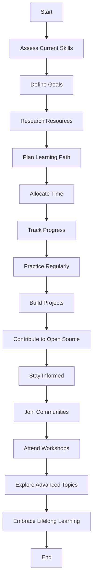

## 15.4 Setting Goals and Continuing Education in JavaScript Programming

Embarking on the journey of learning JavaScript is an exciting endeavor. As with any new skill, setting clear goals and committing to continuous education is crucial for success. In this section, we'll explore how to establish effective learning objectives, build a personalized roadmap, and maintain a practice routine that enhances your programming skills.

### Understanding the Importance of Goal Setting

Setting goals in your JavaScript learning journey is like charting a course on a map. Without a clear destination, you may find yourself wandering aimlessly, unsure of your progress or next steps. Goals provide direction, motivation, and a sense of accomplishment as you achieve them.

#### Short-Term vs. Long-Term Goals

**Short-Term Goals**: These are objectives you aim to achieve in the near future, typically within a few weeks or months. They are specific, measurable, and attainable, serving as stepping stones toward larger aspirations. Examples include mastering basic JavaScript syntax, completing a small project, or understanding a specific concept like loops or functions.

**Long-Term Goals**: These are broader objectives that may take several months or even years to accomplish. They often involve mastering more complex topics, such as building full-stack applications, contributing to open-source projects, or becoming proficient in multiple programming languages.

### Building a Personalized Learning Roadmap

Creating a personalized learning roadmap is essential for organizing your educational journey. It helps you prioritize topics, allocate time efficiently, and track your progress.

#### Steps to Create a Learning Roadmap

1. **Assess Your Current Skills**: Begin by evaluating your current knowledge and skills in JavaScript. Identify areas where you feel confident and those that require improvement.

2. **Define Your Goals**: Based on your assessment, outline your short-term and long-term goals. Be specific about what you want to achieve and set realistic timelines.

3. **Research Resources**: Identify resources that align with your goals. These could include online courses, books, tutorials, or community forums. Websites like [MDN Web Docs](https://developer.mozilla.org/en-US/docs/Web/JavaScript) and [W3Schools](https://www.w3schools.com/js/) are excellent starting points.

4. **Plan Your Learning Path**: Organize the topics you need to learn in a logical sequence. Start with foundational concepts and gradually move to more advanced topics.

5. **Allocate Time**: Decide how much time you can dedicate to learning each week. Consistency is key, so aim for regular study sessions rather than sporadic bursts of activity.

6. **Track Your Progress**: Use tools like spreadsheets, journals, or apps to monitor your progress. Celebrate small victories along the way to stay motivated.

#### Sample Learning Roadmap

Here's a sample roadmap for a beginner aiming to become proficient in JavaScript over six months:

- **Month 1**: Basics of JavaScript (syntax, variables, data types)
- **Month 2**: Control structures (loops, conditionals)
- **Month 3**: Functions and scope
- **Month 4**: Arrays and objects
- **Month 5**: DOM manipulation and events
- **Month 6**: Building a small web application

### Continuous Practice and Project Development

Learning JavaScript is not just about understanding concepts; it's about applying them in real-world scenarios. Continuous practice and project development are vital for reinforcing your knowledge and honing your skills.

#### Importance of Practice

Practice is the bridge between theory and application. It helps solidify your understanding, improve problem-solving skills, and build confidence in your abilities. Regular practice also keeps your skills sharp and prepares you for more complex challenges.

#### Tips for Effective Practice

- **Solve Coding Challenges**: Websites like [LeetCode](https://leetcode.com/) and [HackerRank](https://www.hackerrank.com/domains/tutorials/10-days-of-javascript) offer coding challenges that test your skills and improve your problem-solving abilities.

- **Build Projects**: Apply what you've learned by building projects. Start with simple applications like a to-do list or a calculator, and gradually tackle more complex projects.

- **Contribute to Open Source**: Participating in open-source projects is a great way to gain experience, collaborate with others, and contribute to the community.

- **Pair Programming**: Work with a partner to solve problems together. This collaborative approach enhances learning and exposes you to different perspectives.

#### Project Ideas for Beginners

- **Personal Portfolio Website**: Showcase your skills and projects by building a personal website using HTML, CSS, and JavaScript.

- **Interactive Quiz App**: Create a quiz application that tests users' knowledge on a specific topic. Incorporate features like scoring and feedback.

- **Weather App**: Build an application that fetches and displays weather data from an API. This project introduces you to working with APIs and asynchronous JavaScript.

- **Simple Game**: Develop a basic game like Tic-Tac-Toe or Snake. This project challenges you to think creatively and implement game logic.

### Embracing Lifelong Learning

The field of programming is ever-evolving, with new technologies and frameworks emerging regularly. Embracing lifelong learning is essential to stay current and relevant in the industry.

#### Strategies for Continuous Education

- **Stay Informed**: Follow industry news, blogs, and podcasts to keep up with the latest trends and developments in JavaScript and web development.

- **Join Communities**: Participate in online communities and forums like [Stack Overflow](https://stackoverflow.com/) and [Reddit's r/javascript](https://www.reddit.com/r/javascript/). Engaging with peers provides support, inspiration, and opportunities to learn from others.

- **Attend Workshops and Conferences**: Events like [JSConf](https://jsconf.com/) and [Node.js Interactive](https://nodejs.org/en/) offer valuable learning experiences and networking opportunities.

- **Explore Advanced Topics**: Once you're comfortable with the basics, delve into advanced topics like asynchronous programming, JavaScript frameworks (e.g., React, Angular), and server-side JavaScript (Node.js).

### Try It Yourself

Let's put some of these concepts into practice. Below is a simple JavaScript project idea for you to try:

#### Project: Interactive To-Do List

Create a basic to-do list application where users can add, remove, and mark tasks as complete. This project will help you practice DOM manipulation and event handling.

```javascript
// HTML Structure
// <div id="todoApp">
//   <input type="text" id="taskInput" placeholder="Enter a new task" />
//   <button id="addTaskButton">Add Task</button>
//   <ul id="taskList"></ul>
// </div>

// JavaScript Code
document.getElementById('addTaskButton').addEventListener('click', function() {
  const taskInput = document.getElementById('taskInput');
  const taskText = taskInput.value.trim();

  if (taskText !== '') {
    const taskList = document.getElementById('taskList');
    const newTask = document.createElement('li');
    newTask.textContent = taskText;
    
    // Add a click event to toggle task completion
    newTask.addEventListener('click', function() {
      newTask.classList.toggle('completed');
    });

    taskList.appendChild(newTask);
    taskInput.value = ''; // Clear the input field
  }
});

// CSS for completed tasks
// .completed {
//   text-decoration: line-through;
// }
```

**Try It Yourself**: Modify the code to add a delete button for each task, allowing users to remove tasks from the list.

### Visual Aids

To better understand the flow of setting goals and continuous education, let's visualize the process with a flowchart.



**Description**: This flowchart outlines the steps for setting goals and continuing education in JavaScript programming, from assessing current skills to embracing lifelong learning.

### References and Links

- [MDN Web Docs - JavaScript](https://developer.mozilla.org/en-US/docs/Web/JavaScript)
- [W3Schools - JavaScript Tutorial](https://www.w3schools.com/js/)
- [LeetCode - JavaScript Challenges](https://leetcode.com/)
- [HackerRank - JavaScript Challenges](https://www.hackerrank.com/domains/tutorials/10-days-of-javascript)
- [JSConf](https://jsconf.com/)
- [Node.js Interactive](https://nodejs.org/en/)

### Engagement and Reinforcement

Let's reinforce what we've learned with a few questions and challenges:

- **Question**: What are the benefits of setting both short-term and long-term goals in your learning journey?
- **Challenge**: Create a learning roadmap for the next three months, focusing on JavaScript concepts you find challenging.

### Summary

In this section, we've explored the importance of setting goals and continuing education in your JavaScript programming journey. By establishing clear objectives, creating a personalized roadmap, and committing to continuous practice, you can enhance your skills and stay current in the ever-evolving world of programming. Remember, learning is a lifelong journey, and every step you take brings you closer to mastery.

## Quiz Time!



### What is the primary purpose of setting short-term goals in learning JavaScript?

- [x] To achieve specific, measurable objectives in the near future
- [ ] To become an expert in JavaScript immediately
- [ ] To avoid learning advanced topics
- [ ] To complete a project without understanding the basics

> **Explanation:** Short-term goals help learners focus on specific, achievable objectives that serve as stepping stones toward larger aspirations.

### Which of the following is a long-term goal example for a JavaScript learner?

- [ ] Completing a basic JavaScript tutorial
- [x] Building a full-stack application
- [ ] Understanding loops and conditionals
- [ ] Learning HTML tags

> **Explanation:** Long-term goals involve mastering more complex topics and achieving broader objectives over an extended period.

### What is the first step in creating a personalized learning roadmap?

- [x] Assessing your current skills
- [ ] Joining a community
- [ ] Building a project
- [ ] Attending a workshop

> **Explanation:** Assessing your current skills helps you identify areas for improvement and set realistic learning goals.

### Why is continuous practice important in learning JavaScript?

- [x] It reinforces knowledge and improves problem-solving skills
- [ ] It allows you to skip learning basic concepts
- [ ] It guarantees immediate mastery of JavaScript
- [ ] It eliminates the need for projects

> **Explanation:** Continuous practice helps solidify understanding, build confidence, and prepare learners for more complex challenges.

### Which of the following is a recommended practice for effective learning?

- [x] Solving coding challenges
- [ ] Avoiding community engagement
- [ ] Skipping project development
- [ ] Ignoring advanced topics

> **Explanation:** Solving coding challenges enhances problem-solving abilities and reinforces learning through practical application.

### What is a benefit of contributing to open-source projects?

- [x] Gaining experience and collaborating with others
- [ ] Avoiding teamwork
- [ ] Focusing only on personal projects
- [ ] Skipping learning new skills

> **Explanation:** Contributing to open-source projects provides valuable experience, collaboration opportunities, and community engagement.

### How can learners stay informed about the latest trends in JavaScript?

- [x] Following industry news and blogs
- [ ] Ignoring new developments
- [ ] Avoiding workshops and conferences
- [ ] Focusing only on basic concepts

> **Explanation:** Staying informed through news, blogs, and events helps learners keep up with the latest trends and developments in the field.

### What is the purpose of attending workshops and conferences?

- [x] To gain valuable learning experiences and network
- [ ] To avoid learning new skills
- [ ] To focus solely on individual study
- [ ] To skip practical applications

> **Explanation:** Workshops and conferences offer opportunities for learning, networking, and exposure to new ideas and technologies.

### Which of the following is an advanced topic in JavaScript?

- [ ] Basic syntax
- [x] Asynchronous programming
- [ ] Variable declaration
- [ ] Simple loops

> **Explanation:** Asynchronous programming is an advanced topic that involves handling tasks that occur independently of the main program flow.

### True or False: Lifelong learning is essential in the field of programming.

- [x] True
- [ ] False

> **Explanation:** Lifelong learning is crucial in programming due to the constant evolution of technologies and the need to stay current.


