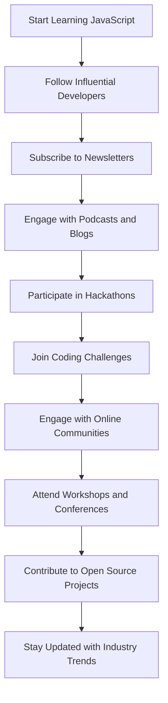

## 15.6 Keeping Up with Industry Trends

As you embark on your journey to master JavaScript, it's important to stay informed about the latest industry trends. The world of programming is ever-evolving, and keeping up-to-date will not only enhance your skills but also open up new opportunities. In this section, we'll explore various ways to stay informed, including following influential developers, subscribing to relevant newsletters, engaging with podcasts and blogs, and actively participating in coding communities and events.

### Following Influential Developers and Industry Leaders

One of the best ways to stay informed about the latest trends in JavaScript is by following influential developers and industry leaders. These individuals often share valuable insights, tips, and updates about new technologies and best practices.

#### Influential Developers to Follow

1. **Brendan Eich**: As the creator of JavaScript, Brendan Eich is a pivotal figure in the programming community. Following his work can provide insights into the language's evolution.

2. **Addy Osmani**: A Google Chrome engineer, Addy Osmani shares valuable resources on performance optimization and modern web development.

3. **Kyle Simpson**: Known for his "You Don't Know JS" book series, Kyle Simpson offers deep dives into JavaScript concepts and best practices.

4. **Sarah Drasner**: A renowned speaker and author, Sarah Drasner shares insights on JavaScript, CSS, and SVG animations.

5. **Dan Abramov**: Co-author of Redux and Create React App, Dan Abramov provides valuable insights into React and modern JavaScript development.

#### Industry Leaders to Follow

1. **Mozilla Developer Network (MDN)**: MDN is a comprehensive resource for web developers, offering documentation and tutorials on JavaScript and other web technologies.

2. **ECMA International**: As the organization responsible for standardizing JavaScript, ECMA International provides updates on new language features and specifications.

3. **Google Developers**: Google Developers offers resources and updates on web development technologies, including JavaScript.

4. **W3C (World Wide Web Consortium)**: W3C is responsible for developing web standards and provides updates on new web technologies and best practices.

### Subscribing to Newsletters, Podcasts, and Blogs

Subscribing to newsletters, podcasts, and blogs is an excellent way to receive curated content and stay informed about the latest trends in JavaScript.

#### Recommended Newsletters

1. **JavaScript Weekly**: A popular newsletter that provides a weekly roundup of JavaScript news, articles, and tutorials.

2. **Frontend Focus**: A newsletter that covers the latest trends in frontend development, including JavaScript, CSS, and HTML.

3. **Node Weekly**: Focused on Node.js, this newsletter provides updates on server-side JavaScript development.

4. **CSS-Tricks**: While primarily focused on CSS, this newsletter often includes JavaScript-related content and tutorials.

#### Recommended Podcasts

1. **JavaScript Jabber**: A weekly podcast that discusses JavaScript and web development topics with industry experts.

2. **Syntax**: Hosted by Wes Bos and Scott Tolinski, Syntax covers web development topics, including JavaScript, in an engaging format.

3. **The Changelog**: A podcast that covers open-source software development, including JavaScript projects and trends.

4. **ShopTalk Show**: A podcast about front-end web design and development, often featuring JavaScript-related discussions.

#### Recommended Blogs

1. **CSS-Tricks**: A blog that offers tutorials and articles on CSS and JavaScript.

2. **Smashing Magazine**: A web development blog that covers a wide range of topics, including JavaScript.

3. **A List Apart**: A blog that explores the design, development, and meaning of web content, often featuring JavaScript-related articles.

4. **David Walsh Blog**: A blog by Mozilla developer David Walsh, offering tutorials and insights on JavaScript and web development.

### Participating in Hackathons, Coding Challenges, and Continuous Learning

Engaging in hackathons, coding challenges, and continuous learning opportunities is a great way to apply your skills, learn new concepts, and stay motivated.

#### Hackathons

Hackathons are events where developers come together to collaborate on projects, often within a limited timeframe. Participating in hackathons can help you:

- **Gain Practical Experience**: Work on real-world projects and apply your JavaScript skills in a collaborative environment.
- **Network with Peers**: Meet other developers, share ideas, and build connections within the programming community.
- **Learn New Technologies**: Explore new tools and technologies that you may not encounter in your day-to-day work.

#### Coding Challenges

Coding challenges are a fun and effective way to improve your problem-solving skills and deepen your understanding of JavaScript. Some popular platforms for coding challenges include:

- **LeetCode**: Offers a variety of coding challenges that cover different aspects of programming, including JavaScript.
- **HackerRank**: Provides coding challenges and competitions to help you improve your skills and compete with other developers.
- **Codewars**: Offers a gamified experience where you can solve coding challenges and earn ranks.

#### Continuous Learning

Continuous learning is essential for staying up-to-date with the latest trends and technologies in JavaScript. Here are some ways to continue learning:

- **Online Courses**: Platforms like Coursera, Udemy, and Pluralsight offer courses on JavaScript and web development.
- **Workshops and Conferences**: Attend workshops and conferences to learn from industry experts and gain hands-on experience.
- **Open Source Contributions**: Contribute to open-source projects to gain practical experience and collaborate with other developers.

### Engaging with the JavaScript Community

Engaging with the JavaScript community can provide valuable support, resources, and opportunities for growth. Here are some ways to get involved:

#### Online Communities

1. **Stack Overflow**: A popular platform for asking and answering programming questions, including JavaScript-related queries.

2. **Reddit**: Subreddits like r/javascript and r/webdev offer discussions and resources on JavaScript and web development.

3. **GitHub**: Explore open-source projects, contribute code, and collaborate with other developers on GitHub.

4. **Twitter**: Follow JavaScript developers and industry leaders on Twitter to stay informed about the latest trends and updates.

#### Local Meetups

Local meetups provide opportunities to connect with other developers in your area. Platforms like Meetup.com offer listings of JavaScript and web development meetups.

#### Online Forums

Participate in online forums and discussion boards to share knowledge, ask questions, and connect with other developers. Some popular forums include:

- **JavaScript Forum**: A dedicated forum for JavaScript developers to discuss topics and share resources.
- **Dev.to**: A community of developers sharing articles, tutorials, and discussions on programming topics.

### Try It Yourself

To reinforce your learning and stay updated with industry trends, try the following activities:

- **Follow a Developer**: Choose one influential developer or industry leader to follow on social media or subscribe to their blog.
- **Subscribe to a Newsletter**: Sign up for a JavaScript-related newsletter to receive regular updates and resources.
- **Participate in a Coding Challenge**: Choose a coding challenge platform and solve a JavaScript problem.
- **Join a Community**: Join an online community or local meetup to connect with other JavaScript developers.

### Visual Aids

To further illustrate the importance of staying updated with industry trends, let's visualize the process of engaging with the JavaScript community and continuous learning.

**Diagram Description**: This flowchart illustrates the process of staying updated with industry trends by following developers, subscribing to resources, engaging with communities, and participating in events.

### References and Links

Here are some reputable resources for further reading and exploration:

- [Mozilla Developer Network (MDN)](https://developer.mozilla.org/en-US/docs/Web/JavaScript)
- [ECMA International](https://www.ecma-international.org/)
- [Google Developers](https://developers.google.com/)
- [W3C (World Wide Web Consortium)](https://www.w3.org/)
- [JavaScript Weekly](https://javascriptweekly.com/)
- [Frontend Focus](https://frontendfoc.us/)
- [Node Weekly](https://nodeweekly.com/)
- [CSS-Tricks](https://css-tricks.com/)
- [JavaScript Jabber](https://devchat.tv/javascript-jabber/)
- [Syntax Podcast](https://syntax.fm/)

### Engagement and Reinforcement

To further engage with the content and reinforce your learning, consider the following questions and challenges:

- **Question**: Who is the creator of JavaScript, and why is it important to follow their work?
- **Challenge**: Participate in a local JavaScript meetup and share your experience with the community.
- **Question**: What are the benefits of participating in hackathons and coding challenges?
- **Challenge**: Solve a JavaScript coding challenge on a platform like LeetCode or HackerRank.

### Summary

In this section, we've explored various ways to keep up with industry trends in JavaScript programming. By following influential developers, subscribing to newsletters and podcasts, participating in hackathons and coding challenges, and engaging with the JavaScript community, you can stay informed and continuously improve your skills. Remember, the key to success in programming is continuous learning and active engagement with the community.

## Quiz Time!



### Who is the creator of JavaScript?

- [x] Brendan Eich
- [ ] Tim Berners-Lee
- [ ] Linus Torvalds
- [ ] Guido van Rossum

> **Explanation:** Brendan Eich created JavaScript in 1995 while working at Netscape.

### Which newsletter provides a weekly roundup of JavaScript news?

- [x] JavaScript Weekly
- [ ] Frontend Focus
- [ ] Node Weekly
- [ ] CSS-Tricks

> **Explanation:** JavaScript Weekly is a popular newsletter that provides a weekly roundup of JavaScript news, articles, and tutorials.

### What is one benefit of participating in hackathons?

- [x] Gain practical experience
- [ ] Only learn about CSS
- [ ] Work in isolation
- [ ] Avoid networking

> **Explanation:** Hackathons provide opportunities to gain practical experience by working on real-world projects in a collaborative environment.

### Which platform offers coding challenges and competitions?

- [x] HackerRank
- [ ] GitHub
- [ ] Stack Overflow
- [ ] Meetup

> **Explanation:** HackerRank provides coding challenges and competitions to help improve programming skills.

### What is the primary focus of the Syntax podcast?

- [x] Web development topics
- [ ] Only CSS animations
- [ ] Database management
- [ ] Hardware engineering

> **Explanation:** The Syntax podcast, hosted by Wes Bos and Scott Tolinski, covers web development topics, including JavaScript.

### Which organization is responsible for standardizing JavaScript?

- [x] ECMA International
- [ ] W3C
- [ ] Mozilla
- [ ] Google

> **Explanation:** ECMA International is responsible for standardizing JavaScript and provides updates on new language features.

### What is a benefit of subscribing to newsletters?

- [x] Receive curated content
- [ ] Avoid learning new things
- [ ] Only read old articles
- [ ] Disconnect from the community

> **Explanation:** Subscribing to newsletters allows you to receive curated content and stay informed about the latest trends in JavaScript.

### Which online community is popular for asking and answering programming questions?

- [x] Stack Overflow
- [ ] GitHub
- [ ] Reddit
- [ ] Twitter

> **Explanation:** Stack Overflow is a popular platform for asking and answering programming questions, including JavaScript-related queries.

### What is one way to engage with the JavaScript community?

- [x] Join local meetups
- [ ] Only read books
- [ ] Avoid social media
- [ ] Work alone

> **Explanation:** Joining local meetups provides opportunities to connect with other developers and engage with the JavaScript community.

### True or False: Continuous learning is essential for staying up-to-date with JavaScript trends.

- [x] True
- [ ] False

> **Explanation:** Continuous learning is essential for staying up-to-date with the latest trends and technologies in JavaScript programming.


