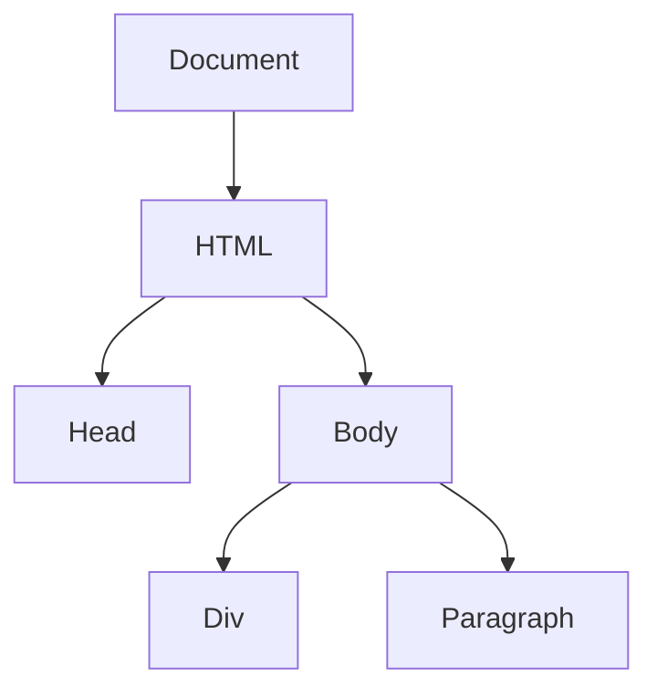
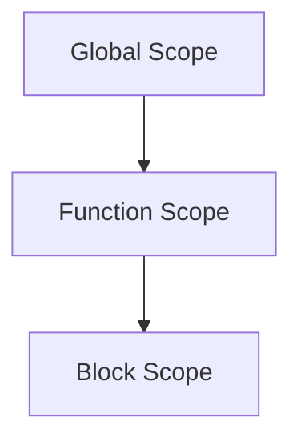

## A. Glossary of Programming Terms

Welcome to the glossary section of **JavaScript Essentials: Getting Started with Programming**. This glossary is designed to provide clear and concise definitions of key terms and concepts introduced throughout the book. Understanding these terms will help you grasp the fundamentals of JavaScript programming and build a solid foundation for further learning. Let's dive into the world of programming terminology!

### A

**Algorithm**  
An algorithm is a step-by-step procedure or formula for solving a problem. In programming, algorithms are used to perform calculations, data processing, and automated reasoning tasks.

**API (Application Programming Interface)**  
An API is a set of rules and tools that allows different software applications to communicate with each other. It defines the methods and data structures that developers can use to interact with an external system or library.

### B

**Boolean**  
A Boolean is a data type that can hold one of two values: `true` or `false`. Booleans are often used in conditional statements to control the flow of a program.

**Bug**  
A bug is an error or flaw in a computer program that causes it to produce incorrect or unexpected results. Debugging is the process of identifying and fixing bugs.

### C

**Callback Function**  
A callback function is a function that is passed as an argument to another function and is executed after some operation has been completed. Callbacks are commonly used in asynchronous programming.

**Class**  
A class is a blueprint for creating objects in object-oriented programming. It defines the properties (attributes) and behaviors (methods) that the objects created from the class will have.

**Compiler**  
A compiler is a program that translates code written in a high-level programming language into machine code that a computer's processor can execute.

**Conditional Statement**  
A conditional statement is a programming construct that allows the execution of code based on whether a condition is true or false. Examples include `if`, `else`, and `switch` statements.

### D

**Data Type**  
A data type is a classification that specifies the type of data that a variable can hold. Common data types in JavaScript include strings, numbers, Booleans, arrays, and objects.

**Debugging**  
Debugging is the process of identifying, analyzing, and fixing bugs or errors in a computer program to ensure it runs correctly.

**DOM (Document Object Model)**  
The DOM is a programming interface for web documents. It represents the structure of a document as a tree of objects, allowing developers to manipulate the content, structure, and style of a web page dynamically.



**Diagram Description:** The DOM tree structure visually represents the hierarchical relationship between elements in an HTML document.

### E

**Event**  
An event is an action or occurrence that can be detected by a program. Examples include user interactions like clicks, key presses, and mouse movements.

**Expression**  
An expression is a combination of variables, operators, and values that produces a result. Expressions are used to perform calculations and evaluate conditions.

### F

**Function**  
A function is a block of code designed to perform a specific task. Functions can take inputs (parameters), execute code, and return outputs (results).

```javascript
// Example of a simple function
function greet(name) {
    return "Hello, " + name + "!";
}

console.log(greet("Alice")); // Output: Hello, Alice!
```

### G

**Global Variable**  
A global variable is a variable that is declared outside of any function and is accessible from anywhere in the code.

### H

**Hoisting**  
Hoisting is a JavaScript mechanism where variable and function declarations are moved to the top of their containing scope during the compile phase. This means that variables and functions can be used before they are declared in the code.

### I

**IDE (Integrated Development Environment)**  
An IDE is a software application that provides comprehensive facilities to programmers for software development. It typically includes a code editor, debugger, and build automation tools.

**If Statement**  
An `if` statement is a conditional statement that executes a block of code if a specified condition is true.

```javascript
// Example of an if statement
let age = 18;
if (age >= 18) {
    console.log("You are eligible to vote.");
}
```

### J

**JavaScript Engine**  
A JavaScript engine is a program or interpreter that executes JavaScript code. Examples include Google's V8 engine and Mozilla's SpiderMonkey.

### K

**Keyword**  
A keyword is a reserved word in a programming language that has a special meaning and cannot be used as an identifier, such as `var`, `let`, `const`, `if`, `else`, and `function`.

### L

**Loop**  
A loop is a programming construct that repeats a block of code as long as a specified condition is true. Common types of loops include `for`, `while`, and `do...while`.

```javascript
// Example of a for loop
for (let i = 0; i < 5; i++) {
    console.log("Iteration number: " + i);
}
```

### M

**Method**  
A method is a function that is associated with an object. Methods define the behaviors of objects and can manipulate the object's properties.

**Module**  
A module is a self-contained unit of code that can be reused across different parts of a program. Modules help organize code and manage dependencies.

### N

**NaN (Not-a-Number)**  
NaN is a special value in JavaScript that represents a value that is not a legal number. It is the result of an invalid or undefined mathematical operation.

**Node**  
In the context of the DOM, a node is an individual part of a document, such as an element, attribute, or text.

### O

**Object**  
An object is a data structure that contains properties and methods. Objects are used to represent real-world entities in programming.

```javascript
// Example of an object
let car = {
    make: "Toyota",
    model: "Camry",
    year: 2020,
    start: function() {
        console.log("Car started");
    }
};

console.log(car.make); // Output: Toyota
car.start(); // Output: Car started
```

### P

**Parameter**  
A parameter is a variable used in a function definition to represent the value that will be passed to the function when it is called.

**Prototype**  
A prototype is an object from which other objects inherit properties and methods. In JavaScript, every object has a prototype, which is used for inheritance.

### Q

**Query Selector**  
A query selector is a method used to select elements from the DOM based on a CSS selector. It allows developers to access and manipulate specific elements on a web page.

### R

**Recursion**  
Recursion is a programming technique where a function calls itself to solve a problem. Recursive functions must have a base case to prevent infinite loops.

**Return Statement**  
A return statement is used in a function to specify the value that should be returned to the caller of the function.

### S

**Scope**  
Scope refers to the visibility and lifetime of variables within a program. JavaScript has two types of scope: global scope and local scope.



**Diagram Description:** The scope chain in JavaScript shows the hierarchy of variable visibility, from global to function to block scope.

**String**  
A string is a data type used to represent text. Strings are enclosed in quotes, either single (`'`) or double (`"`).

```javascript
// Example of a string
let greeting = "Hello, world!";
console.log(greeting); // Output: Hello, world!
```

**Syntax**  
Syntax refers to the set of rules that define the structure of a programming language. Correct syntax is essential for writing valid code.

### T

**Ternary Operator**  
The ternary operator is a shorthand for an `if...else` statement. It takes three operands and returns a value based on a condition.

```javascript
// Example of a ternary operator
let age = 18;
let canVote = (age >= 18) ? "Yes" : "No";
console.log(canVote); // Output: Yes
```

**Type Conversion**  
Type conversion is the process of converting a value from one data type to another. JavaScript supports both implicit and explicit type conversion.

### U

**Undefined**  
Undefined is a special value in JavaScript that indicates a variable has been declared but has not been assigned a value.

**URL (Uniform Resource Locator)**  
A URL is the address used to access resources on the internet. It specifies the location of a resource and the protocol used to access it.

### V

**Variable**  
A variable is a named storage location in a program that holds a value. Variables can be declared using `var`, `let`, or `const`.

```javascript
// Example of a variable declaration
let name = "Alice";
console.log(name); // Output: Alice
```

### W

**Whitespace**  
Whitespace refers to spaces, tabs, and newlines in code. While whitespace is generally ignored by the JavaScript engine, it is important for code readability and formatting.

### X

**XML (eXtensible Markup Language)**  
XML is a markup language used to define rules for encoding documents in a format that is both human-readable and machine-readable. It is often used for data interchange between systems.

### Y

**Yield**  
Yield is a keyword used in generator functions to pause and resume execution. It allows the function to return multiple values over time.

### Z

**Zero-Based Indexing**  
Zero-based indexing is a system where the first element of a sequence is assigned an index of 0. JavaScript arrays use zero-based indexing.

```javascript
// Example of zero-based indexing
let fruits = ["apple", "banana", "cherry"];
console.log(fruits[0]); // Output: apple
```

---

This glossary provides a comprehensive overview of the key programming terms and concepts introduced in this book. By familiarizing yourself with these terms, you'll be better equipped to understand and apply JavaScript programming principles.

## Quiz Time!



### What is an algorithm?

- [x] A step-by-step procedure for solving a problem
- [ ] A type of data structure
- [ ] A programming language
- [ ] A debugging tool

> **Explanation:** An algorithm is a step-by-step procedure or formula for solving a problem.

### What does API stand for?

- [ ] Application Programming Instruction
- [x] Application Programming Interface
- [ ] Application Process Interface
- [ ] Application Protocol Interface

> **Explanation:** API stands for Application Programming Interface, which allows different software applications to communicate with each other.

### What is a Boolean?

- [ ] A type of loop
- [x] A data type with two values: true or false
- [ ] A type of function
- [ ] A type of object

> **Explanation:** A Boolean is a data type that can hold one of two values: true or false.

### What is the DOM?

- [ ] A type of variable
- [x] A programming interface for web documents
- [ ] A type of loop
- [ ] A debugging tool

> **Explanation:** The DOM is a programming interface for web documents, representing the structure of a document as a tree of objects.

### What is hoisting in JavaScript?

- [ ] A method of sorting arrays
- [x] A mechanism where declarations are moved to the top of their scope
- [ ] A type of loop
- [ ] A debugging tool

> **Explanation:** Hoisting is a JavaScript mechanism where variable and function declarations are moved to the top of their containing scope during the compile phase.

### What is a loop?

- [ ] A type of data structure
- [ ] A debugging tool
- [x] A programming construct that repeats a block of code
- [ ] A type of function

> **Explanation:** A loop is a programming construct that repeats a block of code as long as a specified condition is true.

### What is recursion?

- [ ] A type of loop
- [x] A technique where a function calls itself
- [ ] A type of variable
- [ ] A type of object

> **Explanation:** Recursion is a programming technique where a function calls itself to solve a problem.

### What is a string in JavaScript?

- [ ] A type of loop
- [ ] A type of function
- [x] A data type used to represent text
- [ ] A debugging tool

> **Explanation:** A string is a data type used to represent text, enclosed in quotes.

### What is the ternary operator?

- [ ] A type of loop
- [x] A shorthand for an if...else statement
- [ ] A type of function
- [ ] A debugging tool

> **Explanation:** The ternary operator is a shorthand for an if...else statement, taking three operands and returning a value based on a condition.

### What is zero-based indexing?

- [x] A system where the first element has an index of 0
- [ ] A type of loop
- [ ] A type of function
- [ ] A debugging tool

> **Explanation:** Zero-based indexing is a system where the first element of a sequence is assigned an index of 0, commonly used in JavaScript arrays.


