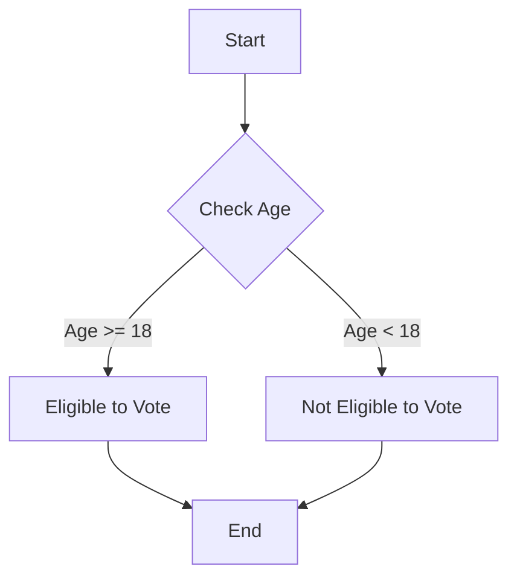

## B. JavaScript Keywords and Reserved Words

In the world of programming, **keywords** and **reserved words** play a crucial role. They are the building blocks of any programming language, including JavaScript. Understanding these terms is essential for writing clean, error-free code. In this section, we will explore the keywords and reserved words in JavaScript, discuss their significance, and provide guidance on how to avoid common pitfalls when using them.

### What Are Keywords and Reserved Words?

**Keywords** are predefined words in a programming language that have special meanings. They are part of the language's syntax and are used to perform specific operations. For example, in JavaScript, the keyword `if` is used to create conditional statements.

**Reserved words**, on the other hand, are words that are reserved by the language for future use or for specific purposes. These words cannot be used as identifiers, such as variable names, function names, or labels. This is because they are reserved for the language's internal use and may cause conflicts or errors if used improperly.

### Why Are Keywords and Reserved Words Important?

Keywords and reserved words are important because they help define the structure and behavior of a program. They are the foundation upon which the language is built. Using them correctly ensures that your code is readable, maintainable, and free from syntax errors.

### List of JavaScript Keywords

JavaScript has a set of keywords that are used to perform various operations. Here is a comprehensive list of JavaScript keywords:

- `break`: Terminates a loop or switch statement.
- `case`: Defines a case in a switch statement.
- `catch`: Handles exceptions in a try-catch block.
- `class`: Declares a class (introduced in ECMAScript 6).
- `const`: Declares a block-scoped, read-only variable (introduced in ECMAScript 6).
- `continue`: Skips the current iteration of a loop.
- `debugger`: Invokes any available debugging functionality.
- `default`: Specifies the default block of code in a switch statement.
- `delete`: Deletes an object property.
- `do`: Executes a block of code once, and then repeats the loop as long as a specified condition is true.
- `else`: Specifies a block of code to be executed if a condition is false.
- `export`: Exports a module (introduced in ECMAScript 6).
- `extends`: Extends a class (introduced in ECMAScript 6).
- `finally`: Executes a block of code after try-catch, regardless of the result.
- `for`: Creates a loop that consists of three optional expressions.
- `function`: Declares a function.
- `if`: Executes a block of code if a specified condition is true.
- `import`: Imports a module (introduced in ECMAScript 6).
- `in`: Checks if a property is in an object.
- `instanceof`: Tests for an instance of an object.
- `let`: Declares a block-scoped variable (introduced in ECMAScript 6).
- `new`: Creates an instance of an object.
- `return`: Exits a function and returns a value.
- `super`: Refers to the parent class (introduced in ECMAScript 6).
- `switch`: Specifies many alternative blocks of code to be executed.
- `this`: Refers to the current object.
- `throw`: Throws an exception.
- `try`: Implements error handling.
- `typeof`: Returns the type of a variable.
- `var`: Declares a variable.
- `void`: Evaluates an expression without returning a value.
- `while`: Creates a loop that executes as long as a specified condition is true.
- `with`: Extends the scope chain for a statement.

### Reserved Words in JavaScript

In addition to keywords, JavaScript also has reserved words that cannot be used as identifiers. Here is a list of reserved words:

- `enum`: Reserved for future use.
- `await`: Reserved for future use (introduced in ECMAScript 2017).
- `implements`: Reserved for future use.
- `interface`: Reserved for future use.
- `package`: Reserved for future use.
- `private`: Reserved for future use.
- `protected`: Reserved for future use.
- `public`: Reserved for future use.
- `static`: Reserved for future use.
- `yield`: Reserved for future use (introduced in ECMAScript 2015).

### New Keywords Introduced in Recent ECMAScript Versions

JavaScript is an evolving language, and new keywords are introduced with each new version of ECMAScript. Here are some of the new keywords introduced in recent ECMAScript versions:

- **ECMAScript 6 (ES6) / ECMAScript 2015**:
  - `class`: Used to declare a class.
  - `const`: Used to declare a block-scoped, read-only variable.
  - `export`: Used to export a module.
  - `extends`: Used to extend a class.
  - `import`: Used to import a module.
  - `let`: Used to declare a block-scoped variable.
  - `super`: Used to refer to the parent class.
  - `yield`: Used in generator functions to pause and resume execution.

- **ECMAScript 2017 (ES8)**:
  - `await`: Used in asynchronous functions to pause execution until a promise is resolved.

### Avoiding Keywords and Reserved Words in Your Code

Using keywords and reserved words as identifiers in your code can lead to syntax errors and unexpected behavior. Here are some tips to avoid these pitfalls:

1. **Familiarize Yourself with Keywords and Reserved Words**: Make sure you know which words are reserved in JavaScript and avoid using them as identifiers.

2. **Use Descriptive Names**: Choose descriptive names for your variables, functions, and classes. This not only avoids conflicts with reserved words but also makes your code more readable.

3. **Follow Naming Conventions**: Use camelCase for variable and function names, and PascalCase for class names. This helps distinguish between different types of identifiers and reduces the risk of using reserved words.

4. **Stay Updated with ECMAScript Versions**: Keep up with the latest ECMAScript versions to be aware of any new keywords introduced. This will help you avoid using them as identifiers in your code.

5. **Use Linting Tools**: Use linting tools like ESLint to automatically detect and warn you about the use of reserved words as identifiers. These tools can help you catch errors early in the development process.

### Code Examples

Let's look at some code examples to illustrate the use of keywords and reserved words in JavaScript.

#### Example 1: Using Keywords

```javascript
// Using the 'if' keyword to create a conditional statement
let age = 18;

if (age >= 18) {
    console.log("You are eligible to vote.");
} else {
    console.log("You are not eligible to vote.");
}

// Using the 'for' keyword to create a loop
for (let i = 0; i < 5; i++) {
    console.log("This is loop iteration number " + i);
}
```

#### Example 2: Avoiding Reserved Words

```javascript
// Incorrect: Using a reserved word as a variable name
// let class = "JavaScript Essentials"; // This will cause a syntax error

// Correct: Using a descriptive name for the variable
let courseName = "JavaScript Essentials";

// Incorrect: Using a reserved word as a function name
// function new() { // This will cause a syntax error
//     console.log("This is a new function.");
// }

// Correct: Using a descriptive name for the function
function createNewFunction() {
    console.log("This is a new function.");
}
```

### Try It Yourself

Now it's your turn! Try modifying the code examples above to see how they work. Here are some suggestions:

- Change the condition in the `if` statement to check for a different age.
- Modify the loop to iterate a different number of times.
- Experiment with different variable and function names to see what works and what doesn't.

### Visual Aids

To help you better understand the concept of keywords and reserved words, let's look at a simple diagram that illustrates the flow of a program using keywords.



**Diagram Description:** This flowchart represents a simple program that checks if a person is eligible to vote based on their age. The program uses the `if` keyword to create a conditional statement that determines the flow of execution.

### References and Links

For more information on JavaScript keywords and reserved words, check out the following resources:

- [MDN Web Docs: JavaScript Reference](https://developer.mozilla.org/en-US/docs/Web/JavaScript/Reference)
- [W3Schools: JavaScript Keywords](https://www.w3schools.com/js/js_reserved.asp)
- [ECMAScript 6 Features](https://www.ecma-international.org/ecma-262/6.0/)

### Engagement and Reinforcement

To reinforce your understanding of JavaScript keywords and reserved words, try answering the following questions:

1. What is the difference between a keyword and a reserved word?
2. Why is it important to avoid using reserved words as identifiers?
3. How can linting tools help you avoid using reserved words in your code?

### Exercises

1. Write a program that uses at least three different JavaScript keywords to perform a simple task.
2. Identify any reserved words in the following code snippet and suggest alternative names for the identifiers:

    ```javascript
    let interface = "User Interface";
    function implements() {
        console.log("This function implements a feature.");
    }
    ```

3. Research the latest ECMAScript version and list any new keywords introduced.

### Summary

In this section, we explored the concept of JavaScript keywords and reserved words. We learned that keywords are predefined words used to perform specific operations, while reserved words are reserved for future use and cannot be used as identifiers. We also discussed the importance of avoiding these words in your code and provided tips on how to do so. By understanding and correctly using keywords and reserved words, you can write clean, error-free JavaScript code.

---

## Quiz Time!



### What is a keyword in JavaScript?

- [x] A predefined word with a special meaning used in the language's syntax.
- [ ] A word that can be used as a variable name.
- [ ] A word that is reserved for future use.
- [ ] A word that has no special significance in the language.

> **Explanation:** Keywords are predefined words in JavaScript that have special meanings and are used to perform specific operations.

### What is a reserved word in JavaScript?

- [x] A word reserved by the language for future use or specific purposes.
- [ ] A word that can be used as a function name.
- [ ] A word that is used to declare variables.
- [ ] A word that has no special significance in the language.

> **Explanation:** Reserved words are reserved by JavaScript for future use or for specific purposes and cannot be used as identifiers.

### Which of the following is a JavaScript keyword?

- [x] `function`
- [ ] `interface`
- [ ] `package`
- [ ] `private`

> **Explanation:** `function` is a keyword in JavaScript used to declare functions, while the others are reserved words.

### Which keyword is used to declare a block-scoped variable in JavaScript?

- [x] `let`
- [ ] `var`
- [ ] `const`
- [ ] `new`

> **Explanation:** The `let` keyword is used to declare block-scoped variables in JavaScript.

### Which of the following is a reserved word in JavaScript?

- [x] `enum`
- [ ] `for`
- [ ] `while`
- [ ] `if`

> **Explanation:** `enum` is a reserved word in JavaScript, while the others are keywords used in control structures.

### What is the purpose of the `super` keyword in JavaScript?

- [x] To refer to the parent class.
- [ ] To declare a superclass.
- [ ] To create a new instance of a class.
- [ ] To define a subclass.

> **Explanation:** The `super` keyword is used in JavaScript to refer to the parent class, especially when extending classes.

### Which ECMAScript version introduced the `class` keyword?

- [x] ECMAScript 6 (ES6)
- [ ] ECMAScript 5
- [ ] ECMAScript 2017 (ES8)
- [ ] ECMAScript 3

> **Explanation:** The `class` keyword was introduced in ECMAScript 6 (ES6) to declare classes in JavaScript.

### Can reserved words be used as identifiers in JavaScript?

- [x] No
- [ ] Yes

> **Explanation:** Reserved words cannot be used as identifiers in JavaScript because they are reserved for future use or specific purposes.

### Which keyword is used to handle exceptions in JavaScript?

- [x] `catch`
- [ ] `try`
- [ ] `throw`
- [ ] `finally`

> **Explanation:** The `catch` keyword is used in JavaScript to handle exceptions in a try-catch block.

### True or False: The `await` keyword is used in synchronous functions.

- [ ] True
- [x] False

> **Explanation:** The `await` keyword is used in asynchronous functions to pause execution until a promise is resolved.


