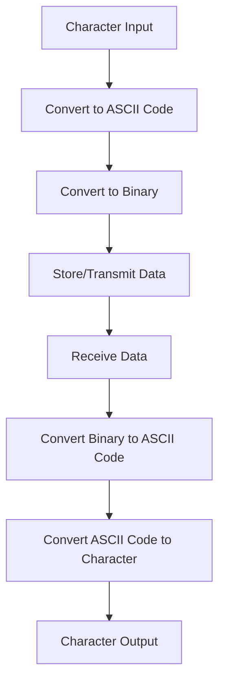

## ASCII Table and Character Codes: Understanding Text Encoding in JavaScript

As we delve deeper into programming, understanding how computers interpret and handle text is crucial. One of the foundational concepts in text encoding is the ASCII table, which maps characters to numerical codes. This section will guide you through the basics of ASCII and character codes, their significance in programming, and how they are utilized in JavaScript.

### What is ASCII?

ASCII, which stands for the American Standard Code for Information Interchange, is a character encoding standard used to represent text in computers and other devices that use text. It was developed in the early 1960s and has become a cornerstone in computing for text representation.

#### Key Points about ASCII:

- **Character Mapping**: ASCII maps 128 characters to numbers ranging from 0 to 127. This includes:
  - **Control Characters**: Non-printable characters used to control devices (e.g., newline, tab).
  - **Printable Characters**: Includes letters (both uppercase and lowercase), digits, punctuation marks, and a few special symbols.
- **Standardization**: ASCII provides a common standard for text representation, ensuring consistency across different devices and platforms.

### The ASCII Table

Below is the ASCII table, which shows the character codes and their corresponding symbols:

| Decimal | Character | Description          |
|---------|-----------|----------------------|
| 0       | NUL       | Null character       |
| 1       | SOH       | Start of Header      |
| 2       | STX       | Start of Text        |
| 3       | ETX       | End of Text          |
| 4       | EOT       | End of Transmission  |
| 5       | ENQ       | Enquiry              |
| 6       | ACK       | Acknowledgment       |
| 7       | BEL       | Bell                 |
| 8       | BS        | Backspace            |
| 9       | HT        | Horizontal Tab       |
| 10      | LF        | Line Feed            |
| 11      | VT        | Vertical Tab         |
| 12      | FF        | Form Feed            |
| 13      | CR        | Carriage Return      |
| 14      | SO        | Shift Out            |
| 15      | SI        | Shift In             |
| 16      | DLE       | Data Link Escape     |
| 17      | DC1       | Device Control 1     |
| 18      | DC2       | Device Control 2     |
| 19      | DC3       | Device Control 3     |
| 20      | DC4       | Device Control 4     |
| 21      | NAK       | Negative Acknowledgment |
| 22      | SYN       | Synchronous Idle     |
| 23      | ETB       | End of Transmission Block |
| 24      | CAN       | Cancel               |
| 25      | EM        | End of Medium        |
| 26      | SUB       | Substitute           |
| 27      | ESC       | Escape               |
| 28      | FS        | File Separator       |
| 29      | GS        | Group Separator      |
| 30      | RS        | Record Separator     |
| 31      | US        | Unit Separator       |
| 32      | Space     | Space                |
| 33      | !         | Exclamation mark     |
| 34      | "         | Double quote         |
| 35      | #         | Number sign          |
| 36      | $         | Dollar sign          |
| 37      | %         | Percent sign         |
| 38      | &         | Ampersand            |
| 39      | '         | Single quote         |
| 40      | (         | Left parenthesis     |
| 41      | )         | Right parenthesis    |
| 42      | *         | Asterisk             |
| 43      | +         | Plus sign            |
| 44      | ,         | Comma                |
| 45      | -         | Hyphen               |
| 46      | .         | Period               |
| 47      | /         | Slash                |
| 48      | 0         | Digit 0              |
| 49      | 1         | Digit 1              |
| 50      | 2         | Digit 2              |
| 51      | 3         | Digit 3              |
| 52      | 4         | Digit 4              |
| 53      | 5         | Digit 5              |
| 54      | 6         | Digit 6              |
| 55      | 7         | Digit 7              |
| 56      | 8         | Digit 8              |
| 57      | 9         | Digit 9              |
| 58      | :         | Colon                |
| 59      | ;         | Semicolon            |
| 60      | <         | Less-than sign       |
| 61      | =         | Equal sign           |
| 62      | >         | Greater-than sign    |
| 63      | ?         | Question mark        |
| 64      | @         | At sign              |
| 65      | A         | Uppercase A          |
| 66      | B         | Uppercase B          |
| 67      | C         | Uppercase C          |
| 68      | D         | Uppercase D          |
| 69      | E         | Uppercase E          |
| 70      | F         | Uppercase F          |
| 71      | G         | Uppercase G          |
| 72      | H         | Uppercase H          |
| 73      | I         | Uppercase I          |
| 74      | J         | Uppercase J          |
| 75      | K         | Uppercase K          |
| 76      | L         | Uppercase L          |
| 77      | M         | Uppercase M          |
| 78      | N         | Uppercase N          |
| 79      | O         | Uppercase O          |
| 80      | P         | Uppercase P          |
| 81      | Q         | Uppercase Q          |
| 82      | R         | Uppercase R          |
| 83      | S         | Uppercase S          |
| 84      | T         | Uppercase T          |
| 85      | U         | Uppercase U          |
| 86      | V         | Uppercase V          |
| 87      | W         | Uppercase W          |
| 88      | X         | Uppercase X          |
| 89      | Y         | Uppercase Y          |
| 90      | Z         | Uppercase Z          |
| 91      | [         | Left square bracket  |
| 92      | \         | Backslash            |
| 93      | ]         | Right square bracket |
| 94      | ^         | Caret                |
| 95      | _         | Underscore           |
| 96      | `         | Grave accent         |
| 97      | a         | Lowercase a          |
| 98      | b         | Lowercase b          |
| 99      | c         | Lowercase c          |
| 100     | d         | Lowercase d          |
| 101     | e         | Lowercase e          |
| 102     | f         | Lowercase f          |
| 103     | g         | Lowercase g          |
| 104     | h         | Lowercase h          |
| 105     | i         | Lowercase i          |
| 106     | j         | Lowercase j          |
| 107     | k         | Lowercase k          |
| 108     | l         | Lowercase l          |
| 109     | m         | Lowercase m          |
| 110     | n         | Lowercase n          |
| 111     | o         | Lowercase o          |
| 112     | p         | Lowercase p          |
| 113     | q         | Lowercase q          |
| 114     | r         | Lowercase r          |
| 115     | s         | Lowercase s          |
| 116     | t         | Lowercase t          |
| 117     | u         | Lowercase u          |
| 118     | v         | Lowercase v          |
| 119     | w         | Lowercase w          |
| 120     | x         | Lowercase x          |
| 121     | y         | Lowercase y          |
| 122     | z         | Lowercase z          |
| 123     | {         | Left curly brace     |
| 124     | \|        | Vertical bar         |
| 125     | }         | Right curly brace    |
| 126     | ~         | Tilde                |
| 127     | DEL       | Delete               |

### How Character Codes are Used in Encoding and Decoding Text

Character encoding is the process of converting characters into a format that can be easily stored and transmitted by computers. ASCII is one of the simplest forms of character encoding.

#### Encoding Process

1. **Character to Code**: Each character in a text is converted to its corresponding ASCII code.
2. **Binary Representation**: These codes are then translated into binary numbers, which computers can process.

#### Decoding Process

1. **Binary to Code**: The binary data received by a computer is converted back into ASCII codes.
2. **Code to Character**: These codes are then mapped back to their respective characters to display text.

### Why ASCII Codes Matter in Programming

Understanding ASCII codes can be beneficial in several programming scenarios:

- **Text Manipulation**: When dealing with text data, knowing ASCII codes can help in tasks like sorting, searching, and filtering.
- **Data Transmission**: ASCII is often used in protocols for data transmission, ensuring that text is correctly interpreted across different systems.
- **Debugging**: When debugging, especially in low-level programming, ASCII codes can help identify issues related to character encoding.

### JavaScript and ASCII

JavaScript provides several methods to work with character codes, allowing you to convert characters to their ASCII values and vice versa.

#### Example: Converting Characters to ASCII Codes

Let's explore how to convert a character to its ASCII code in JavaScript using the `charCodeAt()` method.

```javascript
// Convert a character to its ASCII code
let character = 'A';
let asciiCode = character.charCodeAt(0);

console.log(`The ASCII code for '${character}' is ${asciiCode}.`); // Output: The ASCII code for 'A' is 65.
```

#### Example: Converting ASCII Codes to Characters

To convert an ASCII code back to a character, use the `String.fromCharCode()` method.

```javascript
// Convert an ASCII code to a character
let asciiCode = 65;
let character = String.fromCharCode(asciiCode);

console.log(`The character for ASCII code ${asciiCode} is '${character}'.`); // Output: The character for ASCII code 65 is 'A'.
```

### Try It Yourself

Experiment with the following code examples to deepen your understanding:

1. **Modify the Character**: Change the character in the first example to see its ASCII code.
2. **Change the ASCII Code**: In the second example, input different ASCII codes to see their corresponding characters.

### Visualizing Character Encoding

To better understand how character encoding works, let's visualize the process using a flowchart.



**Diagram Description**: This flowchart illustrates the encoding and decoding process, starting with a character input, converting it to ASCII, then to binary for storage or transmission, and finally decoding it back to a character.

### ASCII in Practice

Understanding ASCII is not just theoretical; it has practical applications in real-world programming. Here are a few scenarios where ASCII knowledge is useful:

- **File Handling**: When reading or writing text files, knowing the ASCII representation of characters can help in ensuring data integrity.
- **Network Communication**: ASCII is often used in network protocols to ensure that text data is correctly interpreted by different systems.
- **Cryptography**: In some encryption algorithms, ASCII codes are used as part of the encryption and decryption process.

### ASCII and Unicode

While ASCII is a fundamental concept, it's important to note that it has limitations, especially when dealing with international text. Unicode is a more comprehensive character encoding standard that includes ASCII as a subset but extends to represent characters from all writing systems.

#### Key Differences:

- **Character Range**: ASCII uses 7 bits to represent characters, while Unicode can use up to 32 bits, allowing for a much larger set of characters.
- **Global Support**: Unicode supports characters from all languages, making it essential for global applications.

### Conclusion

Understanding ASCII and character codes is a foundational skill in programming, especially when working with text data. While ASCII provides a basic framework for text representation, modern applications often rely on Unicode for broader character support. As you continue your programming journey, this knowledge will serve as a valuable tool in handling text data effectively.

## Quiz Time!



### What does ASCII stand for?

- [x] American Standard Code for Information Interchange
- [ ] American System Code for Information Interchange
- [ ] Advanced Standard Code for Information Interchange
- [ ] American Standard Code for International Interchange

> **Explanation:** ASCII stands for American Standard Code for Information Interchange, which is a character encoding standard for electronic communication.

### How many characters does the standard ASCII table represent?

- [x] 128
- [ ] 256
- [ ] 64
- [ ] 512

> **Explanation:** The standard ASCII table represents 128 characters, including control and printable characters.

### Which method in JavaScript is used to convert a character to its ASCII code?

- [x] `charCodeAt()`
- [ ] `fromCharCode()`
- [ ] `toString()`
- [ ] `parseInt()`

> **Explanation:** The `charCodeAt()` method in JavaScript is used to get the ASCII code of a character at a specified index in a string.

### What is the ASCII code for the uppercase letter 'A'?

- [x] 65
- [ ] 97
- [ ] 32
- [ ] 90

> **Explanation:** The ASCII code for the uppercase letter 'A' is 65.

### Which JavaScript method converts an ASCII code back to a character?

- [x] `String.fromCharCode()`
- [ ] `charCodeAt()`
- [ ] `toString()`
- [ ] `parseInt()`

> **Explanation:** The `String.fromCharCode()` method in JavaScript is used to convert an ASCII code back to a character.

### What is the primary limitation of ASCII compared to Unicode?

- [x] Limited character range
- [ ] Complexity
- [ ] Speed
- [ ] Security

> **Explanation:** ASCII has a limited character range, representing only 128 characters, whereas Unicode supports a much larger set of characters.

### In which scenarios is knowledge of ASCII codes particularly useful?

- [x] Text manipulation
- [x] Data transmission
- [ ] Image processing
- [ ] Video editing

> **Explanation:** Knowledge of ASCII codes is useful in text manipulation and data transmission, ensuring correct interpretation and processing of text data.

### Which of the following is not a control character in ASCII?

- [x] @
- [ ] NUL
- [ ] BEL
- [ ] ESC

> **Explanation:** The '@' symbol is a printable character, not a control character. Control characters are non-printable and used for device control.

### What is the ASCII code for the space character?

- [x] 32
- [ ] 0
- [ ] 64
- [ ] 127

> **Explanation:** The ASCII code for the space character is 32.

### True or False: Unicode includes ASCII as a subset.

- [x] True
- [ ] False

> **Explanation:** Unicode includes ASCII as a subset, providing a broader range of characters while maintaining compatibility with ASCII.


