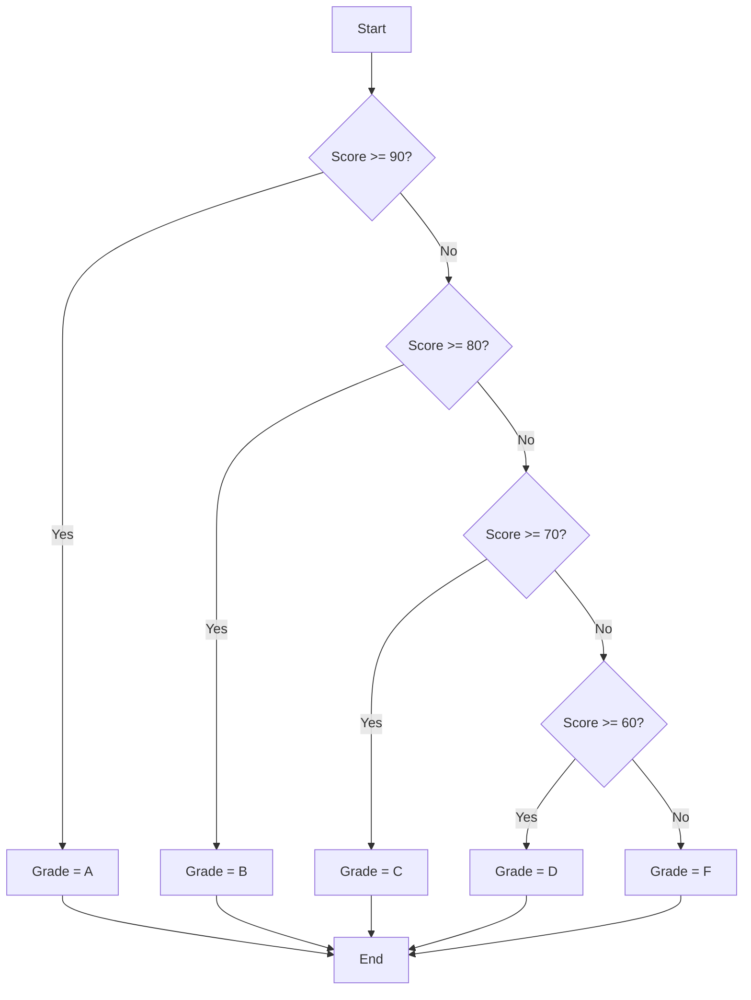

## D. Additional Exercises and Challenges

Welcome to the Additional Exercises and Challenges section of "JavaScript Essentials: Getting Started with Programming." This section is designed to help you reinforce the concepts you've learned throughout the book by providing practical exercises and challenges. These exercises range in difficulty, allowing you to start simple and gradually tackle more complex problems as you build your confidence and skills.

### Chapter 2: Setting Up Your Development Environment

#### Exercise 1: Hello, World! Revisited
- **Objective:** Write a JavaScript program that outputs "Hello, World!" to the console.
- **Instructions:** 
  - Use a text editor or IDE of your choice.
  - Save the file and run it in your browser's console.
- **Challenge:** Modify the program to greet a user by name. For example, "Hello, Alice!"

```javascript
// Basic "Hello, World!" program
console.log("Hello, World!");

// Challenge: Greet a user by name
let userName = "Alice";
console.log("Hello, " + userName + "!");
```

### Chapter 3: JavaScript Fundamentals

#### Exercise 2: Commenting Practice
- **Objective:** Practice using comments to explain code.
- **Instructions:** 
  - Write a short program that calculates the sum of two numbers.
  - Use comments to explain each step of your code.

```javascript
// Declare two variables and assign them values
let num1 = 5;
let num2 = 10;

// Calculate the sum of num1 and num2
let sum = num1 + num2;

// Output the result to the console
console.log("The sum is: " + sum);
```

### Chapter 4: Variables and Data Types

#### Exercise 3: Data Type Exploration
- **Objective:** Experiment with different data types in JavaScript.
- **Instructions:** 
  - Declare variables of different data types: string, number, boolean, null, and undefined.
  - Output the type of each variable using the `typeof` operator.

```javascript
// Declare variables of different data types
let myString = "Hello";
let myNumber = 42;
let myBoolean = true;
let myNull = null;
let myUndefined;

// Output the type of each variable
console.log(typeof myString); // string
console.log(typeof myNumber); // number
console.log(typeof myBoolean); // boolean
console.log(typeof myNull); // object (special case)
console.log(typeof myUndefined); // undefined
```

### Chapter 5: Operators and Expressions

#### Exercise 4: Basic Calculator
- **Objective:** Create a simple calculator using arithmetic operators.
- **Instructions:** 
  - Write a program that takes two numbers and an operator as input.
  - Perform the operation and output the result.

```javascript
// Declare two numbers and an operator
let a = 8;
let b = 4;
let operator = '+';

// Perform the operation based on the operator
let result;
if (operator === '+') {
  result = a + b;
} else if (operator === '-') {
  result = a - b;
} else if (operator === '*') {
  result = a * b;
} else if (operator === '/') {
  result = a / b;
}

// Output the result
console.log("The result is: " + result);
```

### Chapter 6: Control Flow with Conditional Statements

#### Exercise 5: Grade Evaluator
- **Objective:** Use conditional statements to evaluate a student's grade.
- **Instructions:** 
  - Write a program that takes a score as input.
  - Output the corresponding grade (A, B, C, D, or F).

```javascript
// Declare a score
let score = 85;

// Determine the grade based on the score
let grade;
if (score >= 90) {
  grade = 'A';
} else if (score >= 80) {
  grade = 'B';
} else if (score >= 70) {
  grade = 'C';
} else if (score >= 60) {
  grade = 'D';
} else {
  grade = 'F';
}

// Output the grade
console.log("The grade is: " + grade);
```

### Chapter 7: Loops and Iterations

#### Exercise 6: Multiplication Table
- **Objective:** Use loops to generate a multiplication table.
- **Instructions:** 
  - Write a program that outputs the multiplication table for a given number.

```javascript
// Declare a number for the multiplication table
let number = 5;

// Use a loop to generate the multiplication table
for (let i = 1; i <= 10; i++) {
  console.log(number + " x " + i + " = " + (number * i));
}
```

### Chapter 8: Functions

#### Exercise 7: Temperature Converter
- **Objective:** Write a function to convert temperatures between Celsius and Fahrenheit.
- **Instructions:** 
  - Create a function that takes a temperature and a unit ('C' or 'F') as input.
  - Convert the temperature to the other unit and return the result.

```javascript
// Function to convert temperatures
function convertTemperature(temp, unit) {
  if (unit === 'C') {
    return (temp * 9/5) + 32; // Convert Celsius to Fahrenheit
  } else if (unit === 'F') {
    return (temp - 32) * 5/9; // Convert Fahrenheit to Celsius
  }
}

// Test the function
console.log(convertTemperature(0, 'C')); // 32
console.log(convertTemperature(32, 'F')); // 0
```

### Chapter 9: Arrays

#### Exercise 8: Array Manipulation
- **Objective:** Practice common array methods.
- **Instructions:** 
  - Create an array of numbers.
  - Use methods to add, remove, and sort elements.

```javascript
// Create an array of numbers
let numbers = [5, 3, 8, 1];

// Add a number to the end of the array
numbers.push(7);

// Remove the first number from the array
numbers.shift();

// Sort the array in ascending order
numbers.sort((a, b) => a - b);

// Output the modified array
console.log(numbers);
```

### Chapter 10: Objects

#### Exercise 9: Object Properties
- **Objective:** Work with object properties and methods.
- **Instructions:** 
  - Create an object representing a book with properties like title, author, and year.
  - Add a method to display the book's information.

```javascript
// Create an object representing a book
let book = {
  title: "JavaScript Essentials",
  author: "Tokenizer Inc.",
  year: 2024,
  displayInfo: function() {
    console.log(this.title + " by " + this.author + ", published in " + this.year);
  }
};

// Call the method to display the book's information
book.displayInfo();
```

### Chapter 11: Introduction to the Document Object Model (DOM)

#### Exercise 10: DOM Manipulation
- **Objective:** Practice selecting and modifying DOM elements.
- **Instructions:** 
  - Create an HTML page with a heading and a button.
  - Write JavaScript to change the heading's text when the button is clicked.

```html
<!DOCTYPE html>
<html>
<head>
  <title>DOM Manipulation</title>
</head>
<body>
  <h1 id="myHeading">Original Heading</h1>
  <button onclick="changeHeading()">Change Heading</button>

  <script>
    // Function to change the heading's text
    function changeHeading() {
      document.getElementById('myHeading').innerText = "New Heading";
    }
  </script>
</body>
</html>
```

### Chapter 12: Events and Interactivity

#### Exercise 11: Interactive List
- **Objective:** Create an interactive list using event listeners.
- **Instructions:** 
  - Create an HTML page with an unordered list and a button.
  - Write JavaScript to add a new list item when the button is clicked.

```html
<!DOCTYPE html>
<html>
<head>
  <title>Interactive List</title>
</head>
<body>
  <ul id="myList">
    <li>Item 1</li>
    <li>Item 2</li>
  </ul>
  <button onclick="addItem()">Add Item</button>

  <script>
    // Function to add a new list item
    function addItem() {
      let newItem = document.createElement('li');
      newItem.innerText = "New Item";
      document.getElementById('myList').appendChild(newItem);
    }
  </script>
</body>
</html>
```

### Chapter 13: Debugging and Error Handling

#### Exercise 12: Debugging Practice
- **Objective:** Practice identifying and fixing errors in JavaScript code.
- **Instructions:** 
  - Review the following code and identify any errors.
  - Use `console.log()` to help debug and fix the issues.

```javascript
// Incorrect code with errors
let x = 10;
let y = 20;
let z = x + y;
console.log("The value of z is: " + z;

// Corrected code
let x = 10;
let y = 20;
let z = x + y;
console.log("The value of z is: " + z);
```

### Chapter 14: Writing Clean and Maintainable Code

#### Exercise 13: Code Refactoring
- **Objective:** Improve code readability and maintainability.
- **Instructions:** 
  - Review the following code and refactor it to follow best practices.
  - Use meaningful variable names and add comments.

```javascript
// Original code
let a = 5;
let b = 10;
let c = a + b;
console.log(c);

// Refactored code
let firstNumber = 5; // First number to add
let secondNumber = 10; // Second number to add
let sum = firstNumber + secondNumber; // Calculate the sum
console.log("The sum is: " + sum); // Output the result
```

### Chapter 15: Next Steps in Programming

#### Challenge 14: Build a Simple Web Application
- **Objective:** Apply your JavaScript skills to build a simple web application.
- **Instructions:** 
  - Create a basic to-do list application.
  - Allow users to add, remove, and mark tasks as complete.
  - Use HTML, CSS, and JavaScript to build the application.

```html
<!DOCTYPE html>
<html>
<head>
  <title>To-Do List</title>
  <style>
    .completed {
      text-decoration: line-through;
    }
  </style>
</head>
<body>
  <h1>To-Do List</h1>
  <input type="text" id="taskInput" placeholder="Add a new task">
  <button onclick="addTask()">Add Task</button>
  <ul id="taskList"></ul>

  <script>
    function addTask() {
      let taskInput = document.getElementById('taskInput');
      let taskText = taskInput.value;
      if (taskText === '') {
        alert('Please enter a task.');
        return;
      }
      let taskItem = document.createElement('li');
      taskItem.innerText = taskText;
      taskItem.onclick = function() {
        this.classList.toggle('completed');
      };
      document.getElementById('taskList').appendChild(taskItem);
      taskInput.value = '';
    }
  </script>
</body>
</html>
```

### Try It Yourself

To truly master JavaScript, it's important to experiment and try modifying the code examples provided. Here are a few suggestions:

- **Modify the Calculator:** Add support for more operators, such as modulus (%) or exponentiation (**).
- **Enhance the Grade Evaluator:** Allow the program to handle multiple scores and calculate the average grade.
- **Expand the To-Do List:** Add features like task priority, deadlines, or categories.

### Visual Aids

To help visualize some of the concepts, let's use Mermaid.js diagrams.

#### Flowchart: Grade Evaluator



**Description:** This flowchart represents the logic used in the Grade Evaluator exercise, showing how the program determines the grade based on the score.

### References and Links

For further reading and to deepen your understanding of JavaScript, consider exploring the following resources:

- [MDN Web Docs: JavaScript](https://developer.mozilla.org/en-US/docs/Web/JavaScript)
- [W3Schools: JavaScript Tutorial](https://www.w3schools.com/js/)
- [JavaScript.info](https://javascript.info/)

### Engagement and Reinforcement

As you work through these exercises, consider these questions:

- How can you modify the code to handle different scenarios?
- What additional features could you add to the projects?
- How can you apply these concepts to real-world problems?

### Summary

In this section, we've provided a variety of exercises and challenges to help you practice and apply the JavaScript concepts covered in this book. By working through these problems, you'll gain a deeper understanding of programming and build the confidence to tackle more complex projects.

## Quiz Time!



### Which operator is used to assign a value to a variable in JavaScript?

- [x] =
- [ ] ==
- [ ] ===
- [ ] =>

> **Explanation:** The `=` operator is used to assign values to variables in JavaScript.

### What will the following code output? `console.log(typeof null);`

- [ ] null
- [ ] undefined
- [x] object
- [ ] number

> **Explanation:** In JavaScript, the `typeof` operator returns "object" for `null`, which is a known quirk of the language.

### Which method is used to add an element to the end of an array?

- [x] push()
- [ ] pop()
- [ ] shift()
- [ ] unshift()

> **Explanation:** The `push()` method adds one or more elements to the end of an array.

### What is the correct syntax for a function declaration in JavaScript?

- [x] function myFunction() {}
- [ ] function: myFunction() {}
- [ ] def myFunction() {}
- [ ] myFunction function() {}

> **Explanation:** The correct syntax for declaring a function in JavaScript is `function myFunction() {}`.

### Which loop will execute at least once, regardless of the condition?

- [ ] for
- [ ] while
- [x] do...while
- [ ] for...of

> **Explanation:** A `do...while` loop will execute its block of code at least once before checking the condition.

### What does the `console.log()` function do?

- [x] Outputs a message to the web console
- [ ] Displays an alert box
- [ ] Writes to a file
- [ ] Sends a message to the server

> **Explanation:** The `console.log()` function outputs a message to the web console, useful for debugging.

### How do you access the third element in an array `arr`?

- [x] arr[2]
- [ ] arr[3]
- [ ] arr(2)
- [ ] arr{2}

> **Explanation:** Arrays in JavaScript are zero-indexed, so the third element is accessed with `arr[2]`.

### What is the purpose of the `break` statement in loops?

- [x] To exit the loop immediately
- [ ] To pause the loop
- [ ] To skip the current iteration
- [ ] To restart the loop

> **Explanation:** The `break` statement is used to exit a loop immediately, regardless of the loop's condition.

### Which of the following is a valid way to declare a variable in JavaScript?

- [x] let myVar;
- [ ] var myVar:
- [ ] const myVar;
- [ ] int myVar;

> **Explanation:** `let myVar;` is a valid way to declare a variable in JavaScript. The `var` keyword is also valid but requires a semicolon.

### JavaScript is a statically typed language.

- [ ] True
- [x] False

> **Explanation:** JavaScript is a dynamically typed language, meaning variables can hold values of any type without explicit type declaration.



By engaging with these exercises and quiz questions, you're taking significant steps toward mastering JavaScript. Keep practicing, and don't hesitate to explore additional resources to expand your knowledge!
