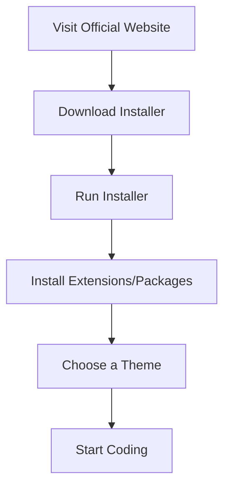

## 2.1 Choosing a Text Editor or IDE

Embarking on your journey to learn JavaScript is an exciting step, and choosing the right text editor or Integrated Development Environment (IDE) is crucial for a smooth start. In this section, we will explore some of the most popular text editors and IDEs suitable for beginners, including Visual Studio Code, Atom, and Sublime Text. We will also provide step-by-step instructions on how to download, install, and configure these tools for JavaScript development.

### What is a Text Editor or IDE?

Before diving into specific tools, let's clarify what text editors and IDEs are:

- **Text Editor**: A text editor is a program that allows you to write and edit plain text. It is lightweight and often used for writing code. Examples include Notepad++ and Sublime Text.

- **IDE (Integrated Development Environment)**: An IDE is a more comprehensive software suite that includes a text editor, along with additional features like debugging tools, build automation, and version control. Examples include Visual Studio Code and Eclipse.

### Why Choose the Right Tool?

Choosing the right text editor or IDE can significantly impact your learning experience. A good tool will:

- **Enhance Productivity**: With features like syntax highlighting, code completion, and error detection, you can write code more efficiently.
- **Improve Code Quality**: Built-in tools help you write cleaner, more maintainable code.
- **Facilitate Learning**: A user-friendly interface and helpful extensions can make learning JavaScript more enjoyable.

### Popular Text Editors and IDEs for Beginners

Let's explore three popular tools that are beginner-friendly and widely used in the JavaScript community.

#### Visual Studio Code

**Visual Studio Code (VS Code)** is a free, open-source text editor developed by Microsoft. It is highly popular among developers due to its versatility and extensive range of features.

##### Key Features

- **IntelliSense**: Provides smart code completions based on variable types, function definitions, and imported modules.
- **Built-in Git**: Integrated Git control allows you to manage version control directly within the editor.
- **Extensions**: A vast library of extensions to enhance functionality, including JavaScript-specific tools.
- **Debugging**: Built-in debugging support for JavaScript and other languages.

##### Download and Installation

1. **Visit the Official Website**: Go to [Visual Studio Code's official website](https://code.visualstudio.com/).
2. **Download the Installer**: Click on the download button for your operating system (Windows, macOS, or Linux).
3. **Run the Installer**: Follow the on-screen instructions to install VS Code on your machine.

##### Basic Configuration for JavaScript

- **Install Extensions**: Open the Extensions view by clicking on the Extensions icon in the Activity Bar. Search for and install the following extensions:
  - **ESLint**: Helps you find and fix problems in your JavaScript code.
  - **Prettier**: An opinionated code formatter that ensures consistent code style.
  - **JavaScript (ES6) code snippets**: Provides useful code snippets for JavaScript development.

- **Set Up a Theme**: Customize the appearance of VS Code by selecting a theme. Go to `File > Preferences > Color Theme` and choose a theme that suits your taste.

#### Atom

**Atom** is a free, open-source text editor developed by GitHub. Known for its hackability, Atom is a great choice for beginners who want a customizable coding environment.

##### Key Features

- **Built-in Package Manager**: Easily install and manage packages to extend Atom's functionality.
- **Teletype**: Collaborate with other developers in real-time.
- **Themes**: A wide variety of themes to personalize the editor's appearance.
- **Cross-platform**: Available on Windows, macOS, and Linux.

##### Download and Installation

1. **Visit the Official Website**: Go to [Atom's official website](https://atom.io/).
2. **Download the Installer**: Click on the download button for your operating system.
3. **Run the Installer**: Follow the installation instructions to set up Atom on your computer.

##### Basic Configuration for JavaScript

- **Install Packages**: Open the Settings view by going to `File > Settings` and navigate to the `Install` tab. Search for and install the following packages:
  - **linter-eslint**: Integrates ESLint into Atom for JavaScript linting.
  - **atom-beautify**: Beautifies your code to ensure consistent formatting.
  - **autocomplete-plus**: Provides intelligent code completion.

- **Choose a Theme**: Customize Atom's look by selecting a theme. Go to `File > Settings > Themes` and choose a UI and syntax theme.

#### Sublime Text

**Sublime Text** is a sophisticated text editor known for its speed and simplicity. It is a great choice for beginners who prefer a lightweight editor.

##### Key Features

- **Multiple Selections**: Make multiple changes at once with multiple selections.
- **Command Palette**: Access frequently used commands with a few keystrokes.
- **Distraction-Free Mode**: Focus entirely on your code with a full-screen mode.
- **Customizable**: Extensive customization options with themes and settings.

##### Download and Installation

1. **Visit the Official Website**: Go to [Sublime Text's official website](https://www.sublimetext.com/).
2. **Download the Installer**: Click on the download button for your operating system.
3. **Run the Installer**: Follow the installation instructions to install Sublime Text.

##### Basic Configuration for JavaScript

- **Install Packages**: Use the Package Control to install useful packages. Press `Ctrl + Shift + P` to open the Command Palette, type `Install Package Control`, and press `Enter`. Then, use the Command Palette to install packages like:
  - **SublimeLinter**: A framework for linting code.
  - **JavaScript Enhancements**: Provides JavaScript-specific features and enhancements.
  - **Emmet**: A toolkit for web developers to improve HTML and CSS workflow.

- **Select a Theme**: Customize the appearance by choosing a theme. Go to `Preferences > Color Scheme` and select a theme that you like.

### Try It Yourself

Now that you have an overview of these tools, try downloading and installing one of them. Experiment with the configurations and explore the extensions or packages available. This hands-on experience will help you get comfortable with the tool and set the stage for your JavaScript learning journey.

### Visual Aids

To help you understand the process of setting up a text editor or IDE, let's look at a simple flowchart that outlines the steps involved:

**Figure 1**: Steps to Set Up a Text Editor or IDE

### Additional Resources

For more information on text editors and IDEs, consider exploring the following resources:

- [Visual Studio Code Documentation](https://code.visualstudio.com/docs)
- [Atom Documentation](https://flight-manual.atom.io/)
- [Sublime Text Documentation](https://www.sublimetext.com/docs/)

### Key Takeaways

- **Visual Studio Code, Atom, and Sublime Text** are excellent choices for beginners starting with JavaScript.
- **Download and install** the text editor or IDE that best suits your needs and preferences.
- **Configure your tool** with essential extensions or packages to enhance your coding experience.
- **Experiment with themes** to create a comfortable and personalized coding environment.

By choosing the right text editor or IDE and setting it up properly, you'll be well-equipped to dive into JavaScript programming with confidence.

## Quiz Time!



### Which of the following is NOT a feature of Visual Studio Code?

- [ ] IntelliSense
- [ ] Built-in Git
- [x] Multiple Selections
- [ ] Extensions

> **Explanation:** Multiple Selections is a feature of Sublime Text, not Visual Studio Code.

### Atom is developed by which company?

- [ ] Microsoft
- [x] GitHub
- [ ] Google
- [ ] Apple

> **Explanation:** Atom is developed by GitHub, which is now owned by Microsoft.

### What is the primary purpose of a text editor?

- [x] To write and edit plain text
- [ ] To compile code
- [ ] To manage databases
- [ ] To design graphics

> **Explanation:** A text editor is used to write and edit plain text, including code.

### Which of the following is a package manager for Atom?

- [ ] npm
- [ ] pip
- [x] Built-in Package Manager
- [ ] Composer

> **Explanation:** Atom has a built-in package manager for installing and managing packages.

### Sublime Text is known for its:

- [x] Speed and simplicity
- [ ] Extensive built-in features
- [ ] Heavy resource usage
- [ ] Built-in Git support

> **Explanation:** Sublime Text is known for its speed and simplicity, making it a lightweight editor.

### What is the command to open the Command Palette in Sublime Text?

- [x] Ctrl + Shift + P
- [ ] Ctrl + P
- [ ] Ctrl + Shift + S
- [ ] Ctrl + Alt + P

> **Explanation:** Ctrl + Shift + P opens the Command Palette in Sublime Text.

### Which extension is recommended for JavaScript linting in Visual Studio Code?

- [ ] Prettier
- [x] ESLint
- [ ] Emmet
- [ ] JavaScript Enhancements

> **Explanation:** ESLint is recommended for JavaScript linting in Visual Studio Code.

### What is the main advantage of using an IDE over a text editor?

- [x] Additional features like debugging tools and version control
- [ ] Faster code execution
- [ ] Smaller file size
- [ ] Better graphics design capabilities

> **Explanation:** An IDE offers additional features like debugging tools and version control, which are not typically found in a text editor.

### Which tool allows real-time collaboration in Atom?

- [ ] IntelliSense
- [x] Teletype
- [ ] Command Palette
- [ ] Distraction-Free Mode

> **Explanation:** Teletype allows real-time collaboration in Atom.

### True or False: Visual Studio Code is a paid software.

- [ ] True
- [x] False

> **Explanation:** Visual Studio Code is a free, open-source text editor.


