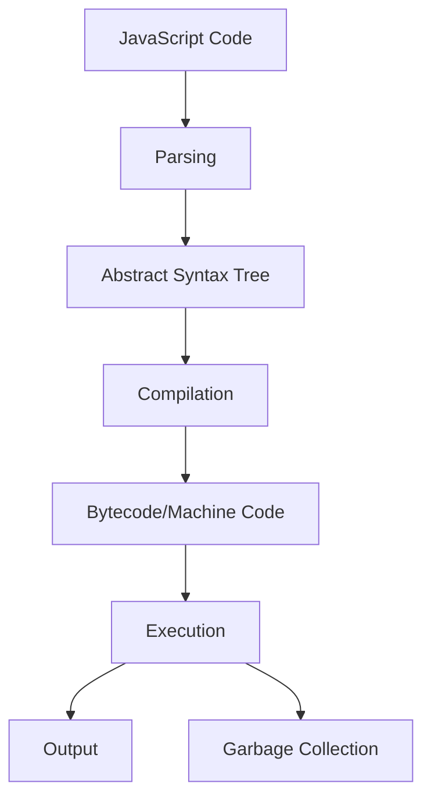

## 2.2 Understanding Web Browsers and the JavaScript Engine

Welcome to the fascinating world of web browsers and JavaScript engines! As we embark on this journey, we'll explore how web browsers execute JavaScript code, the role of JavaScript engines, and the importance of ensuring your code works seamlessly across different browsers. This knowledge is crucial for any budding developer, as it forms the backbone of creating interactive and dynamic web applications.

### The Role of Web Browsers

Web browsers are software applications that allow us to access and interact with content on the World Wide Web. They interpret and display HTML, CSS, and JavaScript to render web pages. Popular web browsers include Google Chrome, Mozilla Firefox, Microsoft Edge, and Safari. Each browser has its own unique features and rendering engines, which can affect how web pages are displayed.

#### How Browsers Work

When you enter a URL into a browser's address bar and hit enter, the browser performs several tasks to display the requested web page:

1. **DNS Resolution**: The browser translates the domain name into an IP address using the Domain Name System (DNS).

2. **HTTP Request**: The browser sends an HTTP request to the server hosting the website.

3. **Response Handling**: The server responds with the requested resources, typically HTML, CSS, and JavaScript files.

4. **Rendering**: The browser parses the HTML and CSS to construct the Document Object Model (DOM) and the CSS Object Model (CSSOM). It then renders the page visually.

5. **JavaScript Execution**: The browser's JavaScript engine executes any JavaScript code, allowing for dynamic content and interactivity.

### Introducing JavaScript Engines

A JavaScript engine is a program or an interpreter that executes JavaScript code. Each web browser has its own JavaScript engine, which is responsible for parsing, compiling, and executing JavaScript.

#### Popular JavaScript Engines

- **V8**: Developed by Google, V8 is used in Google Chrome and Node.js. It is known for its high performance and efficient memory management.

- **SpiderMonkey**: Created by Mozilla, SpiderMonkey is the JavaScript engine used in Firefox. It was the first JavaScript engine ever written and continues to evolve with new features and optimizations.

- **JavaScriptCore**: Also known as Nitro, this engine is used by Safari and other WebKit-based browsers. It focuses on performance and compatibility with web standards.

- **Chakra**: Developed by Microsoft, Chakra was used in the Edge browser before the switch to Chromium. It is now open-source and continues to be developed for other applications.

#### How JavaScript Engines Work

JavaScript engines perform several key tasks to execute JavaScript code:

1. **Parsing**: The engine reads the JavaScript code and converts it into an Abstract Syntax Tree (AST), which represents the structure of the code.

2. **Compilation**: The AST is compiled into bytecode or machine code, depending on the engine. This step optimizes the code for faster execution.

3. **Execution**: The compiled code is executed by the engine's runtime environment, allowing the JavaScript to interact with the DOM and perform other tasks.

4. **Garbage Collection**: JavaScript engines automatically manage memory by reclaiming memory that is no longer in use, a process known as garbage collection.

```javascript
// Example of JavaScript code execution
function greet(name) {
    console.log("Hello, " + name + "!");
}

greet("World"); // Output: Hello, World!
```

### Browser Compatibility and Testing

One of the challenges of web development is ensuring that your JavaScript code works consistently across different browsers. Each browser may interpret JavaScript slightly differently due to variations in their engines and support for web standards.

#### Importance of Browser Compatibility

- **User Experience**: Ensuring compatibility across browsers provides a consistent experience for all users, regardless of their choice of browser.

- **Accessibility**: Some users may rely on specific browsers due to accessibility features or device constraints.

- **Market Reach**: Supporting multiple browsers increases the potential audience for your web application.

#### Testing Across Browsers

To ensure your JavaScript code works across different browsers, consider the following strategies:

1. **Cross-Browser Testing Tools**: Use tools like BrowserStack, Sauce Labs, or CrossBrowserTesting to test your application on various browsers and devices.

2. **Feature Detection**: Use feature detection libraries like Modernizr to check for browser support of specific features and provide fallbacks if necessary.

3. **Polyfills**: Implement polyfills to add support for newer JavaScript features in older browsers.

4. **Progressive Enhancement**: Build your application with a basic level of functionality that works in all browsers, then enhance it with advanced features for browsers that support them.

5. **Responsive Design**: Ensure your application is responsive and adapts to different screen sizes and orientations.

### Try It Yourself

Let's experiment with a simple JavaScript code snippet to see how it behaves in different browsers. Open your favorite browser's developer tools and run the following code in the console:

```javascript
// Simple JavaScript code to test in different browsers
function browserTest() {
    const userAgent = navigator.userAgent;
    console.log("You are using: " + userAgent);
}

browserTest();
```

- **Modify the Code**: Try changing the message or adding additional information about the browser.
- **Test in Different Browsers**: Run the code in multiple browsers and observe any differences in the output.

### Visualizing the JavaScript Engine Process

To better understand how a JavaScript engine processes code, let's visualize the steps using a flowchart:



- **Parsing**: Converts code into a structured format (AST).
- **Compilation**: Optimizes and converts the AST into executable code.
- **Execution**: Runs the code and produces output.
- **Garbage Collection**: Manages memory by cleaning up unused data.

### Key Takeaways

- Web browsers are essential tools for accessing and interacting with web content. They interpret and display HTML, CSS, and JavaScript.
- JavaScript engines like V8, SpiderMonkey, JavaScriptCore, and Chakra are responsible for executing JavaScript code within browsers.
- Ensuring browser compatibility is crucial for providing a consistent user experience and reaching a wider audience.
- Testing across different browsers and using tools like feature detection and polyfills can help achieve compatibility.

### Further Reading

- [MDN Web Docs: JavaScript Engines](https://developer.mozilla.org/en-US/docs/Web/JavaScript/JavaScript_Engines)
- [Google Developers: V8 JavaScript Engine](https://v8.dev/)
- [Mozilla Developer Network: SpiderMonkey](https://developer.mozilla.org/en-US/docs/Mozilla/Projects/SpiderMonkey)
- [WebKit: JavaScriptCore](https://webkit.org/projects/javascriptcore/)

## Quiz Time!



### What is the primary role of a web browser?

- [x] To interpret and display HTML, CSS, and JavaScript
- [ ] To compile Java programs
- [ ] To design web pages
- [ ] To manage server databases

> **Explanation:** Web browsers interpret and display HTML, CSS, and JavaScript to render web pages.

### Which JavaScript engine is used in Google Chrome?

- [x] V8
- [ ] SpiderMonkey
- [ ] JavaScriptCore
- [ ] Chakra

> **Explanation:** Google Chrome uses the V8 JavaScript engine.

### What is the first step a JavaScript engine takes to execute code?

- [x] Parsing
- [ ] Compilation
- [ ] Execution
- [ ] Garbage Collection

> **Explanation:** The first step is parsing, where the engine reads the code and converts it into an Abstract Syntax Tree (AST).

### Why is browser compatibility important?

- [x] To provide a consistent user experience across different browsers
- [ ] To increase server speed
- [ ] To reduce code complexity
- [ ] To enhance graphics

> **Explanation:** Browser compatibility ensures that users have a consistent experience, regardless of their browser choice.

### What tool can be used for cross-browser testing?

- [x] BrowserStack
- [ ] Visual Studio Code
- [ ] GitHub
- [ ] npm

> **Explanation:** BrowserStack is a tool for testing web applications across different browsers and devices.

### What is a polyfill in web development?

- [x] A script that adds support for newer features in older browsers
- [ ] A type of CSS layout
- [ ] A JavaScript library for animations
- [ ] A database management tool

> **Explanation:** Polyfills are scripts that provide support for modern features in older browsers.

### Which JavaScript engine was the first ever written?

- [x] SpiderMonkey
- [ ] V8
- [ ] JavaScriptCore
- [ ] Chakra

> **Explanation:** SpiderMonkey, developed by Mozilla, was the first JavaScript engine ever written.

### What does the garbage collection process do?

- [x] Reclaims memory that is no longer in use
- [ ] Compiles JavaScript code
- [ ] Renders HTML and CSS
- [ ] Manages user sessions

> **Explanation:** Garbage collection automatically manages memory by reclaiming memory that is no longer in use.

### What is the output of the following code in most browsers?

```javascript
console.log(navigator.userAgent);
```

- [x] Information about the user's browser and operating system
- [ ] The current URL
- [ ] The user's IP address
- [ ] The page title

> **Explanation:** `navigator.userAgent` provides information about the user's browser and operating system.

### True or False: JavaScript engines only execute JavaScript code.

- [x] True
- [ ] False

> **Explanation:** JavaScript engines are specifically designed to parse, compile, and execute JavaScript code.


