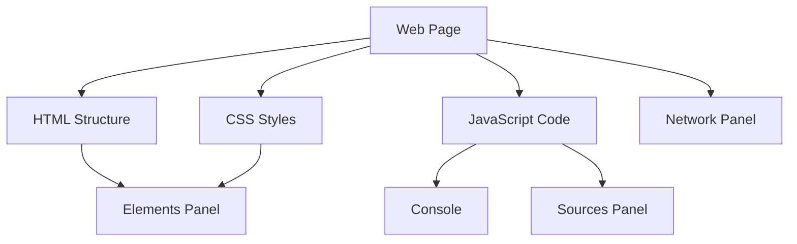

## 2.3 Introducing Developer Tools

As we embark on our journey into JavaScript programming, one of the most powerful allies we have at our disposal is the suite of developer tools available in modern web browsers. These tools are indispensable for writing, testing, and debugging JavaScript code. In this section, we'll guide you through accessing these tools in major browsers like Chrome, Firefox, and Edge. We'll also delve into the key features of the developer console and elements panel, providing examples of how you can use them to run JavaScript commands effectively.

### Understanding Developer Tools

Developer tools, often referred to as DevTools, are built-in features in web browsers that allow developers to inspect and debug web pages. They provide a rich set of functionalities that help you understand how a web page is constructed, how it behaves, and how you can manipulate it using JavaScript.

#### Key Features of Developer Tools

1. **Console**: A command-line interface for executing JavaScript code and viewing output.
2. **Elements Panel**: Allows you to inspect and modify the HTML and CSS of a web page.
3. **Network Panel**: Displays network requests and responses, useful for debugging loading issues.
4. **Sources Panel**: Provides access to the source code of the web page, enabling you to set breakpoints and debug JavaScript.
5. **Performance Panel**: Helps analyze the performance of your web page, identifying bottlenecks.
6. **Memory Panel**: Assists in tracking memory usage and detecting memory leaks.
7. **Application Panel**: Offers insights into the storage used by your web application, such as cookies and local storage.

### Accessing Developer Tools

Let's explore how to access developer tools in the three major browsers: Chrome, Firefox, and Edge.

#### Google Chrome

1. **Opening Developer Tools**: 
   - Press `Ctrl + Shift + I` (Windows/Linux) or `Cmd + Option + I` (Mac).
   - Alternatively, right-click on any element on a web page and select "Inspect".

2. **Navigating the Interface**:
   - The developer tools panel will open, usually docked to the right or bottom of your browser window.
   - You can undock it by clicking the three vertical dots in the top-right corner of the DevTools panel and selecting the desired docking option.

#### Mozilla Firefox

1. **Opening Developer Tools**:
   - Press `Ctrl + Shift + I` (Windows/Linux) or `Cmd + Option + I` (Mac).
   - Right-click on a web page element and choose "Inspect Element".

2. **Exploring the Interface**:
   - Firefox DevTools will appear, offering a similar layout to Chrome's, with tabs for different panels.

#### Microsoft Edge

1. **Opening Developer Tools**:
   - Press `F12` or `Ctrl + Shift + I` (Windows).
   - Right-click on an element and select "Inspect".

2. **Interface Overview**:
   - Edge's DevTools are based on the same engine as Chrome, so the layout and features are quite similar.

### The Developer Console

The console is one of the most frequently used tools by developers. It allows you to execute JavaScript commands in real-time and view the results immediately. This is incredibly useful for testing snippets of code, debugging, and logging information.

#### Using the Console

Let's explore some basic operations you can perform in the console.

1. **Running JavaScript Commands**:
   - Open the console by selecting the "Console" tab in the DevTools panel.
   - Type `console.log('Hello, World!');` and press `Enter`. You should see the output `Hello, World!` displayed in the console.

   ```javascript
   // Logging a message to the console
   console.log('Hello, World!');
   ```

2. **Performing Calculations**:
   - You can use the console as a calculator. Try typing `5 + 3` and press `Enter`. The console will display `8`.

   ```javascript
   // Simple arithmetic operation
   console.log(5 + 3); // Output: 8
   ```

3. **Inspecting Variables**:
   - Declare a variable in the console: `let name = 'Alice';`.
   - Type `name` and press `Enter` to see its value.

   ```javascript
   // Declaring and inspecting a variable
   let name = 'Alice';
   console.log(name); // Output: Alice
   ```

4. **Testing Functions**:
   - Define a function: `function greet() { return 'Hello, ' + name; }`.
   - Call the function by typing `greet()` and pressing `Enter`.

   ```javascript
   // Defining and calling a function
   function greet() {
       return 'Hello, ' + name;
   }
   console.log(greet()); // Output: Hello, Alice
   ```

### The Elements Panel

The elements panel allows you to inspect the HTML and CSS of a web page. This is particularly useful for understanding the structure of a page and making temporary changes to see how they affect the layout.

#### Inspecting Elements

1. **Viewing HTML Structure**:
   - In the elements panel, you'll see the HTML structure of the current page.
   - Click on any element to highlight it in the browser window.

2. **Modifying HTML and CSS**:
   - Double-click on an element's tag or attribute to edit it.
   - Change the text content of a `<p>` tag or modify a CSS property to see the changes in real-time.

   ```html
   <!-- Example HTML element -->
   <p id="greeting">Hello, World!</p>
   ```

   ```css
   /* Example CSS modification */
   #greeting {
       color: blue;
   }
   ```

3. **Adding New Elements**:
   - Right-click on an element and select "Edit as HTML" to add new elements or attributes.

#### Using the Elements Panel for Debugging

1. **Identifying Layout Issues**:
   - Use the elements panel to identify and fix layout issues by adjusting CSS properties.

2. **Understanding CSS Inheritance**:
   - The elements panel shows the CSS rules applied to an element, including inherited styles.

### Practical Examples

Let's put our knowledge to the test with some practical examples.

#### Example 1: Debugging a JavaScript Error

Suppose you have a simple HTML page with a JavaScript error:

```html
<!DOCTYPE html>
<html lang="en">
<head>
    <meta charset="UTF-8">
    <title>JavaScript Error Example</title>
</head>
<body>
    <script>
        // Intentional error: missing closing parenthesis
        console.log('Hello, World!';
    </script>
</body>
</html>
```

1. **Open the Console**:
   - Access the console in your browser's developer tools.

2. **Identify the Error**:
   - You'll see an error message indicating a syntax error. The console will point you to the line number where the error occurred.

3. **Fix the Error**:
   - Correct the error by adding the missing closing parenthesis.

   ```javascript
   // Corrected code
   console.log('Hello, World!');
   ```

#### Example 2: Modifying Page Content

Let's modify the content of a web page using the elements panel.

1. **Open the Elements Panel**:
   - Right-click on a paragraph element and select "Inspect".

2. **Edit the Content**:
   - Double-click on the text content of the paragraph and change it to "Welcome to JavaScript!".

3. **Observe the Changes**:
   - The changes will be reflected immediately on the web page.

### Try It Yourself

Now it's your turn to experiment with developer tools. Here are some suggestions:

- **Modify CSS Styles**: Change the background color of a web page element and see how it affects the design.
- **Run JavaScript Code**: Write a small JavaScript function in the console and execute it.
- **Inspect Network Requests**: Use the network panel to observe the requests made by a web page.

### Visual Aids

To better understand the relationship between the various components of developer tools, let's use a diagram to illustrate the structure of a web page and how developer tools interact with it.



**Diagram Description**: This diagram illustrates how a web page is composed of HTML, CSS, and JavaScript. The elements panel interacts with the HTML structure and CSS styles, while the console and sources panel interact with JavaScript code. The network panel monitors the web page's network requests.

### Further Reading

To deepen your understanding of developer tools, consider exploring the following resources:

- [MDN Web Docs: Introduction to the Developer Tools](https://developer.mozilla.org/en-US/docs/Learn/Common_questions/What_are_browser_developer_tools)
- [Google Chrome DevTools Overview](https://developer.chrome.com/docs/devtools/)
- [Firefox Developer Tools](https://developer.mozilla.org/en-US/docs/Tools)
- [Microsoft Edge DevTools](https://docs.microsoft.com/en-us/microsoft-edge/devtools-guide-chromium/)

### Engagement and Reinforcement

To reinforce your learning, try answering these questions:

- What are the key features of developer tools in a web browser?
- How can you use the console to debug JavaScript code?
- What is the purpose of the elements panel?

### Summary

In this section, we've explored the essential developer tools available in major web browsers. We've learned how to access these tools and use the console and elements panel to inspect and modify web pages. By practicing with these tools, you'll gain confidence in your ability to write and debug JavaScript code effectively.

## Quiz Time!



### How do you access developer tools in Google Chrome?

- [x] Press `Ctrl + Shift + I` or right-click and select "Inspect"
- [ ] Press `Ctrl + Alt + I` or right-click and select "View Source"
- [ ] Press `Ctrl + Shift + J` or right-click and select "Inspect Element"
- [ ] Press `F12` or right-click and select "View Page Info"

> **Explanation:** In Google Chrome, you can access developer tools by pressing `Ctrl + Shift + I` or by right-clicking on an element and selecting "Inspect".

### What is the primary function of the console in developer tools?

- [x] To execute JavaScript code and view output
- [ ] To modify HTML and CSS of a web page
- [ ] To analyze network requests and responses
- [ ] To track memory usage and detect leaks

> **Explanation:** The console is primarily used to execute JavaScript code and view the output, making it a powerful tool for testing and debugging.

### Which panel allows you to inspect and modify the HTML and CSS of a web page?

- [x] Elements Panel
- [ ] Console Panel
- [ ] Network Panel
- [ ] Sources Panel

> **Explanation:** The elements panel allows you to inspect and modify the HTML and CSS of a web page, providing insights into the structure and style of the page.

### How can you use the console as a calculator?

- [x] By typing arithmetic expressions and pressing `Enter`
- [ ] By using the "Calculate" button in the console
- [ ] By entering expressions in the elements panel
- [ ] By opening the network panel and typing expressions

> **Explanation:** You can use the console as a calculator by typing arithmetic expressions directly into it and pressing `Enter` to see the results.

### What is the purpose of the network panel in developer tools?

- [x] To display network requests and responses
- [ ] To execute JavaScript code
- [ ] To modify HTML and CSS
- [ ] To track memory usage

> **Explanation:** The network panel displays network requests and responses, helping developers debug loading issues and understand data flow.

### Which browser shortcut opens developer tools in Mozilla Firefox?

- [x] `Ctrl + Shift + I`
- [ ] `Ctrl + Alt + I`
- [ ] `Ctrl + Shift + J`
- [ ] `F12`

> **Explanation:** In Mozilla Firefox, you can open developer tools by pressing `Ctrl + Shift + I`.

### What can you do with the elements panel?

- [x] Inspect and modify HTML and CSS
- [ ] Execute JavaScript code
- [ ] Analyze network requests
- [ ] Track memory usage

> **Explanation:** The elements panel allows you to inspect and modify the HTML and CSS of a web page, providing insights into its structure and style.

### How do you fix a syntax error in JavaScript using developer tools?

- [x] Identify the error in the console and correct the code
- [ ] Use the network panel to find the error
- [ ] Modify the HTML in the elements panel
- [ ] Track the error using the performance panel

> **Explanation:** To fix a syntax error, you can identify the error in the console and correct the code directly in the sources panel or your code editor.

### What is the use of the sources panel in developer tools?

- [x] To access and debug the source code of a web page
- [ ] To modify HTML and CSS
- [ ] To execute JavaScript code
- [ ] To analyze network requests

> **Explanation:** The sources panel provides access to the source code of a web page, allowing you to set breakpoints and debug JavaScript.

### True or False: The console can only be used for logging messages.

- [ ] True
- [x] False

> **Explanation:** False. The console can be used for executing JavaScript code, performing calculations, testing functions, and more, in addition to logging messages.



By mastering the use of developer tools, you'll be well-equipped to tackle more complex JavaScript programming challenges. Keep experimenting, and don't hesitate to explore the vast capabilities of these tools as you continue your learning journey.
