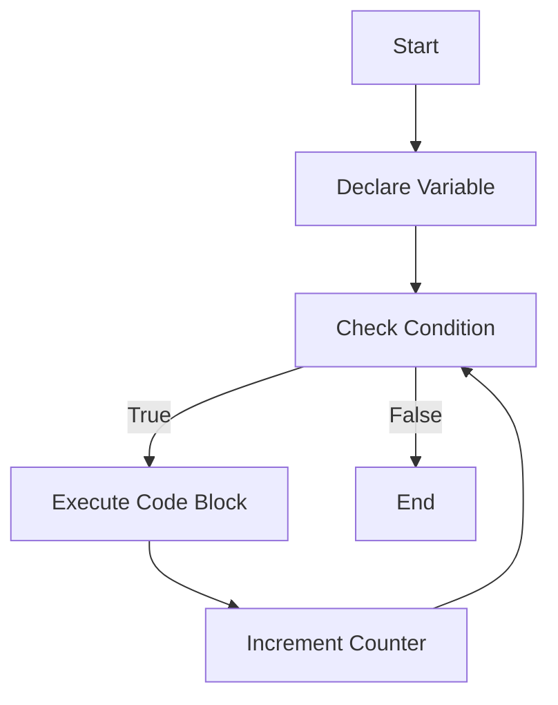

## 3.1 Understanding Syntax and Statements

Welcome to the world of JavaScript, where understanding syntax and statements is the first step towards becoming a proficient programmer. In this section, we will delve into the key components of JavaScript syntax, such as keywords, identifiers, and literals. We will also explore how statements are structured to form programs and the role of semicolons in JavaScript. By the end of this section, you'll have a solid foundation to start writing your own JavaScript code.

### What is Syntax?

In programming, **syntax** refers to the set of rules that define the structure of a language. Just like grammar rules in human languages, syntax rules in programming languages dictate how code must be written to be understood by the computer. Syntax ensures that the code is organized in a way that the JavaScript engine can interpret and execute.

### Key Components of JavaScript Syntax

Let's break down the key components of JavaScript syntax:

#### Keywords

**Keywords** are reserved words in JavaScript that have a specific meaning and purpose. They are the building blocks of JavaScript syntax and cannot be used as identifiers (names for variables, functions, etc.). Some common JavaScript keywords include:

- `var`, `let`, `const`: Used to declare variables.
- `if`, `else`: Used for conditional statements.
- `for`, `while`: Used for loops.
- `function`: Used to define functions.
- `return`: Used to return a value from a function.

Here's an example of using keywords in a simple JavaScript program:

```javascript
let age = 25; // 'let' is a keyword used to declare a variable
if (age >= 18) { // 'if' is a keyword used for conditional statements
    console.log("You are an adult."); // 'console.log' is a method to print output
} else {
    console.log("You are a minor."); // 'else' is a keyword used for alternative conditions
}
```

#### Identifiers

**Identifiers** are names given to variables, functions, and other entities in the code. They are used to uniquely identify these entities and must follow certain rules:

- Identifiers can contain letters, digits, underscores (_), and dollar signs ($).
- They must begin with a letter, underscore, or dollar sign.
- JavaScript is case-sensitive, so `myVariable` and `myvariable` are considered different identifiers.

Here's an example of using identifiers:

```javascript
let firstName = "John"; // 'firstName' is an identifier for the variable
function greetUser() { // 'greetUser' is an identifier for the function
    console.log("Hello, " + firstName);
}
greetUser(); // Calls the function using its identifier
```

#### Literals

**Literals** are fixed values that appear directly in the code. They represent data that is not stored in a variable. JavaScript supports several types of literals:

- **Numeric Literals**: Represent numbers, e.g., `10`, `3.14`.
- **String Literals**: Represent text, enclosed in quotes, e.g., `"Hello"`, `'World'`.
- **Boolean Literals**: Represent true or false values, e.g., `true`, `false`.
- **Array Literals**: Represent arrays, e.g., `[1, 2, 3]`.
- **Object Literals**: Represent objects, e.g., `{name: "Alice", age: 30}`.

Here's an example of using literals:

```javascript
let number = 42; // Numeric literal
let greeting = "Hello, World!"; // String literal
let isJavaScriptFun = true; // Boolean literal
let colors = ["red", "green", "blue"]; // Array literal
let person = {name: "Alice", age: 30}; // Object literal
```

### Understanding Statements

A **statement** in JavaScript is a complete instruction that performs an action. Statements are the building blocks of a JavaScript program. They can include variable declarations, function calls, loops, and more. Each statement is typically written on a new line and ends with a semicolon (`;`), although semicolons are not always required.

#### Types of Statements

Let's explore some common types of statements in JavaScript:

1. **Declaration Statements**: Used to declare variables or functions.

    ```javascript
    let x = 5; // Variable declaration
    function sayHello() { // Function declaration
        console.log("Hello!");
    }
    ```

2. **Expression Statements**: Evaluate an expression and assign the result to a variable.

    ```javascript
    let sum = 10 + 20; // Expression statement
    ```

3. **Conditional Statements**: Execute code based on a condition.

    ```javascript
    if (x > 0) {
        console.log("x is positive");
    } else {
        console.log("x is not positive");
    }
    ```

4. **Loop Statements**: Repeat a block of code multiple times.

    ```javascript
    for (let i = 0; i < 5; i++) {
        console.log(i);
    }
    ```

5. **Return Statements**: Return a value from a function.

    ```javascript
    function add(a, b) {
        return a + b;
    }
    ```

### The Role of Semicolons

In JavaScript, semicolons (`;`) are used to separate statements. While semicolons are not always required, it is a good practice to use them to avoid potential errors. JavaScript has a feature called **automatic semicolon insertion** (ASI), which automatically adds semicolons where they are missing. However, relying on ASI can lead to unexpected behavior, so it's recommended to use semicolons explicitly.

Here's an example demonstrating the use of semicolons:

```javascript
let name = "Alice"; // Semicolon at the end of a statement
console.log("Hello, " + name); // Semicolon at the end of a statement
```

### Try It Yourself

Let's put your understanding to the test. Try modifying the following code examples:

1. Change the `age` variable in the first example to see different outputs.
2. Create a new identifier for a variable and assign it a literal value.
3. Add a new statement to the loop example to print a message when the loop ends.

### Visualizing JavaScript Syntax

To better understand the flow of JavaScript syntax, let's visualize a simple program using a flowchart:



This flowchart represents a basic loop structure, where a variable is declared, a condition is checked, and a code block is executed repeatedly until the condition is false.

### Further Reading

For more information on JavaScript syntax and statements, check out these resources:

- [MDN Web Docs: JavaScript Guide](https://developer.mozilla.org/en-US/docs/Web/JavaScript/Guide)
- [W3Schools: JavaScript Syntax](https://www.w3schools.com/js/js_syntax.asp)

### Key Takeaways

- **Syntax** is the set of rules that define the structure of a programming language.
- **Keywords** are reserved words with specific meanings and cannot be used as identifiers.
- **Identifiers** are names given to variables, functions, and other entities.
- **Literals** are fixed values that appear directly in the code.
- **Statements** are complete instructions that perform actions in a program.
- **Semicolons** are used to separate statements and prevent errors.

## Quiz Time!



### What is the purpose of syntax in programming?

- [x] To define the structure of a programming language
- [ ] To execute code
- [ ] To store data
- [ ] To print output

> **Explanation:** Syntax defines the rules and structure of a programming language, ensuring that code is organized in a way that can be understood by the computer.

### Which of the following is a JavaScript keyword?

- [x] `let`
- [ ] `myVariable`
- [ ] `greetUser`
- [ ] `42`

> **Explanation:** `let` is a reserved keyword in JavaScript used to declare variables.

### What is an identifier in JavaScript?

- [x] A name given to variables, functions, and other entities
- [ ] A fixed value in the code
- [ ] A reserved word with a specific meaning
- [ ] A complete instruction that performs an action

> **Explanation:** Identifiers are names given to variables, functions, and other entities in the code.

### Which of the following is a string literal?

- [x] `"Hello, World!"`
- [ ] `42`
- [ ] `true`
- [ ] `[1, 2, 3]`

> **Explanation:** `"Hello, World!"` is a string literal, representing text enclosed in quotes.

### What is the role of semicolons in JavaScript?

- [x] To separate statements
- [ ] To declare variables
- [ ] To define functions
- [ ] To check conditions

> **Explanation:** Semicolons are used to separate statements and prevent errors in JavaScript.

### Which statement type is used to declare variables?

- [x] Declaration statements
- [ ] Expression statements
- [ ] Conditional statements
- [ ] Loop statements

> **Explanation:** Declaration statements are used to declare variables and functions.

### What is automatic semicolon insertion (ASI)?

- [x] A feature that automatically adds semicolons where they are missing
- [ ] A method to declare variables
- [ ] A way to define functions
- [ ] A tool to debug code

> **Explanation:** ASI is a feature in JavaScript that automatically adds semicolons where they are missing.

### Which of the following is an example of a conditional statement?

- [x] `if (x > 0) { console.log("x is positive"); }`
- [ ] `let x = 5;`
- [ ] `console.log("Hello!");`
- [ ] `return a + b;`

> **Explanation:** `if (x > 0) { console.log("x is positive"); }` is a conditional statement that executes code based on a condition.

### What is a literal in JavaScript?

- [x] A fixed value that appears directly in the code
- [ ] A name given to variables and functions
- [ ] A reserved word with a specific meaning
- [ ] A complete instruction that performs an action

> **Explanation:** Literals are fixed values that appear directly in the code, such as numbers, strings, and booleans.

### True or False: JavaScript is case-sensitive.

- [x] True
- [ ] False

> **Explanation:** JavaScript is case-sensitive, meaning that `myVariable` and `myvariable` are considered different identifiers.



By understanding the fundamental components of JavaScript syntax and how statements form programs, you're now equipped to start writing your own JavaScript code. Remember to practice regularly and experiment with different code examples to reinforce your learning. Happy coding!
