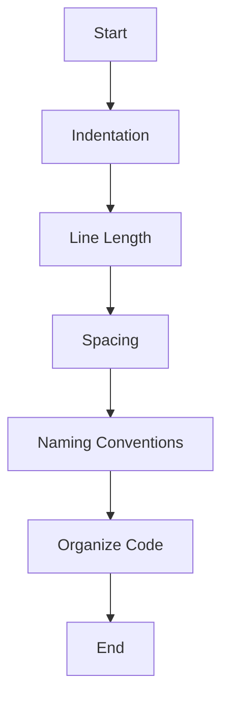

## 3.2 Comments and Formatting

In the world of programming, writing code is just one part of the equation. Equally important is making sure that your code is understandable, not only to you but also to others who might read it in the future. This is where comments and formatting come into play. In this section, we will explore the purpose of comments, how to use them effectively in JavaScript, and the importance of proper code formatting to enhance readability and maintainability.

### The Purpose of Comments in Code

Comments are annotations in the source code of a program that are ignored by the JavaScript engine during execution. They serve as a way to explain what the code does, why certain decisions were made, or to provide any additional information that might be helpful to someone reading the code. Comments are crucial for:

- **Clarifying Complex Logic**: When code involves complex algorithms or logic, comments can help explain the thought process behind it.
- **Providing Context**: Comments can provide context about why a particular piece of code is necessary or what it is intended to achieve.
- **Facilitating Collaboration**: In team environments, comments help team members understand each other's code, making collaboration easier.
- **Enhancing Maintainability**: Well-commented code is easier to maintain and update since the purpose and functionality are clearly documented.

### Types of Comments in JavaScript

JavaScript supports two types of comments: single-line comments and multi-line comments. Let's explore each type with examples.

#### Single-Line Comments

Single-line comments are used to comment out a single line of code or to add a brief explanation next to a line of code. They begin with `//`.

```javascript
// This is a single-line comment
let name = "John"; // Declare a variable to store the name
```

In the example above, the first comment explains that it is a single-line comment, while the second comment provides context for the variable declaration.

#### Multi-Line Comments

Multi-line comments are used to comment out multiple lines of code or to provide more detailed explanations. They begin with `/*` and end with `*/`.

```javascript
/*
  This is a multi-line comment.
  It can span multiple lines.
  Use it to provide detailed explanations or to comment out blocks of code.
*/
let age = 25; // Declare a variable to store the age
```

Multi-line comments are particularly useful when you need to explain a complex section of code or when you want to temporarily disable a block of code during debugging.

### Best Practices for Using Comments

While comments are a powerful tool, they should be used judiciously. Here are some best practices to keep in mind:

- **Be Clear and Concise**: Comments should be easy to understand. Avoid using jargon or overly complex language.
- **Keep Comments Up-to-Date**: If you change the code, update the comments to reflect those changes. Outdated comments can be misleading.
- **Avoid Redundancy**: Comments should add value. Avoid stating the obvious or repeating what the code already makes clear.
- **Use Comments to Explain Why, Not What**: Focus on explaining why a particular approach was taken rather than what the code does, which should be evident from the code itself.

### The Importance of Code Formatting

Proper code formatting is essential for writing clean, readable, and maintainable code. It involves organizing code in a way that makes it easy to read and understand. Here are some key aspects of code formatting:

#### Indentation

Indentation helps to visually separate code blocks, making it easier to see the structure of the code. In JavaScript, it is common to use two or four spaces for indentation. Consistency is key, so choose one style and stick to it throughout your code.

```javascript
function greet(name) {
    if (name) {
        console.log("Hello, " + name + "!");
    } else {
        console.log("Hello, World!");
    }
}
```

In the example above, the code inside the `if` and `else` blocks is indented to show that it is part of the `greet` function.

#### Line Length

Keep lines of code to a reasonable length to avoid horizontal scrolling. A common guideline is to limit lines to 80-100 characters.

#### Spacing

Use spaces to improve readability. For example, add spaces around operators and after commas.

```javascript
let sum = a + b; // Add spaces around the '+' operator
let numbers = [1, 2, 3, 4]; // Add a space after each comma
```

#### Consistent Naming Conventions

Use meaningful and consistent naming conventions for variables, functions, and other identifiers. This makes the code self-explanatory and easier to understand.

```javascript
let userName = "Alice"; // Use camelCase for variable names
function calculateTotal(price, tax) { // Use camelCase for function names
    return price + tax;
}
```

#### Organizing Code

Organize code logically by grouping related functions and variables together. This makes it easier to navigate the codebase.

### Visual Aids: Code Formatting Flowchart

To better understand the process of code formatting, let's look at a flowchart that outlines the steps involved in formatting code for readability.



This flowchart represents the key steps in formatting code for readability, starting with indentation and ending with organizing code logically.

### Try It Yourself: Experiment with Comments and Formatting

Now that we've covered the basics of comments and formatting, let's put this knowledge into practice. Try modifying the following code snippet by adding comments and improving the formatting:

```javascript
function calculateArea(width, height){
let area=width*height;
return area;
}
let result=calculateArea(5,10);
console.log(result);
```

**Suggestions:**

1. Add comments to explain what the function does and what each line of code represents.
2. Improve the formatting by adding spaces around operators and proper indentation.

### References and Further Reading

For more information on comments and formatting in JavaScript, check out the following resources:

- [MDN Web Docs: Comments](https://developer.mozilla.org/en-US/docs/Web/JavaScript/Guide/Grammar_and_types#Comments)
- [W3Schools: JavaScript Comments](https://www.w3schools.com/js/js_comments.asp)

### Key Takeaways

- Comments are essential for explaining code and providing context.
- Use single-line comments for brief explanations and multi-line comments for detailed descriptions.
- Proper code formatting enhances readability and maintainability.
- Consistency in indentation, spacing, and naming conventions is crucial.
- Well-organized code is easier to navigate and understand.

By mastering the use of comments and formatting, you'll be well on your way to writing clean, readable, and maintainable JavaScript code.

## Quiz Time!



### What is the primary purpose of comments in code?

- [x] To explain and provide context for the code
- [ ] To execute additional code
- [ ] To increase the size of the code file
- [ ] To make the code run faster

> **Explanation:** Comments are used to explain and provide context for the code, making it easier to understand and maintain.

### Which symbol is used to start a single-line comment in JavaScript?

- [x] //
- [ ] /*
- [ ] #
- [ ] <!--

> **Explanation:** Single-line comments in JavaScript start with `//`.

### How do you begin a multi-line comment in JavaScript?

- [x] /*
- [ ] //
- [ ] #
- [ ] <!--

> **Explanation:** Multi-line comments in JavaScript begin with `/*` and end with `*/`.

### Why is proper code formatting important?

- [x] It enhances readability and maintainability
- [ ] It makes the code run faster
- [ ] It reduces the file size
- [ ] It adds more features to the code

> **Explanation:** Proper code formatting enhances readability and maintainability, making it easier for developers to understand and work with the code.

### What is a common guideline for line length in code?

- [x] 80-100 characters
- [ ] 50-60 characters
- [ ] 120-150 characters
- [ ] 30-40 characters

> **Explanation:** A common guideline is to limit lines to 80-100 characters to avoid horizontal scrolling and improve readability.

### What should you focus on when writing comments?

- [x] Explaining why the code was written in a certain way
- [ ] Repeating what the code does
- [ ] Making the code longer
- [ ] Adding unnecessary details

> **Explanation:** Focus on explaining why the code was written in a certain way, rather than repeating what the code does.

### Which of the following is a best practice for using comments?

- [x] Keep comments up-to-date
- [ ] Use comments to make the code longer
- [ ] Avoid using comments altogether
- [ ] Use comments to execute additional code

> **Explanation:** Keeping comments up-to-date ensures they accurately reflect the code, preventing confusion.

### What is the recommended indentation style in JavaScript?

- [x] Consistent use of two or four spaces
- [ ] Using tabs inconsistently
- [ ] No indentation at all
- [ ] Random spaces and tabs

> **Explanation:** Consistent use of two or four spaces for indentation helps maintain readability and structure in the code.

### How can you improve the readability of code?

- [x] Use meaningful variable names
- [ ] Write all code in one line
- [ ] Avoid using spaces
- [ ] Use random naming conventions

> **Explanation:** Using meaningful variable names improves the readability of code, making it easier to understand.

### True or False: Comments should be used to execute additional code.

- [ ] True
- [x] False

> **Explanation:** Comments are not executed by the JavaScript engine; they are meant to provide explanations and context for the code.


