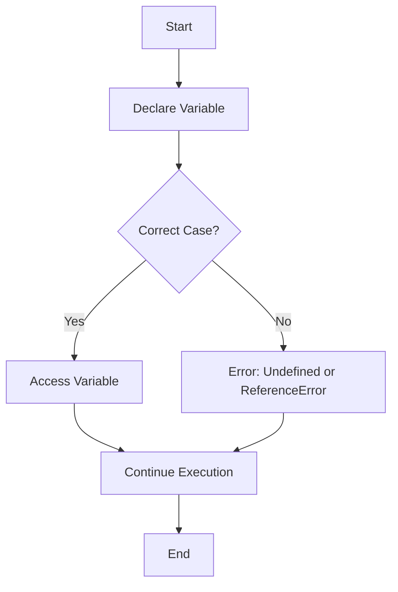

## 3.3 The Case Sensitivity of JavaScript

Welcome to the fascinating world of JavaScript, where every letter counts—literally! In this section, we will explore the concept of case sensitivity in JavaScript, its implications for your coding journey, and how to avoid common pitfalls. We'll also delve into naming conventions such as camelCase and PascalCase, which are crucial for writing clean and maintainable code. Let's embark on this journey to understand how case sensitivity can impact your programming experience.

### Understanding Case Sensitivity in JavaScript

JavaScript is a case-sensitive language. This means that it treats uppercase and lowercase letters as distinct. For instance, the variable `myVariable` is different from `MyVariable` or `MYVARIABLE`. This characteristic extends to all identifiers in JavaScript, including variable names, function names, object properties, and keywords.

#### Implications of Case Sensitivity

The case sensitivity of JavaScript has several implications for coding:

1. **Precision in Naming**: You must be precise when naming variables, functions, and other identifiers. A small typo in case can lead to errors that are often difficult to debug.

2. **Consistency in Code**: Consistent use of case in your codebase is crucial for readability and maintainability. Inconsistent casing can confuse both the programmer and anyone else reading the code.

3. **Error Prevention**: Understanding and respecting case sensitivity helps prevent common errors, especially in larger projects where multiple developers might be involved.

Let's look at some examples to illustrate these points.

### Examples of Common Case Sensitivity Errors

To better understand how case sensitivity can lead to errors, consider the following examples:

#### Example 1: Variable Declaration

```javascript
// Declaring a variable with lowercase
let myVariable = 10;

// Trying to access it with a different case
console.log(MyVariable); // ReferenceError: MyVariable is not defined
```

In this example, the variable `myVariable` is declared with a lowercase 'm'. Attempting to access it with an uppercase 'M' results in a `ReferenceError` because `MyVariable` is considered a different identifier.

#### Example 2: Function Names

```javascript
// Defining a function with camelCase
function calculateSum(a, b) {
  return a + b;
}

// Calling the function with a different case
console.log(CalculateSum(5, 10)); // TypeError: CalculateSum is not a function
```

Here, the function `calculateSum` is defined using camelCase. Calling it with `CalculateSum` results in a `TypeError` because the function name does not match the case used in the definition.

#### Example 3: Object Properties

```javascript
// Creating an object with properties
let person = {
  firstName: "John",
  lastName: "Doe"
};

// Accessing a property with a different case
console.log(person.FirstName); // undefined
```

In this case, the object `person` has a property `firstName`. Attempting to access it using `FirstName` returns `undefined` because JavaScript treats `firstName` and `FirstName` as distinct properties.

### Naming Conventions in JavaScript

To avoid case sensitivity errors and enhance code readability, it's important to follow established naming conventions. Let's explore some common conventions used in JavaScript.

#### camelCase

**camelCase** is a popular naming convention where the first letter of the first word is lowercase, and the first letter of each subsequent word is uppercase. This style is commonly used for variable and function names.

**Examples:**

- `myVariable`
- `calculateSum`
- `firstName`

#### PascalCase

**PascalCase** is similar to camelCase, but the first letter of each word, including the first word, is uppercase. This convention is often used for naming classes and constructors.

**Examples:**

- `MyClass`
- `Person`
- `CalculateSum`

#### snake_case

Although less common in JavaScript, **snake_case** uses underscores to separate words, with all letters typically in lowercase. It's more prevalent in other programming languages like Python.

**Examples:**

- `my_variable`
- `calculate_sum`
- `first_name`

### Best Practices for Naming in JavaScript

To write clean and maintainable JavaScript code, consider the following best practices:

1. **Consistency**: Stick to a single naming convention within your project. Consistency aids readability and reduces the likelihood of errors.

2. **Descriptive Names**: Choose descriptive names that convey the purpose of the variable or function. Avoid single-letter names except for loop counters.

3. **Avoid Reserved Words**: JavaScript has a set of reserved words that cannot be used as identifiers. Familiarize yourself with these to avoid syntax errors.

4. **Use camelCase for Variables and Functions**: This is the most widely accepted convention in JavaScript for variables and functions.

5. **Use PascalCase for Classes and Constructors**: This helps distinguish classes and constructors from regular functions.

### Try It Yourself

To reinforce your understanding of case sensitivity and naming conventions, try the following exercises:

1. **Exercise 1**: Declare a variable using camelCase and attempt to access it using a different case. Observe the error message and correct it.

2. **Exercise 2**: Define a function using camelCase and call it with a different case. Note the error and fix it.

3. **Exercise 3**: Create an object with properties using camelCase. Access the properties with different cases and observe the results.

### Visual Aid: Case Sensitivity Flowchart

To better understand how JavaScript handles case sensitivity, let's visualize the process using a flowchart.



**Description**: This flowchart illustrates the process of declaring and accessing a variable in JavaScript. If the case is correct, the variable is accessed successfully. If the case is incorrect, an error occurs.

### References and Links

For further reading on JavaScript case sensitivity and naming conventions, consider the following resources:

- [MDN Web Docs: JavaScript Guide](https://developer.mozilla.org/en-US/docs/Web/JavaScript/Guide)
- [W3Schools: JavaScript Variables](https://www.w3schools.com/js/js_variables.asp)
- [JavaScript.info: Variables](https://javascript.info/variables)

### Engagement and Reinforcement

To engage with the material and reinforce your learning, consider these questions:

- Why is case sensitivity important in JavaScript?
- How can following naming conventions improve code readability?
- What are some common errors caused by case sensitivity?

### Summary

In this section, we explored the case sensitivity of JavaScript and its implications for coding. We examined common errors that arise from incorrect casing and discussed naming conventions like camelCase and PascalCase. By understanding and applying these concepts, you can write more precise, readable, and maintainable JavaScript code.

## Quiz Time!



### What does it mean that JavaScript is case-sensitive?

- [x] JavaScript treats uppercase and lowercase letters as distinct.
- [ ] JavaScript ignores case differences in identifiers.
- [ ] JavaScript automatically converts all identifiers to lowercase.
- [ ] JavaScript treats all letters as uppercase.

> **Explanation:** JavaScript is case-sensitive, meaning it differentiates between uppercase and lowercase letters in identifiers.

### Which of the following is a common error caused by case sensitivity?

- [x] ReferenceError due to incorrect casing of a variable name.
- [ ] SyntaxError due to missing semicolon.
- [ ] TypeError due to incorrect data type.
- [ ] RangeError due to exceeding number limits.

> **Explanation:** A ReferenceError can occur when trying to access a variable with incorrect casing.

### What is the naming convention where the first letter of each word is uppercase, including the first word?

- [ ] camelCase
- [x] PascalCase
- [ ] snake_case
- [ ] kebab-case

> **Explanation:** PascalCase capitalizes the first letter of each word, including the first word.

### Which naming convention is commonly used for variable and function names in JavaScript?

- [x] camelCase
- [ ] PascalCase
- [ ] snake_case
- [ ] kebab-case

> **Explanation:** camelCase is the standard naming convention for variables and functions in JavaScript.

### What happens if you try to access an object property with incorrect casing?

- [x] The result is `undefined`.
- [ ] A SyntaxError is thrown.
- [ ] The program crashes.
- [ ] The property is automatically corrected.

> **Explanation:** Accessing an object property with incorrect casing results in `undefined`.

### Which naming convention is typically used for class names in JavaScript?

- [ ] camelCase
- [x] PascalCase
- [ ] snake_case
- [ ] kebab-case

> **Explanation:** PascalCase is used for class names to distinguish them from regular functions.

### Why is consistency in naming conventions important?

- [x] It improves code readability and maintainability.
- [ ] It makes the code run faster.
- [ ] It reduces memory usage.
- [ ] It ensures compatibility with all browsers.

> **Explanation:** Consistent naming conventions enhance readability and maintainability of the code.

### What is the result of calling a function with incorrect casing?

- [ ] SyntaxError
- [x] TypeError
- [ ] ReferenceError
- [ ] RangeError

> **Explanation:** A TypeError occurs when calling a function with incorrect casing, as the function is not recognized.

### Which of the following is an example of camelCase?

- [x] myVariableName
- [ ] MyVariableName
- [ ] my_variable_name
- [ ] my-variable-name

> **Explanation:** camelCase starts with a lowercase letter and capitalizes the first letter of each subsequent word.

### True or False: JavaScript automatically corrects case sensitivity errors.

- [ ] True
- [x] False

> **Explanation:** JavaScript does not correct case sensitivity errors; it treats identifiers with different cases as distinct.


