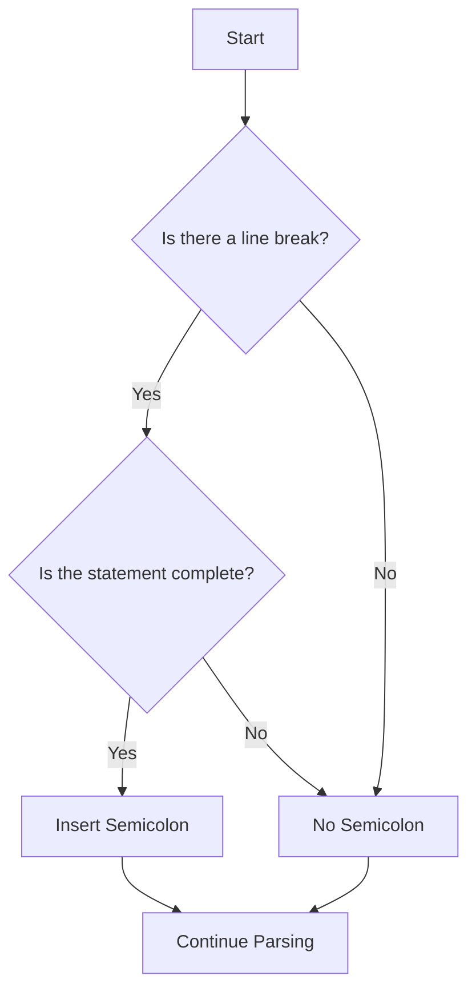

## 3.4 Using Semicolons and Whitespace

When learning JavaScript, two seemingly simple elements—semicolons and whitespace—can sometimes cause confusion for beginners. Understanding how and when to use semicolons, as well as how JavaScript interprets whitespace, is crucial for writing clean and error-free code. In this section, we'll explore these concepts in detail, including the role of Automatic Semicolon Insertion (ASI) and how it can impact your code.

### Understanding Semicolons in JavaScript

Semicolons (`;`) are used in JavaScript to separate statements. They act as a signal to the JavaScript engine that one statement has ended and another can begin. However, unlike some other programming languages, JavaScript does not always require semicolons at the end of every statement due to a feature known as Automatic Semicolon Insertion (ASI).

#### When Semicolons Are Required

While JavaScript can often infer where semicolons should be, there are specific situations where you must use them to avoid errors. Here are some key scenarios:

1. **Multiple Statements on One Line**: If you place multiple statements on a single line, you must separate them with semicolons.

   ```javascript
   let a = 5; let b = 10; console.log(a + b);
   ```

2. **For Loop Initialization**: In `for` loops, semicolons are used to separate the initialization, condition, and increment expressions.

   ```javascript
   for (let i = 0; i < 10; i++) {
       console.log(i);
   }
   ```

3. **Immediately Invoked Function Expressions (IIFE)**: When using IIFE, a semicolon is needed before the function to avoid it being treated as a function declaration.

   ```javascript
   ;(function() {
       console.log('IIFE executed');
   })();
   ```

#### When Semicolons Are Optional

JavaScript's ASI feature allows you to omit semicolons in many cases. For example:

- **Single Statements on Separate Lines**: If each statement is on its own line, semicolons are generally optional.

  ```javascript
  let x = 5
  let y = 10
  console.log(x + y)
  ```

- **End of a Block**: After a block of code, such as a function or loop, semicolons are not necessary.

  ```javascript
  function greet() {
      console.log('Hello, World!')
  }
  ```

### Automatic Semicolon Insertion (ASI)

ASI is a mechanism in JavaScript that automatically inserts semicolons where they are missing. While this feature can make coding more flexible, it can also lead to unexpected behavior if not understood properly.

#### How ASI Works

JavaScript scans your code and inserts semicolons at the end of lines where it thinks they are needed. This usually happens in the following situations:

- **End of a Line**: If a line ends with a statement that can be legally terminated, JavaScript may insert a semicolon.

- **After a `return`, `break`, `continue`, or `throw` Statement**: If these statements are followed by a line break, a semicolon is inserted automatically.

  ```javascript
  return
  {
      key: 'value'
  }
  ```

  In the above example, ASI inserts a semicolon after `return`, resulting in `undefined` being returned instead of the object.

#### Potential Issues with ASI

While ASI can be convenient, it can also cause problems if you rely on it too heavily. Here are some common pitfalls:

1. **Unexpected Returns**: As shown in the example above, placing a line break immediately after a `return` statement can lead to unexpected results.

2. **Misinterpreted Code**: ASI might not insert semicolons where you expect, leading to syntax errors or logical errors.

   ```javascript
   let a = b + c
   (d + e).print()
   ```

   In this case, ASI does not insert a semicolon after `c`, causing a syntax error.

3. **Chained Method Calls**: When chaining methods, ensure that each method call is on the same line or properly separated by semicolons.

   ```javascript
   array
       .filter(item => item > 5)
       .map(item => item * 2)
   ```

### Best Practices for Using Semicolons

To avoid issues with ASI, many developers prefer to use semicolons consistently. Here are some best practices:

- **Always Use Semicolons**: This approach eliminates any ambiguity and ensures your code behaves as expected.

- **Be Consistent**: Whether you choose to use semicolons or not, consistency in your codebase is key to readability and maintainability.

- **Use Linters**: Tools like ESLint can help enforce semicolon usage and catch potential ASI-related issues.

### Understanding Whitespace in JavaScript

Whitespace in JavaScript includes spaces, tabs, and line breaks. While whitespace is generally ignored by the JavaScript engine, it plays a crucial role in making your code readable and maintainable.

#### How JavaScript Interprets Whitespace

JavaScript treats whitespace as a delimiter between tokens (keywords, variables, operators, etc.). It does not affect the execution of the code but is essential for separating elements.

- **Spaces and Tabs**: Used to indent code, making it more readable.

  ```javascript
  function greet(name) {
      console.log('Hello, ' + name)
  }
  ```

- **Line Breaks**: Separate statements and can trigger ASI.

  ```javascript
  let a = 5
  let b = 10
  ```

#### Importance of Whitespace for Readability

Proper use of whitespace can greatly enhance the readability of your code. Here are some tips:

- **Indentation**: Use consistent indentation to show the structure of your code. Most developers use 2 or 4 spaces per indentation level.

- **Line Breaks**: Use line breaks to separate logical blocks of code, such as between functions or loop iterations.

- **Spacing Around Operators**: Add spaces around operators for clarity.

  ```javascript
  let sum = a + b
  ```

### Try It Yourself

Let's experiment with semicolons and whitespace. Try modifying the following code examples to see how they behave with and without semicolons:

```javascript
// Example 1: Semicolons
let x = 10
let y = 20
console.log(x + y)

// Example 2: Whitespace
function add(a, b) {
    return a + b
}
console.log(add(5, 7))
```

**Challenge**: Remove semicolons from the code and observe any changes in behavior. Try adding extra whitespace and see how it affects readability.

### Visualizing Semicolon Insertion

To better understand how ASI works, let's visualize it with a flowchart:



**Diagram Description**: This flowchart illustrates the decision-making process of ASI. If there's a line break and the statement is complete, a semicolon is inserted.

### References and Further Reading

For more information on semicolons and whitespace in JavaScript, check out these resources:

- [MDN Web Docs: Semicolons](https://developer.mozilla.org/en-US/docs/Web/JavaScript/Reference/Statements)
- [W3Schools: JavaScript Semicolons](https://www.w3schools.com/js/js_semicolons.asp)
- [JavaScript: The Good Parts](https://www.oreilly.com/library/view/javascript-the-good/9780596517748/)

### Key Takeaways

- **Semicolons** are used to separate statements in JavaScript, but ASI can insert them automatically.
- **Whitespace** is ignored by the JavaScript engine but is crucial for code readability.
- **ASI** can lead to unexpected behavior if not understood properly.
- **Consistency** in using semicolons and whitespace enhances code readability and maintainability.

Now that we've covered semicolons and whitespace, you're better equipped to write clean and error-free JavaScript code. Let's reinforce your understanding with a quiz!

## Quiz Time!



### When are semicolons required in JavaScript?

- [x] When multiple statements are on one line
- [ ] After every statement
- [ ] Only inside loops
- [ ] Only in function declarations

> **Explanation:** Semicolons are required when multiple statements are on one line to separate them.

### What does ASI stand for?

- [x] Automatic Semicolon Insertion
- [ ] Automated Syntax Interpretation
- [ ] Asynchronous Script Integration
- [ ] Advanced Statement Inference

> **Explanation:** ASI stands for Automatic Semicolon Insertion, a feature in JavaScript that inserts semicolons where they are missing.

### What can cause unexpected behavior due to ASI?

- [x] Placing a line break immediately after a `return` statement
- [ ] Using semicolons consistently
- [ ] Using whitespace for indentation
- [ ] Declaring variables with `let`

> **Explanation:** Placing a line break immediately after a `return` statement can cause unexpected behavior due to ASI inserting a semicolon.

### How does JavaScript treat whitespace?

- [x] As a delimiter between tokens
- [ ] As a syntax error
- [ ] As a required element for execution
- [ ] As a comment

> **Explanation:** JavaScript treats whitespace as a delimiter between tokens, which does not affect execution but enhances readability.

### What is a best practice for using semicolons?

- [x] Always use semicolons to avoid ambiguity
- [ ] Never use semicolons
- [ ] Use semicolons only in loops
- [ ] Use semicolons only in function declarations

> **Explanation:** Always using semicolons is a best practice to avoid ambiguity and ensure code behaves as expected.

### What is the role of whitespace in code?

- [x] Enhances readability and maintainability
- [ ] Causes syntax errors
- [ ] Is ignored by the JavaScript engine
- [ ] Is required for code execution

> **Explanation:** Whitespace enhances readability and maintainability, making code easier to understand.

### What happens if you omit semicolons in JavaScript?

- [x] ASI may insert them automatically
- [ ] The code will not run
- [ ] The code will always throw an error
- [ ] The code will run faster

> **Explanation:** If semicolons are omitted, ASI may insert them automatically, but this can sometimes lead to unexpected behavior.

### What is a common pitfall of ASI?

- [x] Misinterpreted code leading to syntax errors
- [ ] Faster code execution
- [ ] Improved code readability
- [ ] Automatic error correction

> **Explanation:** A common pitfall of ASI is misinterpreted code, which can lead to syntax errors.

### How can you ensure consistent semicolon usage?

- [x] Use linters like ESLint
- [ ] Avoid using semicolons altogether
- [ ] Only use semicolons in loops
- [ ] Only use semicolons in functions

> **Explanation:** Using linters like ESLint can help ensure consistent semicolon usage and catch potential ASI-related issues.

### True or False: Whitespace affects the execution of JavaScript code.

- [ ] True
- [x] False

> **Explanation:** False. Whitespace does not affect the execution of JavaScript code; it is used for readability.


